# 使用 Python 和 NLTK 的自然语言处理

> 原文：<https://medium.com/nerd-for-tech/natural-language-processing-using-python-nltk-5c1804d0962d?source=collection_archive---------6----------------------->

介绍自然语言处理，然后是自然语言处理基础教程，包括使用 Python 和自然语言工具包(NLTK)实现的示例代码

本文探索了为引入自然语言处理(NLP)铺平道路的历史，用示例代码介绍了 NLP 的基础知识，然后深入研究了自然语言工具包(NLTK)库，展示了它们如何简化 NLP 相关的任务。

自然语言处理

# 目录

1.  什么是 NLP？
2.  自然语言处理的历史
3.  自然语言处理的应用及其对通信的影响
4.  自然语言处理的不同方法
5.  NLP 的组件
6.  NLTK 及其特点
7.  使用 NLTK 的 NLP 中的基本任务

# 什么是自然语言处理(NLP)？

自然语言处理(NLP)，广义上定义为通过软件自动操作自然语言，如语音和文本。

它是语言学、计算机科学和人工智能的一个子领域，涉及计算机和人类语言之间的交互，特别是如何编程计算机来处理和分析大量的自然语言数据([维基百科](https://en.wikipedia.org/wiki/Natural_language_processing))。

> **“除了普通的文字处理器操作将文本视为简单的符号序列之外，NLP 还考虑了语言的层次结构:几个单词组成一个短语，几个短语组成一个句子，最终，句子传达思想，”**
> 
> *——melt water Group 的 NLP 专家 John Rehling 在* [*中谈到自然语言处理如何帮助揭示社交媒体情绪*](http://mashable.com/2011/11/08/natural-language-processing-social-media/#VbWC8PySNqqy) *。*

# 自然语言处理的历史

什么是意识？伪造的机器真的会思考吗？对许多人来说，这些都是对人工智能(AI)最终命运的重要思考。然而，英国计算机科学家艾伦·图灵选择驳回所有这些问题，转而提出一个更简单的问题: ***计算机能像人一样说话吗？*** 这个问题促使人们想到估算计算机机器的智力，著名的有 ***图灵测试*** 。

在 1950 年的论文《计算机械与智能》中，图灵提出了如下博弈。人类裁判与看不见的玩家进行文本对话，并评估他们的反应。为了通过测试，机器应该在不改变结果的情况下替换一个玩家。换句话说，一台机器应该公平地扮演足够的角色来愚弄人类法官。机器开始寻找更聪明的方法来愚弄 judge，而不是利用它的计算能力。

第一个取得成功的程序被称为 ***【伊莱扎】*** ，它相当简短，它模仿心理学家，试图误导人们，鼓励他们多说。这就是自然语言处理的启发。

# 自然语言处理的应用及其对交流的影响

在通信中，对于人类来说没有任何问题的东西，对于具有大量非结构化数据的计算机来说是很难的，因为缺乏正式的标准/规则，并且缺乏真实世界的上下文或意图。随着人工智能变得越来越复杂，自然语言处理(NLP)也将如此。虽然人工智能和自然语言处理这两个术语可能会让人联想到先进的机器人，但在我们的日常生活中已经有了自然语言处理的基本例子。

这里有几个突出的例子。

## **电子邮件过滤器**

最基本和最初始的应用是**垃圾邮件过滤**(垃圾邮件&非垃圾邮件) **Gmail 的电子邮件分类**(根据邮件内容分为三个类别:主要、社交、促销)。这有助于用户管理收件箱中的重要和相关邮件。

## 智能助手

像苹果的 Siri、亚马逊的 Alexa 和谷歌的 Ok Google 这样的智能助手开始识别语音模式、识别声音、推断含义并做出回应。随着助理对我们的了解越来越多，他们与我们的互动变得越来越私人化。正如《纽约时报》的一篇文章[“为什么我们可能很快就会生活在 Alexa 的世界里，”](https://www.nytimes.com/2018/02/21/technology/amazon-alexa-world.html)解释道: ***“更大的事情正在发生。Alexa 最有可能成为本十年第三大消费计算平台。”***

## 搜索结果

搜索引擎基于**相似的搜索模式/行为或用户意图**使用 NLP 来找到重要的结果，使任何人都可以找到他们需要的东西，而无需具备 it 专业知识。举例来说，谷歌不仅根据用户的查询预测主流搜索，而且还观察整个画面，感知我们试图说什么，而不是确切的搜索词。

## 预测文本

任何智能手机用户都会遇到像**自动更正、自动完成和预测文本**这样的东西，使我们能够根据我们键入的内容预测要说的东西，完成单词或建议相关的单词，使整个信息变得有意义。预测文本会根据用户的个人语言进行定制，用户使用的次数越多。

还有很多要补充的:**语言翻译**、**数字电话** ( [谷歌助理预约头发](https://www.youtube.com/watch?v=yDI5oVn0RgM))、**问答系统、** NLP 也染指更好的**数据分析和数据可视化、文本分析**等等。

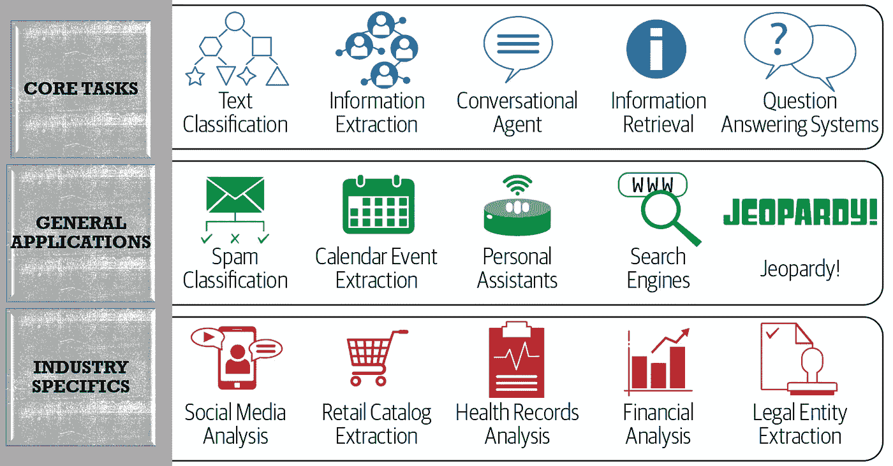

NLP 应用的详细视图及其基于 NLP 核心任务的行业细节

# 自然语言处理的不同方法

1.  符号自然语言处理
2.  统计 NLP
3.  神经 NLP

**符号 NLP:** 在早期，许多语言系统都是使用符号 NLP 设计的，即手动编码的规则集，辅助字典查找:例如通过编写语法或设计启发式规则来进行词干提取。然而，能够自动学习规则的系统会产生更准确的结果。即使是现在，当训练数据不足时，它也用于预处理(标记化)、后处理(知识提取)。

**统计 NLP:** 在 20 世纪 80 年代和 90 年代中期，NLP 研究开始依赖于机器学习范式，这些范式使用统计推理，通过分析真实世界应用程序的大型语料库来自动学习规则。许多不同类别的 ML 算法已经被应用于 NLP 任务。这些算法将从输入数据中生成的大量特征作为输入。越来越多的研究集中在统计模型上，例如:词性标注(POS tagging)使用隐马尔可夫模型，该模型基于将实值权重附加到每个输入特征来做出软的概率决策。这种模型的优势在于，它们可以表达许多不同的可能答案的相对确定性，而不仅仅是一个，当这种模型作为一个更大系统的一个组成部分时，可以产生更可靠的结果。

**神经 NLP:** 统计 NLP 的主要缺点是需要精细的特征工程。这使得研究人员转向基于深度学习的神经网络(DLNN)方法来处理序列到序列的转换。流行的技术包括使用单词嵌入来捕获单词的语义。

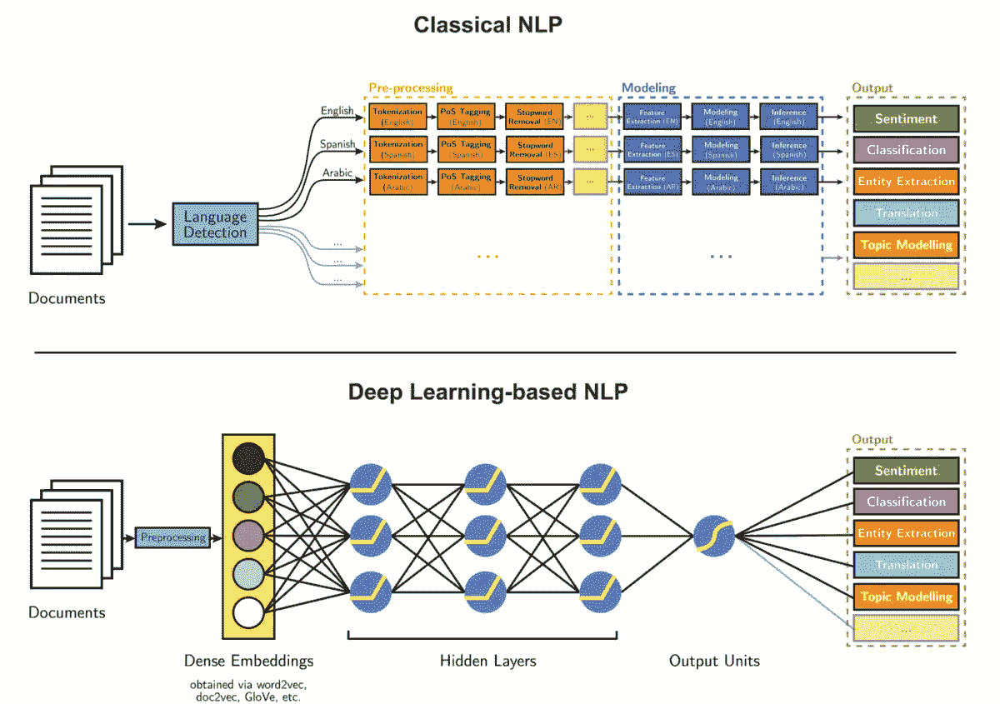

基于 ML 的统计自然语言处理与基于 DL 的神经自然语言处理

# 自然语言处理的组成部分

自然语言处理分为两个部分

1.  自然语言理解(NLU)
2.  自然语言生成(NLG)

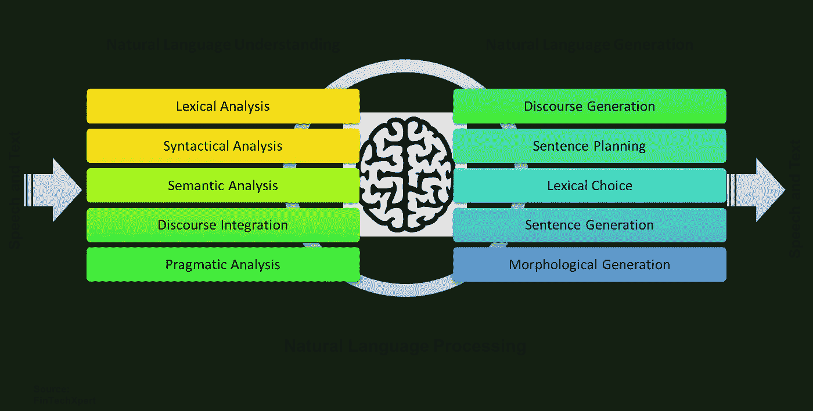

N **自然语言理解:**使智能系统理解通过文本或语音输入的自然语言的过程。

自然语言理解的组成部分

词法分析:通过词法分析，我们将一整块文本分成段落、句子和单词。它包括识别和分析单词的结构。

**句法分析:**句法分析包括对句子中的单词进行语法分析，并以显示单词之间关系的方式排列单词。

**语义分析:**语义分析为词语提取确切的含义，并分析文本的意义。

**语篇分析:**披露分析/语篇整合考虑了语篇的语境。它在句子结束前考虑句子的意思。

语用分析:语用分析处理语言的整体交流和解释。它涉及在各种情况下有意义地使用语言。

自然语言生成:从某种内在表示中以自然语言的形式产生有意义的短语和句子的过程。

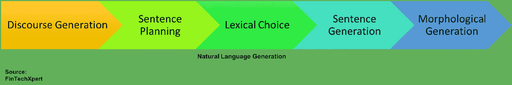

自然语言生成的组件

**话语生成:**输入是交流目标，输出可以是话语的过程，往往以内容树的形式出现。

**句子规划:**涉及到表面实现或者根据语法线性化。

**词汇选择:**它涉及到在生成的文本中选择实词(名词、动词、形容词和副词)。

**句子构造:**创建句子文本的过程，根据句法规则，该过程应该是正确的

**形态生成:**最终结构化的过程，可能涉及修正，如语言在实体、情境等上下文中的时态差异或性别差异。

# 自然语言工具包及其特点

这里有许多开源的 NLP 库，比如 Apache 的 OpenNLP、Stanford NLP、MALLET，它们在现实世界的应用中提供了 NLP 的算法构建模块。NLP 的几个好用的 python 框架是 NLTK，spaCy，GenSim，TextBlob。

> ***“玩自然语言的神奇库。”***

[自然语言工具包(NLTK)](https://www.nltk.org/) 是一个 Python 库，它提供了 50 多个语料库和词汇资源的易用接口，如 [WordNet](https://www.nltk.org/howto/wordnet.html) 以及用于处理文本、分类、标记、词干、标记、解析、情感分析等的文本处理库。它还支持为工业级 NLP 库和活跃的论坛构建聊天机器人和包装器的包。它适用于 Windows、Mac OS X 和 Linux。

# 使用 NLTK 的 NLP 中的基本任务

以下代码在[谷歌合作实验室](https://research.google.com/colaboratory/)中执行，解释了自然语言处理中的文本预处理。

对于 NLP 中的各种数据处理案例，我们需要导入一些库。在这种情况下，我们将使用 NLTK 进行自然语言处理。我们将使用它对文本执行各种操作。

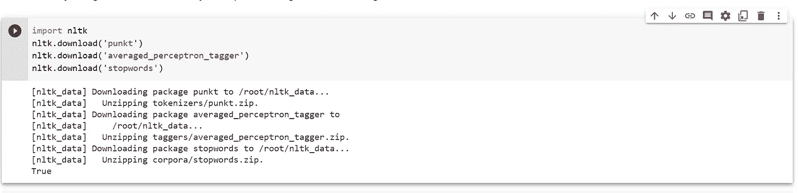

导入所需的库

NLTK 数据包包括 **punkt** :英语预训练标记器、**averaged _ perceptron _ tagger**:英语预训练词性标记器、**停用词**:179 个英语停用词列表，如“I”、“a”、“The”，在分析时对文本没有什么意义。

**记号化:**将一段文本分割成称为记号的更小单元的过程。记号可以是句子、单词、子单词或字符。对语料库执行标记化以获得标记。然后，使用以下标记来准备词汇表。词汇指的是语料库中的唯一标记集。

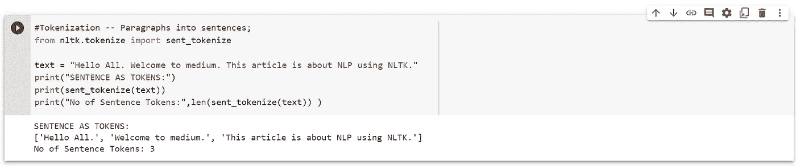

句子标记化

**代码解释:****sent _ tokenize**子模块是从 NLTK 库中导入的。变量文本用 3 个句子初始化。在 sent_tokenize 模块中传递文本变量并打印结果。这个模块用输出中可以看到的标点符号来分隔每个句子。

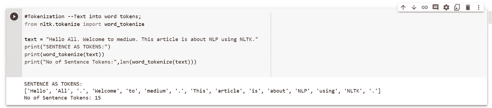

单词标记化

**代码解释:****word _ tokenize**子模块是从 NLTK 库中导入的。一个可变文本用 3 个句子初始化。在 word_tokenize 模块中传递文本变量并打印结果。这个模块打破了每个单词，包括标点符号作为令牌，你可以在输出中看到。

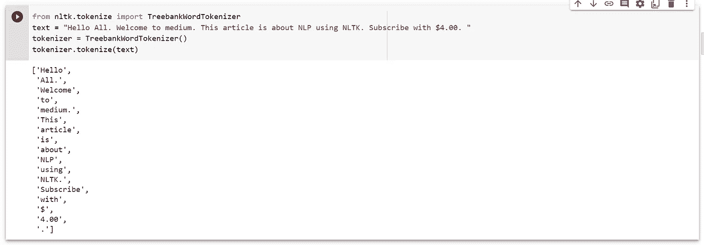

树库单词标记化

**代码解释:****treebankwodtokenize**子模块从 NLTK 库中导入。可变文本**T5 用 4 个句子初始化。文本变量被传入 TreebankWordTokenize 模块并打印结果。这个模块假设文本已经被分割成句子，并把每个单词作为标记。它将大多数标点符号、分隔逗号和单引号，以及行尾的空格分隔句点视为输出中可以看到的标记。**

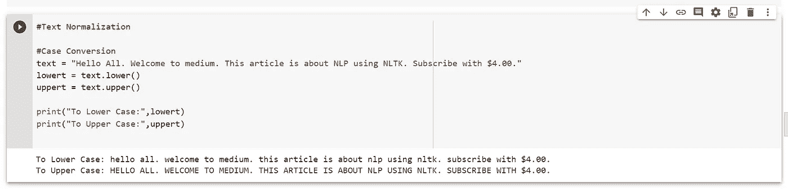

文本规范化:大小写转换

子模块 lower()和 upper()将给定的文本分别转换成小写和大写。

**词干化:**将单词缩减为词干或词根形式的过程。例如，“**连接”、“被连接”、“正在连接”**的词简化为一个常用词**“连接”**。目标是将相关单词归入同一词干，即使该词干不是词典中的单词。它不保留单词的上下文，因为它只对单个单词进行操作。这是因为词干分析中主要有两个错误。

**过词干化:**词干不同的两个词词干化为同一个词根时。这也称为假阳性。例如，**“宇宙”、“宇宙”、“大学”**虽然不同的单词词干都是为了**“宇宙”**这是不对的。

**词干提取不足:**两个应该词干提取到同一个词根的单词没有提取词干。这也被称为假阴性。例如，**“校友”、“校友”、“女校友”**虽然表达的是同一个意思，但词根却不同。

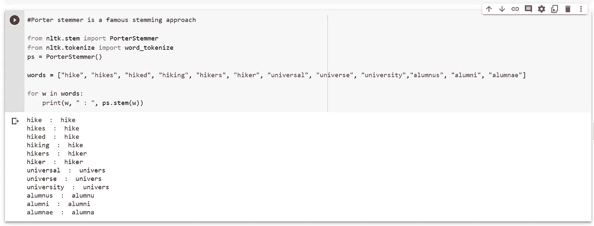

使用波特斯特梅尔算法进行词干提取

有许多方法来做词干，像波特斯特梅尔，斯诺鲍斯特梅尔，兰卡斯特斯特梅尔，波特斯特梅尔算法被认为是经验上有效的。雪球斯特梅尔是波特的即兴版本，也被称为波特 2 stemmer。

**词条化:**将单词还原为其基词，适当减少屈折词，保证词根(词条)属于该语言。Lemma 是单词集的字典形式。它识别词类(POS ),然后进行标准化。例如，没有 POS 标签的单词' *leaves* '将被词条化为单词' *leaf'* '，但是有了动词标签，它的词条将变成' *leave* '。

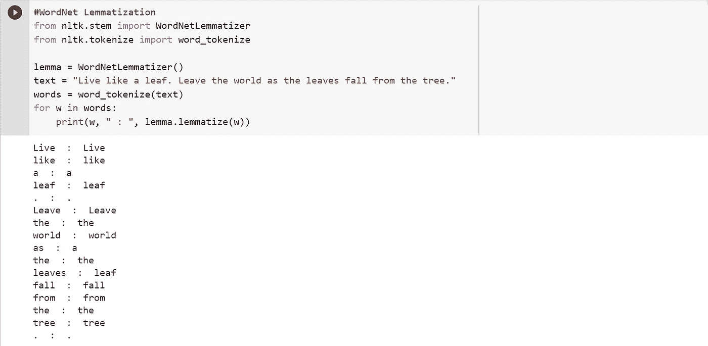

使用 WordNet 词汇化器的词汇化

**停用词移除:**停用词是英语中最常用的对句子没有太大意义的词。它们可以安全地删除，而不会实际影响句子的意思。例如，“该”、“约”、“要”、“何”。

从 nltk 语料库导入停用词模块。将标记与停用字词列表进行比较。如果找到匹配，删除否则打印。

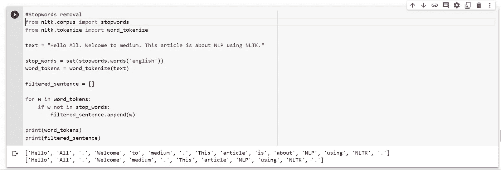

停用词移除

**词性标注:**帮助我们识别每个单词的标签，无论是名词、动词、形容词等。,.以下是 NLTK 列出的位置标签。

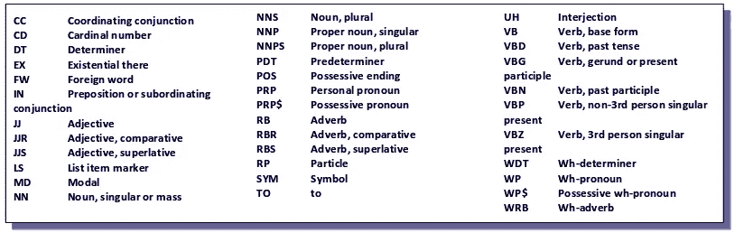

位置标签的 NLTK 列表

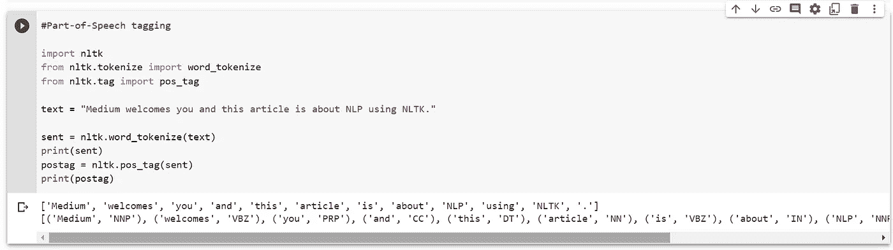

词性标注

**命名实体识别:**它用于捕获命名实体的所有文本提及。命名实体可以是个人、地点、组织等。,.例如，GPE —地缘政治实体，ORG —组织等等。

命名实体识别

**情感分析:**分析文本中情感的过程。情绪依赖于极性(neg:负，neu:中性，pos:正)和幅度(分配给每个极性的权重)。从 NLTK 下载 VADER 词典。VADER(用于情感推理的效价感知词典)是用于文本情感分析的模型，其对情感的极性和幅度都敏感。它在 NLTK 包中提供，可以直接应用于未标记的文本数据。

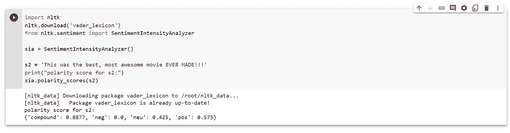

情感分析

# 结论

希望这篇文章让您对 NLP 及其使用 NLTK 的实践有所了解。尝试自己执行所有代码。请跟我来。

要查看代码样本，**点击** [**Colab 代码内容**](https://colab.research.google.com/drive/1iQYQogpe5P7EF8k_NTqX8yuQf3VD7bI6?usp=sharing)