# 导航条:风格与引导反应

> 原文：<https://medium.com/nerd-for-tech/navbar-styling-react-with-bootstrap-6c74b0631d04?source=collection_archive---------0----------------------->

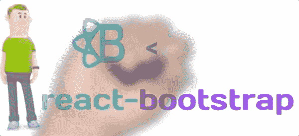

“Navbar”是大多数 React 页面中的另一个重要组件。让我们从 react-bootstrap 了解更多关于<navbar>的信息</navbar>

这篇文章是上一篇文章的延续。我们正在使用我们在那里开始的同一个项目，并完成了项目的初始设置。

 [## <卡>:用引导程序设计 React 应用程序的样式

### https://github . com/ranyelhousieny/bootstrap/blob/master/react-with-bootstrap/src/components/my navbar。

www.linkedin.com](https://www.linkedin.com/pulse/card-styling-react-apps-bootstrap-rany-elhousieny-phd%E1%B4%AC%E1%B4%AE%E1%B4%B0) 

位于[github/ranyelhousieny/react-with-bootstrap/src/components/my Navbar . js](https://github.com/ranyelhousieny/bootstrap/blob/master/react-with-bootstrap/src/components/MyNavbar.js)的 Navbar 最终代码

 [## ranyelhousieny/bootstrap

### 在 GitHub 上创建一个帐户，为 ranyelhousieny/bootstrap 开发做贡献。

github.com](https://github.com/ranyelhousieny/bootstrap/blob/master/react-with-bootstrap/src/components/MyNavbar.js) 

Navbar 组件(和其他 react 组件一样)由开始标签<navbar>和结束标签组成</navbar>

在这两个标签之间是我们将看到的导航栏上的所有项目

# <navbar.brand></navbar.brand>

通常，你会在页面顶部看到导航栏，上面有导航项，比如主页、购物车……它还包括一个品牌，也就是页面所有者的品牌。

正如你在图像中看到的，黑色区域是导航条。它有一个品牌和两个链接，Link1 和 Link2。让我们从一个简单的带有品牌的导航条开始

首先，您导入 Navbar

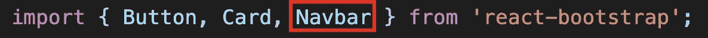

要创建一个品牌，可以在<navbar>组件中使用 <navbar.brand>API，如下所示。在标签之间放上你的品牌名称。在这种情况下，我只是将其命名为“品牌”</navbar.brand></navbar>

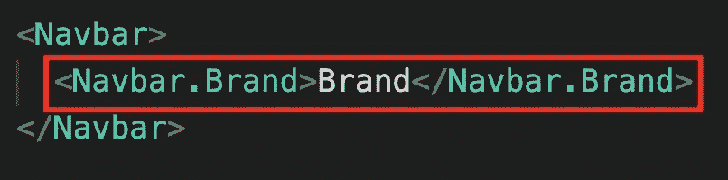

它将在浏览器上显示如下

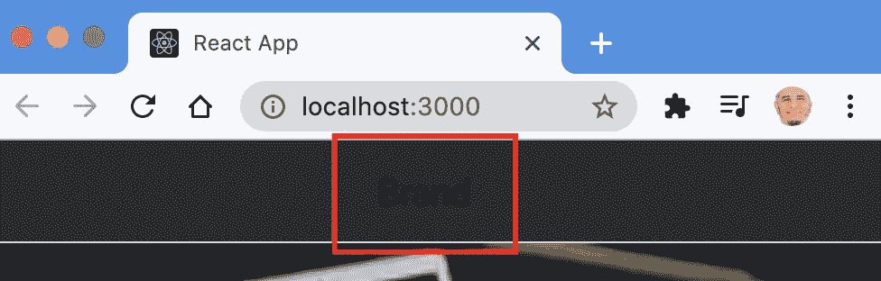

## 背景颜色

我知道这不是最佳视角。让我们把背景色改成浅色。您可以使用 bg prop 更改背景颜色，并且可以使用可用的颜色选项之一。

bg= "深色"代表黑色背景(如上图所示)

bg= "白色"类似于白色/浅灰色背景的 bg= "浅色"

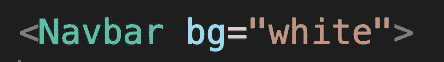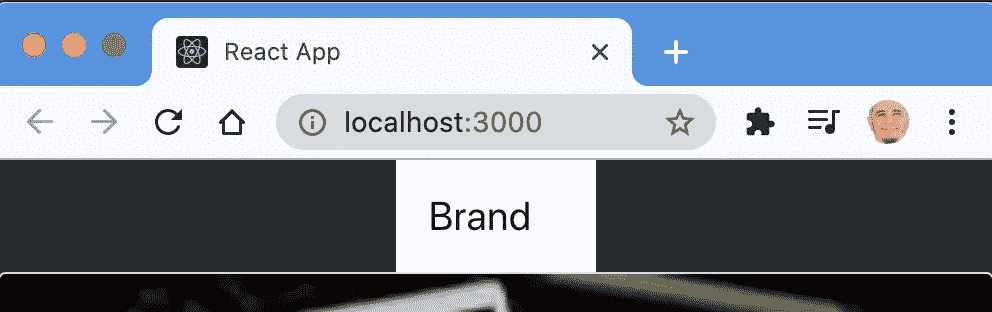

看起来好一点了。我们会不断进步。

你可以控制文本的颜色，我们很好，使用变体

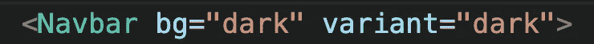

您使用 variant="dark "和 bg="color "给出白色文本，如下所示。当然，使用带 bg="light "的灯

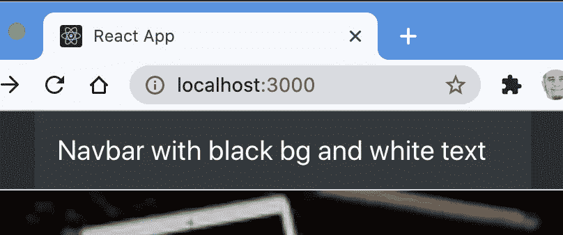

这是你需要的 Navbar 的代码，只有一个品牌。

## 添加链接

你可能希望将品牌路由到主页、关于或任何其他页面。为此，我们可以使用 href= " "。

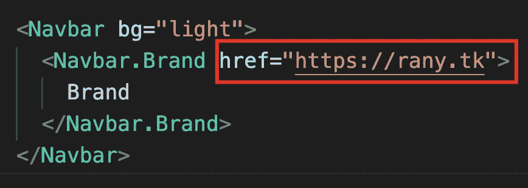

## 添加徽标

您可以使用 img 添加徽标，如下所示

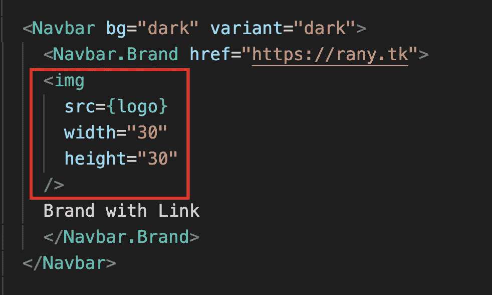

我用了 create-react-app 自带的 logo

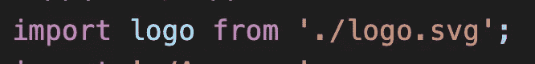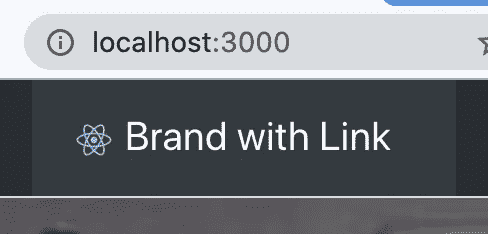

## <container></container>

将导航栏放在容器中，使其在页面上居中

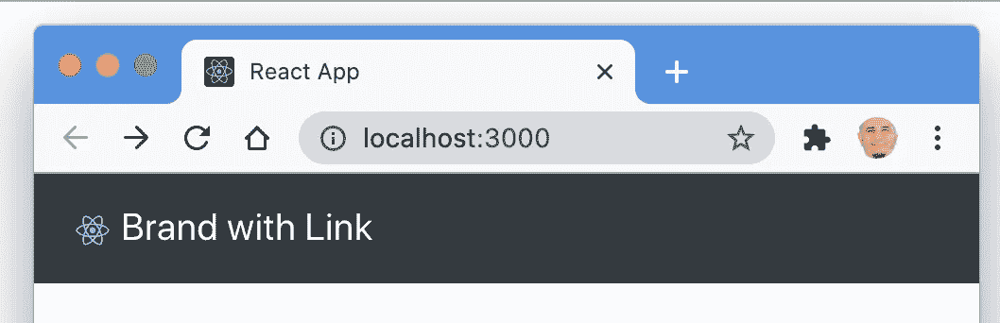

在容器之前

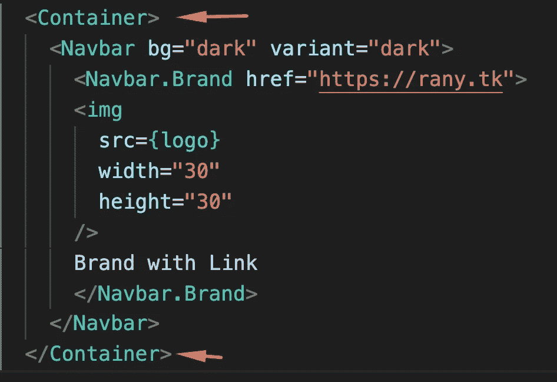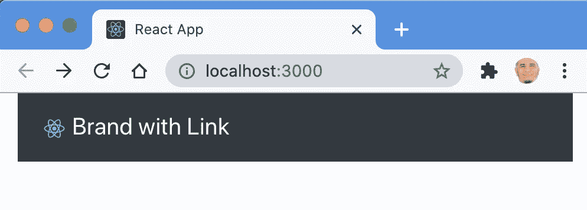

在集装箱之后

由同一作者在 LinkedIn 上发布:

 [## 导航条:风格与引导反应

### “Navbar”是大多数 React 页面中的另一个重要组件。让我们从 react-bootstrap 了解更多关于< Navbar >的信息…

www.linkedin.com](https://www.linkedin.com/pulse/navbar-styling-react-bootstrap-rany-elhousieny-phd%E1%B4%AC%E1%B4%AE%E1%B4%B0/)