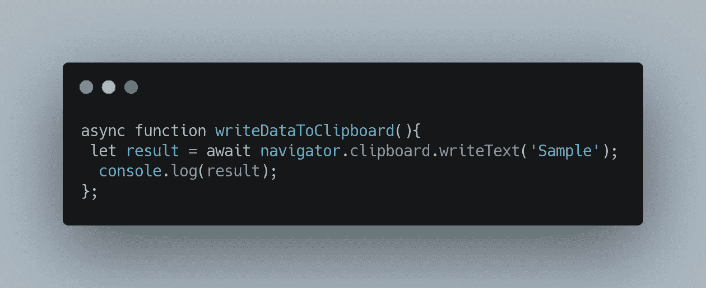
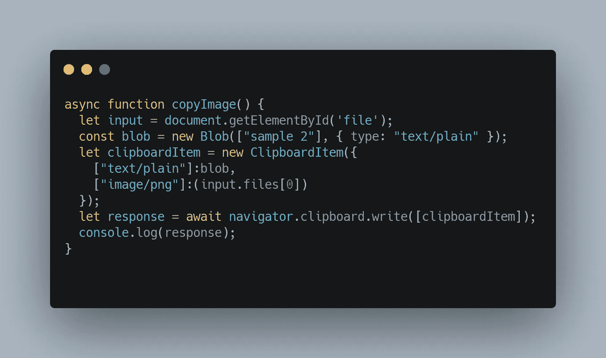
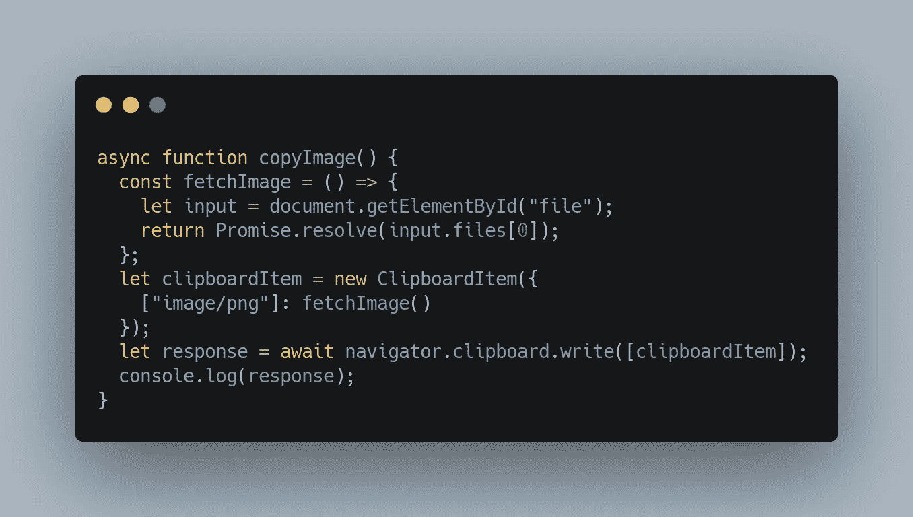
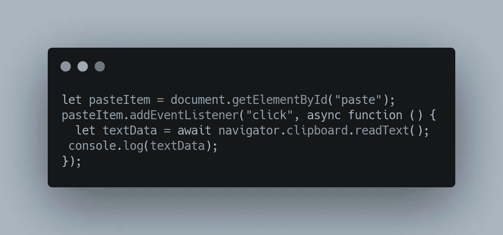

# 导航剪贴板 API

> 原文：<https://medium.com/nerd-for-tech/navigator-clipboard-api-b96be187df5d?source=collection_archive---------0----------------------->

## 在主流浏览器中支持异步剪贴板 API

来自[佩克斯](https://www.pexels.com/photo/person-holding-white-paper-with-blue-pen-9480111/?utm_content=attributionCopyText&utm_medium=referral&utm_source=pexels)的[龟背竹](https://www.pexels.com/@gabby-k?utm_content=attributionCopyText&utm_medium=referral&utm_source=pexels)摄影

剪贴板是一个临时存储数据的空间。这些 API 用于开发应用程序中的剪切、复制和粘贴功能。Navigator 剪贴板浏览器 API 用于将各种数据写入剪贴板，也用于读取剪贴板数据。这些在所有主流浏览器(Chrome、Safari 和 Firefox)中都有，支持程度不同。

# 导航器剪贴板 API

*   [navigator . clipboard . write text](https://developer.mozilla.org/en-US/docs/Web/API/Clipboard/writeText)
*   navigator.clipboard.wri te
*   [navigator . clipboard . read text](https://developer.mozilla.org/en-US/docs/Web/API/Clipboard/readText)
*   [navigator . clipboard . read](https://developer.mozilla.org/en-US/docs/Web/API/Clipboard/read)

# 支持的 Mime 类型

Mime 类型定义了数据的类型。这些是在写入和读取剪贴板时指定的，用于指示数据的种类。这些是通常支持的 MimeTypes。

1.  所有浏览器都支持文本/纯文本格式
2.  所有浏览器都支持文本/html、html 格式
3.  所有浏览器都支持图像/png 图形格式
4.  text/uri-list，URL 列表，仅在 Safari 中受支持。
5.  “web text/*”、 [Web 自定义格式](https://developer.chrome.com/blog/web-custom-formats-for-the-async-clipboard-api/)，仅在 Chrome 中受支持
6.  “web 应用/*”、 [Web 自定义类型](https://developer.chrome.com/blog/web-custom-formats-for-the-async-clipboard-api/)，仅在 Chrome 中受支持

# navigator.clipboard.writeText

## 支持的浏览器

所有主流浏览器(Chrome、Firefox 和 Safari)

## 用例

复制到剪贴板按钮。

[https://codepen.io/rohinikumar4073/pen/yLXMmpP?editors=1111](https://codepen.io/rohinikumar4073/pen/yLXMmpP?editors=1111)

navigator.clipboard.writeText

# 导航器. clipboard.write

## 支持的浏览器

1.  Chrome，Safari
2.  Firefox 通过将 asyncClipboard 标志设置为 true 来支持。这些配置可通过浏览**关于:配置**获得。

## 用例

1.  上下文菜单副本
2.  将图像写入剪贴板

## 描述

[ClipboardItems](https://developer.mozilla.org/en-US/docs/Web/API/ClipboardItem) 数组作为参数传递给 clipboard.write. Blobs 用于创建剪贴板项目。

## 遇到的错误

## 旅行队

> 用户代理或平台在当前上下文中不允许该请求，可能是因为用户拒绝了权限。

多个问题都可能发生这种情况。

1.  [瞬时激活](https://developer.mozilla.org/en-US/docs/Glossary/Transient_activation)后发生剪贴板写入。如果用户操作和写入剪贴板的时间延迟超过 1 秒。(Safari 支持为剪贴板项目返回承诺和解析 blobs 以避免此问题)。

## 铬

> 文档未聚焦

这个错误发生在 Chrome 中，当写入剪贴板时有延迟，用户没有聚焦在窗口上。

## Chrome 浏览器、火狐浏览器

> 写入时不支持类型{mimeType}

当编写的 mimeType 不是文本、html 或图像时，在 Chrome 中会发生此错误。

【https://codepen.io/rohinikumar4073/pen/xxrdxxR 

Safari 还支持使用 blobs 的承诺创建 clipboardItem。当要写入的数据必须从服务器获取时，这很有帮助。

Safari 承诺返回剪贴板项目 blobs

# navigator.clipboard.readText 和 navigator.clipboard.read

## 支持的浏览器

1.  Chrome，Safari
2.  Firefox 通过设置 asyncClipboard 标志来支持这一点，正如我们在 write 中所讨论的。

navigator.clipboard.readText

# 导航器. clipboard.read

## 错误

## 铬

> 读取权限被拒绝

navigator.clipboard.read 上有一个允许剪贴板访问的提示。当提示出现时，如果用户单击阻止剪贴板访问，就会出现此错误。

> 剪贴板上没有有效数据。

当剪贴板中没有文本、html 或图像，并且包含一些其他数据类型或空剪贴板时，会出现此错误。

## 旅行队

> 用户代理或平台在当前上下文中不允许该请求，可能是因为用户拒绝了权限

1.  在 navigator.clipboard.read 上如果剪贴板数据不是来自同一个浏览器按钮，Safari 中会显示一个额外的粘贴按钮。如果没有单击，将会引发此错误。
2.  当我们试图在类似上下文菜单的事件中调用 navigator.clipboard.read 时，就会显示这一点。