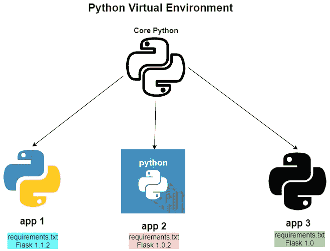
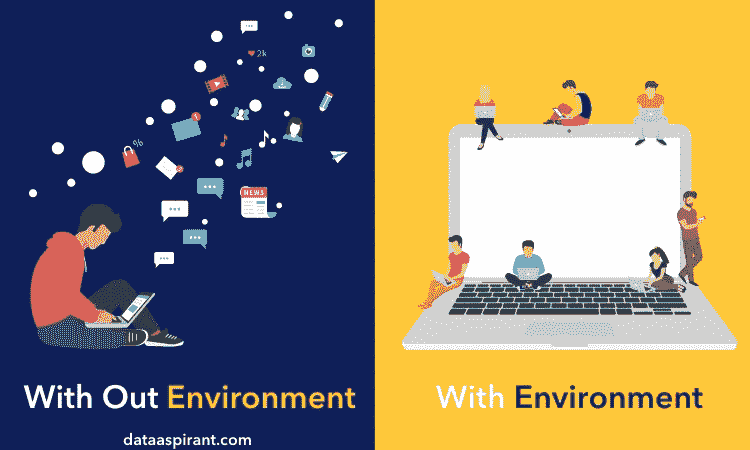
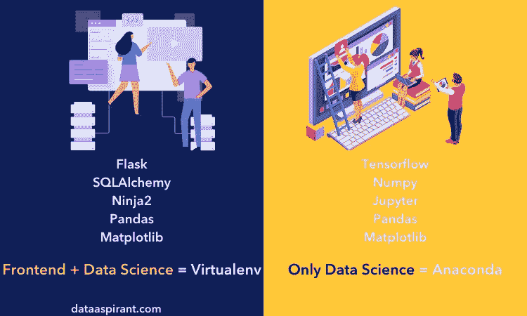

# 为什么我们需要 Python 的虚拟环境

> 原文：<https://medium.com/nerd-for-tech/necessities-of-pythons-virtual-environments-99ce55d6328a?source=collection_archive---------10----------------------->


在这篇博客中，我将谈论虚拟环境的使用，以及它如何让你的生活变得更轻松。Python 有一种在你的计算机上下载包或模块的独特方式。我们用来执行各种任务的第三方包通常放在一个目录中。这可能会导致一个问题，因为您计算机上的每个项目都将使用这些相同的目录并检索这些第三方包。然而，当不同的项目需要不同版本的包，而 python 无法区分目录中的版本时，这会导致一个问题。这就是虚拟环境发挥作用的时候。

# **虚拟环境**

虚拟环境基本上是 python 项目的一个独立环境。它有自己的依赖项，不管其他项目的依赖项是什么。因此，您可以为任何项目创建一个虚拟环境，它将独立于其他库和依赖项。它的优点是对虚拟环境的数量没有限制，因为它只是一个目录，其中包含安装第三方库的文件夹和确保 python 代码在虚拟环境中使用 python 解释器和站点包的脚本。



# **使用虚拟环境的好处**

*   没有依赖问题
*   通过删除一个项目所需的包来保持主包目录的整洁
*   在您没有管理员权限的计算机上安装软件包

# **如何使用虚拟环境**

*   创建一个您想要处理的新目录
*   在该目录中创建新的虚拟环境

`python -m venv env`:这将在目录中创建一个名为`env` 的文件夹，该文件夹将包含三个文件夹:script(Mac 中的 bin)、include 和 library。之后，我们需要通过运行文件夹中的脚本来激活我们的环境。

```
source env/Scripts/activate ## in Windows
source env/bin/activate ## in Mac
```

如果你需要回到主系统然后使用`deactivate.`

# 添加库

默认情况下，`pip` 和`setuptools` 已经在环境内部。您可以使用 pip 添加项目所需的包。您可以使用 pip 创建一个 requirement.txt 文件。

```
pip freeze > requirements.txt
```

如果您在一个组中工作，其他成员可以使用该文件来更新虚拟环境。

```
pip install -r requirements.txt
```

因此，现在所有的组成员都有了软件包的正确版本。同样，当你更新一个库时，它会意外地产生一个问题。您总是可以依靠 requirement.txt 文件在新环境中重新安装依赖项。

# **Jupyter 笔记本中的虚拟环境**

激活虚拟环境后，您需要在环境中安装 ipython 内核。

```
ipython kernel install --user --name=env
```

在那之后,`kernel.json`文件将被创建，你就完成了。之后，您可以使用 `jupyter notebook`或`jupyter lab`并选择 env 内核来使用虚拟环境。



# Conda vs Python 虚拟环境

哪个更好？答案总是视情况而定。如果我们只创建一个没有外部包的数据科学项目，那么我们可以使用 anaconda，因为不需要创建新的虚拟 env。然而，anaconda 的问题是，当我们使用 anaconda 创建虚拟环境时，它会附带所有主要的数据科学包，如果我们为每个项目创建一个包，这对我们的计算机来说是一个很大的负担。如果我们使用 flask 和 SQL 来创建一个应用程序，最好使用虚拟环境来获得更好的依赖性。下面是我找到的一张显示上述观点的图片。



我们了解到，虚拟环境可以让我们的生活变得更加轻松，因为它不需要处理依赖性问题，并且有一个备份 requirement.txt 文件供团队和您在意外创建包问题时使用。

[](https://www.linkedin.com/in/tenzin-wangdu/) [## 丹津·王度-大会数据科学研究员| LinkedIn

### 我是一名数据科学家，拥有数学学士学位。我有使用 Python、SQL 和 Tableau 做项目的经验。

www.linkedin.com](https://www.linkedin.com/in/tenzin-wangdu/)