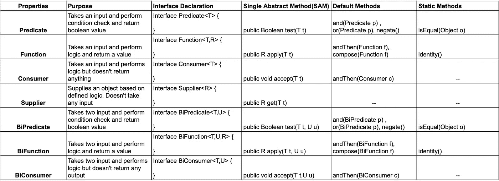

# 需要快速更新 Java 8 特性吗？—第一部分

> 原文：<https://medium.com/nerd-for-tech/need-a-quick-java-8-feature-refresh-part-1-19206165dc58?source=collection_archive---------12----------------------->

## 功能界面备忘单

马库斯·斯皮斯克在 [Unsplash](https://unsplash.com?utm_source=medium&utm_medium=referral) 上的照片

如果你像我一样，正在找工作，并且已经将 Java 8 添加到你的技能组合中，需要快速更新，这将节省你的时间。

***什么是功能界面？***

只有一个抽象方法的接口叫做函数接口。

@FunctionalInterface 注释确保编译器将检查接口是否具有单一抽象方法(SAM)。

功能接口在 **java.util.Function** 包中。

***哪些是预定义的功能界面？***

*   谓词 <t>—接受类型 T 的输入并执行检查，然后返回一个布尔值。谓词主要用于过滤流中的数据。</t>
*   函数 <t r="">—接受 T 类型的输入，执行逻辑，并返回 r 类型的对象。这在 Stream.map 方法中最常见。</t>
*   消费者 <t>—接受类型 T 的输入并执行逻辑。不返回任何输出。</t>
*   供应商 <r>—供应商不接受任何输入，但执行逻辑并返回一个 r 类型的对象。</r>

下面列出了谓词、函数、消费者和供应商中的 SAM、默认和静态方法。

**功能接口有哪些变体？**

*基于输入数量*

*   双谓词 <t u="">—类似于谓词，但**接受类型为 T 和 u 的两个输入** **。**</t>
*   双功能 <t r="">—类似于功能，但**接受 T 和 U 类型的两个输入**并返回 r 类型的输出。</t>
*   双用户<t u="">——类似于用户，但**采用 T 型和 u 型两个输入** **。**</t>
*   b̶i̶s̶u̶p̶p̶l̶i̶e̶r̶——对不起，不存在，因为我没有任何输入参数。

*基于原语类型支持*

Lol，这个有很多排列组合。

*   谓词有 3 个变体
*   函数有 15 个变量
*   消费者有 3 种选择
*   供应商有 4 种变体

当你时间紧迫时，希望这能有所帮助。

干杯！并祝一切顺利:)