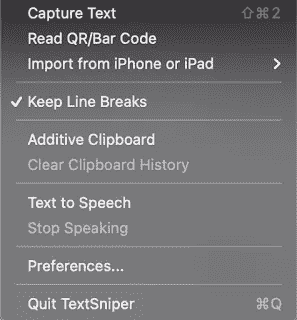

# 想从你的 Mac 上拿点东西，发短信给我

> 原文：<https://medium.com/nerd-for-tech/need-to-grab-something-from-you-mac-textsnipe-it-f92ec45c16e6?source=collection_archive---------22----------------------->

Mac 自带截图工具已经有一段时间了，它非常有用，可以捕捉整个屏幕，一个窗口或者一个(可选的)区域。它可以通过图像甚至视频来实现这一点。

当激活时，它占用屏幕焦点，所以你不能与屏幕交互，所以有一个很好的功能，允许在 5 或 10 秒内抓取，所以设置抓取区域，与任何需要的东西交互，然后截图将抓取图像(这对于抓取下拉菜单和其他类似的东西很有效)。

上图是 [TextSniper.app](https://textsniper.app/?ref=stevekarmeinsky1) 下拉菜单的截屏，截屏抓取一张图片或视频的同时，TextSniper 抓取高亮区域的内容并保存到剪贴板。

抓住屏幕上的一些文本(这些文本可以是图像、PDF 文档或任何东西)，无论是什么，剪贴板上都将有文本。只需打开您最喜欢的编辑器并粘贴，一切都在那里。它也可以对二维码做同样的事情，同样只需在屏幕上绑定二维码，内容就会保存在剪贴板中(对于阅读英国 NHS Covid 二维码等内容非常有用——你的手机只会说这是未经识别的内容)，这也可以解码条形码和二维码。

[TextSniper](https://textsniper.app/?ref=stevekarmeinsky1) 还会从连接的 iPhone 或 iPad(需要通过 USB 或 WiFi 连接)上抓取东西，然后你可以拍照、扫描文件或添加草图。

如果点按文本到语音，那么当文本被采集并复制到剪贴板时，它将被读取(回放速度在偏好设置中选择)。

这可能是最有用的工具之一，它可以直接从 [TextSniper.app](https://gumroad.com/a/494189395/NYNNM) 购买，价格为 6.99 美元，或者从[苹果 Mac 商店](https://apps.apple.com/us/app/textsniper-pdf-image-ocr/id1528890965)购买，尽管价格会涨到 9.99 美元(可能会因当地价格而异)。强烈推荐。

*最初发表于*[*http://eurotechnews.blogspot.com*](https://eurotechnews.blogspot.com/2021/05/need-to-grab-something-from-you-mac.html)*。*