# 负拾取-冻结小行星

> 原文：<https://medium.com/nerd-for-tech/negative-pickup-freeze-asteroid-30b3582dc9f2?source=collection_archive---------30----------------------->

正如我在之前的文章中提到的，是时候开始让**玩家**的**游戏**变得更加**困难**了。他们有相当多的**能量**到**来帮助**他们，但是**到现在为止还没有会对他们**产生负面影响**的**！

在这篇文章中，我们将创建一个**冻结小行星**，它将**减慢**玩家**的速度**几乎停止一段时间。他们最好希望没有敌人快速靠近！

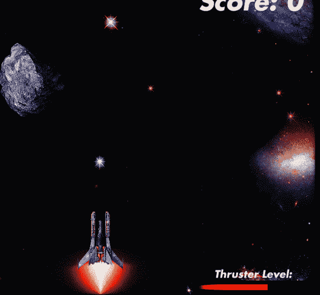

不许动。以[游戏]法则的名义！

# 冻结小行星游戏对象

首先我们将创建**小行星探测器**，它将触发新奇的冻结逻辑！

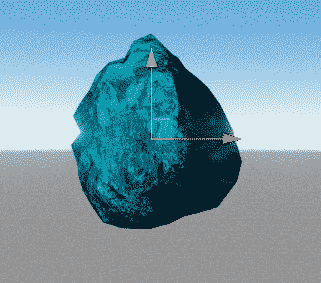

冻结小行星预览

我简单地重复使用了**小行星精灵**，并通过其**精灵渲染器**将其着色为**蓝色**。看起来很冰…对吗？

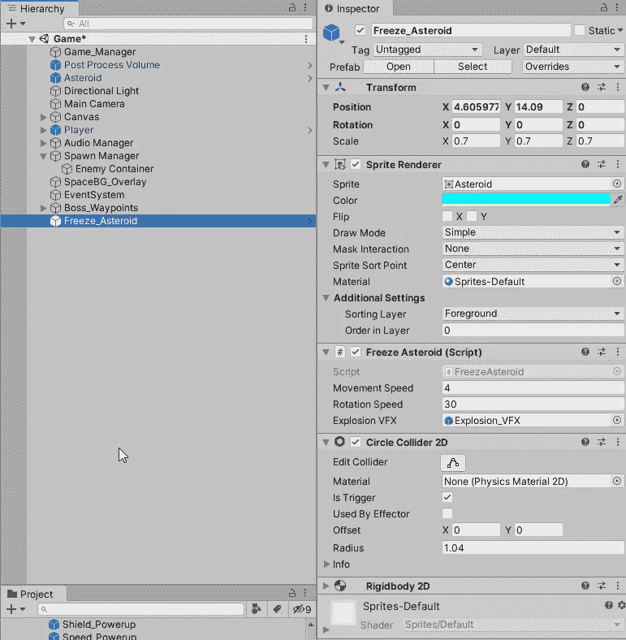

Sprite 渲染器中的蓝色，加上其他组件

我还添加了一个**圆形对撞机 2D** ，它已经被编辑以适应小行星并且**是触发器**，以及一个**刚体 2D** 组件，其**重力比例**设置为 **0** 。

我还创建了一个新的**冰冻小行星脚本**来保存这个新的负面事件的逻辑！

一旦**游戏对象**被创建并链接，不要忘记**将它**添加到 **SpawnManager 加电数组**中，这样它就有机会被生成！

# 冰冻小行星脚本

我们将从全局变量开始:

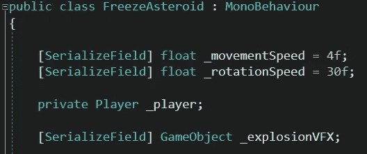

并且会在 **Start()** 得到我们的**播放器**和 **null check** :

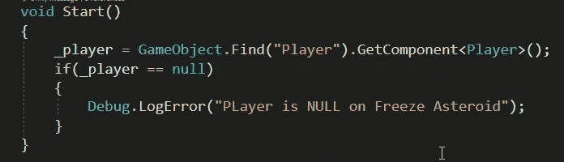

接下来我们将创建**小行星的运动逻辑**。一行用于**向下平移**，另一行用于**旋转**，还有一个 **if 语句**用于在它消失在屏幕外时销毁它:

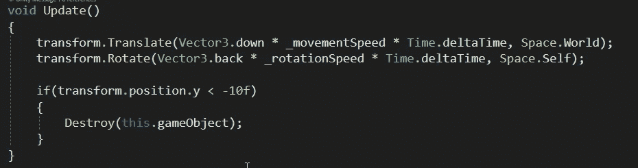

请随意将这些放入它们自己单独的函数中！

现在我们还将创建**触发逻辑**，用于它与**激光**和**播放器**的交互。

一定要在检查器里链接你的 _ explosionVFX！(你也可以忽略 _ player . player users . remove()行…这在下一篇文章中会有意义！)

当**实例化**时，我创建了一个对**爆炸**的**引用**，这样我就可以改变爆炸的**比例**。在这种情况下，由于我的**冻结小行星**比我原来的**小行星**小**，我已经将爆炸 VFX 缩小了一半。**

# _player。FreezeVFXActivate()

现在我们的玩家可以与冰冻小行星互动，但它目前没有做任何事情。我们必须在**玩家脚本**中为其创建逻辑！

所以首先我们将在**玩家脚本**中创建一些变量:

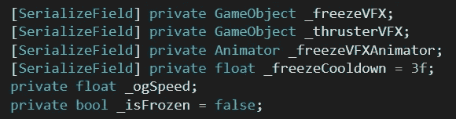

现在是函数:

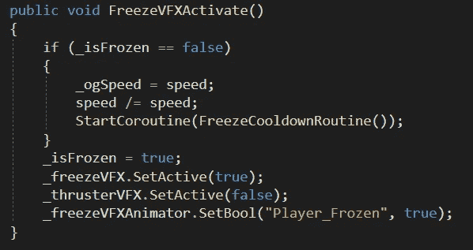

如果我们还没有**_ 被冻结**，那么我们将在 **_ogSpeed** 中缓存我们当前的速度。**除以**我们的**当前速度**，使其成为 **1** 。然后**启动**我们的**冷却**。

我们还将翻转我们的 **_isFrozen** bool 为 **true** ，打开我们的 **_freezeVFX** 动画游戏对象，关闭 **_thrusterVFX** 游戏对象，并启动 **_freezeVFX 动画**(这是我们即将创建的)。

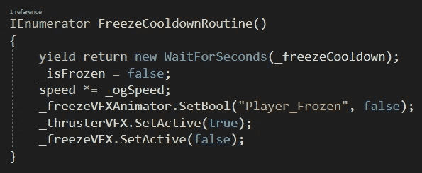

我们的冷却程序

我们的冷却程序将在我们的冷却定时器到期后，逆转我们在 **FreezeVFXActivate()** 函数中所做的一切。

# 定格 VFX 动画

为了创建我们的**冻结 VFX** ，我们将使用**小行星精灵**和**的另一个实例，使用它的**比例**和**阿尔法透明度**来制作**的动画。

我们将使用**小行星精灵**创建一个新的**游戏对象**，并将其作为**子对象**附加到我们的**玩家**:

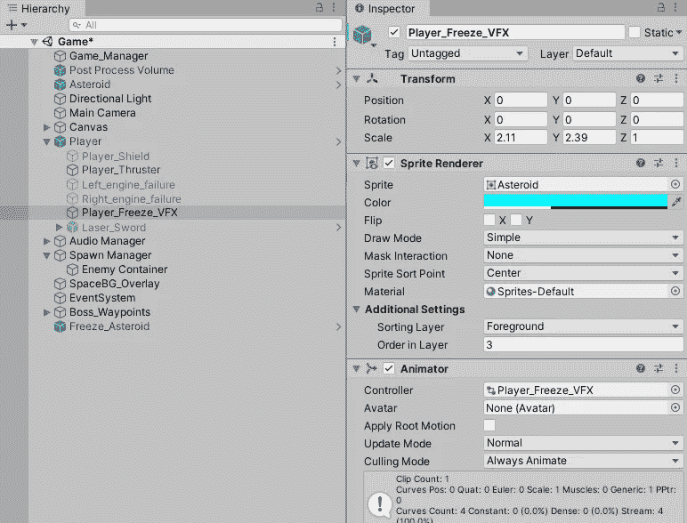

然后创建一个新的动画剪辑，选择 **Player_Freeze_VFX** 来创建 Animator 控制器和动画:

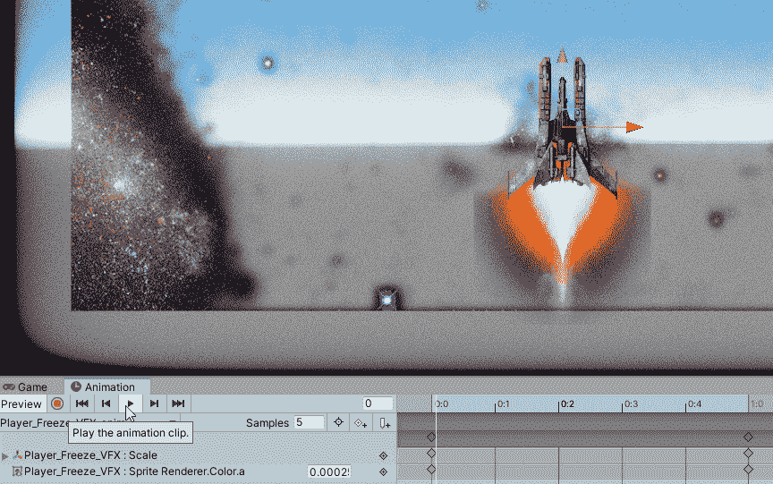

冻结 VFX 动画效果

我刚刚玩了缩放和 alpha 透明度来达到这个效果。采样率也进行了调整，以使时间感觉正确。

我们还将在**动画师控制器**中创建一个**空状态**，这样我们就可以触发动画发生:

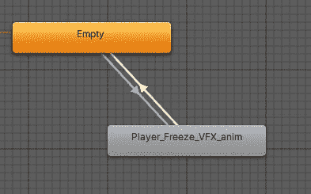

带转换的空状态。

我们的转换是通过创建一个名为"**Player _ freezed**"的**布尔参数**来控制的，并将其用作每个**转换**的**条件**:

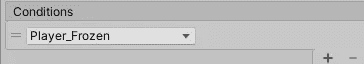

*创建动画时，确保它没有设置为循环！

一旦**动画**被**创建**，**玩家脚本**被赋予**逻辑**，并且**负面拾取**被**创建**并被扔进**产卵管理器加电数组**，你的玩家现在处于一些新的危险中！

在下一篇文章中，我们将通过创造一个没有什么可失去的新敌人来增加这种危险！