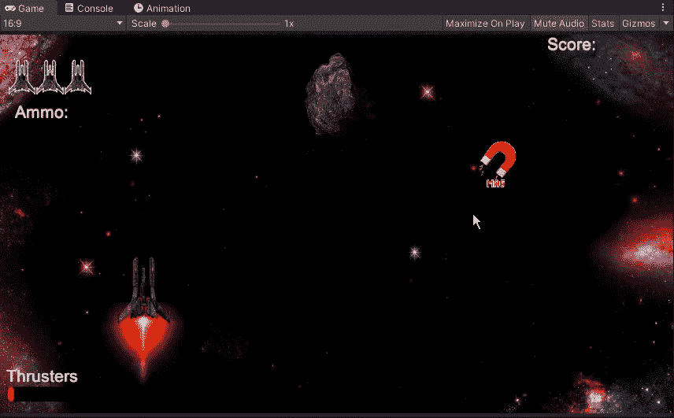
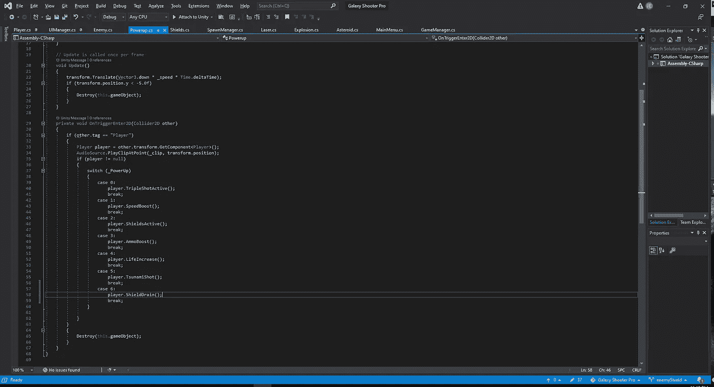
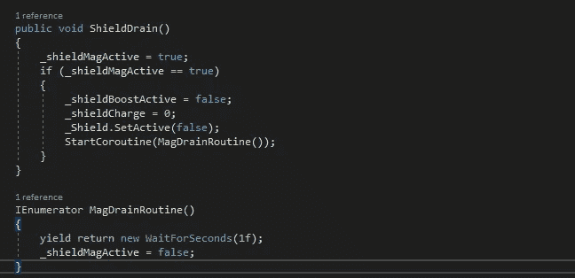
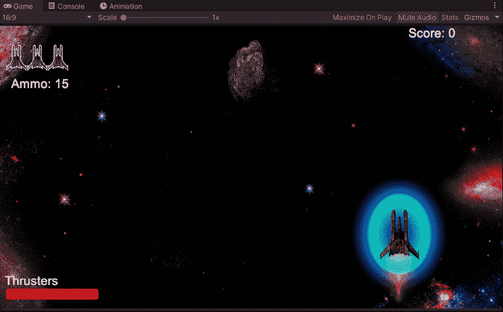
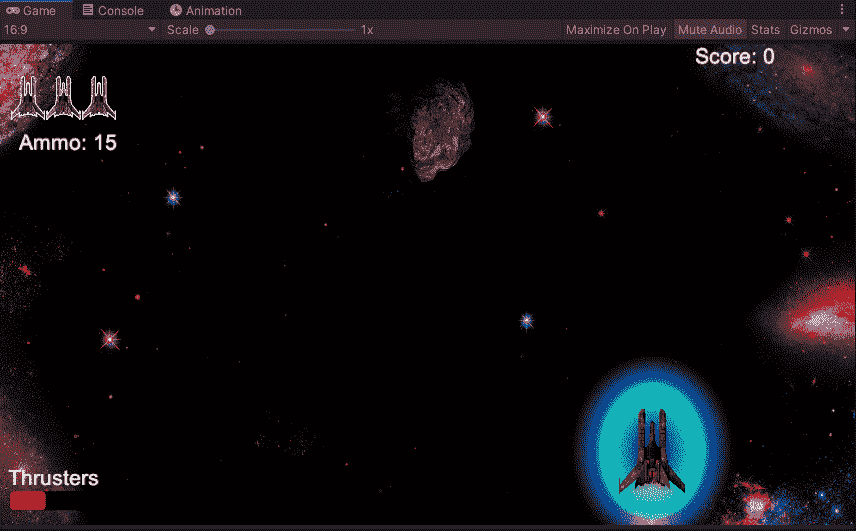
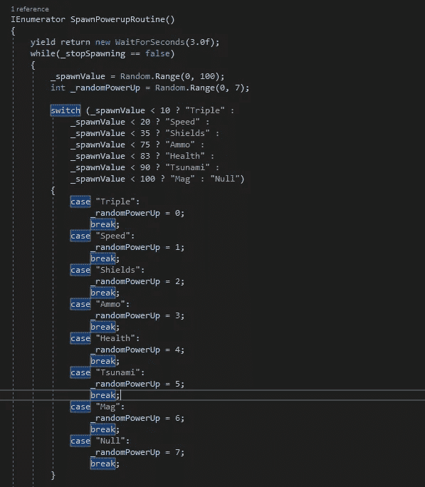

# 负通电:Mag '

> 原文：<https://medium.com/nerd-for-tech/negative-powerup-mag-4e914839a601?source=collection_archive---------21----------------------->

在我们考虑加入一些新的敌人来玩之前，让我们的玩家在能量开始下降的时候注意一下。我们不能总是高兴地看到能量掉落，所以让我们创造一个负面效应，让玩家在拿起能量之前思考一下，如果他们拿起能量，就会破坏我们的玩家护盾。首先，我们将创建我们的 powerup，并让它继承我们已经制作的其他 power up 的所有部分。从那里，我们可以进入我们的脚本，并迅速将其添加到我们的电源列表，我们的 UI 管理器，调整我们所有电源的百分比，并在我们的播放器中添加一个方法，让它以我们期望的方式做出反应。

至于这个磁力加速对我们的影响，它会剥夺我们玩家所有的护盾。然而，在我们实现它之前，我们需要创建一行代码来实现它。首先，在启动脚本中，我们将创建一个新的案例，并将其设置为新的编号:

现在，我们将进入我们的播放器脚本，并为加电创建新的函数:

为了让这个新功能对我们关闭，我们将在一个协程下运行它。因为我们不必担心新的加电会马上出现，所以我们只给它 1 秒钟的延迟。从这里，我们可以测试收集后盾牌是否会消失，以及收集新的盾牌能量是否正常:

现在我们可以看到它工作了，让我们用一个向我们开火的敌人来测试它:

我们需要做的最后一步是进入我们的产卵管理器脚本，将它设置到我们的产卵例程中，并给它一个产卵机会，同时调整当前的产卵率。因为我们想让它以一个合适的速度产卵，我们将降低一些更有用的能量，让它有机会以一个合适的速度产卵:

现在我们有了，快速的看一下我们如何创造一个能量来摧毁我们玩家的护盾。现在，我们在抓住掉下来的物体之前必须三思。