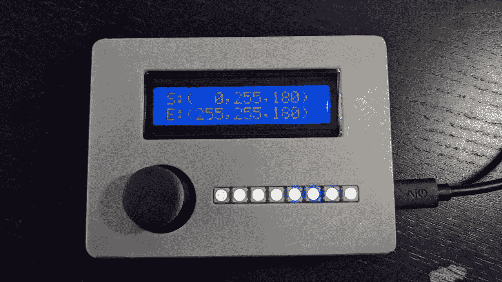

# 一小时后 NeoPixel ColorPicker

> 原文：<https://medium.com/nerd-for-tech/neopixel-colorpicker-in-one-hour-608a3377705c?source=collection_archive---------2----------------------->

本文描述了一个用于 NeoPixel LED 灯条的“所见即所得”硬件颜色选择器工具。

# 背景

最近我正在做一个 DIY 项目，需要用 NeoPixel (WS2812b) RGB LED 条显示不同的渐变。

从技术上讲，显示渐变没有什么困难，因为大多数开发板已经有了支持 HSV 的 LED 库…