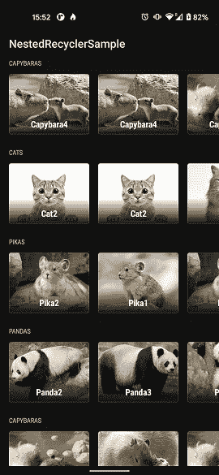
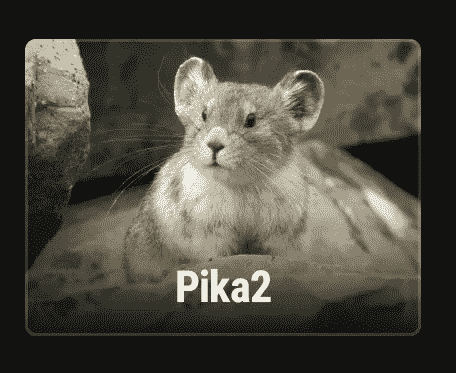
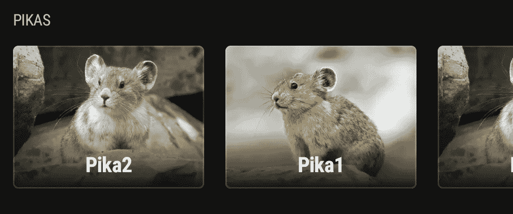
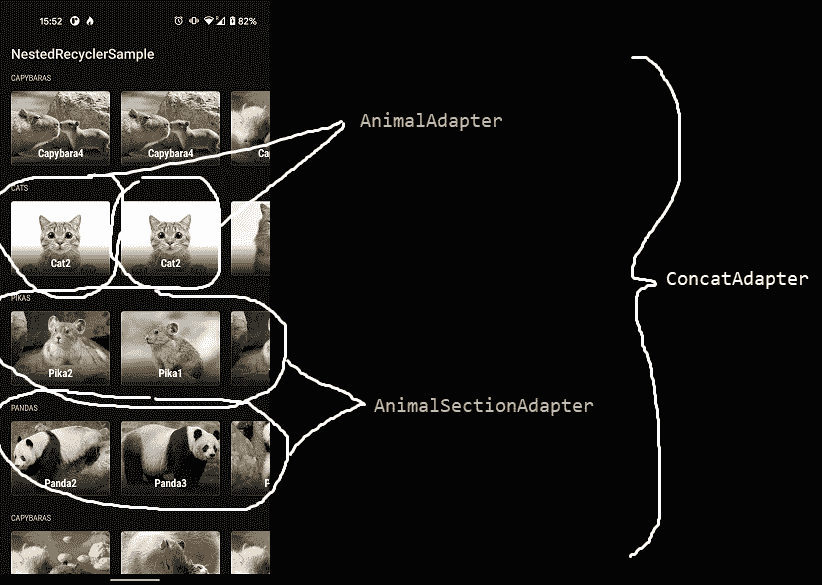
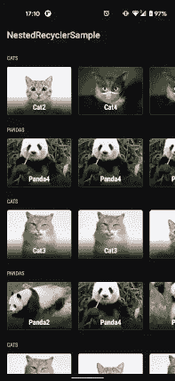
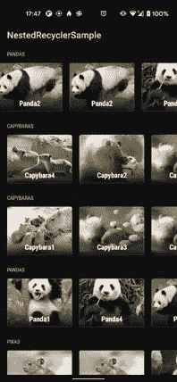

# Android 中的嵌套回收器做得很好！

> 原文：<https://medium.com/nerd-for-tech/nested-recycler-in-android-done-right-b101744e2a9a?source=collection_archive---------0----------------------->

米卡·鲍梅斯特在 [Unsplash](https://unsplash.com/s/photos/mobile-phone-android?utm_source=unsplash&utm_medium=referral&utm_content=creditCopyText) 上的照片

**TL；DR** : *这篇文章解决了垂直滚动和水平滚动手势被注册为垂直时水平滚动位置丢失的问题。参考* [*本 GitHub repo 带示例 app*](https://github.com/minarja1/NestedRecyclerSample) *查看解决方案。*

包括*网飞*和 *Play Store* 在内的许多应用程序使用嵌套回收器模式，在一个垂直视图中嵌入多个水平可滚动视图。用 [RecyclerView](https://developer.android.com/guide/topics/ui/layout/recyclerview) 在 Android 中实现这样的结构看起来很简单。的确如此。

但是…有几件事需要调整，以使一切顺利并按预期运行。让我们直入主题吧。

让我们创建一个显示动物部分的应用程序。每个部分都有一个*标题*，每个动物都有一个*名字*和一个*图像。结果应该是这样的:*

示例应用程序截图:嵌套回收器和动物部分。

# 数据

数据结构如下:

# 布局

我们需要一个动物个体的布局。布局[*item _ animal . XML*](https://github.com/minarja1/NestedRecyclerSample/blob/developv2/app/src/main/res/layout/item_animal.xml)*包含一个 CardView，带有 ImageView、TextView 和渐变，使文本弹出。*

**

*接下来，我们需要标题部分的布局和嵌套的 recycler view:[*item _ animal _ section . XML*](https://github.com/minarja1/NestedRecyclerSample/blob/developv2/app/src/main/res/layout/item_animal_section.xml)*

**

*[activity_main.xml](https://github.com/minarja1/NestedRecyclerSample/blob/developv2/app/src/main/res/layout/activity_main.xml) 只包含一个回收器。*

# *适配器*

*接下来，我们需要我们的适配器。为了这个教程，我使用一个简单的 [RecyclerView。适配器](https://developer.android.com/reference/androidx/recyclerview/widget/RecyclerView.Adapter)。在现实生活中，你可能会想去[看看回收。列表适配器](https://developer.android.com/reference/androidx/recyclerview/widget/ListAdapter)。*

*[*animaladapter . kt*](https://github.com/minarja1/NestedRecyclerSample/blob/developv2/app/src/main/java/com/example/nestedrecyclersample/ui/adapter/AnimalAdapter.kt)*使用*[*item _ animal . XML*](https://github.com/minarja1/NestedRecyclerSample/blob/developv2/app/src/main/res/layout/item_animal.xml)和 *onBindViewHolder* 方法设置名称并加载图像(使用[线圈库](https://github.com/coil-kt/coil)):*

*[*animalsectionadapter . kt*](https://github.com/minarja1/NestedRecyclerSample/blob/developv2/app/src/main/java/com/example/nestedrecyclersample/ui/adapter/AnimalSectionAdapter.kt)使用[*item _ animal _ section . XML*](https://github.com/minarja1/NestedRecyclerSample/blob/developv2/app/src/main/res/layout/item_animal_section.xml)*和 *onBindViewHolder* 方法设置节的标题和嵌套回收器的适配器:**

# **把所有的放在一起**

**对于父回收器(垂直)，我们将使用一个 [ConcatAdapter](https://developer.android.com/reference/androidx/recyclerview/widget/ConcatAdapter) 。这在技术上是不必要的，但这是一个好习惯，因为如果你决定以此为基础，它会让你的生活更容易。该结构如下图所示(MS 绘画技能:10/10):**

****

**图示的单个适配器。**

**我们现在需要做的就是创建一些假数据(这不是本教程的重点；在 GitHub repo 查看我的[数据源，看看我如何创建列表，或者创建自己的逻辑)并填充适配器。](https://medium.com/r?url=https%3A%2F%2Fgithub.com%2Fminarja1%2FNestedRecyclerSample%2Fblob%2Fdevelopv2%2Fapp%2Fsrc%2Fmain%2Fjava%2Fcom%2Fexample%2Fnestedrecyclersample%2Fdata%2FDataSource.kt)**

**[*main activity . kt:*](https://github.com/minarja1/NestedRecyclerSample/blob/developv2/app/src/main/java/com/example/nestedrecyclersample/ui/MainActivity.kt)**

**瞧，我们已经创建了工作嵌套回收视图！**

**但是我们真的做到了吗？**

# **这些问题**

## **1.回收再利用者**

**第一个问题是由我们的 *AnimalSectionAdapter* (意思是整行)中的单个视图被回收这一事实引起的。这导致垂直滚动时水平滚动位置丢失:**

****

**垂直滚动时，首行的水平滚动位置丢失。**

**为了解决这个问题，我们需要在每行被回收或绑定时分别手动保存和恢复每行的水平滚动状态。**

**为此，我们需要在我们的*[*AnimalSectionAdapter*](https://github.com/minarja1/NestedRecyclerSample/blob/developv2/app/src/main/java/com/example/nestedrecyclersample/ui/adapter/AnimalSectionAdapter.kt)*a*中保存 *onViewRecycled* 方法中的状态，并在 *onBindViewHolder* 方法*中恢复状态。****

**为了保持状态，将使用一个*可变映射*，其键是相应行的 ID。**

**[*animalsectionadapter . kt*](https://github.com/minarja1/NestedRecyclerSample/blob/developv2/app/src/main/java/com/example/nestedrecyclersample/ui/adapter/AnimalSectionAdapter.kt)**

## **2.注册为垂直的水平刷卡**

****

**第二个问题是，我们有两个视图，滚动方向相反。Christophe Beyls 已经在他的文章中解决了这个问题。)我们将使用他的出色解决方案，而不是重新发明轮子。**

**基于 Christophe 的解决方案，我们将创建一个 [*Kotlin 扩展*](https://github.com/minarja1/NestedRecyclerSample/blob/developv2/app/src/main/java/com/example/nestedrecyclersample/utils/ViewExtensions.kt) 来解决这个问题。**

**.**

**并在我们的[*main activity . kt*](https://github.com/minarja1/NestedRecyclerSample/blob/developv2/app/src/main/java/com/example/nestedrecyclersample/ui/MainActivity.kt)的 *initViews* 方法 *:* 中调用它**

# **奖金:优化！**

## **观景池**

**默认情况下，每个嵌套的 RecyclerView 都有自己的[视图池](https://developer.android.com/reference/androidx/recyclerview/widget/RecyclerView.RecycledViewPool)来回收。这不是最佳选择，因为我们知道视图总是相同的，所以一个池就足够了。**

**我们可以通过在我们的[*AnimalSectionAdapter*](https://github.com/minarja1/NestedRecyclerSample/blob/developv2/app/src/main/java/com/example/nestedrecyclersample/ui/adapter/AnimalSectionAdapter.kt)*中创建一个池并将其设置为每个嵌套的 RecyclerViews 来轻松实现这一点。***

## ***初始预取项目计数***

***正如 Christophe Beyls 自己所指出的:***

> ***在嵌套的 RecyclerView 的`LinearLayoutManager`上，您应该使用将可见的水平项目的估计数量来调用`setInitialPrefetechItemCount()`。当预取包含水平 RecyclerView 的`ViewHolder`时，父 RecyclerView 将要求子 RecyclerView 预绑定一整行项目，由于子 RecyclerView 在布局之前无法知道将显示多少项目，因此您需要自己提供该信息。如果不这样做，默认情况下只有 2 个项目会被预绑定，其余的将在预取后当行被布局并可见时被绑定，这会导致性能降低。***

***我们将在 [*AnimalSectionAdapter 的*](https://github.com/minarja1/NestedRecyclerSample/blob/developv2/app/src/main/java/com/example/nestedrecyclersample/ui/adapter/AnimalSectionAdapter.kt)*onBindViewHolder:*中做同样的事情***

# **结论**

**完整代码可从 this [GitHub repo](https://github.com/minarja1/NestedRecyclerSample) 获得。**

**构建一个相当复杂的嵌套 RecyclerView 布局是一项如此常见的任务，以至于人们会认为它开箱即可完美工作。然而，不幸的是，在 Android 世界中，情况并非如此。我在这篇文章中解决了这个问题，创建了一个示例应用程序，您可以用它来解决自己的类似问题。祝你好运！**