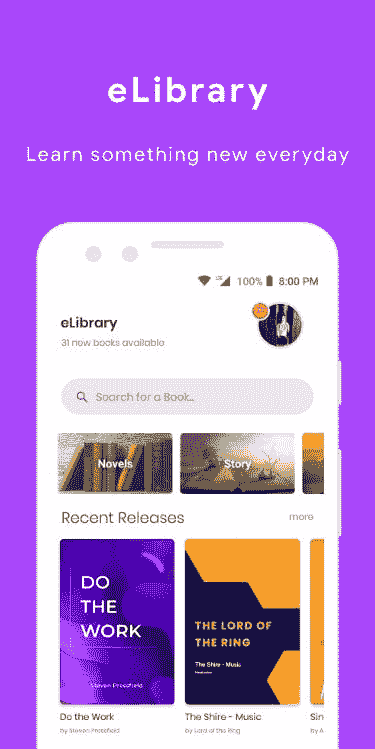
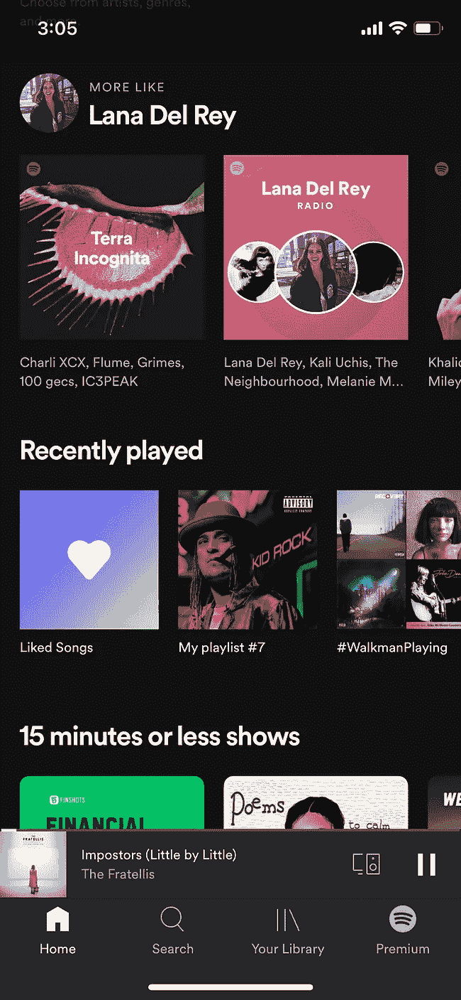
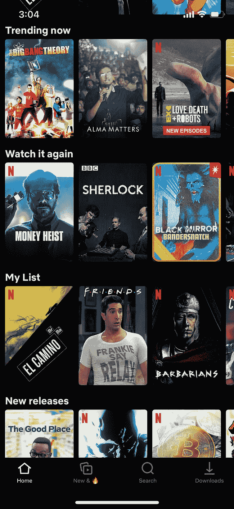
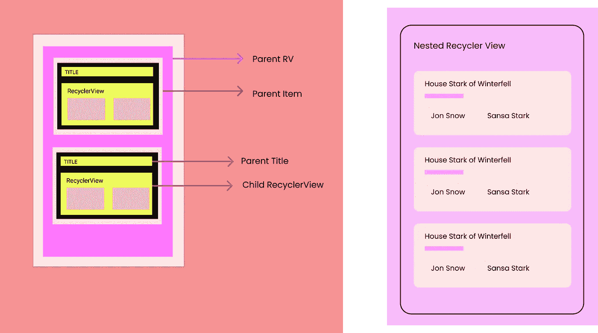
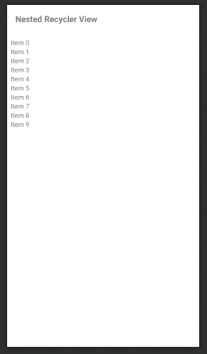
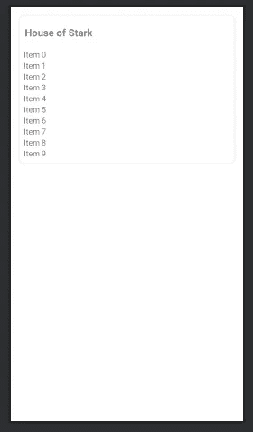
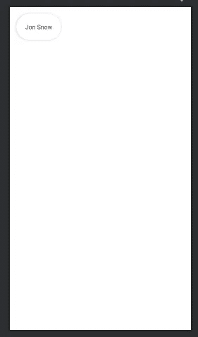
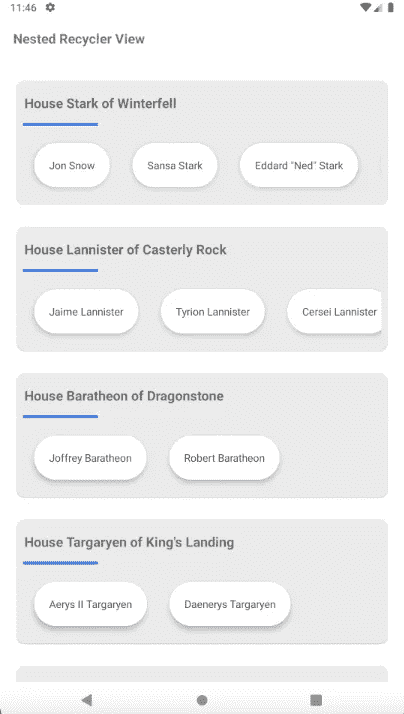

# Android 中的嵌套回收视图

> 原文：<https://medium.com/nerd-for-tech/nested-recyclerview-in-android-e5afb2b9771a?source=collection_archive---------0----------------------->

实现嵌套 recyclerview 及其优化的完美指南。


作者照片——尼泊尔甘德鲁克

💥你好，在这篇文章中我们将实现一个嵌套的 **recyclerview。**我们将学习如何在实时项目中精确地嵌套 **recyclerview** ，并学习如何适当地优化它。

我们可以在另一个**回收视图**中使用一个**回收视图**。我们称之为嵌套**回收视图**。这里有一些嵌套的**recycle view**应用程序的图片。



嵌套回收查看样本的图片-电子图书馆、Spotify、网飞

# 先决条件

*   科特林语
*   回收视图
*   句柄依赖注入
*   翻新 2
*   **API _ URL**:[https://game-of-thrones-quotes.herokuapp.com/v1/**房屋**](https://game-of-thrones-quotes.herokuapp.com/v1/houses)

给我所有的代码👇

[](https://github.com/iamnaran/template-recycler-view) [## iam naran/template-recycler-view

### 回收视图。在 GitHub 上创建一个帐户，为 iam naran/template-recycler-view 开发做贡献。

github.com](https://github.com/iamnaran/template-recycler-view) 

## 我们开始吧，

# 步骤 1 —设置模型和 API 数据

一个 API，它有一个对象列表和另一个对象的嵌套列表。看一下下面的 **API 响应，**那里我们有**权力的游戏** **API** **列表**，它有一个列表，里面有**房屋的名称**和它们的**成员**列表作为嵌套对象。

API 响应



应用结构和用户界面

> 理解 API 结构很重要。我发现许多开发人员不能分析所需的 API 数据结构，这导致了糟糕的开发实践。在开始处理任何功能或模块之前，请始终了解数组[]、对象{}、模型/数据。

让我们跳过鼓舞士气的谈话，开始正确编码吧！👍


要从 **JSON** 生成 **KOTLIN** 模型，你可以在 Android Studio 中下载这些插件。

1.  ( [**JSON 到 Kotlin 类**](https://plugins.jetbrains.com/plugin/9960-json-to-kotlin-class-jsontokotlinclass-) )
2.  ( [**JSON 转 Java 类**](https://www.jsonschema2pojo.org/) )

> **gameoftrones . kt**—型号

GameOfThrones 模型

现在，创建 API 服务以从 **API** 获得响应。

> [https://game-of-thrones-quotes.herokuapp.com/v1/**房屋**](https://game-of-thrones-quotes.herokuapp.com/v1/houses)

首先将我们的 URL 分解成 **BASE_URL** & **端点。**

```
buildConfigField 'String', 'BASE_URL', "\"**https://game-of-thrones-quotes.herokuapp.com/v1/**\""
```

> **ApiEndPoints.kt**

```
object ApiEndPoints {

   const val GAME_OF_THRONES_URL = "houses"

}
```

> **ApiService.kt**

```
interface ApiService {

    @GET(ApiEndPoints.GAME_OF_THRONES_URL)
    suspend fun getGameOfThronesData():Response<List<GameOfThrones>>
}
```

现在，让我们创建 **ViewModel** 来从上面的 API 服务获得响应。

> **HomeViewModel.kt**

这里， **HomeRepository** 作为一个存储库类来获取我们的响应& **PreferencesHelper** 作为一个帮助器类来存储 **SharedPreference** 中的数据。你可以看看项目资源库，更清楚地了解它。

> 为了简单起见，存储在共享 pref 中，您可以通过将当前模型映射到房间/领域 DB 实体中并使用 Dao 将其插入来保存在房间数据库中。

# 步骤 2—用户界面设置 **(XML)**

这里，我们需要三种布局，

1.  活动 UI，用于工具栏和父回收视图
2.  父 RecyclerView 的布局行项目—由**标题** & **子** **recyclerview** 组成。
3.  子 RecyclerView 的布局行项目。



三种布局(1–2–3):活动、父项和子项

> **1。activity_home.xml**

```
<?xml version="1.0" encoding="utf-8"?>
<androidx.core.widget.NestedScrollView
    xmlns:android="http://schemas.android.com/apk/res/android"
    xmlns:app="http://schemas.android.com/apk/res-auto"
    xmlns:tools="http://schemas.android.com/tools"
    android:layout_width="match_parent"
    android:layout_height="match_parent">

    <androidx.constraintlayout.widget.ConstraintLayout
        android:layout_width="match_parent"
        android:layout_height="wrap_content"
        android:layout_marginStart="8dp"
        android:layout_marginEnd="8dp"
        android:fitsSystemWindows="true">

        <include
            android:id="@+id/title_layout"
            layout="@layout/item_title_profile"
            android:layout_width="0dp"
            android:layout_height="wrap_content"
            app:layout_constraintEnd_toEndOf="parent"
            app:layout_constraintStart_toStartOf="parent"
            app:layout_constraintTop_toTopOf="parent" />

        <androidx.recyclerview.widget.RecyclerView
            android:id="@+id/parent_recycler_view"
            android:layout_width="match_parent"
            android:layout_height="wrap_content"
            android:clipToPadding="false"
            android:paddingTop="10dp"
            android:paddingBottom="60dp"
            app:layout_constraintBottom_toBottomOf="parent"
            app:layout_constraintTop_toBottomOf="@+id/title_layout" />
    </androidx.constraintlayout.widget.ConstraintLayout>
</androidx.core.widget.NestedScrollView>
```

> **2。item_row_parent.xml**

```
<?xml version="1.0" encoding="utf-8"?>
<androidx.cardview.widget.CardView xmlns:android="http://schemas.android.com/apk/res/android"
    xmlns:app="http://schemas.android.com/apk/res-auto"
    android:layout_width="match_parent"
    android:layout_height="wrap_content"
    android:layout_margin="15dp"
    app:cardCornerRadius="10dp"
    app:cardElevation="1dp">

    <androidx.constraintlayout.widget.ConstraintLayout
        android:layout_width="match_parent"
        android:layout_height="wrap_content">

        <TextView
            android:id="@+id/content_title"
            android:layout_width="0dp"
            android:layout_height="wrap_content"
            android:layout_marginTop="10dp"
            android:layout_marginBottom="10dp"
            android:includeFontPadding="false"
            android:padding="10dp"
            android:text="House of Stark"
            android:textSize="18sp"
            android:textStyle="bold"
            app:layout_constraintBottom_toBottomOf="parent"
            app:layout_constraintEnd_toEndOf="parent"
            app:layout_constraintHorizontal_bias="1.0"
            app:layout_constraintStart_toStartOf="parent"
            app:layout_constraintTop_toTopOf="parent"
            app:layout_constraintVertical_bias="0.0" />

        <androidx.recyclerview.widget.RecyclerView
            android:id="@+id/child_recycler_view"
            android:layout_width="match_parent"
            android:layout_height="wrap_content"
            android:padding="8dp"
            app:layout_constraintEnd_toEndOf="parent"
            app:layout_constraintStart_toStartOf="parent"
            app:layout_constraintTop_toBottomOf="@+id/content_title" />

    </androidx.constraintlayout.widget.ConstraintLayout>

</androidx.cardview.widget.CardView>
```

> **3。item_row_child.xml**

```
<?xml version="1.0" encoding="utf-8"?>
<androidx.cardview.widget.CardView xmlns:android="http://schemas.android.com/apk/res/android"
    xmlns:app="http://schemas.android.com/apk/res-auto"
    xmlns:tools="http://schemas.android.com/tools"
    android:layout_width="wrap_content"
    android:layout_margin="15dp"
    app:cardCornerRadius="30dp"
    app:cardElevation="5dp"
    android:layout_height="wrap_content">

    <androidx.constraintlayout.widget.ConstraintLayout
        android:layout_width="match_parent"
        android:layout_height="match_parent">

        <TextView
            android:id="@+id/name"
            android:layout_width="match_parent"
            android:layout_height="wrap_content"
            android:layout_marginTop="200dp"
            android:padding="20dp"
            android:text="Jon Snow"
            android:textColor="@color/colorPrimaryText"
            app:layout_constraintBottom_toBottomOf="parent" />

    </androidx.constraintlayout.widget.ConstraintLayout>

</androidx.cardview.widget.CardView>
```

# 步骤 3-设置适配器类

几个不同的类一起工作来构建我们的动态列表。这里我们有两个**回收视图**，这意味着我们需要两个适配器。您通过扩展`[RecyclerView.Adapter](https://developer.android.com/reference/androidx/recyclerview/widget/RecyclerView.Adapter)`来定义适配器。您通过扩展`[RecyclerView.ViewHolder](https://developer.android.com/reference/androidx/recyclerview/widget/RecyclerView.ViewHolder)`来定义视图固定器。*布局管理器*排列列表中的单个元素。

记住**亲子概念**。父适配器持有子适配器。


亲子插画**👉**

让我们从创建子成员适配器开始，在这里我们将绘制来自每个家族**的**成员**的列表。**

> **childmembersdadapter . kt**

现在，让我们来处理我们的**parenthood adapter**，父 **recyclerview** 适配器，我们将从其中调用我们的子适配器，如下所示。

```
fun bind(result: GameOfThrones) {
    itemView.content_title.text = result.name
    val childMembersAdapter = ChildMembersAdapter(result.members)
    itemView.child_recycler_view.layoutManager = LinearLayoutManager(itemView.context, LinearLayoutManager.HORIZONTAL,false)
    itemView.child_recycler_view.adapter = childMembersAdapter

}
```

> **圆括号 Adapter.kt**

# 最后一步—在视图中集成适配器

我们已经准备好了适配器，在我们的**活动**中，我们正在观察 **API 响应，**我们将在收到响应后向适配器添加数据。

最后，我们现在可以看到所有房屋及其成员，



嗯（表示踌躇等）..输出

完成后，您就实现了嵌套的 recycler-view。恭喜你！现在，你可以为子/父回收器视图项目制作自己的**精美 UI** 。

# 最后..让我们来谈谈优化

> 如果实施不当，recycle view 可能会非常滞后。它应该在它的 peek 性能上工作，否则我们会在滚动时感觉到故障。其性能取决于**设计**、**数据**、**计算**和**实现**。

让我们找出一些在使用 **RecyclerView** 保持其性能时需要记住的技巧。⚠️

1.  **切勿将 Recyclerview 与 NestedScrollView 一起使用。**

因为 recycle view 意味着在滚动时回收视图，只有可见的项目被呈现。但是当与 NestedScrollView 一起使用时，它将避免回收视图。您可以使用带有 recyclerview 或[concat adapters](https://developer.android.com/reference/androidx/recyclerview/widget/ConcatAdapter)的多视图类型来完全删除 NestedScrollView。

**2。避免繁重的计算&在 Recyclerview 项目中嵌套视图。**

onBindViewHolder 中的计算逻辑不理想。在 recyclerview 中绘制数据之前，在模型中进行复杂的计算。使用最少的视图组/布局使你的用户界面尽可能简单。recycle view 项目中嵌套视图过多&计算会降低其性能，因为 recycle view 的可见项目中会出现大量渲染。

**3。将 ListAdapter 与 DiffUtil/async different 一起使用**

使用 DiffCallbacks 将完全删除 notifyDatasetChanged，这将避免重新计算和重新呈现所有视图，它只会更改需要更改的数据。

*还要告诉 recyclerview 你的物品有唯一 ID。这将减少数据集通知上的闪烁效应，在数据集通知中，它只修改有更改的项目。*

`parentAdapter.setHasStableIds(true)`

4.**使用 RecycledViewPool**

它允许您在多个 RecyclerViews 之间共享视图。如果您想要跨 recycle views 回收视图，请创建 RecycledViewPool 的一个实例并使用`[setRecycledViewPool](https://developer.android.com/reference/androidx/recyclerview/widget/RecyclerView#setRecycledViewPool(androidx.recyclerview.widget.RecyclerView.RecycledViewPool))`。

`viewHolder.childRecyclerView.setRecycledViewPool(viewPool)`

**5。使用项目视图缓存大小**

在将屏幕外视图添加到可能共享的回收视图池之前，设置要保留的屏幕外视图的数量。

`parentRecyclerView.setItemViewCacheSize(cacheSize)`

**6。设置项目预取使能**

设置 collectInitialPrefetchPositions(int，LayoutPrefetchRegistry)中要预取的项数，它定义当此 LayoutManager 的 recycle view 嵌套在另一个 recycle view 中时应预取多少个内部项。

`childRecyclerView.setItemPrefetchEnabled(true)`

**7。如果 scroll 在垂直嵌套 Recyclerview 上截取，可以用 layoutManger 禁用它。**

```
linearLayoutManager {
    @Override
    public boolean canScrollVertically() {
        return false;
    }
};
```

**8。如果 RecyclerView 在更新时闪烁**

```
binding.recyclerViewContainer.setItemAnimator(null);
```

**9。如果您正在从房间数据库观察 LiveData/Flowable 并绘制嵌套的 recyclerview 视图。**

每当您观察到来自房间表& recyclerview 的数据列表滚动时，就会从房间中连续提取新数据，这将不得不更新整个 recyclerview，在这种情况下，嵌套的 recyclerview 会再次初始化。这种**“从房间连续获取”**从未停止，这将降低 recyclerview 的性能。我们可以改进 ListAdapter &，但是在嵌套适配器上提交列表将是一项繁重的任务。

> *好的让我们用一个例子来理解如何解决。*

假设，我们有**category entity**&**book entity&**a**category with books**关系 Pojo 来获取所有带有书籍的类别，观察房间表的变化。

```
@Entity(tableName = "category",
        indices = {
                @Index(value = "categoryId", unique = true),
        }
)
class CategoryEntity{
  private int categoryId;
  private String categoryName;
  private String categoryImage;
  private Long createdAt;
  // getter setter
} 
```

```
@Entity(tableName = "book",
        foreignKeys = @ForeignKey(
                entity = CategoryEntity.class,
                parentColumns = "categoryId",
                childColumns = "categoryId",
                onDelete = CASCADE,
                onUpdate = NO_ACTION
        ),
        indices = {
                @Index(value = "bookId", unique = true),
                @Index(value = "categoryId")
        }
)
class BookEntity{
  private int bookId;
  private int categoryId;
  private String bookName;
  private String bookAuthor;
  private EntityMapType entityMapType = EntityMapType.BOOK;
  // getter setter
}
```

```
class CategoryWithBooks{

  @Embedded
  private CategoryEntity categoryEntity;

  @Relation(parentColumn = "categoryId",
            entityColumn = "categoryId",
            entity = BookEntity.class

  )
  private List<BookEntity> bookEntities;
  // getter setter
}
```

为了**避免**创建嵌套对象，我们可以将所有的**类别对象**映射为一个**book 对象**并用类型来区分它。姑且称之为 EntityMapType。

```
enum EntityMapType { CATEGORY, BOOK }
```

```
@Transaction
@Query("SELECT * FROM category ORDER BY createdAt DESC")
public abstract LiveData<List<CategoryWithBooks>> getAllCategoryWithBooks();

getViewModel().getAllCategoryWithBooks().observe(getViewLifecycleOwner(), getAllCategoryObserver);

private final Observer<List<CategoryWithBooks>> getAllCategoryObserver = listBaseResource -> {

        if (!listBaseResource.isEmpty()) {
            List<Book> bookList = new ArrayList();
            foreach(Category category: listBaseResource){
              Book book = new Book();
              book.setBookId(category.getCategoryId());
              book.setEntityMapType(EntityMapType.CATEGORY);
              ....
              bookList.add(book);
              bookList.addAll(category.getBookEntities())

            }
            // plotting recyclerview with BookList Only.
            recyclerView.submitList(bookList);
            // make two view type for recyclerview - TYPE_BOOK & TYPE_CATEGORY
        } 
```

因此，我们可以完全删除嵌套的 recyclerview，这肯定会提高性能。**一个缺点是**，正在进行映射计算，这应该比在嵌套的 recyclerview 中提交列表更不是问题。😄

今天就到这里，回答任何问题和建议..

谢谢你……梵拉·多哈尔斯