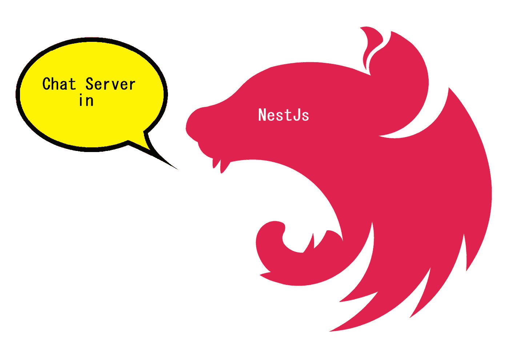
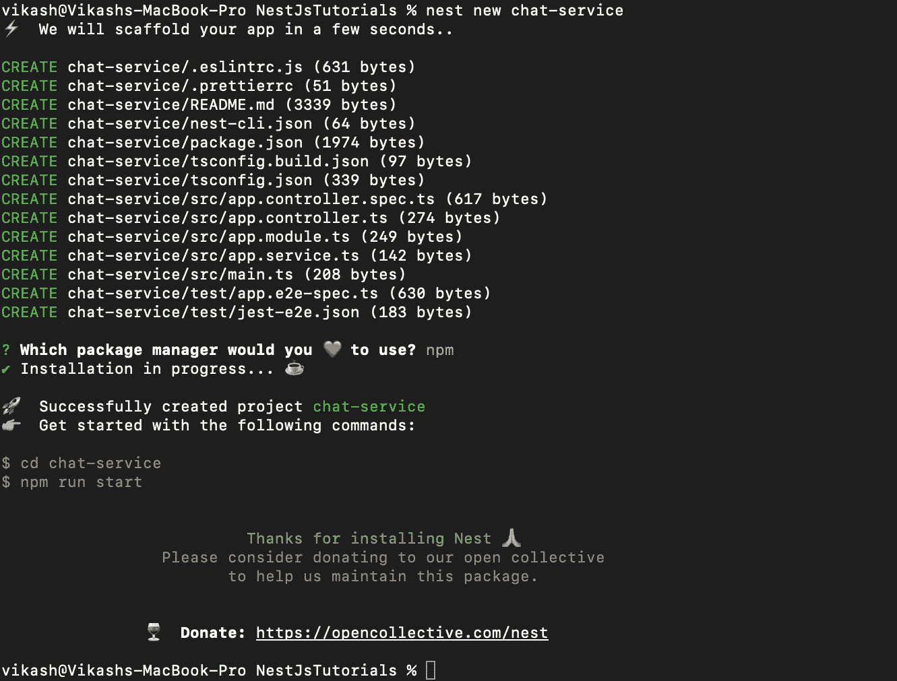
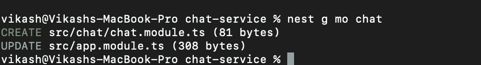
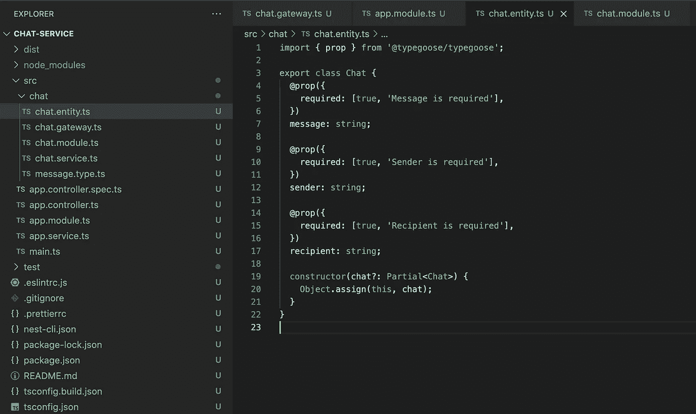
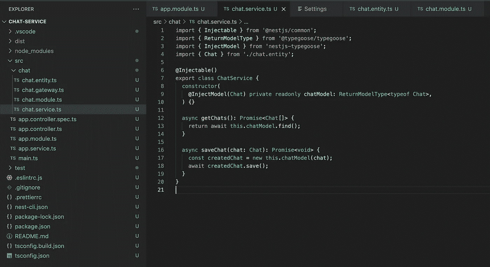
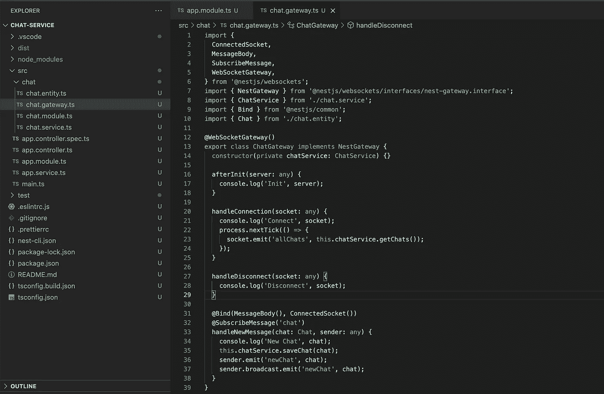
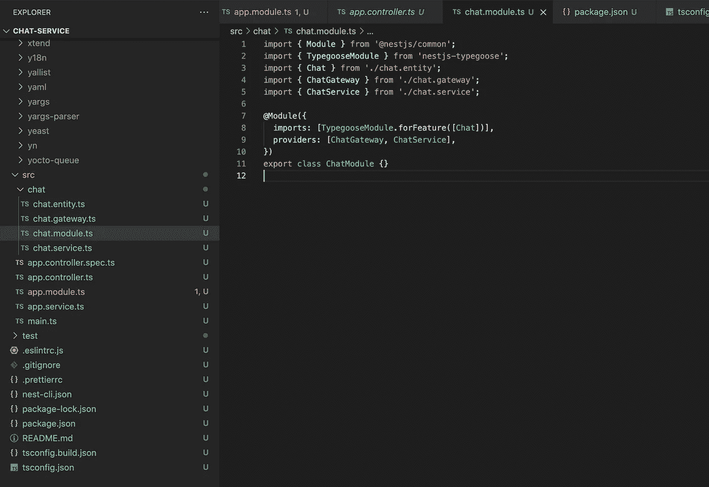
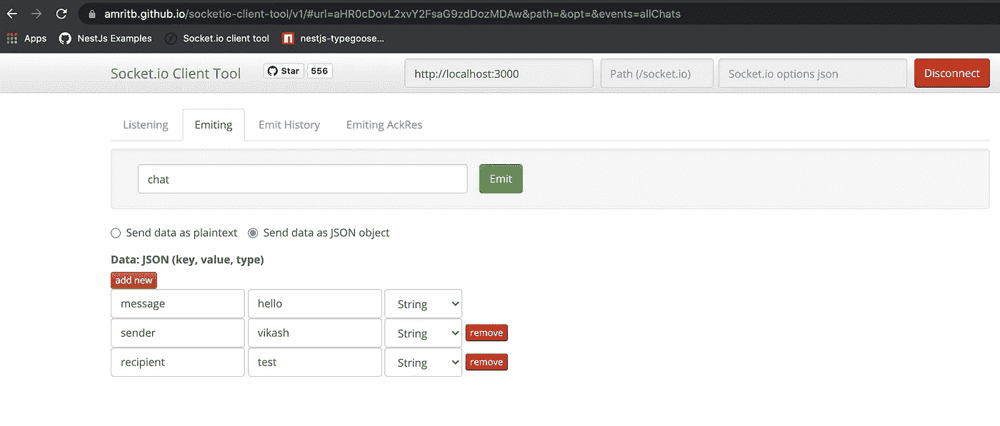

# NestJs:由 MongoDB 支持的 NestJs 中的聊天服务器

> 原文：<https://medium.com/nerd-for-tech/nestjs-chat-server-in-nestjs-backed-by-mongodb-687da9aa30bb?source=collection_archive---------1----------------------->



这篇文章将帮助你用 NestJs + socket.io + MongoDB 创建一个聊天服务器。我们将在 NestJs 中开发服务，使用 socket.io 公开 WebSocket 网关，并将消息存储在 MongoDB 中。
遵循以下步骤:

# 步骤 1:创建一个 NestJs 项目

同样，我更喜欢使用 Nest CLI。如果您没有 Nest CLI，请使用以下命令通过 NPM 下载该软件包:

```
**$ npm install -g @nestjs/cli**
```

创建一个 NestJs 应用程序(我将我的项目命名为'*聊天服务'*)；给出您选择的任何名称)，在您的首选文件夹中打开一个控制台，并运行命令:

```
**$ nest new chat-service**
```



创建新的 NestJs 项目

# 步骤 2:创建一个聊天模块

创建一个新的 NestJs 模块“ChatModule”。这将创建一个“聊天”文件夹和一个聊天模块(chat.module.ts)。在终端中运行这个命令来生成一个新模块。

```
**$ nest generate module chat**
```



生成聊天模块

# 步骤 3:添加 Typegoose 依赖项

我们将使用 MongoDB 存储聊天记录，使用 Typegoose 与 MongoDB 交互。安装下面提到的所需依赖项:

```
**$ npm install @typegoose/typegoose nestjs-typegoose
$ npm install mongoose@5.10.1
$ npm install --save-dev @types/mongoose@5.10.1**
```

关于 Typegoose 与 NestJs 集成的更多信息，请访问 npm 包[这里](https://www.npmjs.com/package/nestjs-typegoose)。

# 步骤 4:为 MongoDB 创建一个聊天实体

我们将为 MongoDB 中的“chat”集合创建一个新的 Typegoose 实体类。到目前为止，我们只保留了 3 列:消息、发送者和接收者。



聊天实体

# **步骤#5:导入 TypegooseModule**

要初始化 TypegooseModule，我们需要一个 MongoDB 服务器连接字符串(在下图中被屏蔽)。我正在使用由 MongoDB Atlas 提供的免费云托管 MongoDB 服务。按照这里的步骤[获得一个免费的云托管 MongoDB 服务。我们在这里导入根模块(AppModule - > app.module.ts)中的 TypegooseModule。](/nerd-for-tech/mongodb-how-to-get-a-cloud-hosted-free-mongodb-cluster-as-a-service-214db2cc1c29)


导入 TypegooseModule

# 步骤 6:创建聊天服务

接下来，我们将创建一个 ChatService (chat.service.ts ),通过注入的 Typegoose 聊天模型对' chat '集合进行 CRUD 操作。该服务公开了两个函数:***【get chats】***(从集合中加载所有聊天)&***save chat***(持久保存单个聊天文档)。



与 Typegoose 互动的聊天服务

# 步骤 7:添加 socket.io 依赖项

在这一步，我们将把所需的 socket.io 依赖项添加到我们的应用程序中。

```
**$ npm install @nestjs/platform-socket.io @nestjs/websockets
$ npm install --save-dev @types/socket.io**
```

# 步骤 8:创建一个 WebSocket 网关

我们现在将创建一个 WebSocket 网关(chat.gateway.ts)来监听“聊天”事件。我实现了 nestjs-socket.io 提供的 3 个生命周期钩子:***【after init】***(服务初始化时) ***handleConnection*** (新客户端连接到服务时)&***handle disconnect***(客户端断开服务时)。
***handleNewMessage***函数订阅“聊天”事件，接收并在 MongoDB 中存储聊天内容&将新聊天内容发送到“new chat”。



聊天网关

# 步骤 9:更新聊天模块

最后，我们需要提供 ChatGateway & ChatService，并在 ChatModule 中导入 Typegoose 聊天模型。



更新聊天模块

# 步骤#10:运行应用程序

现在，让我们运行应用程序。应用程序将在@ 3000 上运行，WebSocket 也是如此。

```
**$ npm run build
$ npm run start**
```

# 步骤 11:验证

我使用这个神奇的 [socket.io 客户端](https://amritb.github.io/socketio-client-tool/v1/#)来测试我的 socket.io 服务。让我们连接到我们的 WebSocket 并发出一些聊天。这里我发出一个 JSON 对象来匹配我的聊天实体类。



向“聊天”发送消息

验证您的聊天是否保存在 MongoDB 中。


聊天被保存到 MongoDB

> *代码库:
> 【https://github.com/sharmavikashkr/chat-service-nestjs】*