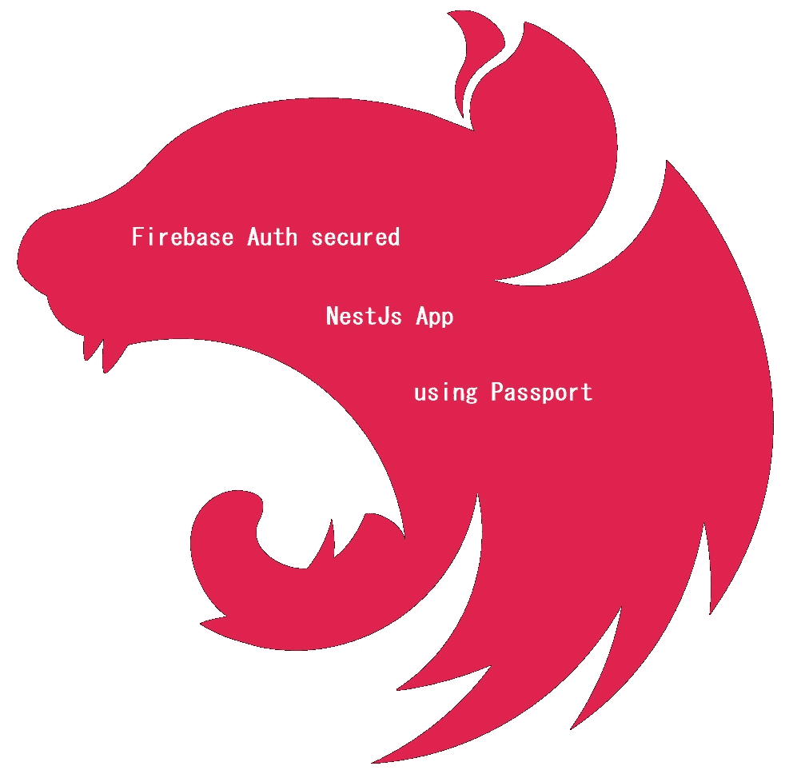
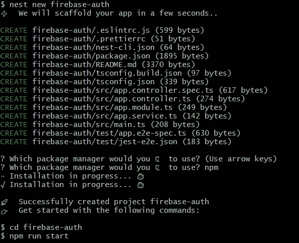
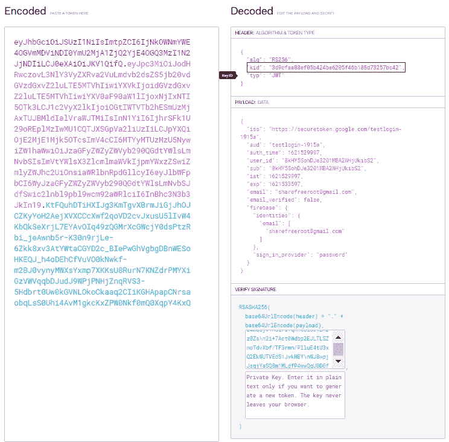
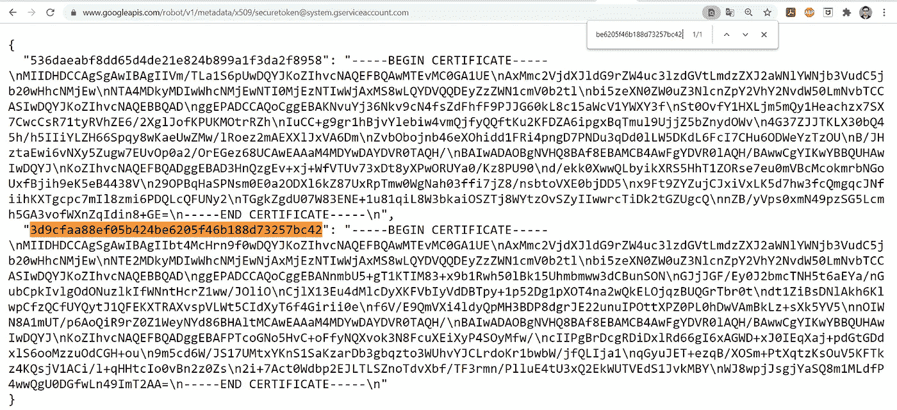
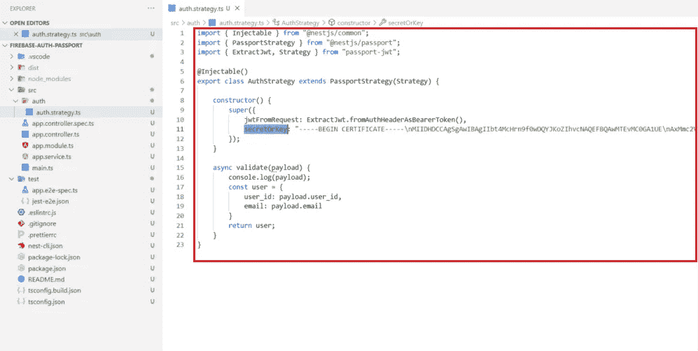
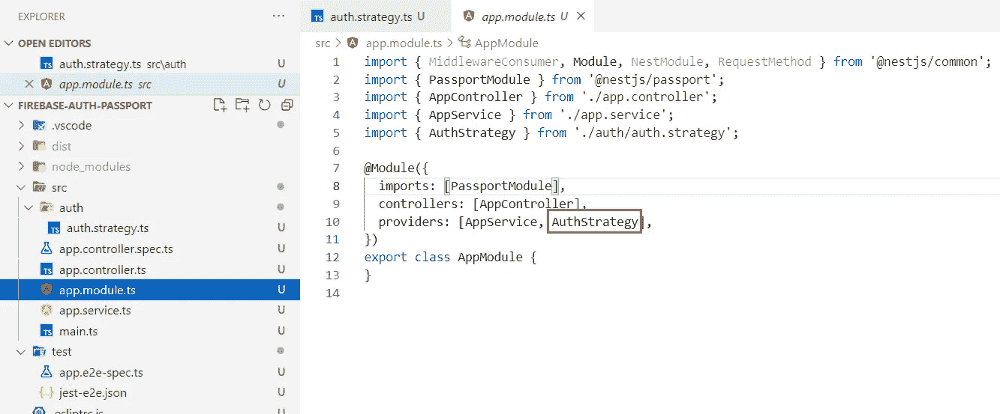
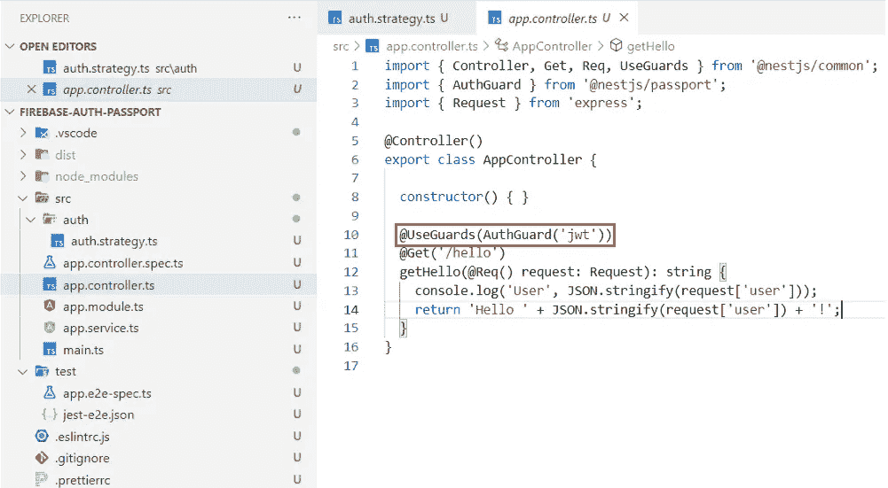
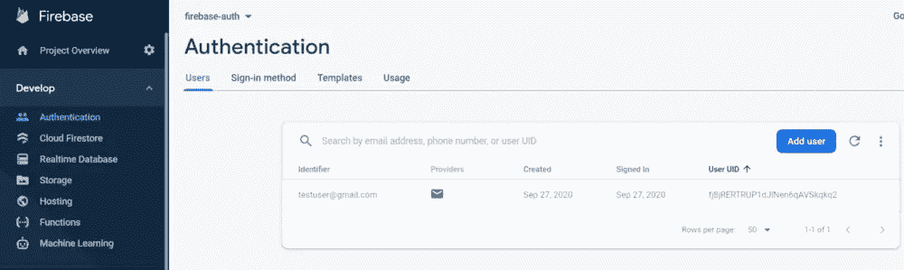
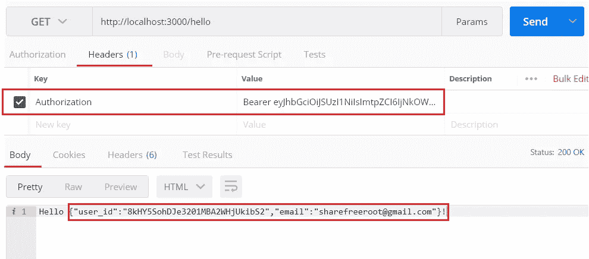
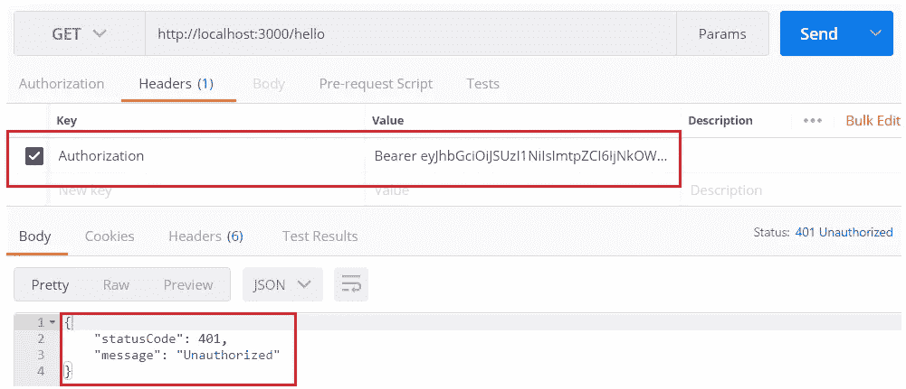

# NestJs: Firebase Auth 使用 PassportJs 保护 NestJs 应用程序

> 原文：<https://medium.com/nerd-for-tech/nestjs-firebase-auth-secured-nestjs-app-using-passport-60e654681cff?source=collection_archive---------0----------------------->



PassportJs 是 NodeJs 应用程序最好的认证中间件库之一。它支持 500 多种认证策略，包括最常见的策略，如用户名-密码、谷歌、脸书、Twitter 等。在为 NestJs 应用程序选择身份验证中间件库时，它的灵活性和易于集成性使它成为最优先考虑的对象。

如果您使用 Firebase 进行身份验证，可以使用 PassportJs 提供的' *passport-jwt'* 策略。按照下面的步骤来知道如何做。

# ***步骤#1*** :创建一个 Firebase 项目

创建一个 Firebase 项目并添加一个 web 应用程序。

在这里按照步骤[进行](/@sharma.vikashkr/firebase-how-to-setup-an-app-in-firebase-9ddbacfe8ad1)。

# **第二步**:创建一个 NestJs 应用程序

创建一个 NestJs 项目。同样，我更喜欢使用 Nest CLI。如果您没有 Nest CLI，请使用以下命令通过 NPM 下载该软件包:

```
**$ npm install -g @nestjs/cli**
```

创建一个 NestJs 应用程序(我将我的项目命名为'*firebase-auth '*)；给出您选择的任何名称)，在您的首选文件夹中打开一个控制台，并运行命令:

```
**$ nest new firebase-auth**
```



创建新的 NestJs 项目

# ***第三步*** :安装 PassportJs 依赖项

正如我们所知，Firebase 在认证时会生成 **JSON Web Token (JWT)** ，我们将需要' *passport-jwt* '以及其他 passport 依赖项。控制台进入项目目录并安装这些依赖项:

```
**$ npm install** [**@nestjs/passport**](http://twitter.com/nestjs/passport) **passport passport-jwt
$ npm install --save-dev** [**@types/passport-jwt**](http://twitter.com/types/passport-jwt)
```

# ***第四步*** :确定你的秘钥

*passport-jwt* 需要一个“ **secretOrKey** ”来验证令牌的签名。Firebase 使用 2 个可用的公钥[在这里](https://www.googleapis.com/robot/v1/metadata/x509/securetoken@system.gserviceaccount.com)对有效载荷进行签名(参考 [Firebase 文档](https://firebase.google.com/docs/auth/admin/verify-id-tokens#verify_id_tokens_using_a_third-party_jwt_library))。要使用的密钥由 Firebase JWT 的解码报头中的' **kid** '参数标识。按照以下步骤识别您的'**秘密密钥**':

***a)*** 去[https://jwt.io/](https://jwt.io/)解码你的 JWT。这将给你一个 **keyId** 。



解码任何 JWT 火焰

***b)*** 在此搜索此密钥 Id [以获得一个公共证书，该证书将是您的' **secretOrKey** ':](https://www.googleapis.com/robot/v1/metadata/x509/securetoken@system.gserviceaccount.com)



搜索您的签名

# ***第五步*** :创建一个授权策略

在您喜欢的 IDE 中打开项目。创建一个文件夹，在 src 中说' *auth* '。从 *passport-jwt* 策略扩展创建您的授权策略。使用上一步获得的公共证书作为' **secretOrKey** '。此外，定义一个 **validate** 回调函数来接收经过验证的有效载荷，如下所示。



由 passport-jwt 支持的授权策略

```
jwtFromRequest: ExtractJwt.fromAuthHeaderAsBearerToken()
```

(必需)指示 passport 从身份验证标头中提取 JWT 作为持有人。

```
secretOrKey: “<CERTIFICATE>”
```

(必需)指定用于验证 JWT 签名的 secretKey。

```
async validate(payload) {}
```

这个被覆盖的函数“validate”允许您接受解码后的有效负载并返回一个自定义用户对象(从 DB？).这个返回的对象被设置为快速请求的“用户”字段。

# ***第六步*:为 DI** 提供你的认证策略

在您的 AppModule 中提供 AuthStrategy。



AppModule 中提供的 AuthStrategy

# ***步骤#7*** :为您的 API 启用 AuthGuard

创建一个控制器，并启用带有“jwt”策略的 passport AuthGuard 来与您的 API 挂钩。



控制器，带“jwt”策略的 passport AuthGuard

在控制器方法中，我从 express 请求中读取用户字段。

# ***步骤#8* :在 Firebase 上创建用户**

在 Firebase 上创建用户。此外，创建任何客户端( [VueJs 客户端示例](https://sharma-vikashkr.medium.com/vuejs-firebase-auth-in-vuejs-client-83c91a7cf4fd))来接受 firebase 登录并获取有效的 firebase idToken。使用这个 idToken 作为 API 调用的授权头中的承载令牌。



创建 firebase 用户

# ***步骤#9*** :运行 app 并验证

运行您的应用程序并验证。

```
**$ npm run dev**
```



成功



不正确/过期的 JWT

> 代码库:
> [https://github . com/sharmavikashkr/firebase-auth-nestjs-passport](https://github.com/sharmavikashkr/firebase-auth-nestjs-passport)

使用中间件的 NestJs 中的 firebase auth & firebase-admin->[此处](https://sharma-vikashkr.medium.com/nestjs-firebase-auth-secured-nestjs-resource-server-9649bcebd0de)。