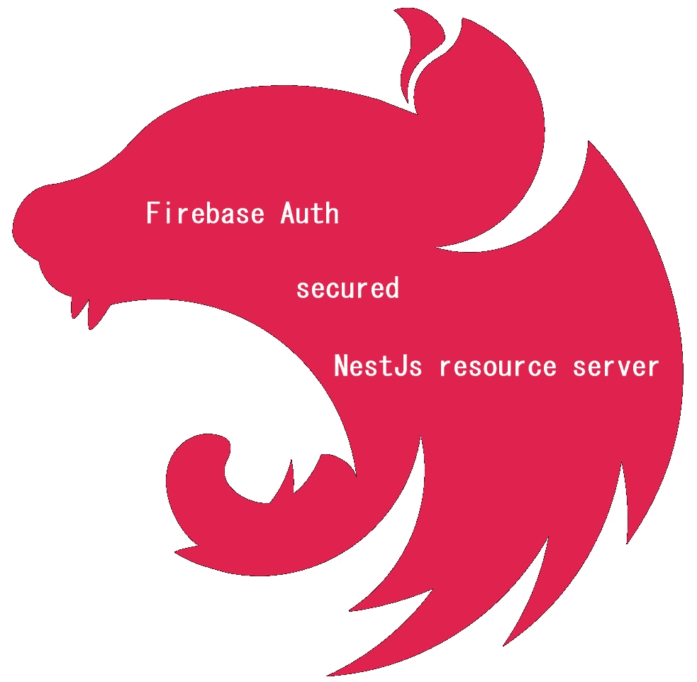
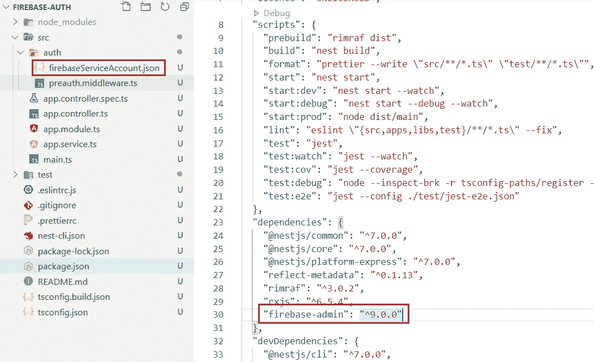
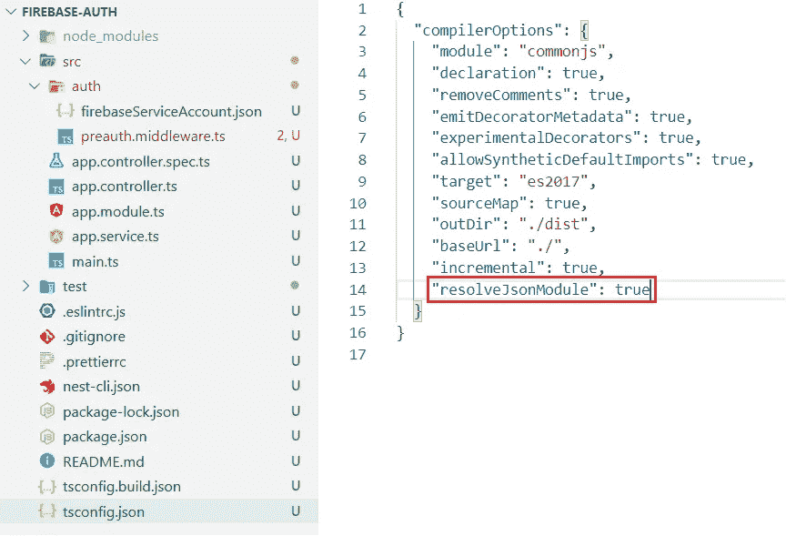
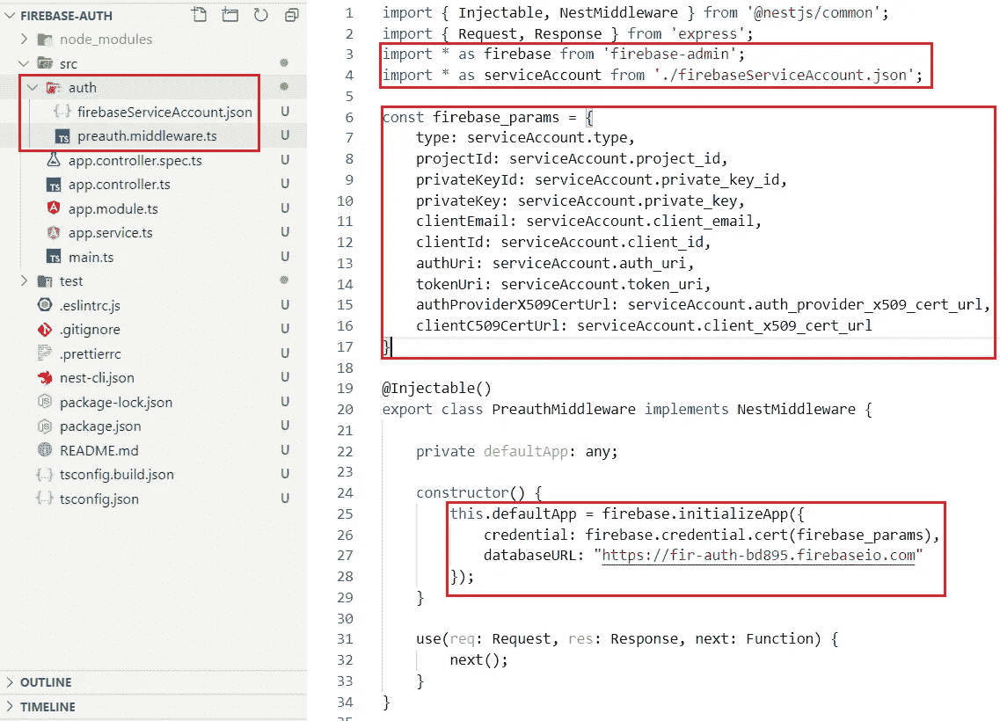
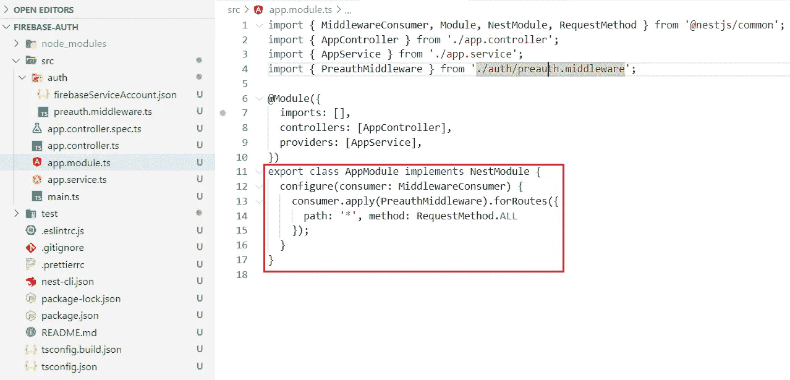
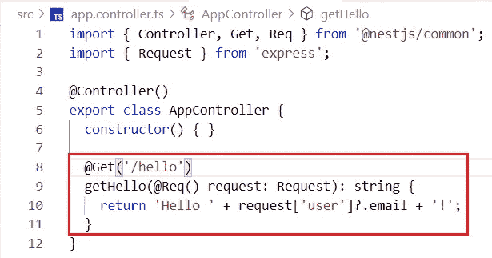
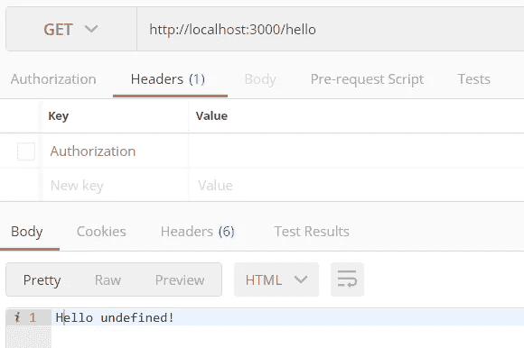
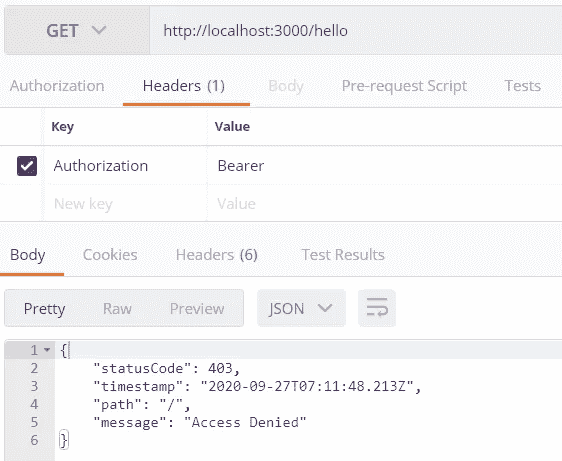
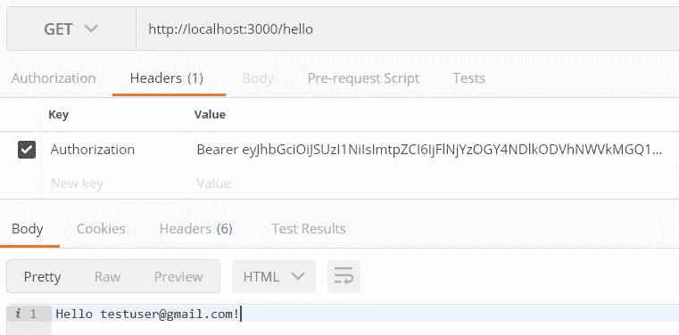

# NestJs: Firebase Auth 安全的 NestJs 应用程序

> 原文：<https://medium.com/nerd-for-tech/nestjs-firebase-auth-secured-nestjs-resource-server-9649bcebd0de?source=collection_archive---------0----------------------->



NestJs 是用 TypeScript 和/或 JavaScript 编写的优秀的 NodeJs 框架。它的效率和可伸缩性使您能够创建一系列不同的应用程序后端。这使得在你的应用中有一个严格的安全机制变得非常重要。这篇文章将帮助你通过 Firebase Auth 保护你的 NestJs APIs。

# ***步骤#1*** :创建一个 Firebase 项目，添加一个 web app。

在这里按照步骤[进行](/@sharma.vikashkr/firebase-how-to-setup-an-app-in-firebase-9ddbacfe8ad1)。

# **步骤#2** :创建一个 NestJs 项目。

同样，我更喜欢使用 Nest CLI。如果您没有 Nest CLI，请使用以下命令通过 NPM 下载该软件包:

```
**$ npm install -g @nestjs/cli**
```

创建一个 NestJs 应用程序(我将我的项目命名为'*firebase-auth '*)；给出您选择的任何名称)，在您的首选文件夹中打开一个控制台，并运行命令:

```
**$ nest new firebase-auth**
```


创建新的 NestJs 项目

# ***步骤#3*** :安装 firebase 依赖项

在新项目中使用控制台，并将' *firebase-admin* '包添加到项目中。

```
**$ npm install — save firebase-admin**
```

# ***第四步*** :创建 firebase 服务帐号

在 firebase 控制台中创建一个服务帐户，并下载服务帐户 JSON 文件。在这里跟随[的步骤](/@sharma.vikashkr/firebase-how-to-setup-a-firebase-service-account-836a70bb6646)。

# ***步骤#5*** :下载项目中的服务账号 JSON

在您喜欢的 IDE 中打开项目。创建一个文件夹，在 src 里面说' *auth* '。将服务帐户 JSON 文件复制到该文件夹中。



添加库 firebase-admin

# **步骤#6** :允许 resolveJsonModule

在 tsconfig.json 文件中设置“resolveJsonModule”:true。这允许在 Typescript 中导入 JSON 文件。



允许 TS 中的 JSON 模块解析

# ***步骤#7*** :创建认证中间件

在 auth 文件夹中创建一个 NestJs 中间件，比如' *preauth.middlewate.ts* '。使用服务帐户 JSON 创建常量 JSON 对象。导入 firebase-admin SDK 并使用常量 JSON 进行初始化。



初始化 Firebase 管理 SDK

# ***步骤#8*** :验证 firebase 承载令牌

修改中间件内部的'*使用*方法从请求中读取承载令牌，并使用 firebase-admin 验证令牌。最后，将包含用户电子邮件的对象设置为请求对象。
注意:@ Line#33，我不会保护没有授权头的请求。


通过 Firebase Admin SDK 验证令牌

# ***步骤#9*** :注册中间件

为所有请求在根模块中注册中间件。



注册中间件

# ***步骤#10*** :创建控制器进行验证。



测试控制器

# 步骤#11:运行并验证故障场景

```
**$ npm run dev**
```



没有授权



无效授权

# ***步骤#12*** :创建一个 firebase 用户并验证成功场景

对于成功的流，创建任何客户机来接受 firebase 登录并获取有效的 firebase idToken。将此令牌用作授权头中的无记名令牌。


在 Firebase 控制台中添加用户



有效授权

> 代码库:【https://github.com/sharmavikashkr/firebase-auth-nestjs】T5
> 

使用 PassportJs -> [在 NestJs 中进行 Firebase auth 此处](https://sharma-vikashkr.medium.com/nestjs-firebase-auth-secured-nestjs-app-using-passport-60e654681cff)。