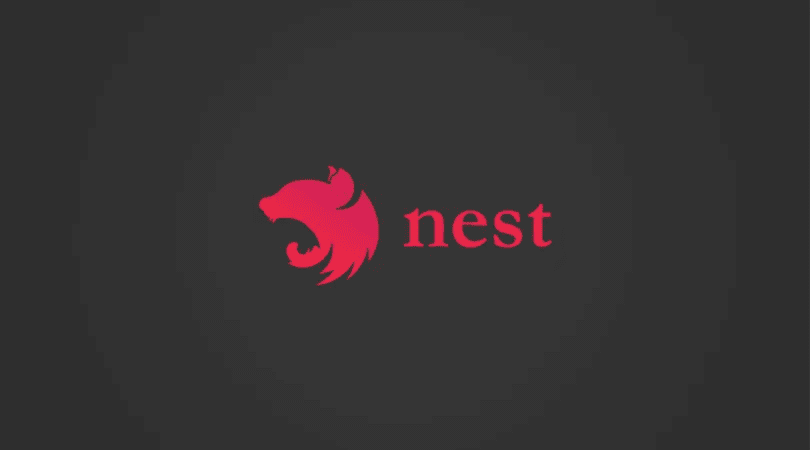
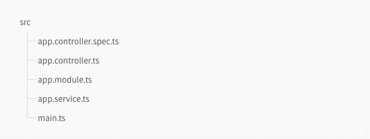
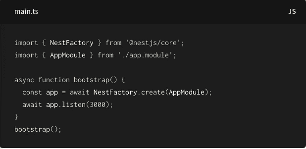
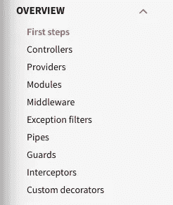
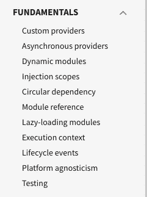
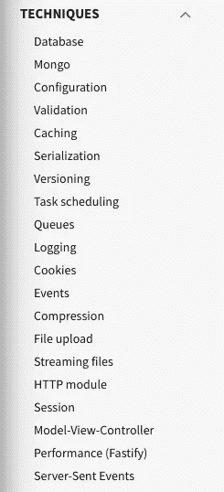
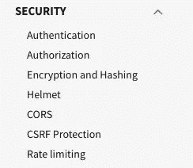
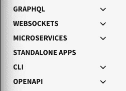

# NestJs — Spring boot lite？

> 原文：<https://medium.com/nerd-for-tech/nestjs-spring-boot-lite-my-experience-with-nestjs-e40796ac56a0?source=collection_archive---------3----------------------->

市场上有相当多的可用框架让你困惑，不管是 **N** ext **Js** 、 **N** ust **Js** 还是 **N** est **Js** ，我敢肯定还有更多。

它们都有不同的用途，但是名字看起来非常相似，但这只是名字混淆，不要太担心。

在过去的几个月里，我在 NestJs 上写了一些我的兼职项目，这看起来很有希望。

当我开始写后端 API 的时候，Kotlin 是我的第一选择，但是我已经接触过它，所以我想尝试一些不同的东西。这是我的一个朋友说服我尝试 NestJs 的时候。

## 什么是 NestJs？

> Nest (NestJS)是一个用于构建高效、可伸缩的服务器端应用程序的框架。它使用渐进式 JavaScript，由 [TypeScript](http://www.typescriptlang.org/) 构建并完全支持[TypeScript](http://www.typescriptlang.org/)(但仍然允许开发人员用纯 JavaScript 编码)，并结合了 OOP(面向对象编程)、FP(函数式编程)和 FRP(函数式反应编程)的元素。—[https://docs.nestjs.com/](https://docs.nestjs.com/)

在引擎盖下，Nest 使用 **Express** 服务器，也可以选择使用 **Fastify** 服务器，这两种服务器在 NodeJs 世界中都非常流行和知名。Nest 是在这些之上的一个包装器，它公开了 API，帮助开发人员以一种简单的方式利用许多自定义库。

它使用的理念是 javascript 是后端和前端的 web 语言。

Nest 主要致力于解决 javascript 框架中存在的架构问题，旨在提供开箱即用的解决方案，这种解决方案是高度可测试、可伸缩、松散耦合且易于维护的应用程序。该建筑的灵感主要来自于*棱角*。

关于安装和配置，你可以查阅官方文档，这些文档写得很好——[https://docs.nestjs.com/#installation](https://docs.nestjs.com/#installation)

## 基本原则

NestJs 支持类型脚本和纯 JavaScript，它利用了最新的语言特性，并使用 Babel 编译器来编译普通 JavaScript。

我的经验是 NestJs 与 typescript，因为它给人类型和一些界限的感觉。它还提供了一个漂亮的小 cli，你可以通过安装`nestjs/cli`包来配置它，以创建类似 Angular 中的模块。

一旦你设置了这个项目，你会看到它使用了一个类似 MVC 的框架，非常类似于 Angular(这就是为什么他们说它受到 Angular 的很大启发)

`main.ts`包含一个异步函数，它将引导我们的应用程序:

来源——nestjs 文档

Nest 使用了平台的概念，使得它可以灵活地使用不同的库和框架，这就是为什么在像 express 这样的 web 服务器和 fastify 之间切换非常容易。

我有过这样的经历，我不费吹灰之力就从 mysql 完全切换到了 mongose。

## 有什么不同？

到目前为止，它看起来像任何其他框架，它确实可以与 Angular framework 和 Spring 相联系，但我认为它的核心优势是内置了对大多数可能用于构建任何可靠后端 api 服务器的插件的支持。

它已经为常见用例构建了大部分库，由于它是 typescript 和 javascript，使用它变得容易多了，*例如，附加一个中间件，附加 JWT 身份验证或附加呼入和呼出的拦截器只是后面的几个配置。*

在它的文档的基础部分，你会看到它对*异步提供者和延迟加载模块*有很好的支持，它在文档的第一个视图中可用的原因也使它可以被探索。

在下一节中，您将看到许多可能会说服您使用它的东西，*配置队列改变数据库、支持 sql 和非 sql 数据库、缓存、日志等等。*

NestJs 也支持*安全插件*，如下图所示

最后但并非最不重要的是，您还可以看到对 *Websockets 和 GraphQL* 的支持

## 应该用 NestJs 吗？

如果你是一个喜欢配置所有内部东西的人，你可能不喜欢它，因为你会发现大部分东西已经有插件了。

如果你是构建 API 和解决它们的新手，我建议你不要这样做，先自己学习基础知识和配置。

但是，如果你是一个刚起步的人，或者之前已经了解 API 服务器的基础知识，并且希望快速完成一些事情，这是为你准备的，它可以让你以一种快速的方式构建东西，特别是如果你事先了解 javascript 或 typescript 的话。

## 你应该从哪里开始？

nestjs 文档是最好的起点，我也为 NestJs 创建了一个启动工具，你可以查看一下——[https://github.com/cksharma11/nestjs-starter-kit](https://github.com/cksharma11/nestjs-starter-kit)