# 。使用 MongoDB 进行. NET Jwt 身份验证

> 原文：<https://medium.com/nerd-for-tech/net-jwt-authentication-with-mongodb-9bca4a33d3f0?source=collection_archive---------1----------------------->

大家好！在本教程中，我将向您展示一种方法来实现 JWT 认证，但在这种情况下使用 MongoDB 驱动程序。

首先，我们将使用 dotnet cli 创建新的 web api。打开你的终端，运行命令:**dot net new web app--name = web API**。
这将为我们的应用程序创建开始样板文件。

在你最喜欢的代码编辑器中打开精心制作的应用程序，我用的是 vs-code。
这就是你将得到的。

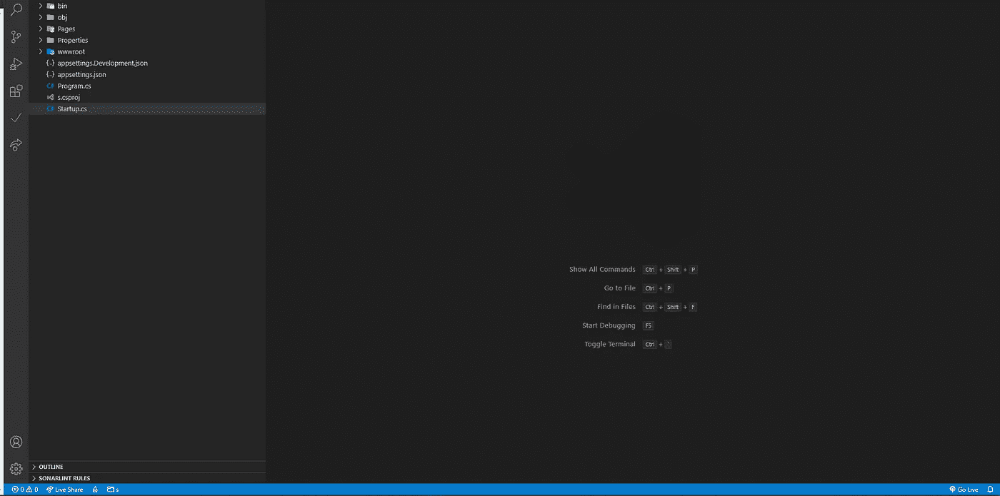

我们首先将 MongoDB 驱动程序包添加到我们的应用程序中，这样我们就可以使用我们的集合。
在你的终端运行: **dotnet 添加包 MongoDB。驱动程序**
安装完成后，回到 project，打开你的**。csproj 文件**，而你应该看到:
**<package reference Include = " MongoDB。驱动程序" Version="2.12.0" / >**

现在我们准备好连接到我们的 Mongo 数据库。

在项目根目录下创建文件夹数据库里面添加两个文件:
1)**idatabasesettings . cs**

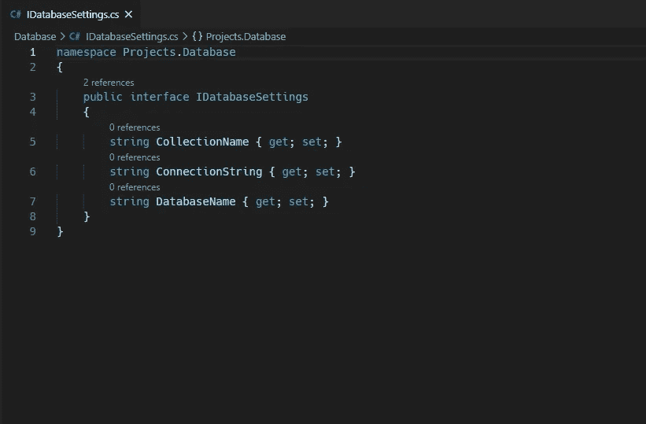

2) **数据库设置. cs**

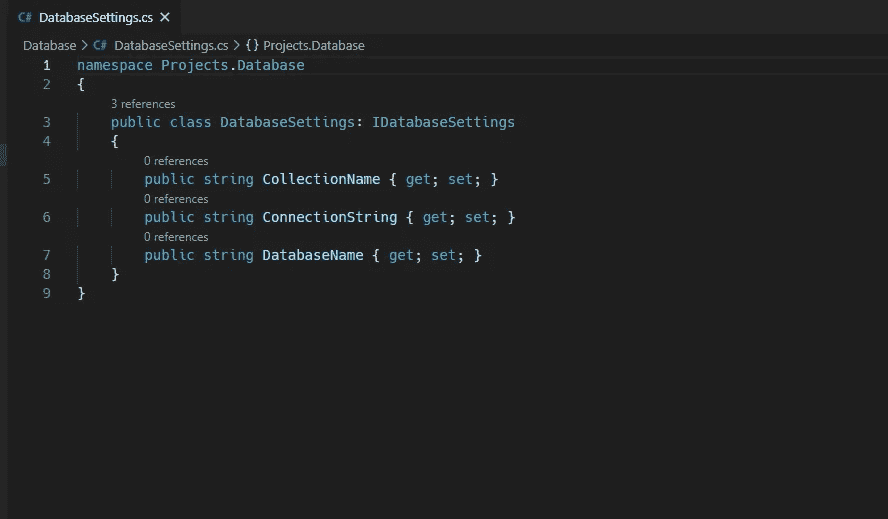

**请注意，命名空间会因项目名称而异。**

一般来说，我们需要以上 3 种信息来描述我们与数据库的联系，以及收藏本身。在现实生活中，我们将这些保存在某种环境文件中。

现在打开您的 **Startup.cs** 文件，导航到 **ConfigureServices** 方法并添加这一行:

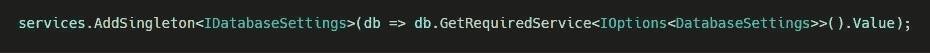

现在要指定您的连接数据，打开您的 **appsettings.json** 和 ConnectionString 对象，如下所示:

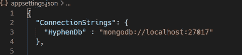

如果需要，您可以在该文件中添加附加信息。
我们现在完成了与数据库的连接。现在让我们添加一些数据，并从中读取一些数据。
为此，我将创建用户集合，并在我们的中创建用户模型和用户控制器。Net 应用程序。

在你的项目根目录下添加文件夹 **Models** 。在里面创建 **User.cs** 文件。
为了本文的目的，我们将保持事情简单，并有**电子邮件**和**密码**字段。

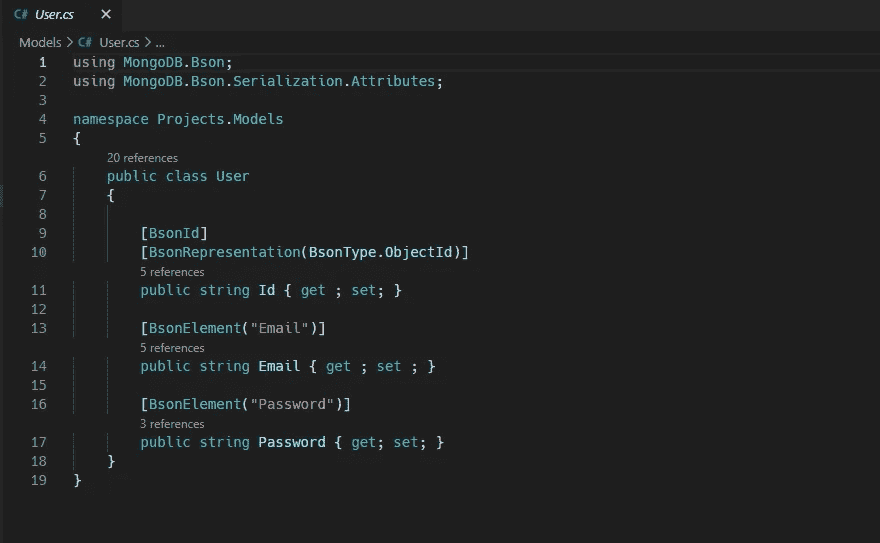

在这之后，我们将通过创建服务类来分离逻辑的所谓的**数据层**，服务类将与数据库通信，之后我们将仅在我们的用户控制器中调用其方法，用户控制器将代表逻辑的业务层(当你告诉面试官这一点时，他们会喜欢你的！:D)。

再次在你的项目根目录下，创建**服务**文件夹，并在 **UserService.cs** 文件中。

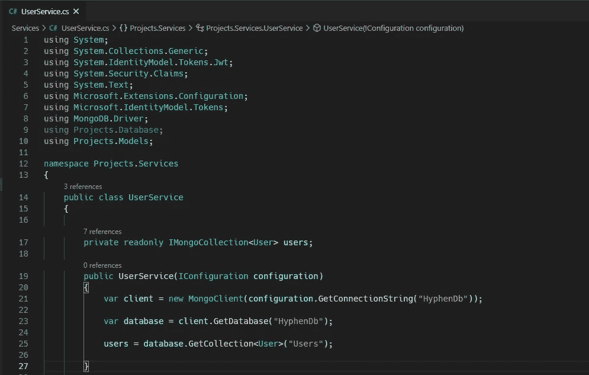

出于本教程的目的，我们将只执行一些 CRUD 操作。
注意，这里我们是硬编码集合名称等。
就像我提到的，在现实生活中你会从 **appsettings.json** 文件中得到这些。

现在让我们添加 CRUD 操作。

我们为控制器做好了准备。创建**控制器**文件夹，并在里面 **UserController.cs** 文件。

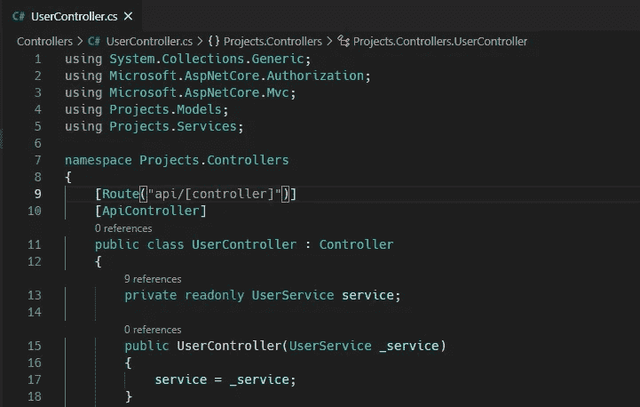

我们在控制器的构造函数中使用了**依赖注入**。为了能够使用这个特性，我们必须启用它。打开 **Startup.cs** ，在 **ConfigureServices** 方法中添加这一行: **services。AddScoped < UserService >()。**

现在让我们实现控制器方法。

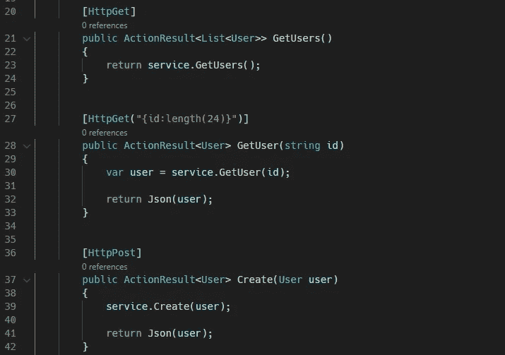

**如果我们触发路由 [**将执行 get users()**http://localhost:5000/API/use](http://localhost:5000/api/use)****r**

**如果我们触发路由 [**将执行 GetUser()**http://localhost:5000/API/user/](http://localhost:5000/api/user/60435cc79a3b1df86ebf7d49)****【id }**

**如果我们触发路由 [**将会执行 create user()**http://localhost:5000/API/user](http://localhost:5000/api/user)****(Post 请求)**

打开终端并运行命令:
**dotnet build**

然后命令: **dotnet watch run (** 运行这个，每次保存的代码更改都会自动重新加载项目)。

现在打开 **postman，**，在添加 JWT 认证之前，让我们测试一下我们的 api。

首先，我们将运行 Post 请求，以添加新用户。请注意，id 被自动指定为 24 个字符长的字符串。

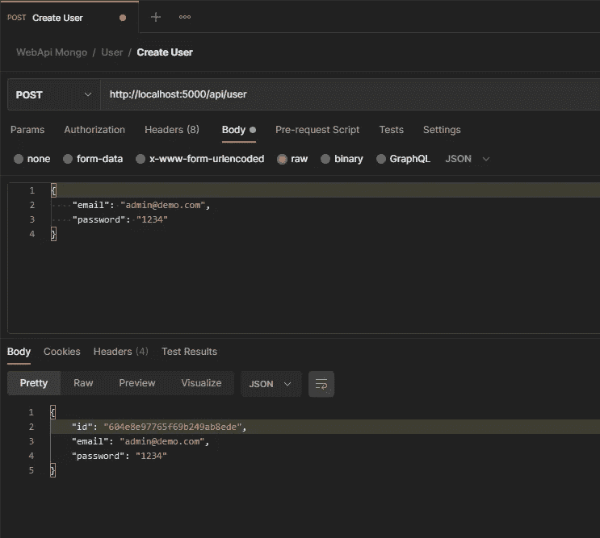

现在，如果我们使用[**http://localhost:5000/API/use**](http://localhost:5000/api/use)**，**运行 **Get** 请求，我们应该会得到用户列表，目前只有一个用户。

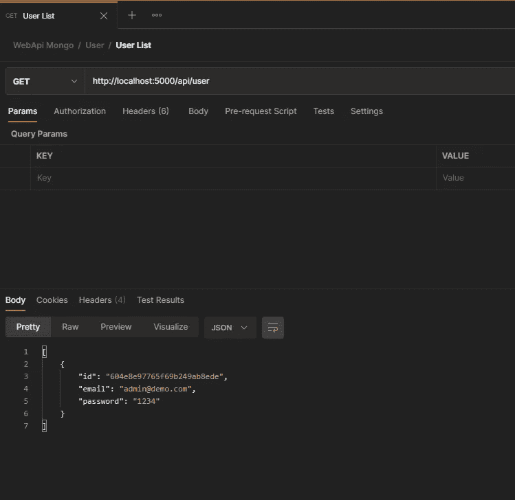

我们有。

现在有趣的部分，让我们添加 Jwt 认证。
先用 **ctrl + c** 停止服务器，再添加几个包。运行下一个命令:

**微软 dotnet 添加包。AspNetCore.Authentication**

**微软 dotnet 添加包。AspNetCore . authentic ation . jwtbearer**

**dotnet 添加包系统。IdentityModel.Tokens.Jwt**

再次检查**。csproj** 文件并确认这些包在那里。现在，为了使用任何种类的身份验证，我们必须在我们的项目中启用它。转到你的 **Startup.cs** 文件，导航到**配置**方法。在里面添加 **app。使用 Authentication()** 方法。

现在，在同一个文件中，我们需要像这样配置我们的 Jwt 认证:

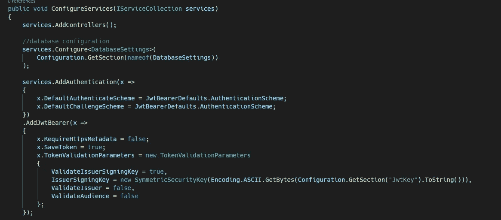

现在，IssuerSigningKey 是我们正在设置的密钥，它用于签名验证。

**配置。GetSection("JwtKey ")。ToString()** 这将从 **appsettings.json** 文件中获取给定键的值。在我的例子中，我像这样添加了 JwtKey:

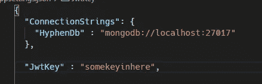

在现实世界中，这可能更合适，或者你可能不想把这个键放在这里。

现在我们已经添加了所有需要的东西，我们可以为身份验证本身编写逻辑了。
打开**用户服务**，创建方法**认证**。该方法将从登录表单或我们的请求主体中获取**电子邮件**和**密码**，并检查凭证是否有效，如果有效，它将创建包含我们想要的数据的令牌。方法如下所示:

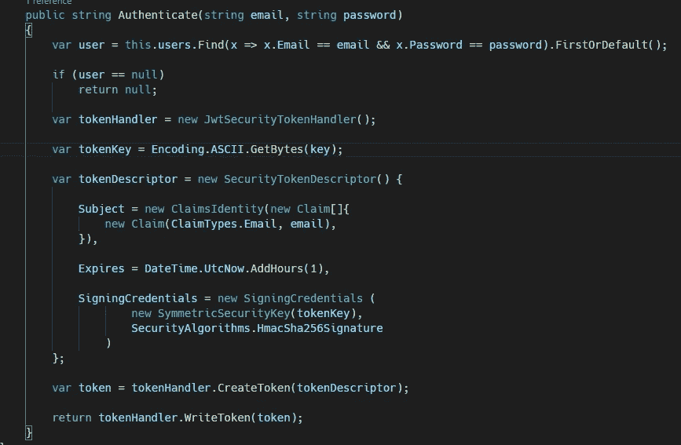

在这里，我将返回 **null** ，因为**first order default**如果在数据库中没有找到匹配，将返回 **null** 。因为我们正在使用来自我们的 **appsettings.json** 文件的 JwtKey，我们需要像这样分配它:

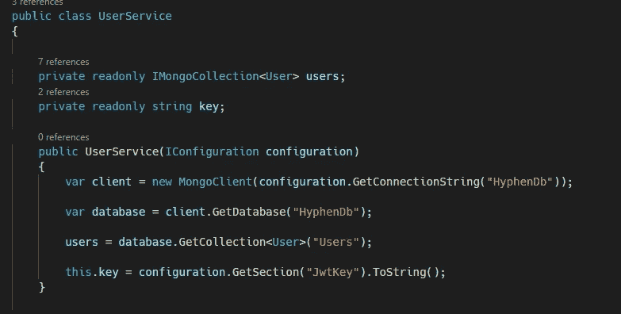

只需在**构造函数**中再添加一个赋值，就万事大吉了。最后，让我们在我们的控制器中使用这种认证方法，我们可以测试它。
打开 UserController.cs，在上面添加**【授权】**属性。这意味着您必须获得授权才能从该控制器执行任何操作，在我们的例子中，我们是通过提供令牌获得授权的。

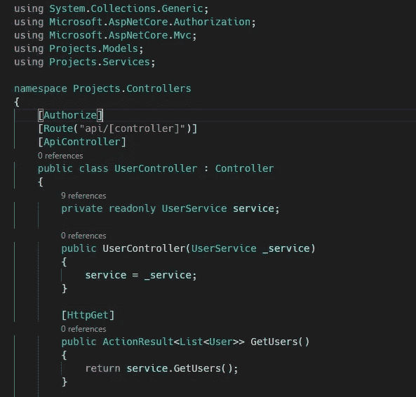

添加名为 **Login** 的新方法，并赋予其**【allow anonymous】**属性，因为我们**确实希望**允许在没有**授权**的情况下执行此操作。

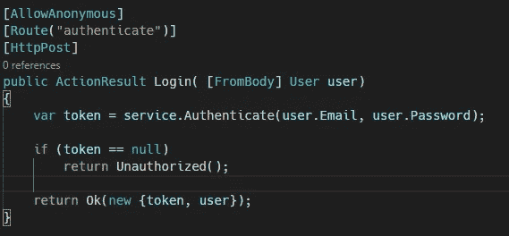

我们在请求体中期待用户的凭证，然后将它们传递给我们的服务。如果凭证不正确，我们将返回 **Unauthorized()，**然而当用户通过认证时，我们将返回用户对象和令牌。现在，如果需要，您可以自由地返回附加数据。让我们再测试一次。

如果我们试图在未经身份验证的情况下访问用户列表:

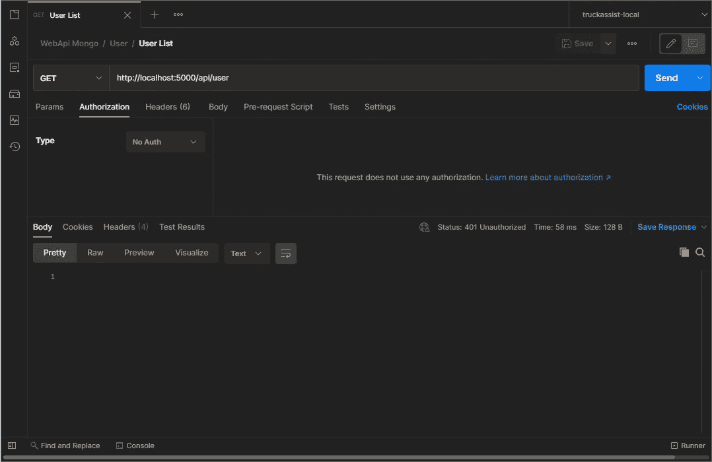

我们得到 401 未经授权。现在让我们先登录并获取令牌。

现在，如果我们转到 Jwt.io 并粘贴我们的令牌，我们将获得我们在配置它时提供的数据。

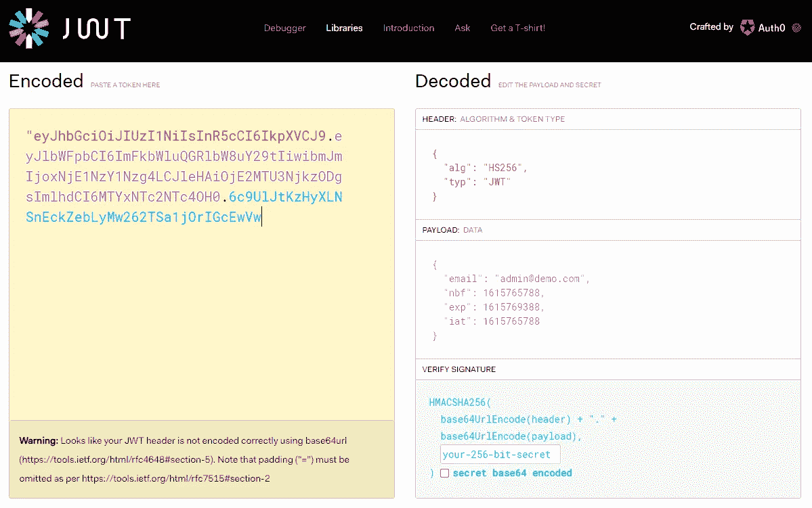

现在让我们再次回到用户列表。转到“授权”选项卡，选择不记名令牌。

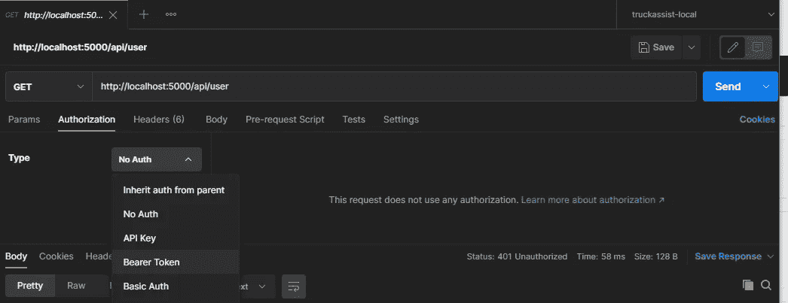

在内部粘贴令牌。并再次发送请求。

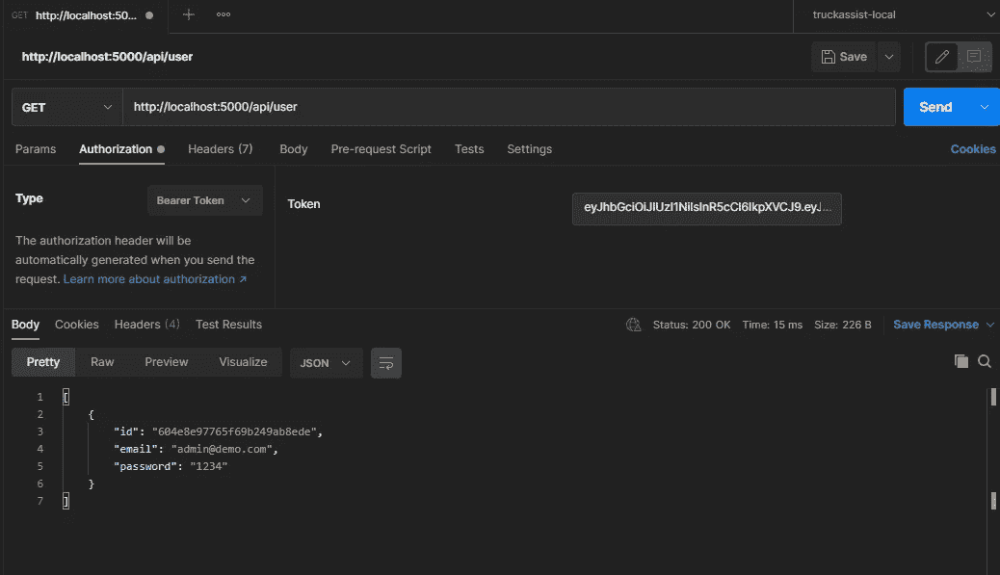

我们现在有了名单。

下一步将是用 React.js 创建前端应用程序，并将其与该应用程序连接。来看看吧👉 [**此处**](https://tonicfilip.medium.com/react-js-spa-with-net-core-5-8e419834e48) 。

这就是本教程，希望你觉得有趣和有用。如果是这样，你可以支持我的工作，请我喝杯咖啡😊

请分享你的想法，下次快乐编码！