# 网络联系形式+反应

> 原文：<https://medium.com/nerd-for-tech/netlify-contact-form-react-923e59ed0189?source=collection_archive---------12----------------------->

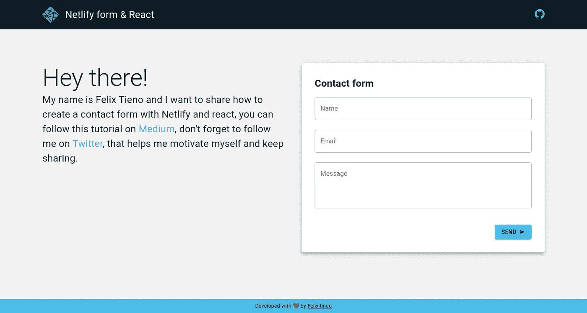

# **简介**

在本教程中，我想告诉你如何用 react 和 netlify 制作一个联系表单。非常有用的投资组合，如果你不想变得如此复杂，节省一些时间和金钱。

# **设置**

我们要做的第一件事是创建我们的项目，我将使用 yarn 作为包管理器，但它与 npm 非常相似。

```
yarn create react-app netlify-contact-form
```

依赖项创建和安装过程完成后，项目结构应该如下所示:

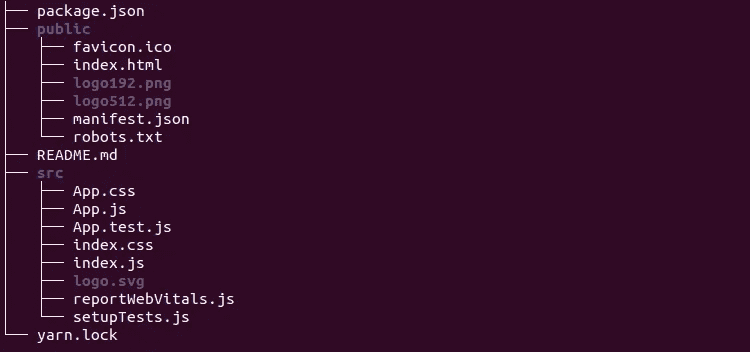

接下来，您将转到 src 文件夹:

```
cd src/
```

删除 App.css，App.test.js，index.css，logo.svg，reportWebVitals.js，setupTests.js:

```
rm App.css App.test.js index.css logo.svg reportWebVitals.js setupTests.js
```

> 注意:我们将删除它们，因为它们的使用超出了本教程的范围，并且将使浏览我们的文件更快。

# 材料用户界面

我们将使用 material ui 向表单中添加一些样式，并在此过程中学习一些相关知识。我们还将安装您的图标。

```
yarn add @material-ui/core @material-ui/icons
```

现在我们的 package.json 将如下所示:

```
{
  "name": "netlify-contact-form",
  "version": "0.1.0",
  "private": true,
  "dependencies": {
    "[@material](http://twitter.com/material)-ui/core": "^4.11.4",
    "[@material](http://twitter.com/material)-ui/icons": "^4.11.2",
    "[@testing](http://twitter.com/testing)-library/jest-dom": "^5.11.4",
    "[@testing](http://twitter.com/testing)-library/react": "^11.1.0",
    "[@testing](http://twitter.com/testing)-library/user-event": "^12.1.10",
    "react": "^17.0.2",
    "react-dom": "^17.0.2",
    "react-scripts": "4.0.3",
    "web-vitals": "^1.0.1"
  },
  "scripts": {
    "start": "react-scripts start",
    "build": "react-scripts build",
    "test": "react-scripts test",
    "eject": "react-scripts eject"
  },
  "eslintConfig": {
    "extends": [
      "react-app",
      "react-app/jest"
    ]
  },
  "browserslist": {
    "production": [
      ">0.2%",
      "not dead",
      "not op_mini all"
    ],
    "development": [
      "last 1 chrome version",
      "last 1 firefox version",
      "last 1 safari version"
    ]
  }
}
```

# 布局

初始配置完成后，就该动手了，我们要做的第一件事是创建 components 文件夹并访问它:

```
mkdir components && cd components
```

现在我们将创建我们的布局组件:

```
mkdir layout && touch layout/index.js
```

创建完成后，我们打开布局目录中的 index.js 文件，开始导入我们将使用的依赖项。

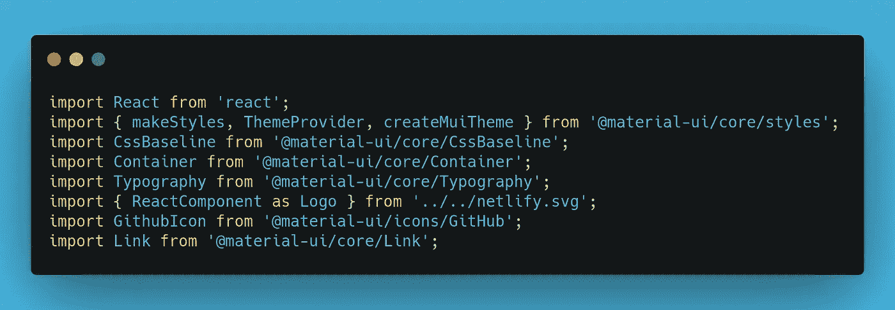

1.**反应:**我们进口反应

2. **makeStyles:** 帮助我们创建一个钩子，用它我们可以通过 className 向我们的组件注入样式。

3.提供一个我们自己创建的主题，这样我们可以自定义一个小的素材 UI。

4.**createmiutheme:**它允许我们创建我们的主题，稍后我们将通过 ThemeProvider 来完成。

5. **CssBaseline:** 正常化默认浏览器样式。

6.容器:它允许我们保持内容居中，并给出一个更加统一的外观。

7.**排版:**帮助我们格式化文本的组件。

8.**{ react component as Logo }:**是 CRA 允许我们导入 svg 图形的方式。

9.GithubIcon: Gitub 图标，它将指向这个项目的资源库，以防你想更深入地了解它。

10.**链接:**这个组件允许我们转到另一个地址，它的工作原理类似于< a >标签。

> 在整个教程中，我将使用一些已经提到的组件以及其他组件，你可以看到它们在官方的 [Material UI](https://material-ui.com/getting-started/installation/) 文档中是如何使用的，以及我如何在项目的[资源库](https://github.com/felixTineo/netlify-contact-form.git)中应用它们。

**现在我们将对**默认的材质 UI 主题进行一点修改，我们将修改主次色，使其更具原创性；)

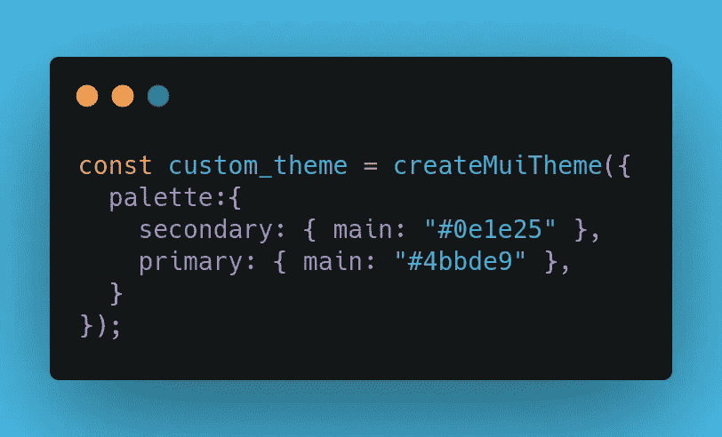

**我们将创建**一些类，我们将把这些类传递给我们的组件，以对它们应用一些样式。

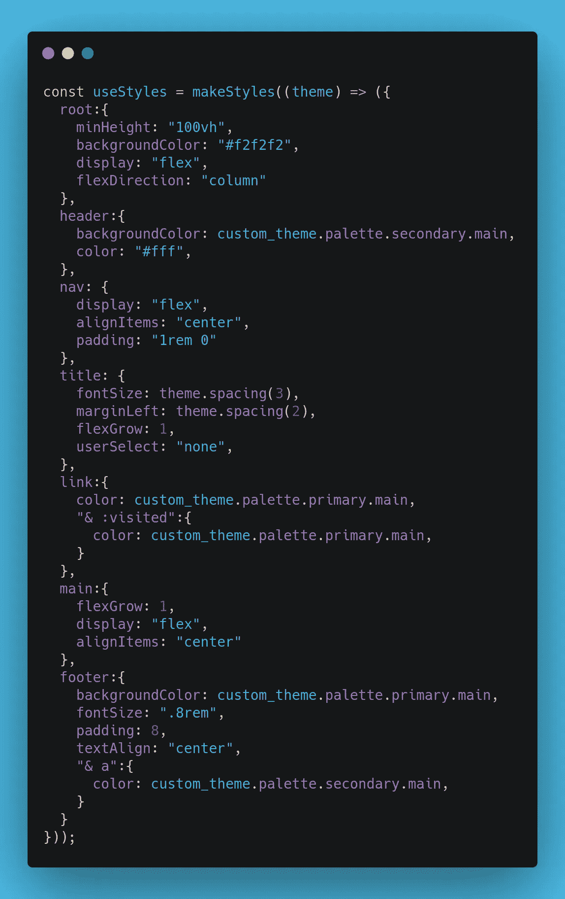

**通过这种方式，我们可以创建布局组件**，作为应用程序的容器。

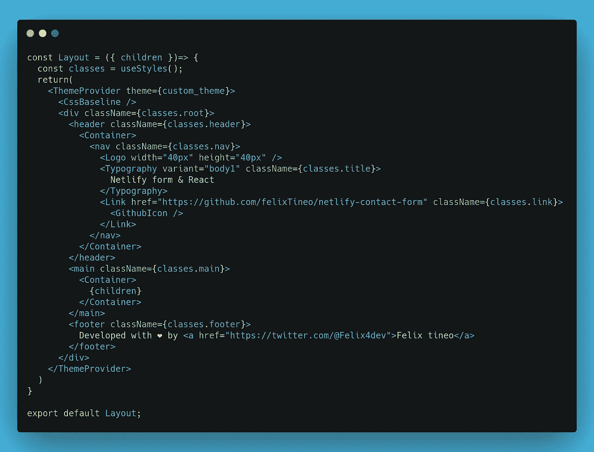

# 描述

现在我们将创建描述组件:

```
mkdir description && touch description/index.js
```

**一旦组件被创建**，我们将打开描述目录中的 index.js 文件，我们将使它类似于下面这样:

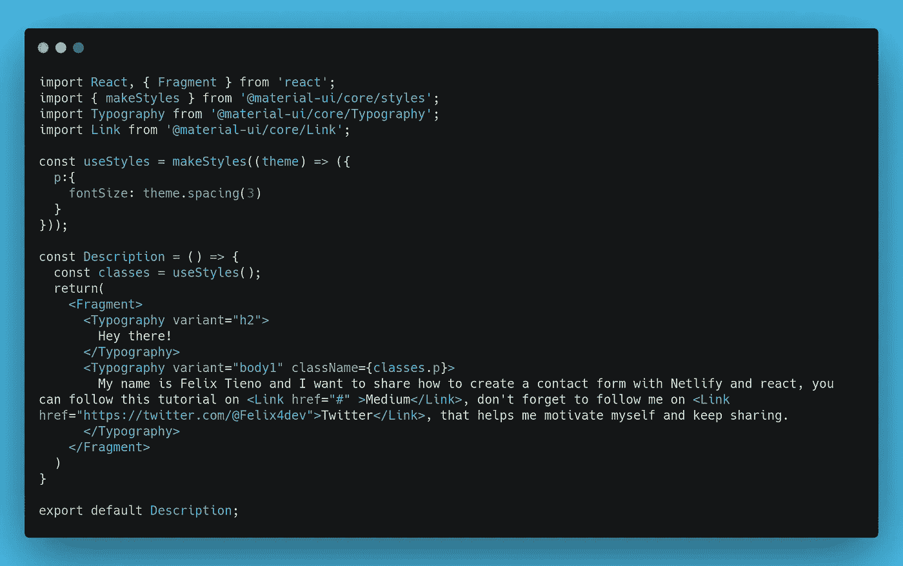

# 联系方式

这是我们教程中最重要的部分，因为有些元素是关键，这样我们的表单才能正确地与 netlify 一起工作。

```
mkdir contact-form && touch contact-form/index.js
```

现在，我们打开刚刚创建的 contact-form 目录中的 index.js 文件，并开始导入依赖项。

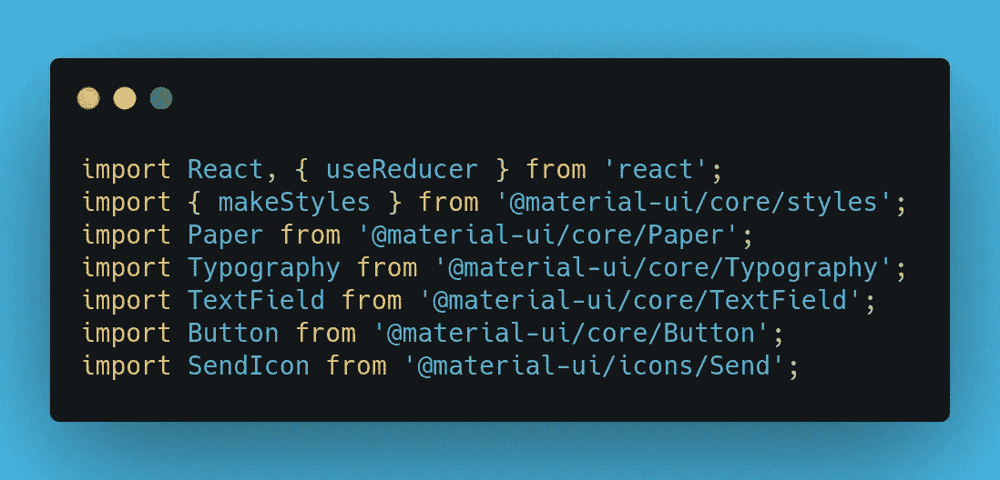

## **useReducer**

使用这个类似于 useState 的钩子，我们将处理表单的值及其验证。

## 其他人

其他依赖项是 Material UI 的一部分，其中一些之前已经解释过了，如果您有任何问题，请参考他们的[官方文档](https://material-ui.com/getting-started/installation/)。

## 初始值

**useReducer** 需要初始值，它只不过是一个由我们表单的值组成的平面对象，我们将使用两个，一个存储输入的值，另一个非常类似地处理验证。

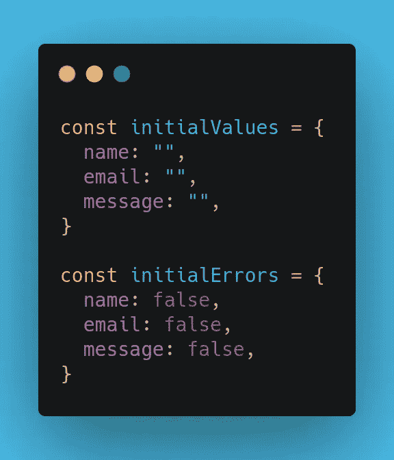

## 还原剂

这是一个减函数，它接受表单值的当前状态和下一个状态，因此只返回发生变化的那个。

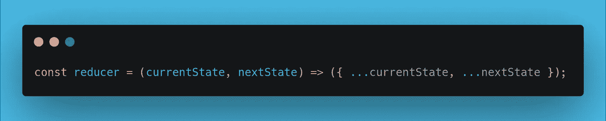

有了以上内容，我们可以初始化 useReducer:

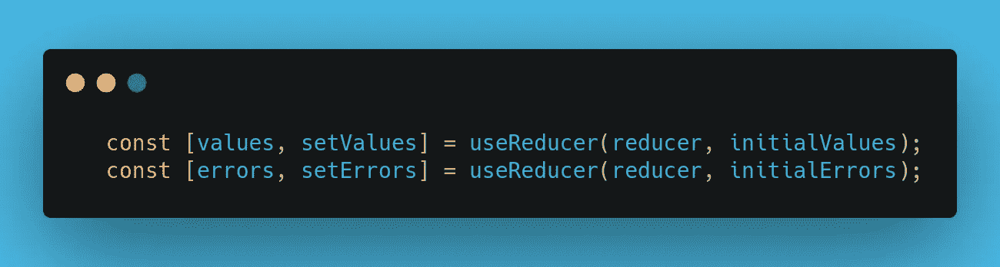

## onChange

这个函数允许我们处理输入的 onChange 事件，将元素本身作为一个参数，然后使用 setValues 只改变它当时正在输入的字段。

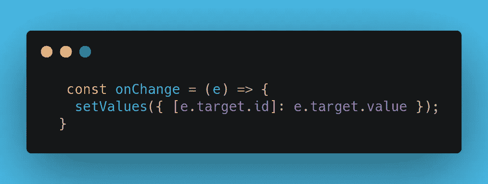

## 专注

有了这个函数，我们可以从我们的输入中删除错误信息。

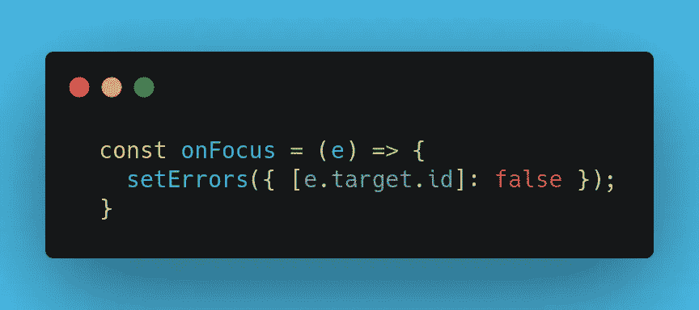

## 编码

这个函数允许我们将 values 对象转换成查询字符串，因为这是发送数据的方式。

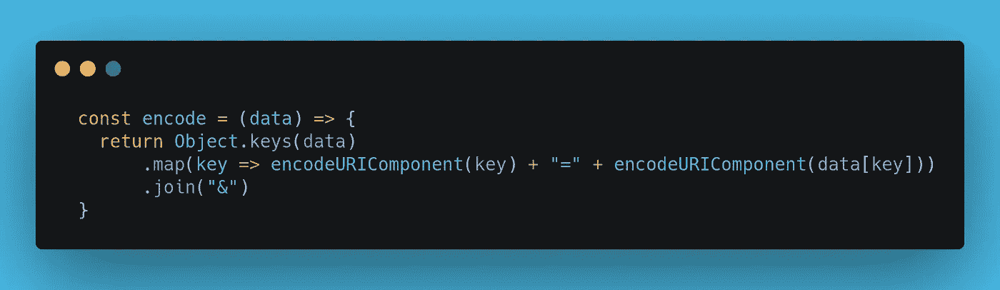

## onSubmit

通过这个函数，我们将管理数据的发送，我们将看到它分为两个部分，验证和数据发送。

1.  **验证:**我们将遍历我们的每个值来验证没有字段是空的，如果是，我们将标记错误。还有其他类型的验证，如电子邮件，但我尽量保持简单。

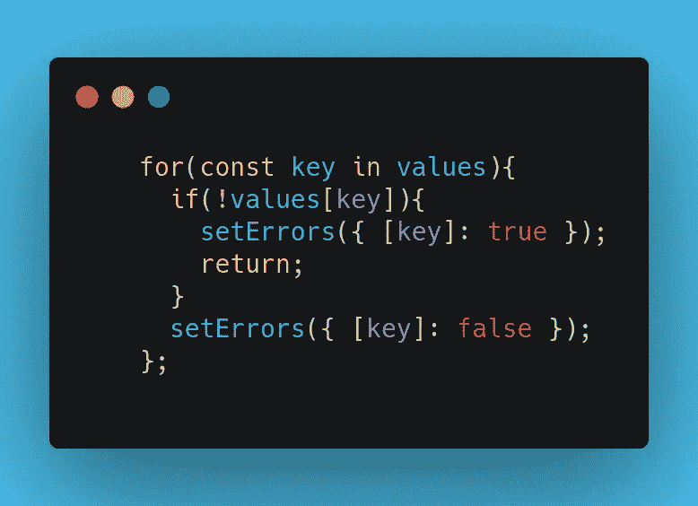

1.  **Fetch:** 一旦我们的表单通过验证，我们将发送捕获的数据。

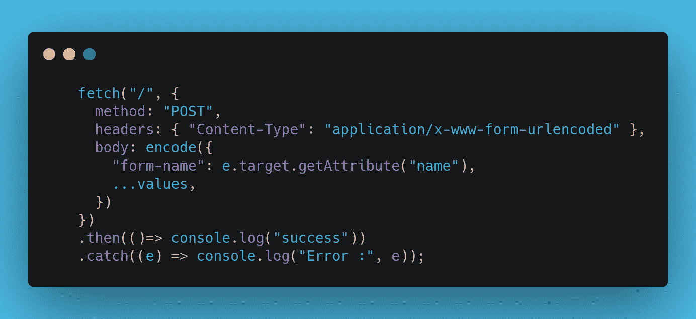

# 最后一件事是将上述所有内容与构成我们表单的组件集成在一起。

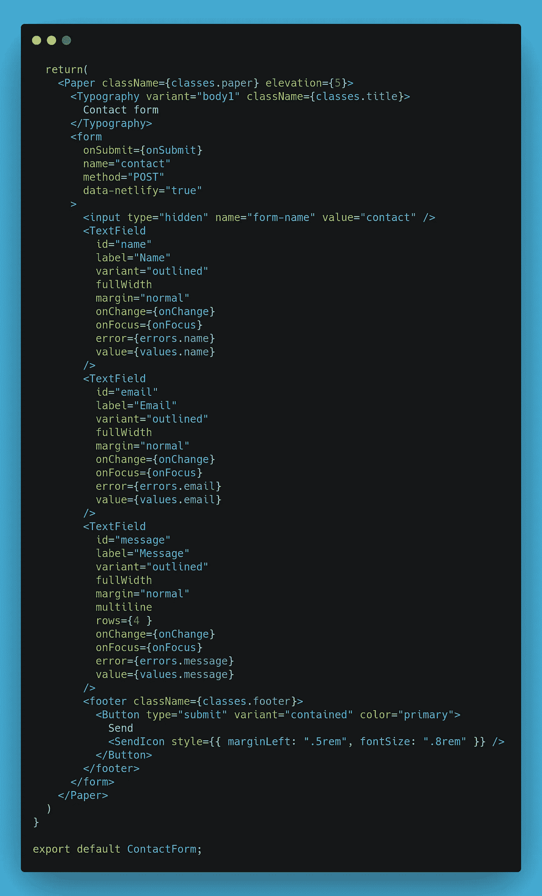

# 重要的

我们可以注意到，除了额外的输入(其值是表单的名称)之外，我们还向表单添加了属性 data-netlify = "true ",这是必不可少的，以便 netlify 机器人可以识别表单并将其集成到他们的系统中。

# 最后一步

我们转到/public 目录所在的根目录，也就是 index.html 文件所在的目录，我们将打开它，并在正文的开始标记下添加以下内容:

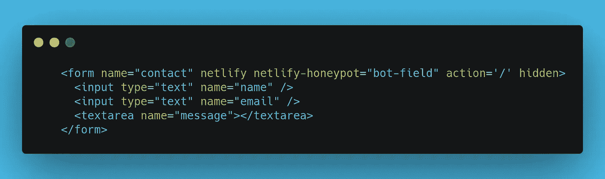

重要的是，除了您可以看到的和 netlify 加载表单所必需的额外属性之外，数据要与我们之前制作的表单和输入的名称一致。

# 最后的

至此，我们已经准备好将项目上传到 github 并与 netlify 集成。我们测试我们的表单，然后从我们的 netlify 帐户进入表单。

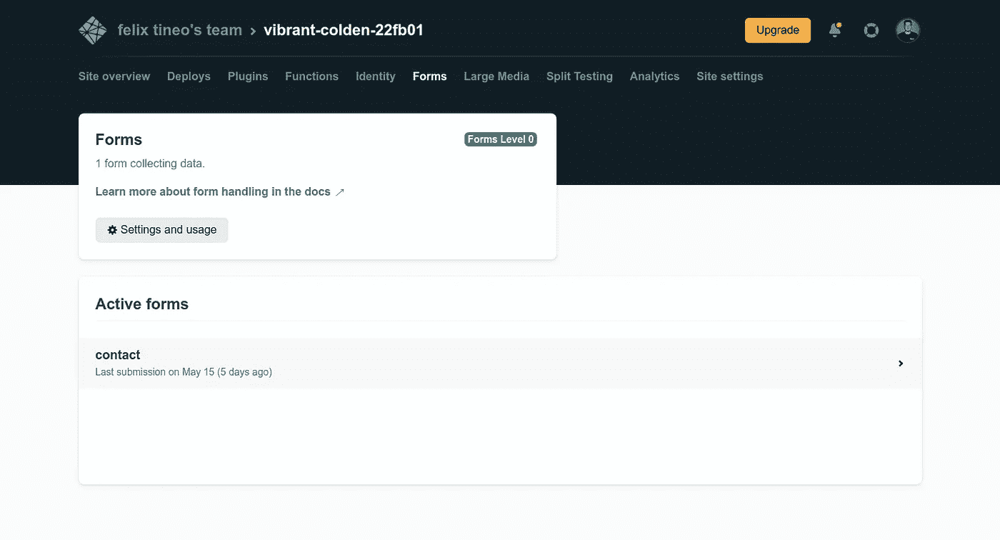

我们单击表单的名称，在这种情况下，名称是 contact，在这里您可以找到收到的消息。

**储存库:**【https://github.com/felixTineo/netlify-contact-form】T2

【https://vibrant-colden-22fb01.netlify.app/】举例:

**推特:**https://twitter.com/Felix4dev