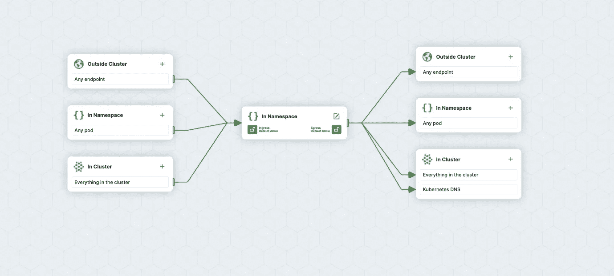
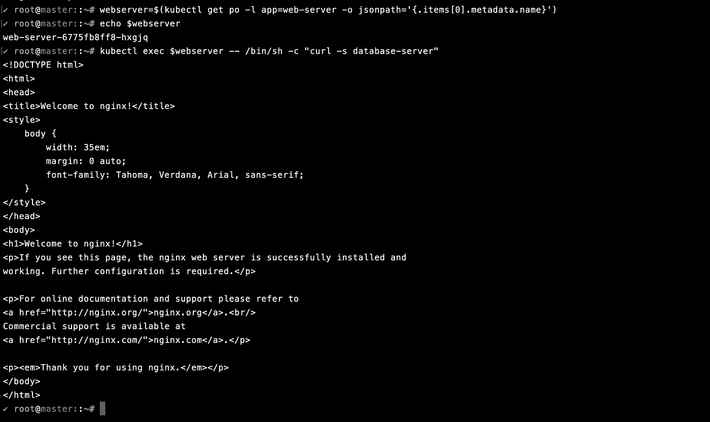
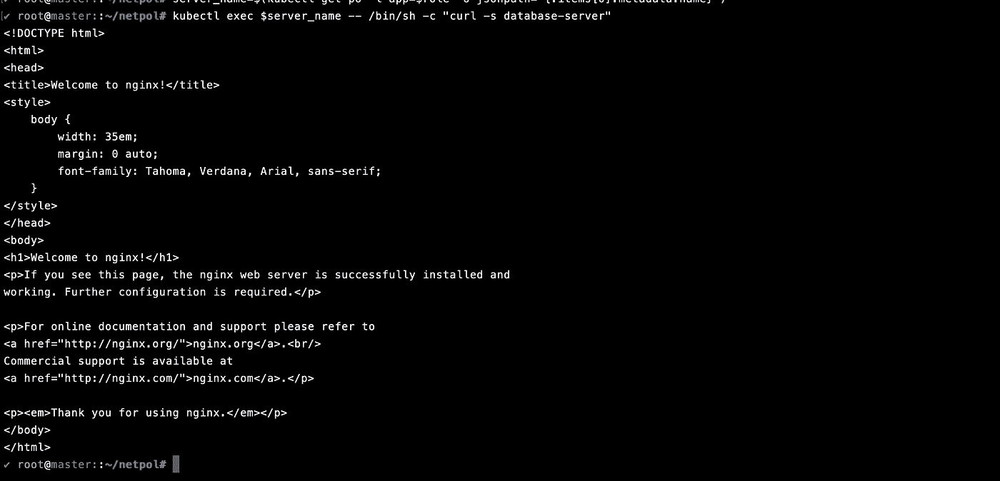
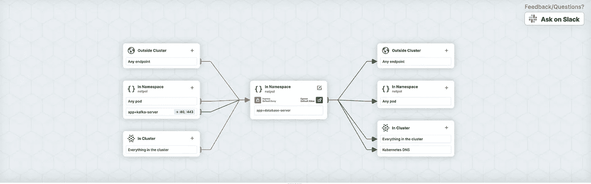
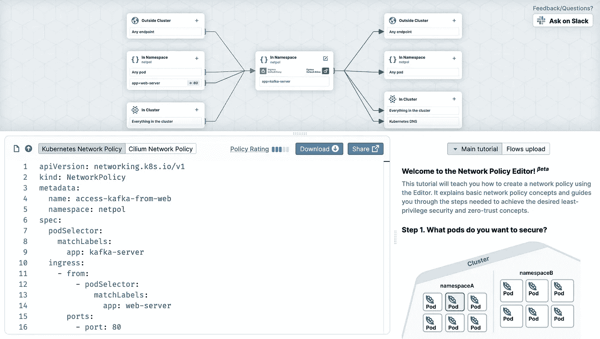
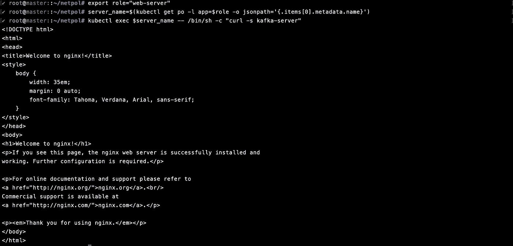

# Kubernetes 揭秘网络政策

> 原文：<https://medium.com/nerd-for-tech/network-policies-demystified-in-kubernetes-d57fc2548043?source=collection_archive---------9----------------------->

使用 Cilium 编辑器在 Kubernetes 中可视化网络策略

你可能会在 Kubernetes 上运行一些微服务。考虑一个简单的架构，你可能有一个 web 服务器(前端)和一个数据库服务器(后端)以及一些其他的微服务(例如:像 Kafka、RabbitMQ 等消息队列)。您可能希望数据库服务器只能由 Kafka、RabbitMQ Pods 访问。messaging broker pods(即 Kafka)应该只接收来自 web 服务器 pod 的流量。所有这些是如何实现的？我们如何控制进出 Kubernetes 资源的流量？ [**网络政策**](https://kubernetes.io/docs/concepts/services-networking/network-policies/) 在 Kubernetes 来我们这里救援。**网络策略**是 Kubernetes 资源，控制 Kubernetes 资源之间的流量，如 pod、网络端点。它定义了 pod 和网络端点之间通信的网络访问策略。网络策略允许我们指定 Pod 被授权连接的实体。可以通过在数据库单元上实施联网策略来解决上述单元之间通信受限的问题，这将允许来自标签为 app=messaging-server 的单元的流量，Kafka/RabbitMQ 单元也同样允许来自标签为 app=web-server 的单元的流量。



使用 cilium 编辑器实现网络策略可视化

# 整个故事是关于什么的？(TLDR)

1.  了解 Kubernetes 中的各种网络策略。
2.  使用 [*纤毛编辑器*可视化这些网络策略。](https://editor.cilium.io/)

# 先决条件

1.  Kubernetes 集群(可以是本地、AKS、EKS、GKE、Kind)。

# 故事资源

1.  GitHub 链接:[https://github.com/pavan-kumar-99/medium-manifests](https://github.com/pavan-kumar-99/medium-manifests)
2.  GitHub 分支:网络-策略

## 创建网络策略

> 网络策略由网络插件实现。要使用网络策略，您必须使用支持网络策略的网络解决方案。

默认情况下，单元是非隔离的。这意味着

1.  每个 pod 可以与同一命名空间中的所有其他 Pod 通信。
2.  一个名称空间中的所有 pod 可以与不同名称空间中的所有其他 pod 通信。
3.  没有入口或出口策略应用于 pod。默认情况下，允许入站和出站流量进出 Pod。

让我们从创建 3 个部署开始。在本演示的范围内，所有三个部署将使用相同的映像(即 Nginx ),因为本文的主要目的是理解网络策略的概念，而不是从头开始开发应用程序。让我们创建 web 服务器组件。

```
$ kubectl create ns netpol$ kubectl config set-context --current --namespace=netpol$ kubectl create deploy web-server --image=nginx $ kubectl expose deploy web-server --port=80 
```

让我们现在创建卡夫卡组件

```
$ kubectl create deploy kafka-server --image=nginx$ kubectl expose deploy kafka-server --port=80
```

现在让我们创建数据库组件

```
$ kubectl create deploy database-server --image=nginx$ kubectl expose deploy database-server --port=80
```

我们现在将尝试从 web 服务器访问数据库服务器。

```
$ export role="web-server"$ server_name=$(kubectl get po -l app=$role -o jsonpath='{.items[0].metadata.name}')$ kubectl exec $server_name -- /bin/sh -c "curl -s database-server" 
```



web 服务器和数据库服务器之间的通信

您应该注意到 web 服务器可以与数据库服务器通信。其他的豆荚也是如此。您可以通过在上面的命令中将角色更改为 kafka-server 或任何其他服务器来检查这一点。

所以，不，我们不希望名称空间中的每个 pod 都可以访问数据库服务器。相反，只有 kafka 服务器应该访问它。即，只有标签为 app=kafka-server 的 pod 才能与数据库服务器通信(即，标签为 app=database-server)。

现在让我们仔细看看清单。

> spec.podSelector:要应用此网络策略的 pod 的标签。
> 
> 入口. from.podSelector:允许入口流量的 pod 的标签。
> 
> ingress.ports:允许进入通信的端口。

现在，让我们应用网络策略来查看变化。

```
$ git clone [https://github.com/pavan-kumar-99/medium-manifests.git](https://github.com/pavan-kumar-99/medium-manifests.git) \
-b network-policies$ cd medium-manifests/$ kubectl apply -f access-db-from-kafka-netpol.yaml
```

好啊，我们的第一个政策现在开始实施了。让我们尝试从两个不同的 pod 访问数据库服务器，即

1.  从 web 服务器 pod(这应该会失败)。
2.  来自卡夫卡豆荚(这个应该会过去)。

```
$ export role="web-server"$ server_name=$(kubectl get po -l app=$role -o jsonpath='{.items[0].metadata.name}')$ kubectl exec $server_name -- /bin/sh -c "curl -s database-server"

command terminated with exit code 7
```

请求现在将会超时。现在让我们从 Kafka 服务器尝试同样的方法。

```
$ export role="kafka-server"$ server_name=$(kubectl get po -l app=$role -o jsonpath='{.items[0].metadata.name}')$ kubectl exec $server_name -- /bin/sh -c "curl -s database-server"
```



curl 命令现在成功了

现在，您应该能够从 kafka-server pod 连接到数据库服务器 pod。

我们还应该限制 kafka-server pod 的流量，只允许来自 web-server pod 的入站流量。但这一次，让我们通过可视化网络策略使它更具交互性。


图片来源:谷歌

是的，你没看错。**[**editor . cilium . io**](https://editor.cilium.io/)可以轻松构建和可视化网络策略，然后可以作为 YAML 下载并在任何 Kubernetes 集群中运行。YAML 的也可以上传到一个适当的图形用户界面可视化。**

****

**纤毛编辑器**

**中间的方框代表您尝试应用网络策略的资源。左边的资源代表入口策略，右边的资源代表出口策略。我们现在应该限制 kafka-server pod 的流量，只允许来自 web-server pod 的入站流量。**

**一旦创建了策略，您应该会在屏幕上找到 yaml 创建的策略。**

****

**来自 cilium 编辑器的网络策略**

**我们现在将下载该策略并将其应用到我们的 Kubernetes 集群。我已经把这个下载到我的 GitHub repo 里了。**

```
$ git clone [https://github.com/pavan-kumar-99/medium-manifests.git](https://github.com/pavan-kumar-99/medium-manifests.git) \
-b network-policies$ cd medium-manifests/$ kubectl apply -f access-kafka-from-web.yaml
```

**万岁，我们的第二个政策也适用。让我们尝试从两个不同的 pod 访问 kafka 服务器，即**

1.  **从 web 服务器 pod(这应该会通过)。**
2.  **从数据库窗格(这应该会失败)。**

```
$ export role="database-server"$ server_name=$(kubectl get po -l app=$role -o jsonpath='{.items[0].metadata.name}')$ kubectl exec $server_name -- /bin/sh -c "curl -s kafka-server"

command terminated with exit code 7
```

**我们现在将尝试从 web 服务器访问 kafka 服务器**

```
$ export role="web-server"$ server_name=$(kubectl get po -l app=$role -o jsonpath='{.items[0].metadata.name}')$ kubectl exec $server_name -- /bin/sh -c "curl -s kafka-server"
```

****

**网络策略按预期工作**

# **结论**

**在像[https://editor.cilium.io/](https://editor.cilium.io/)理解和可视化工具的帮助下，网络政策现在变得更加容易。许多更复杂的网络策略包括选择器，如 CIDR 块、名称空间等。我将在下一篇文章中用一个实际的 golang 应用程序来介绍它们。**

**直到下一次…..**

# **被推荐的**

**[](https://www.techmanyu.com/creating-self-hosted-github-runners-in-a-kubernetes-cluster-fd05560de34a) [## 在 Kubernetes 集群中创建自托管 GitHub 运行程序

### 在您自己的 Kubernetes 集群上运行 GitHub 操作

www.techmanyu.com](https://www.techmanyu.com/creating-self-hosted-github-runners-in-a-kubernetes-cluster-fd05560de34a) [](/nerd-for-tech/introduction-to-crossplane-2f873ae0f9f3) [## 交叉平面简介

### 如何使用 Kubernetes 清单和 Crossplane 在云上创建任何资源。

medium.com](/nerd-for-tech/introduction-to-crossplane-2f873ae0f9f3) [](https://faun.pub/introduction-to-bitnami-sealed-secrets-bb5ae74d9a25) [## 比特纳米密封秘密介绍

### 如何使用 Sealed Secrets 和 Kubese 在 GitHub 中存储您的秘密

faun.pub](https://faun.pub/introduction-to-bitnami-sealed-secrets-bb5ae74d9a25) [](/nerd-for-tech/autoscaling-in-kubernetes-hpa-vpa-ab61a2177950) [## Kubernetes 中的自动缩放(HPA / VPA)

### 使用垂直 Pod 自动缩放器(VPA)和水平 Pod 自动缩放器(HPA)在 Kubernetes 中自动缩放您的应用程序

medium.com](/nerd-for-tech/autoscaling-in-kubernetes-hpa-vpa-ab61a2177950) 

## 参考

[](https://kubernetes.io/docs/concepts/services-networking/network-policies/#the-networkpolicy-resource) [## 网络策略

### 如果您想在 IP 地址或端口级别(OSI 第 3 层或第 4 层)控制流量，那么您可以考虑使用…

kubernetes.io](https://kubernetes.io/docs/concepts/services-networking/network-policies/#the-networkpolicy-resource)**