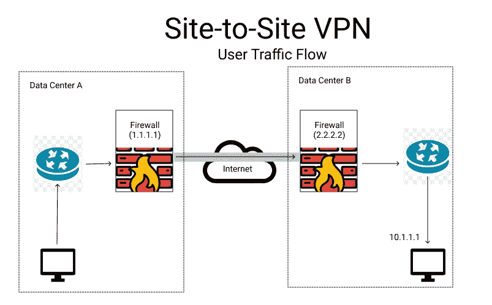
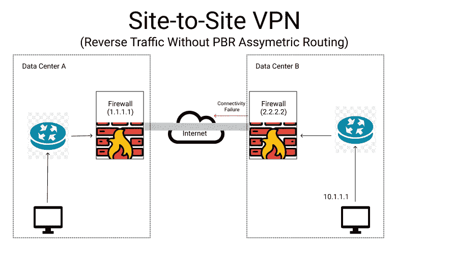
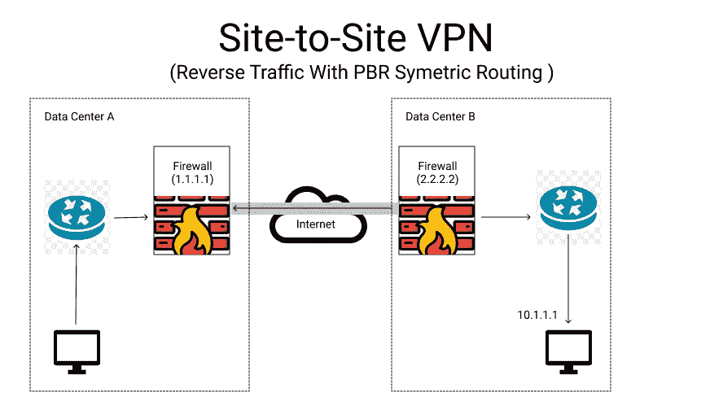

# 网络—基于策略的路由

> 原文：<https://medium.com/nerd-for-tech/network-policy-based-routing-96e08d951b63?source=collection_archive---------5----------------------->

基于策略的路由用于通过在防火墙上创建策略来将流量路由到特定目的地。我们可以考虑一个站点到站点的 VPN，其中我们将尝试部署基于策略的路由(PBR)。

考虑两个数据中心之间的站点到站点 VPN 连接示例

数据中心 A 的防火墙有一个公共对等 IP 地址(1.1.1.1 ),流量通过站点到站点 VPN 到达数据中心 B 的 IP-10.1.1.1 服务器。

> 数据中心防火墙的公共 IP 地址是 2.2.2.2

为了避免不对称路由，我们将使用基于策略的路由通过 VPN 发送返回流量。数据中心 A 正在使用公共 IP 发送流量。因此，防火墙会将响应发送到互联网，因为存在到达公共 IP 的默认路由。因此，为了避免不对称路由，我们将使用基于策略的路由来通过 VPN 发送返回流量。

# 怎么会？

我们将在防火墙上创建转发策略。其中可以提及任何来源，目的地必须是 1.1.1.1，并添加目的地接口作为站点到站点 VPN 隧道。因此，任何以 1.1.1.1 为目的地的流量都将通过点对点 VPN 隧道进行路由。并且非对称路由可以被固定。

> 这是在帕洛阿尔托防火墙上测试的。