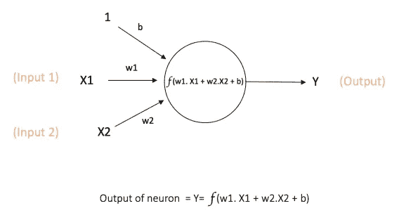
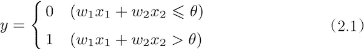
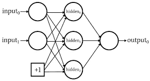
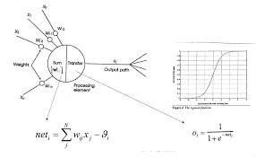

# 初学者的神经网络

> 原文：<https://medium.com/nerd-for-tech/neural-network-for-beginners-146003991beb?source=collection_archive---------10----------------------->

# 什么是神经网络？

神经网络也称为人工神经网络(ANN)。它们是机器学习的子集，也是深度学习的核心。它们的名字和结构受到人类大脑的启发，并复制了生物神经元相互发送信号的方式。

一个复杂的定义是，神经网络是一个具有网络架构的计算模型。这个架构是由人工神经元组成的。这种结构具有特定的参数，通过这些参数可以修改它以执行某些任务。

人工神经网络是深度学习的核心。它们非常强大、可伸缩和通用。他们可以处理机器学习中非常复杂的问题。

神经网络包含多层互连的节点。每个节点是一个感知器。感知器将多元线性回归产生的信号提供给可能是非线性的激活函数。

# 什么是感知器？

感知器是最简单的人工神经网络之一。它是由弗兰克·罗森布拉特在 1957 年发明的。它基于一种被称为线性阈值单元的人工神经元。

那么，感知器是如何工作的呢？

感知器接受几个二进制输入，x1，x2，…，并产生一个二进制输出。

可以看到，我们有 3 个输入 x1、x2，所有这些输入都有随机权重“w0、w1、w2”，输出将是“x*w1+w2+b”之和，我们在其中添加了偏差。这就是感知器的工作原理。

如果两者(w1x1 和 w2x2)之和小于或等于θ，它将给出 0，如果大于θ，它将给出 1。所以在知道感知器是如何工作的之后，让我们看看神经网络是如何工作的。

# 神经网络是如何工作的？

神经网络基于两个概念向前传播和向后传播。在正向传播中没有学习发生，学习发生在反向传播中。

神经网络有许多层，每一层都执行特定的功能，神经元越多，神经网络就越复杂。根据需要可以有很多隐藏层，但这并不意味着层数越多架构越好，只有一个隐藏层的架构可以是非常好的架构，这取决于我们是否需要增加层数的问题和需要。

一个基本的神经网络有 3 层。

1.  输入层
2.  隐蔽层
3.  输出层

正如你所看到的，我们有一个输入层，接受 2 个数字输入，然后我们有一个隐藏层，有 3 个神经元，然后是一个输出层。每一层都有特定的用途，这些层由节点组成。

输入层获取输入，然后在将权重乘以输入后传输到隐藏层。然后隐藏层进行一些计算，然后传输到输出层，然后我们得到损失值。

因此，在隐藏层中，一个神经元执行两个步骤。

## 第一步:

在这一步中，它将所有乘以权重和偏差的输入相加。即(x1w1+x2w2+Bias)。

## 第二步:

在这一步中，它应用一个激活函数。节点的激活函数定义了节点的输出。激活功能最终决定给下一个神经元什么。

有许多类型的激活功能，但我会名称广泛使用。

1.  乙状结肠(逻辑)
2.  双曲正切值
3.  整流线性单元
4.  泄漏 ReLU
5.  参数泄漏 ReLU (PReLU)
6.  指数线性单位(ELU)
7.  比例指数线性单位(SELU)

在这之后，输出层给出输出，该输出被称为损耗值。然后我们通过反向传播来降低损耗值。

在反向传播中，它对每一个神经元进行微分，并不断改变权值，直到损失值最小。这就是梯度下降的概念。

# 结论:

在这里，我已经给出了神经网络的概述。接下来，我将深入探讨反向传播和损耗值及其计算。

## 谢谢你