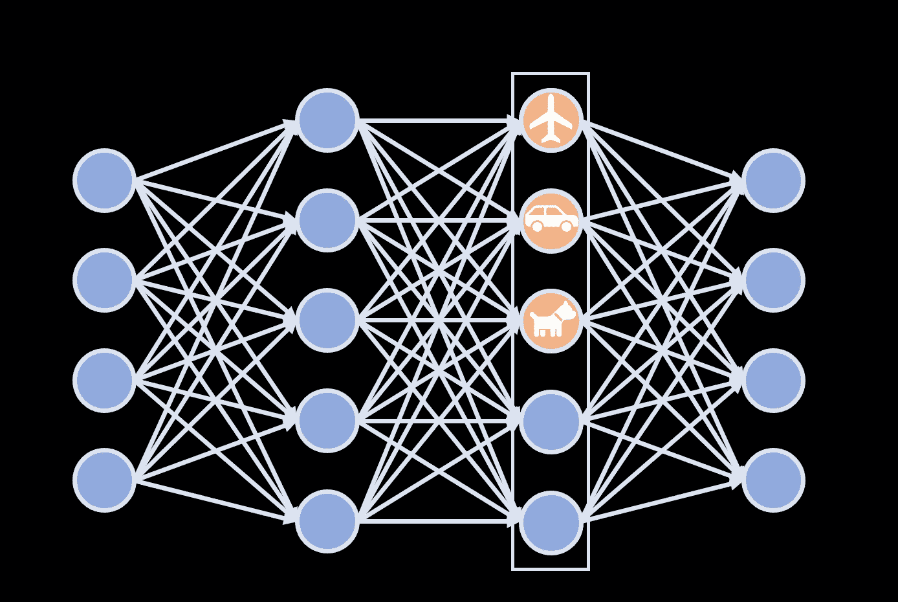
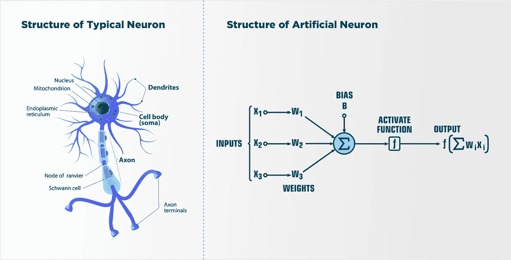
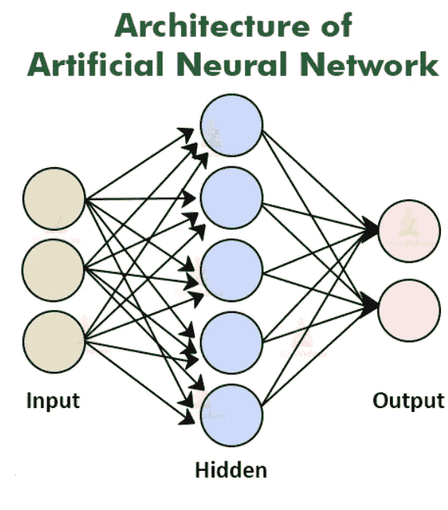
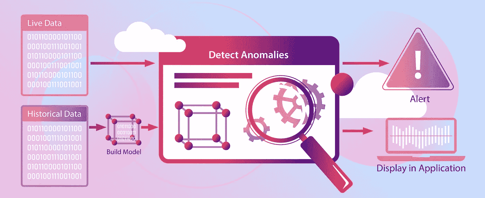

# 神经网络及其用例

> 原文：<https://medium.com/nerd-for-tech/neural-network-its-use-cases-775bd3f6524d?source=collection_archive---------16----------------------->

## 神经网络及其在当前 IT 行业中的应用案例

问候大家！！！在此，另一篇关于神经网络的信息以及它们在 IT 行业中的当前用例影响了我们的生活方式的博客。

我们都用过电脑，也见识过它们的威力有多大。计算机能够做许多人脑认为困难或耗时的事情。它们并不聪明，但它们比人脑还快。计算机是由人类建造、编程和设计的，目的是为了更快地完成任务。我们可以说，计算机只是被设计和开发来完成某个特定的编程任务。如果计算机开始像人脑一样工作会怎样？如果计算机也能像人脑一样学习，并根据所学做出或通过决定，那会怎么样？

以上问题的答案都是“是的，有可能。”我们在技术上取得了如此大的进步，现在我们可以给计算机编程，让它们开始像人脑一样工作。该处理器技术被称为**神经网络**。

## **人脑是如何工作的？**

让我更清楚地说明这一点。首先，我们来看看人脑是如何工作的。人类大脑包含数十亿个被称为**神经元**的**神经细胞**，它们以协调思想、情感、行为、运动和感觉的模式排列。一个复杂的神经高速公路系统将你的大脑和身体的其他部分连接起来，这样交流就可以在瞬间发生。**神经元**是大脑的基本工作单位，是一种专门用来向其他神经细胞、肌肉或腺体细胞传递信息的细胞。神经元是神经系统中向其他神经细胞、肌肉或腺体细胞传递信息的细胞。

猜这么多生物学足以理解神经元是帮助我们学习和理解我们所看到的，感觉到的，触摸到的，闻到的，尝到的细胞。这就是为什么我们从童年开始就一直在学习，直到现在，我们还在学习。当我们第一次学习一件事情的时候，我可能会很困惑去决定或者解释它，但是当我们的大脑(神经元)反复学习同一件事情的时候，当我们看到一个类似的物体时，我们可以很容易地传递一个输出。

当我们在计算机程序中使用相同的概念，并对一些数据有更多的了解时，那么计算机也可以帮助我们预测类似的数据。我们使用计算机的原因并不是它们会学得更好。他们会学得更快，他们可以处理更大量的信息，这是人类不可能做到的。

## **什么是人工神经网络？**

人工神经网络，通常称为神经网络，是由构成动物大脑的生物神经网络模糊启发的计算系统。人工神经网络是基于称为人工神经元的连接单元或节点的集合，它松散地模拟生物大脑中的神经元。来源-维基百科

简单地说，我们可以说一个神经网络包括许多感知层；这就是它被命名为“多层感知器”的原因。这些层也称为密集层的隐藏层。它们是协同工作形成感知层的基本单元。这些神经元接收输入集合中的信息。

## 为什么我们需要人工神经网络？

随着世界越来越大，科技也越来越发达。我们正在产生大量的数据和信息。我们在许多发展领域取得了进展。我们一直在用技术解决世界上的许多问题。我们一直在用机器学习来追踪大数据的所有问题，并从问题中发现一些东西。我们使用传统的 ML 算法，但是现在，那些算法还不足以理解和解决我们现在遇到的问题。所以来了*

*   安正在使用它是非常强大的。人工神经网络可以学习和模拟非线性和复杂的关系，这非常重要，因为在现实生活中，输入和输出之间的许多关系都是非线性和复杂的。在真实世界的数据中，我们有很多特征，如果我们是领域专家，特征选择会更难。人工神经网络自动检测有用的特征，并通过在建筑模型中没有帮助的特征。
*   ANN 将随机权重分配给所有链接，并开始算法构建。然后，它比较权重并继续改变，直到它们满足收敛标准。
*   人工神经网络(ANN)有许多不同的系数，它们可以优化这些系数。因此，与传统模型相比，它可以处理更多的可变性。

## 人工神经网络在当前行业中的用例

以下是人工神经网络的一些行业使用案例以及他们如何使用它:

## **电子商务**

我们在行业的各个地方都使用电子商务。我们可以看到许多拥有电子商务分支的科技巨头，如亚马逊、Flipkart、全球速卖通、易贝等。电子商务有大量的受众，他们有一个很好的优化服务。神经网络在电子商务中的应用已经有很多年了，近年来也有所发展。他们一直在用神经网络来理解顾客购物行为背后的深层知识和想法。它有助于行业预测所需的新订单和明年的销售额。NN 也用于在要求的时间内增加库存，并根据季节减少库存。他们还使用神经网络来理解和计算每一个报价的利润，这也是通过最大化利润和向客户销售所有产品来实现的。此外，他们使用神经网络来了解和预测客户的购买行为，然后用邮件或短信提醒他们重新购买产品。

## 金融部门

神经网络也适用于金融行业。金融行业有大量的数据，当数据很多的时候，那么神经网络一定会派上用场。神经网络在这里是最有用的，因为数据量很大，神经网络的准确性几乎是 100%，这是金融部门所必须的。我们能提供的数据越多，我们能得到的结果就越准确。神经网络在未来预测方面很好。像 Bridgewater 和 MJ Futures 这样的公司使用了 NN，并在 NN 的帮助下获得了大约 199%的回报。

神经网络也一直在帮助银行部门向下一级银行发展。银行现在已经理解了他们客户的行为，并且正在进行更好的分析。这有助于银行为自己和客户做出正确的决定。NN 还帮助银行根据信用和贷款来了解客户。他们一直在研究客户以前的交易模式，预测可以给予的信用额度，将自己从信用风险中解救出来。

## 犯罪和欺诈检测

神经网络也被提前开发出来，用来打击犯罪，为安全社会服务。有时自动提款机被设计用来检测人的脸，他们可以用这张脸取钱。有趣的是，该公司还训练模型检查警察在这种 ATM 抢劫中搜索的人的脸，它有助于检测这些人的脸并发出警报。神经网络的想法可以利用这个想法来降低犯罪率和抢劫率。神经网络一直在帮助增加金融部门的收入，但它也一直在保护它的安全。具有 NN 或深度学习功能的应用程序可以识别交易中的任何欺诈活动或任何异常行为，并在一定时间内警告或关闭应用程序。他们还可以了解用户的时间选择，研究交易的行为和位置。

# 结论

总之，我想说，神经网络仅限于这些用例及应用。它在许多应用领域都有广泛的应用，如自动驾驶汽车、面部识别、商业创意、卫生部门、研究和医疗等等。在涉及神经网络的每个应用中，总有一个发展领域。

我希望我已经提供了一些关于神经网络和一些用例的见解。博客上的任何建议都将受到高度重视，欢迎随时通过我的 LinkedIn 与我联系。

 [## 密山 Regmi -研究实习生- SkillGeek | LinkedIn

### 在世界上最大的职业社区 LinkedIn 上查看米山·雷米的个人资料。密山有一个工作列在他们的…

www.linkedin.com](https://www.linkedin.com/in/mishanregmi/) 

***感谢您的配合。祝你愉快。***