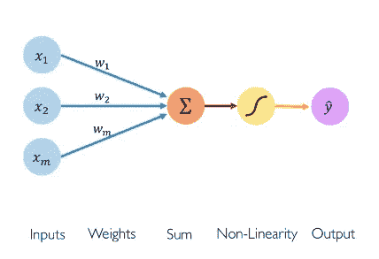
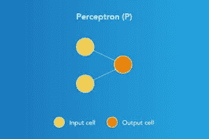
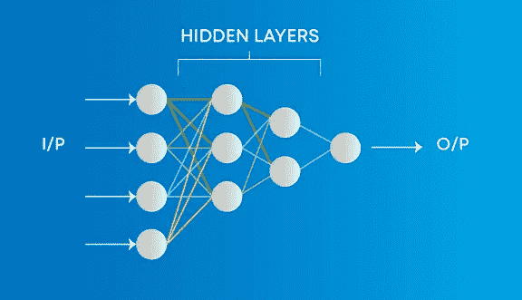
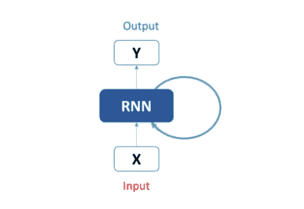

# 神经网络

> 原文：<https://medium.com/nerd-for-tech/neural-networks-68531432fb5?source=collection_archive---------9----------------------->

正如我在之前的博客中提到的，人工智能是机器学习的超级集合，而机器学习又是深度学习的超级集合。深度学习与受人脑结构和功能启发的算法有关。那么，现在让我们深入这个领域，尝试理解它是如何工作的，以及这个强大的算法实际上是什么。

# 什么是神经网络？

它是一系列算法，通过模拟人脑运行方式的过程来识别给定数据集中的潜在关系。现在，如果我们实际上讨论人脑类比，那么这指的是神经元，无论是自然的还是人工的。这些帮助我们对给定的数据进行聚类和分类。

如前所述，这种算法纯粹是受我们人类大脑工作的启发，我们的大脑在一系列或一个称为神经元的网络的帮助下工作。比如突然一只猫或者一只狗向你走来，你会如何预测这是哪种动物？有许多种类的狗和猫，所以很难预测。我们的大脑在不同特征的基础上想象特定的动物，例如腿的数量，它们有什么样的爪子，脸的特征是什么，同样，我们大脑中的神经元网络分层工作，学习这些特征来得出结论。人工神经网络的工作方式几乎是一样的，这里的神经单词来自我们大脑中的单个神经元细胞。

来源:Kayli Leung

# 神经网络元素

建立一个功能与我们的大脑相似的网络并不容易，因此它需要一组对你的网络非常重要的特殊元素，这些元素是你网络中每个神经元的一部分。

这些层由节点组成。一个**节点**只是一个计算发生的地方，类似于我们大脑中的神经元，当它遇到足够的刺激时就会激活。节点将来自数据的输入与一组系数或权重相结合，这些系数或权重放大或衰减该输入，从而根据算法试图学习的任务来分配输入的重要性。这些输入权重乘积相加，然后总和通过节点的所谓激活功能，以确定信号是否应该在网络中进一步传播，以及传播到何种程度，以影响最终结果，比如说，分类行为。如果信号通过，神经元就被“激活”了。

来源:神经网络第一部分:单个神经元内部作者~ [Shweta Kadam](https://shwetarkadam25.medium.com/?source=post_page-----fee5e44f1e--------------------------------)

因此，除了输入和输出之外，基本上总共有三个重要元素:权重、总和以及非线性。根据神经网络如何对输入进行分类和聚类，我们将模型的可调权重与输入特征配对，从而为这些特征赋予重要性。这意味着权重是为特定输入要素(X1，X2…..Xm)根据其在输出预测中的重要性。求和元件实际上负责所有加权输出的求和。非线性或激活函数部分，它是人工神经网络的重要组成部分。没有激活函数的神经网络本质上只是一个线性回归模型。激活功能对输入进行非线性转换，使其能够学习和执行更复杂的任务。

在输入(X)通过所有这些元素后，输出 Y 的直觉就形成了，这个过程也被称为前向传播，这也将在以后的博客中详细讨论。

**Y =激活函数(∑(权重*输入+偏差))**

# 神经网络的类型

有许多类型的神经网络可用或可能处于开发阶段。它们可以根据它们的结构、数据流、使用的神经元及其密度、层及其深度激活滤波器等来分类。

## **1。感知器**

这是最简单也是最古老的神经元模型。它接受加权输入，并应用激活函数获得输出作为最终结果。感知器是一种监督学习算法，它将数据分为两类，因此它是一个二元分类器。

资料来源:mygreatlearning.com

## **2。前馈神经网络**

这也是最简单的神经网络形式，其中数据只沿一个方向传递，例如，输入通过网络节点进入，输出通过输出节点离开。在隐藏层可能存在也可能不存在的地方，输入和输出层都存在。基于此，它们可以进一步分类为单层或多层前馈神经网络。

来源:斯坦福大学的 eroberts 课程项目神经网络

## 3.多层感知器

在这里，输入数据通过不同层的人工神经元。每个节点都连接到下一层的所有神经元，这使得它成为一个完全连接的神经网络。存在具有多个隐藏层的输入和输出层。它具有双向传播，即前向传播和后向传播，这将在后面详细解释。

资料来源:mygreatlearning.com

使用多层感知器的一个主要优点是，由于其深层结构，它对深度学习问题非常有帮助，并给出很好的结果。

## 4.卷积神经网络

现在是神经网络的核心和最迷人的网络类型，卷积神经网络处理图像、视频等输入数据，并在计算机视觉、图像处理、语音识别等方面有大量应用。

来源:卷积神经网络作者~ [塞尚·卡马乔](https://cezannec.github.io/)

这是神经元的三维排列，而不是二维排列，第一层是卷积层。卷积层中的每个神经元只处理来自一小部分视野的信息。像过滤器一样以批处理方式获取输入要素。网络部分地理解图像，并通过在模型中添加不同的层来分层地发展理解，以完成完整的图像处理。卷积神经网络在图像和视频识别、语义分析和释义检测中显示出非常有效的结果。

## 5.递归神经网络

这些类型的网络非常擅长模拟序列数据(例如:文本、音频)。它反馈到输入，以帮助预测层的结果。这里的第一层是一个前馈层，它给信息一个单一的方向，然后它通过一个 RNN 层，在那里它在先前的时间步中的一些信息被一个记忆功能记住。在 RNN，顺序记忆概念被用作工作，通过它，前一状态的输出是预测当前状态输出的必要因素。

来源:用 Python 从零开始构建递归神经网络作者~ [法伊赞·谢赫](https://www.analyticsvidhya.com/blog/author/jalfaizy/)

此外，LSTM 和 GRU 的是一些修改模型，用于相同的应用，但有效地和纠正 RNN 面临的错误。

# 结论

在这里，我们讨论了什么是真正的神经网络，它如何模仿我们的人脑，讨论了它的元素。我们根据神经网络的功能和应用讨论了一些重要的神经网络类型，从而对其进行了总结。神经网络有三个基本的工作阶段:正向传播、损耗计算和反向传播，这将在下一篇博客中详细讨论，然后我们将使用 Python 和适当的框架(如 Tensorflow、Keras 和 Pytorch)来实现神经网络。

希望你们现在对神经网络有了清晰的认识，请留下你们的反馈，祝你们学习愉快！！