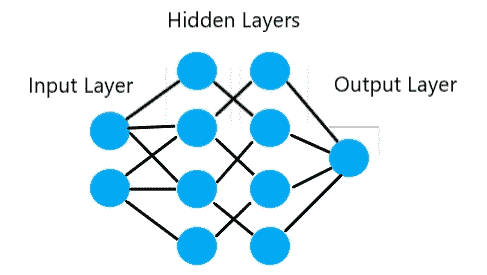
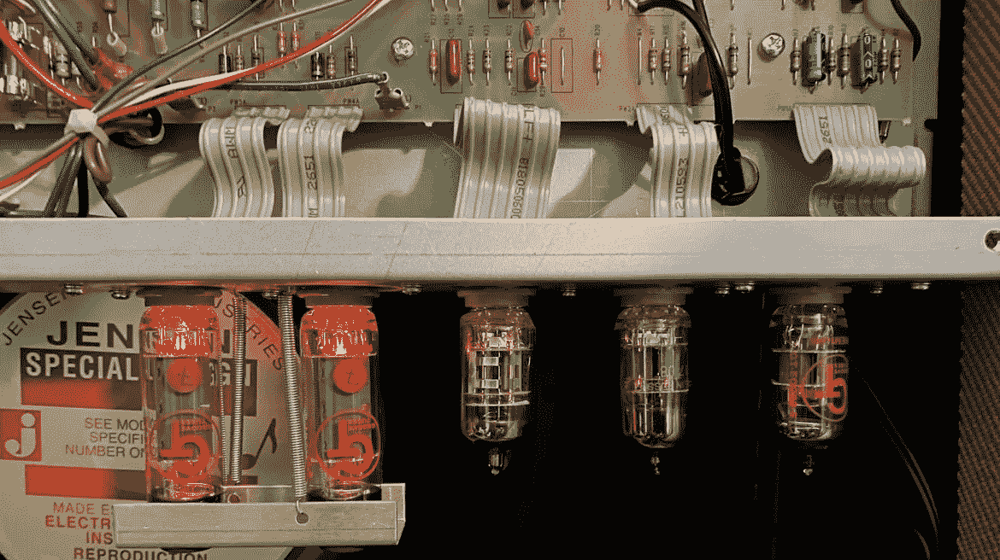
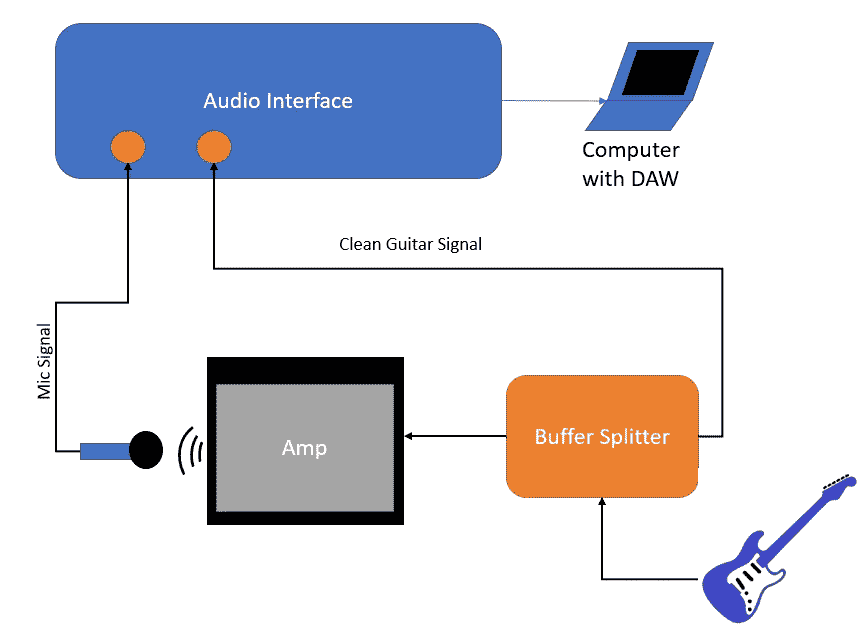
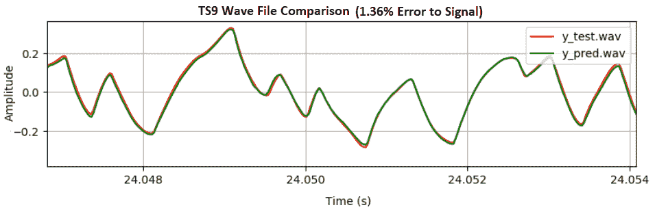
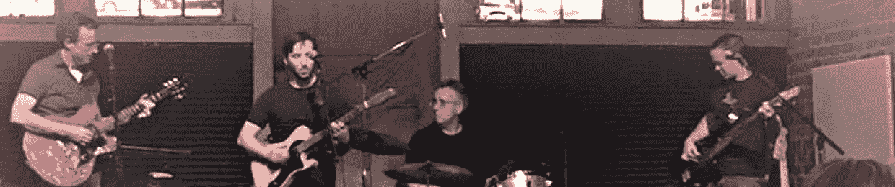

# 用于实时音频的神经网络:简介

> 原文：<https://medium.com/nerd-for-tech/neural-networks-for-real-time-audio-introduction-ed5d575dc341?source=collection_archive---------2----------------------->

这是关于使用神经网络进行实时音频的五部分系列的第一部分。

无论我们是否意识到，人工智能每天都在更多地影响着我们的生活。从社交媒体到网上购物，再到无人驾驶汽车，人工智能正在改变我们的生活方式和决策方式。

但是等等，人工智能不就是终结者和人形机器人和机器接管世界吗？这是我们在电影中看到的，但在现实中，人工智能只是解决问题的一种不同方式。它使用计算机、大数据和智能数学来解决问题，这是以前只有人类才能做到的。

神经网络是人工智能的一个子集。该理论大致基于大脑的工作方式，大脑由神经元组成，这些神经元形成了复杂的连接，这些连接决定了我们是谁。它不使用生物细胞，而是使用数值或“节点”,这些数值或“节点”形成层，并以定义的数学方式连接。事实证明，即使这些人工神经元的简单结构也可以用于令人印象深刻的复杂任务，如阅读手写字母，或从图片中识别人脸。

用于可视化前馈神经网络的典型图形

为什么将神经网络用于音频？一个常见的应用是文本到语音或语音到文本。像 Alexa 这样的产品，可以听我们的声音，明白我们在问它什么(大部分时间)，并用听起来像人类的声音做出回应。但是神经网络和音频还有很多其他的应用。

音频质量在音乐行业至关重要。我们希望从立体声音响或耳机中听到尽可能好的声音。模拟硬件通常因其为声音增添温暖的能力而备受推崇。例如，高端吉他放大器使用真空管来放大和过载原本干净的吉他信号。他们以一种悦耳的方式扭曲声音。基于晶体管的放大器(固态)在它们应该做的事情上有点太好了。正是真空管放大声音的不完美之处增加了一些特别之处。但是它们既昂贵又易碎，而且像任何灯泡一样，最终会烧坏。

芬德布鲁斯小吉他放大器中的真空管和电路

神经网络可以用来精确地模拟这些非线性音频分量。这种类型的建模被称为“黑盒”建模，因为我们不关心物理系统如何工作，只关心模型以同样的方式响应。相反的方法是“白盒”建模，详细的电路分析和方程定义每个电气元件。一种混合方法被称为“灰箱”建模。

使用任何神经网络都包括三个步骤:

1.  **数据收集:**模型必须有数据可以学习。对于吉他放大器，神经网络需要获取干净的吉他信号，并模拟放大器的动态响应。这需要两个单独的记录:系统的输入和系统的输出(其中系统是音频放大器/电路/部件)。录音是一门独立的艺术，有很多技巧可以捕捉到最好的声音。

吉他放大器输入/输出数据采集(录音)的信号链示例

**2。模型训练:**然后输入和输出信号被用来训练神经网络，使其表现得像真实系统一样。定义了网络架构，以及优化器和损失函数。训练神经网络以最小化预测信号和真实信号(音频设备输出的实际信号)之间的损失。网络结构和损失函数的选择对模型的性能至关重要。

TS9 吉他踏板与神经网络模型的示例信号比较(高精度)

**3。模型部署**:一旦神经网络模型被训练，你就可以部署它用于特定的任务。这也被称为“推断”，因为模型是根据它在训练阶段学到的知识来推断如何对新输入做出反应。在实时吉他放大器模型的情况下，网络持续处理现场音频信号。数字音频效果通常以 44.1kHz(每秒 44，100 个样本)或更高的频率运行。这是一个巨大的数据量，从模拟转换成数字，通过神经网络，转换回模拟，并在你的耳朵注意到延迟之前发送到你的扬声器。要做到这一点，需要高性能的算法。

本系列文章假设读者对编程语言和人工智能框架有基本的了解，旨在作为使用神经网络实现实时音频解决方案的参考。我将主要使用 [**GuitarML**](https://github.com/GuitarML) 项目作为我的代码示例。GuitarML 是开源吉他插件和用于训练模型的相关机器学习软件的集合。我们将逐步介绍三种不同的神经网络架构及其实时算法。实时软件使用 [**JUCE**](https://juce.com/) 音频框架，用 **c++** 编写。机器学习代码使用[**tensor flow**](https://www.tensorflow.org/)**(带 [**Keras**](https://keras.io/) )和 [**PyTorch**](https://pytorch.org/) 。**

**在我的下一篇文章中，我将介绍用于实时音频处理的 WaveNet 神经网络模型的代码示例。点击此处的进入下一篇文章。**

****

**向我最喜欢的当地乐队——Black Tupelo(我在右边)大声欢呼**

***如果你喜欢我在这里和在*[*guitar ml*](https://guitarml.com/)*上的工作，考虑加入我的*[***patr eon***](https://www.patreon.com/GuitarML)*为幕后软件开发贴子和神经网络放大器/踏板模型为我的插件。***