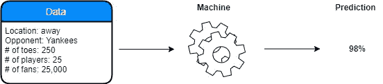
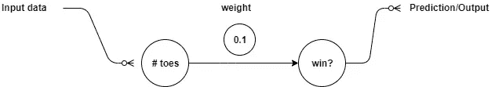
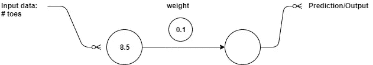
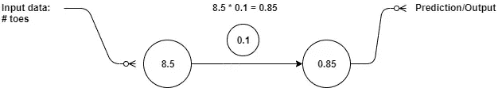

# 正向传播

> 原文：<https://medium.com/nerd-for-tech/neural-prediction-forward-propagation-2fdc1b58729a?source=collection_archive---------5----------------------->

## 预测，比较，学习


耶！

如果你正在阅读这篇文章，你可能想深入学习。在这篇文章中，我将试图解释如何建立一个只有一个输入和一个输出的非常基本的网络。
所以，你可能已经知道深度学习就是*预测、比较、*和*学习*。你可能已经看过这些步骤了:



先说*数据。*数据量对神经网络的准确预测能力有重大影响。这些数据必须为网络提供人类做出同样预测所需的尽可能多的信息。但是正如我已经告诉你的，对于这个网络，我们只使用一个输入，只是为了向你展示神经网络预测是如何工作的。我们走吧！

所以，为了建立一个网络，我们必须首先了解数据集(输入和输出)的*形状*。形状是指您同时处理的数据点或列的数量。我们的网络采用一个输入数据点并输出一个预测。正因为如此，我们只有一个*重量*。重量——是什么？其实深度&机器学习都是关于权重的。稍后你会得到这个…

## 1.



网络体系结构

```
weight = 0.1
def neural_network (input, weight):
    output = input * weight
    return output
```

首先，我们初始化一些随机权重，在我们的例子中， *0.1。但是你可以从任何你想要的数字开始。接下来，我们定义一个函数，实际上是我们的网络" *neural_network* "，它接受*输入*和*权重*，并返回一个*输出*，或者换句话说，一个*预测*。为了进行预测，网络将输入数据点乘以给定的权重。现在我们来放一些数字，看看效果如何。*

## 2.

```
number_of_toes = [8.5, 9.5, 10, 9]
input = number_of_toes [0]
prediction = neural_network(input , weight)
print(prediction)
```



第一次输入:#toes = 8.5

我们设置了一个输入数据点列表，并将第一个数据点作为我们的输入。
所以*输入* = **8.5** ，权重为 **0.1**

## 3.

```
def neural_network (input, weight):
    **output = input * weight**
    return output
```


将权重与输入相乘(正向传播)

在网络上运行并得到预测。这个过程叫做 ***正向传播*** 。我们只是通过网络运行**转发**，直到我们有一个输出/预测。

## 4.

```
number_of_toes = [8.5, 9.5, 10, 9]
input = number_of_toes [0]
**prediction = neural_network(input , weight)**
print(prediction)
```



得到预测

所以我们的网络做出的预测是 0.85。我们只是用*输入*乘以*权重*。就是这样！

本文所用资料:
《Grokking 深度学习》一书；[图解网站](https://www.diagrameditor.com/)