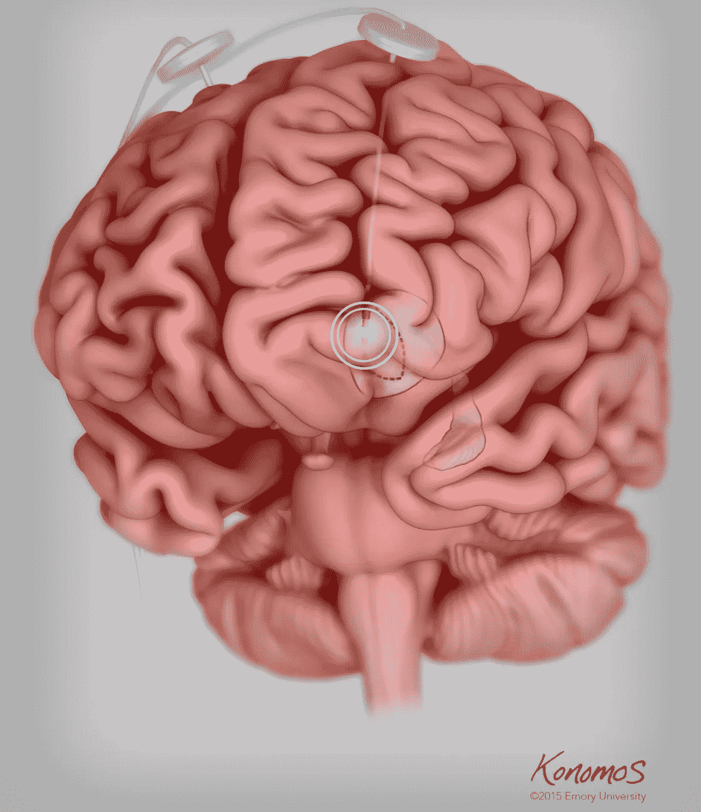
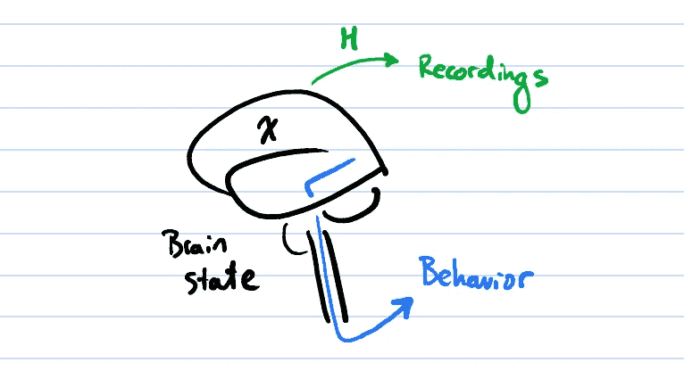
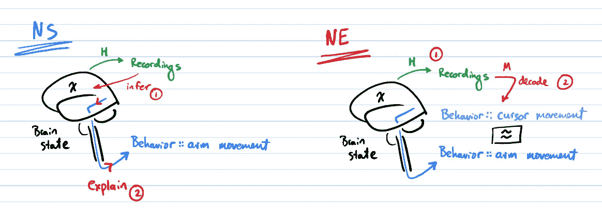
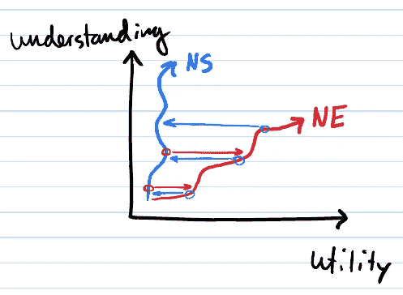

# 大脑神经工程

> 原文：<https://medium.com/nerd-for-tech/neuroengineering-the-brain-c0eeef788694?source=collection_archive---------1----------------------->

## 第一部分:理解行动

对于神经接口来说，这是一个非常重要的十年——它们终于跳出了科幻小说，进入了公众的视野。多么令人兴奋的*新*技术！

深度大脑刺激的图示，一种侵入性神经接口，可以缓解帕金森氏症的症状。来源:[https://www . med . emory . edu/clinical-experience/advanced-patient-care/VME/index . html](https://www.med.emory.edu/clinical-experience/advanced-patient-care/vme/index.html)

事实证明，我们已经设计和使用神经接口 50 多年了，通常是为了恢复重病患者的功能。尽管它们有惊人的效果，但我们并不真正理解它们为什么会起作用。

能够在不完全理解各个部分的情况下控制一个复杂的系统是一件非常 T4 工程的事情。**神经工程**为我们提供了最令人兴奋的方法来平衡技术创新和大脑中的科学理解。

我们来谈谈是什么让神经工程成为研究大脑的独特领域。

## 让我们来研究大脑

我们都希望对大脑有科学的理解:通过对直接观察的分析(**记录**)，建立大脑如何工作(**大脑活动**)，如何与大脑的功能联系起来(**行为**)的机械论。

换句话说，我们想要一个大脑及其产生的行为的数据一致的模型。

我们通过记录大脑状态来研究大脑，通常是在分离出感兴趣的特定行为之后。我们希望将所有这些联系在一起，明确地或逐渐地。

神经科学是建立这种理解的一种方式。在神经科学中，对控制良好的实验记录进行分析，以获得大脑活动的准确视图。一旦我们有了一个准确的观点，我们就把它一点一点地与行为联系起来。只要记录是完美的，我们就能得到一些大脑活动如何与行为联系的狭窄模型。

我们最好确保录音是完美的！关键是**好实验**。

神经工程是一种非常不同的方式。在神经工程中，目标通常是通过建立一个重定向大脑活动的设备来实现现实世界的目标。录音，哪怕是乱七八糟的，都用来建立*解码模型；*将“神经代码”转化为我们关心的行为的数学模型。这种解码模型可以作为大脑正在做的事情的数学近似——带有许多警告。

我们通过**预测行动**反复建立我们的理解。

神经科学试图追溯大脑在做什么，然后解释复杂的行为。神经工程(NE)试图建立一个模型，将记录与行为联系起来。然后，有些人可能想雕刻和打磨它，直到它符合大脑正在做的事情。

当然，神经工程和神经科学必须共同努力，才能让我们对大脑的工作方式有最严谨的理解。鉴于他们建立理解的方法非常不同，我们仍在试图找出如何做到这一点。

## 他们如何一起跳舞

神经工程优先考虑有用性的突破(**效用**)，实现一个以前没有做过的复杂目标。无论是公认的神经科学、启发式、直觉还是纯粹的运气，任何东西都可以在构建复杂系统的干预措施中发挥有效的作用。

控制这一切的是锚定在*的数学严谨性*。数学是最终的制衡，在提高效用和提高理解之间的切换会加快速度。

重要的是，神经工程进展迅速，因为它主要依靠解决问题，而不是科学方法来实现其目标——首先让它工作。因为目标是锚，所以鼓励新颖和创新的方法。

神经科学经常求助于成功的神经工程技术，并试图用既定的、有文献支持的方法和发现来解释它们(**理解**)。像*脑机接口(BCI)* 和*深度大脑刺激(DBS)* 这样越来越明显的技术就是很好的例子。

这份文献的严谨性表明，从已发表的理解中跳出来不仅是不可取的，而且是糟糕的科学。所以以前的出版物是对这些发现的一种制衡。

因此，神经科学通常缓慢而严格地建立对大脑所有部分的理解。它往往不在现实世界神经科学的前沿——但它在“检查工作”中发挥着重要作用。

## 摘要

神经工程是一个令人兴奋的领域，它在神经系统(包括大脑)的紊乱中构建设备和干预措施——尽管我们并不真正了解设备*或*大脑*。*

通过以现实世界的行动为中心，神经工程给了我们有用的东西和潜在的有洞察力的大脑模型之间的平衡。