# 永远不要忘记梯度下降和损失函数

> 原文：<https://medium.com/nerd-for-tech/never-forget-gradient-descent-and-loss-function-ever-again-e593936a3bf8?source=collection_archive---------1----------------------->

## 了解我们为什么使用梯度下降，以及哪种损失函数最适合您的需求

在之前的[文章](/nerd-for-tech/choose-the-best-activation-function-for-your-network-f46154bd9541)中，我们了解了各种激活功能，以及哪一个最适合我们的需求。在我们选择了一个激活函数之后，我们就可以把数据输入到我们的神经网络中了。在第一次记录之后，我们得到一个与原始值相差甚远的预测值。

我们如何告诉网络预测值错了 x 量，重新学习？

***损失和优化器功能。***

我们将在后面的文章中学习损失函数和优化器。

但是在我们计算损失之前，我们想要决定记录的数量，之后我们将调整权重。发送整个内容，然后更新权重，或者在每一行之后更新权重，或者在中间更新？我们传递数据的方式决定了内存的密集程度以及网络在数据中找到模式的速度。

# 梯度下降

梯度下降是任何“学习”发生的基本原理。我们希望减少预测值和原始值之间的差异，也称为损失。如果你花过时间学习机器学习，你一定见过这样一个图，我们想要到达那个图的底部。

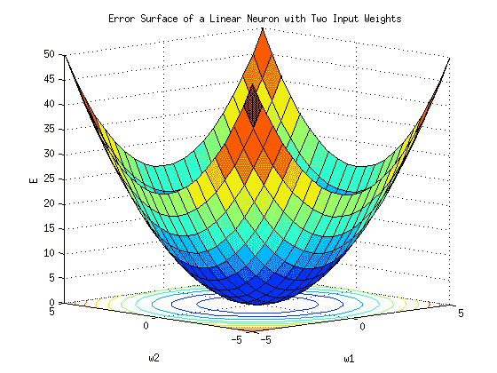

具有两个输入权重的线性神经元的误差表面|图片来自 Wikimedia

但这意味着什么呢？

> 梯度下降有助于找到权重需要改变的程度，以便模型可以最终到达损失最低的点。换句话说，我们说找到了一个最小值。

上面的陈述可以写成如下等式。

**新重量=旧重量——重量的微小变化**

δW 可以代替 W 的一个*小变化。所以更新后的等式是，*

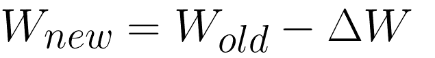

我们如何计算δW？这就是梯度下降的由来。为了更好地理解梯度下降，让我们考虑一个例子。

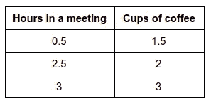

我举了一个线性回归的例子，因为它的数学更简单，但是同样的例子也适用于神经网络。

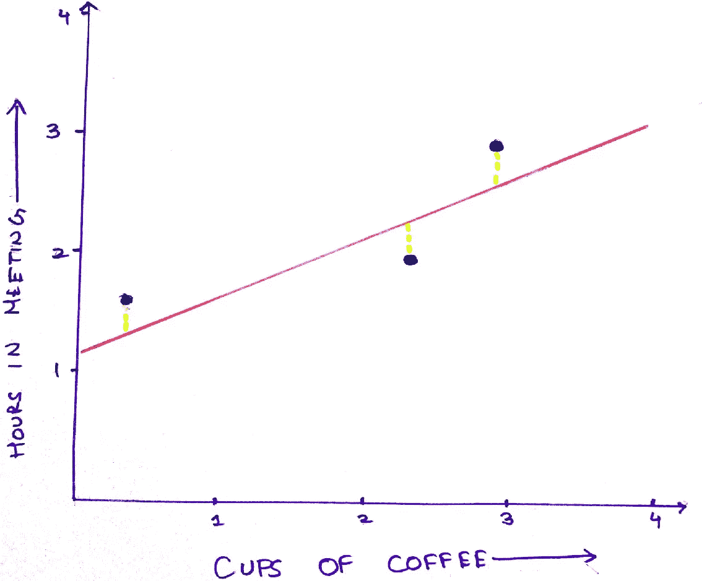

图表 1:作者图片|图表中绘制的示例数据集

正如你在图 1 中看到的，红色的线最符合数据，但是我们是怎么得到这条线的呢？模型是如何知道这条，也只有这条线，最符合数据的呢？

答案是 ***渐变下降*** 。

我们首先选择一个随机截距，或者在公式中， *y = mx + c* ，c 的值。我们可以认为斜率为 0.5。

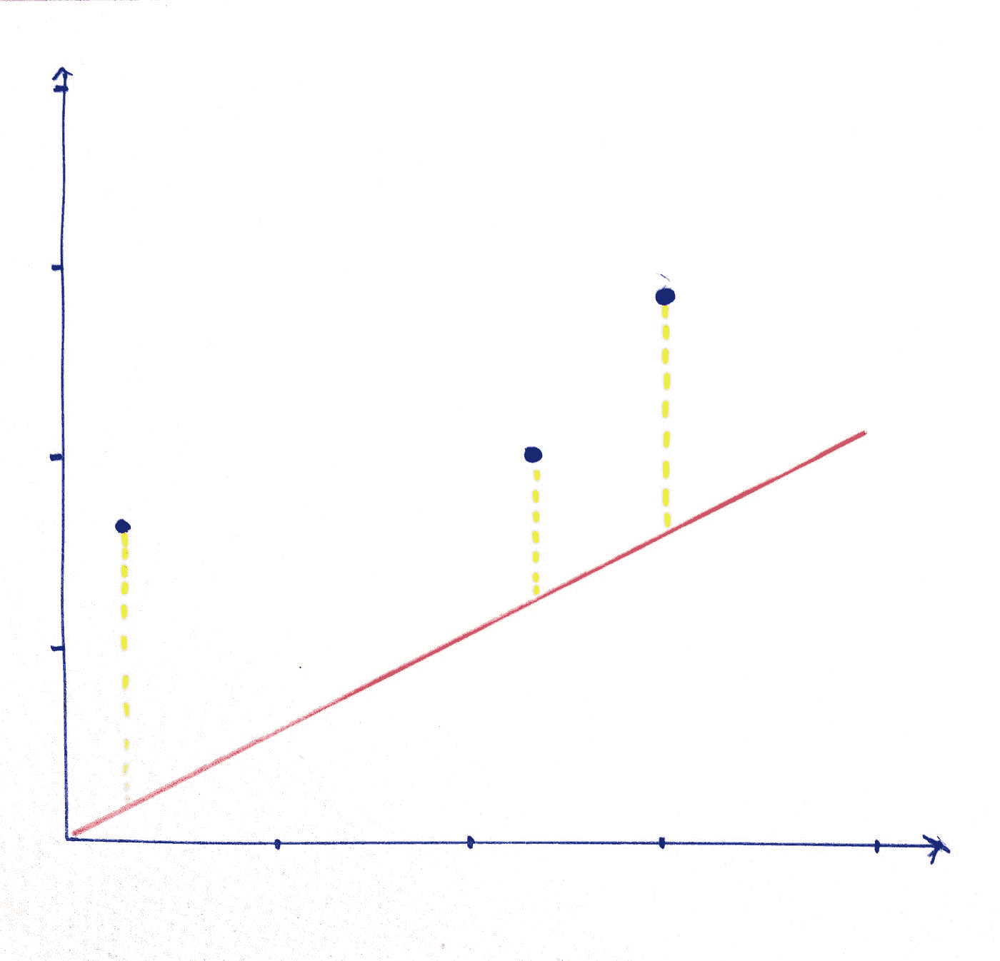

图表 2:作者图片|截距为 0。

对于 c = 0 和数据中的第一行，我们得到 y= 0.5 的预测值。检验图表 2。

我们发现 0.5 和 1.5 之间的差异，实际的 y 值。我们得到 1。如果我们将截距移近集群，比如 c = 0.5，那么损耗为 1。如果我们继续推进截距，我们会得到如第三个图表所示的值。

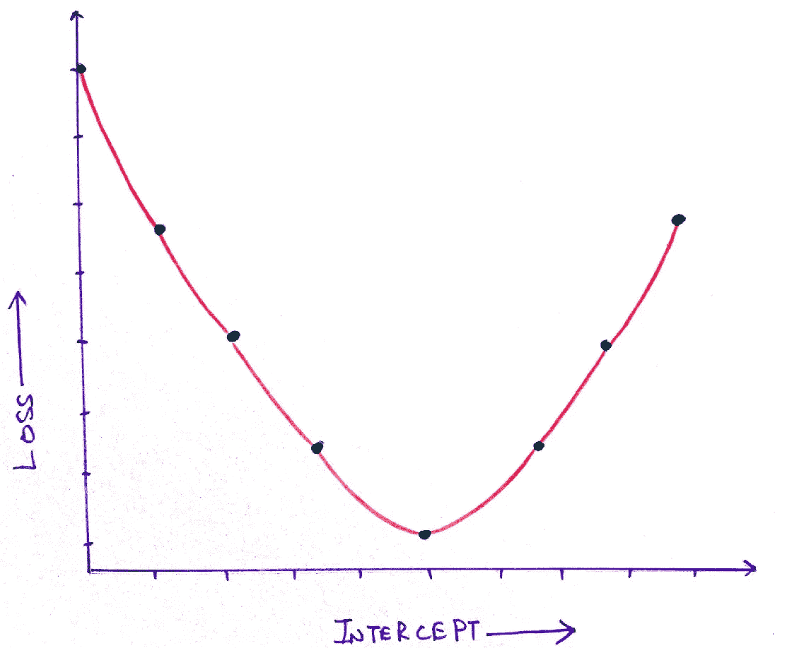

图表 3:作者图片|损失与截距

对于图 3，我们知道当截距为 1 时，损失值最低，也称为最小值。

但是，如果您在可能的截距列表中跳过了这个截距值，会怎么样呢？你怎么知道选择哪个截距值呢？

为了解决这个问题，我们使用了梯度下降法，它根据上图(图 4)的斜率选择梯度值。斜率越陡，截距变化越大，反之亦然。它一直持续到斜率为零。在此之后，我们可以有把握地得出结论，我们已经实现了最小值，并且模型已经实现了最低可能的损失。

寻找梯度下降的方法是利用微分。如果我们对上面的图表进行微分，就可以得到图表的切线，也就是斜率。想了解更多关于微分的知识，可以通过 3b1b 查看这个视频:[梯度下降，神经网络如何学习|第二章，深度学习](https://www.youtube.com/watch?v=IHZwWFHWa-w)。

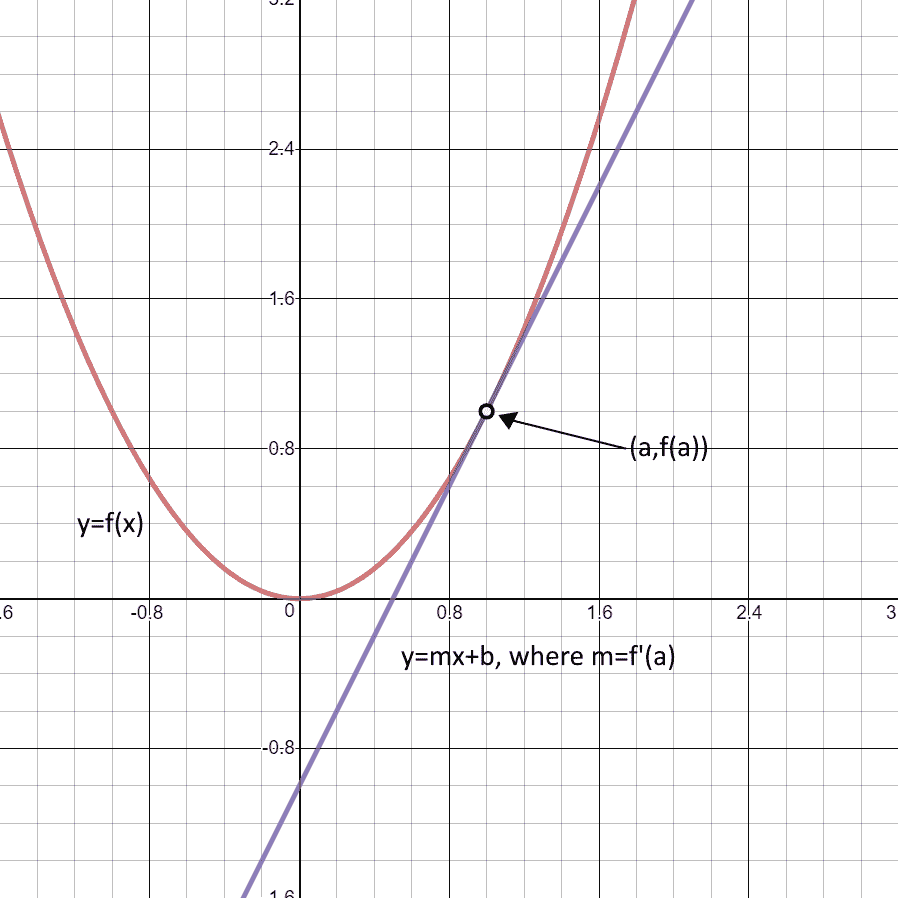

图表 4:抛物线和切线的图表

您还可以设置权重变化量的最大限制，称为学习率。学习率越低，权重变化越小。

因此，我们之前看到的等式，δW，可以更新如下。

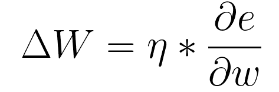

将δW 的值代入上式，我们就得到梯度下降的方程。

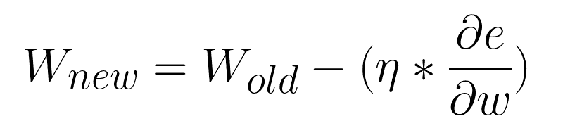

我们现在知道梯度下降是如何计算的了。现在让我们看看传递数据的不同模式。

# 梯度下降的类型

有三种类型。

**批量梯度下降**:通过整个数据集，计算平均损失。这样可以很好地理解整个数据集，但是速度很慢，而且占用大量内存。

下一个最好的东西叫做**小批量梯度下降**。我们定义一个批量，比如说 n，然后随机选择 n 个值，计算这些数据点的成本，并相应地更新权重。*如果 n =行数，那么就变成批量梯度下降。*

因为我们可以控制批量大小，所以它占用的内存更少。然而，由于随机选择的记录可能无法给出整个数据集的最佳概括，因此存在较高的波动性。

**随机梯度下降**是更新权重的另一种方式；每次记录后都会更新权重。它速度快，占用内存少，但易失性高。可能要花很多时间才能收敛到最小值。

上面提到的传递数据的方法没有一个是错误的；我们可以根据您的需要选择任何方法。

# 损失函数

一旦我们有了 Y 的预测值，我们想要检查这个值与原始值有多接近。找出答案最简单的方法是减去它们，得到损失。

这种方法的问题是，如果我们想要平均所有的损失，我们可能会遇到正损失和负损失相互抵消的问题。为了避免这种情况，我们可以使用绝对值，也称为 **L1 损失或平均绝对误差**。

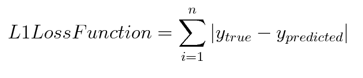

如果我们使用的数据可能有这样的异常值，使用损失的绝对值是有意义的。但是，如果我们的数据被压缩得很紧，情况就不那么好了。如果我们想计算损失，突出紧密包装的数据之间的损失，我们可以平方的差异。

**L2 损失或均方误差**求损失的平方并求平均值。如果我们的数据有异常值，我们就不能使用这种方法，因为异常值会使数据向一个方向倾斜，从而导致模型拟合不佳。

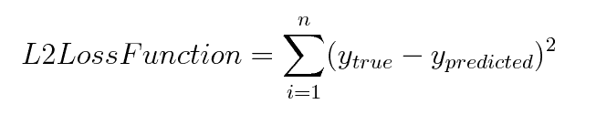

但是，如果您的数据既有离群值又有紧密打包的数据，该怎么办呢？你应该使用哪一个？进来的是**胡贝尔的损失。**

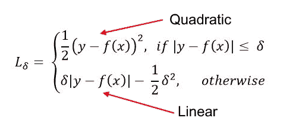

胡伯损失

它充分利用了 L1 和 L2 的损失，完美地拟合了数据。它所做的就是，如果损失比一个值δ更显著，那么它找到绝对损失；否则，它会找到平方损失。

我们讨论的这些损失是针对回归问题的。也就是说，我们的神经网络只有一个输出。如果我们有多个结果，比如在分类问题的情况下，该怎么办？

我们可以使用的函数之一是交叉熵函数。

**交叉熵**听起来可能很复杂，但它本质上是所有类的预期值和预测值的对数的乘积之和。

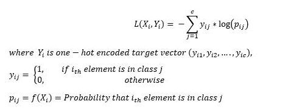

例如，我们有三个类，红色，绿色，蓝色，我们想找到关于实际值的预测值的损失。这种情况下的交叉熵损失为:

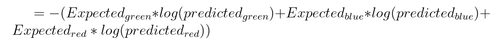

在分类问题中，除了要预测的类别之外的其他类别的期望值为零，因此在这种情况下的交叉熵损失变成

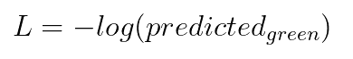

为什么我们用圆木代替正方形？简单的答案是，因为对数惩罚的损失更接近于零，这是我们想要的，而不是在平方的情况下，更接近于 1，这是我们不想要的。

还有很多损失函数。你可以在这里阅读更多关于他们的信息[。](https://www.analyticsvidhya.com/blog/2019/08/detailed-guide-7-loss-functions-machine-learning-python-code/)

# 结论

我们讨论了什么是梯度下降，以及为什么这个方程是这样的。我们还研究了将数据传递给神经网络的各种形式，最后，我们了解了不同的损失函数。我希望这能帮助你理解我们为什么要使用某些方程，以及我们是如何使用它们的。下一篇文章将是关于乐观主义者及其类型的。请保持反馈。让我知道你想让我在接下来的文章中谈论什么。