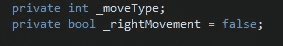
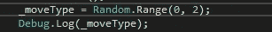
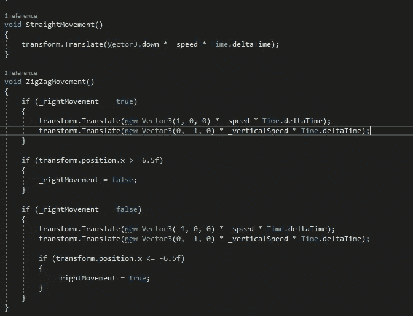
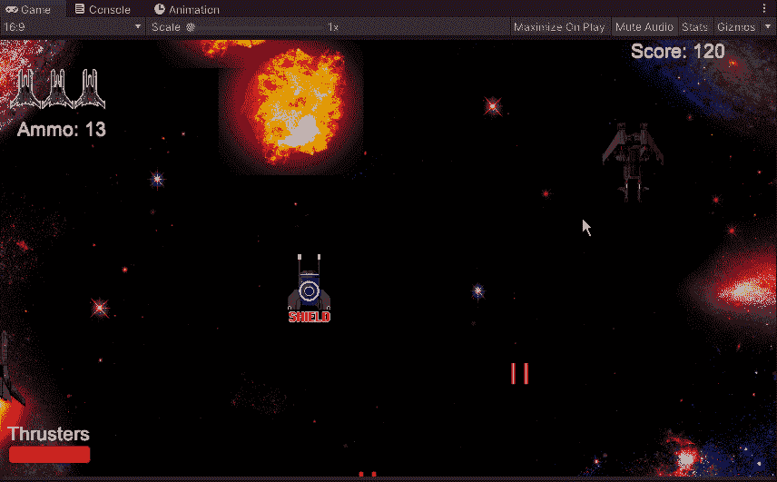
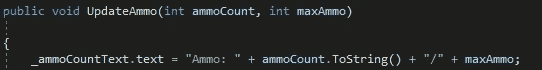
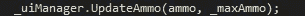
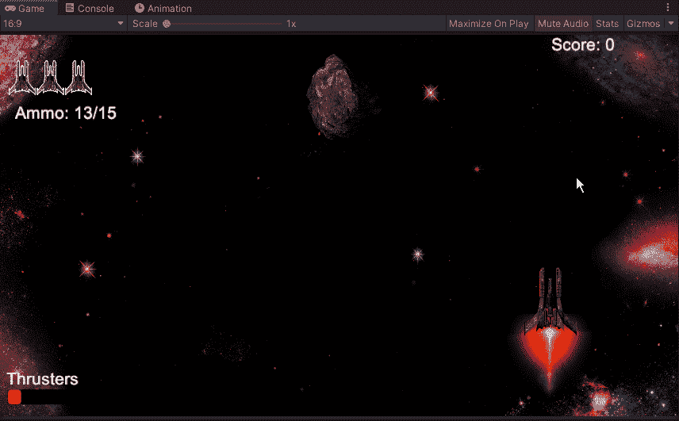

# 新的敌人移动和弹药文本调整

> 原文：<https://medium.com/nerd-for-tech/new-enemy-movements-and-ammo-text-tweak-cb59d1eac78b?source=collection_archive---------16----------------------->

## ***新之字形运动***

为了重新装备我们的敌人，我们将开始给他们一个之字形运动模式。首先，我们需要创建几个新的变量。

在这里，我们可以将我们的 _moveType 分配给一个随机数，用于我们将创建的 switch 语句，以便 unity 从中进行选择。

出于查看的目的，我们将使用 debug.log 进行检查，以确保在调用该号码时获得正确的移动模式。从这里开始，我们将把我们的基本移动模式移动到一个新的空隙中，并为我们的新移动模式创建一个新的之字形空隙:

用我们的之字形模式，我们让 Unity 知道如果我们的敌人单位在任何一边达到 6.5，我们希望它去相反的方向。接下来，我们只是添加这两个新的空白作为我们的敌人移动方法的一部分:

现在所有这些都设置好了，我们可以进入我们的编辑器，看看我们新创建的敌人运动是否发挥作用:

现在我们有了一个新的移动模式，我们可以研究创造一些新的敌人类型。

## ***弹药数微调***

现在对我们的弹药计数器做一个小小的调整，让玩家可以看到他们的最大弹药量

我们所做的是在我们的方法中增加了第二个 int，这样我们就可以调用玩家当时可用的最大弹药。我们将使用这种方法，而不是仅仅使用/15，就好像游戏弹药计数有任何更新一样，它将随着这些变化而改变，而不是必须通过脚本来确保它是正确的。
接下来，我们将进入播放器脚本，添加/调整脚本的一些部分，以包含新的值:

这一行代码我们将包括在我们的 void start 中，以便它显示开始游戏的金额，以及在我们的 fire laser 方法和 powerup pickup 方法中。由于这些都是改变弹药值的不同方法，我们将把它们放在所有的方法中，这样它就能正确地更新。
现在我们已经更新了我们的脚本以包含一个总金额，让我们进入我们的编辑器并检查它是否如预期的那样工作:

