# 游戏开发系列 40

> 原文：<https://medium.com/nerd-for-tech/new-firing-powerup-game-dev-series-40-73b6f6dc684c?source=collection_archive---------19----------------------->

目的:创造一个新的具有稀有产卵率的次级火力。

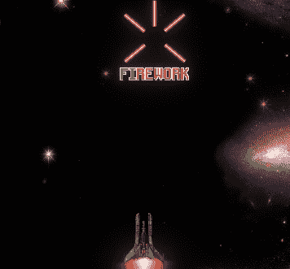

在这篇文章中，我将创建一个新的射击技能，用罕见的产卵率代替三次射击。作为一个新的射击系统，我想在主激光射击 1 秒钟后，用激光穿过 4 个不同的方向，创造一种类似烟花的射击风格。

## 编辑器和激光脚本

创建一个空的游戏对象并给它一个名字，这将在我们发射烟火激光时创建。然后将 4 个激光预制体拖向不同的方向。

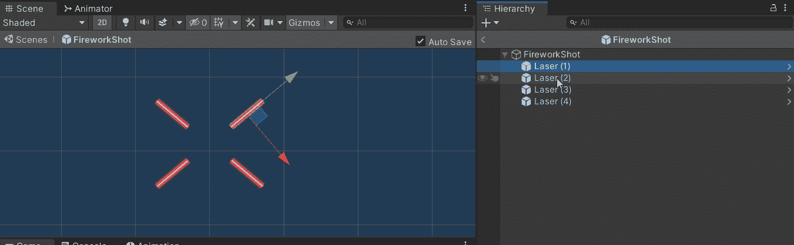

注意航向。因为我们的激光总是“向上”，你应该调整“向上”的方向。

在下一部分之前，我们需要调整激光脚本的销毁方法。到目前为止，当激光与敌人碰撞或 y 轴在屏幕上方时，我们会将其摧毁。由于新的烟花镜头可能不会到达我们屏幕的顶部，如果我们保持这样可能会有问题。
作为我们新的点火装置，我们需要在激光用完屏幕区域时将其摧毁，我们可以使用一种方法来做到这一点。

打开激光脚本，创建**onbecameinsvisible()**。这种方法会在激光器超出边界时自动将其摧毁。

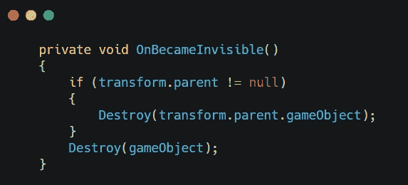

## 玩家脚本

现在我们需要设置当我们发射烟火激光时，它应该做什么的功能。
打开**玩家**脚本，创建一些变量。

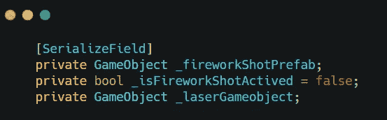

有了这些变量，我们可以在 **ShootLaser()** 中创建另一个 **else if** 。

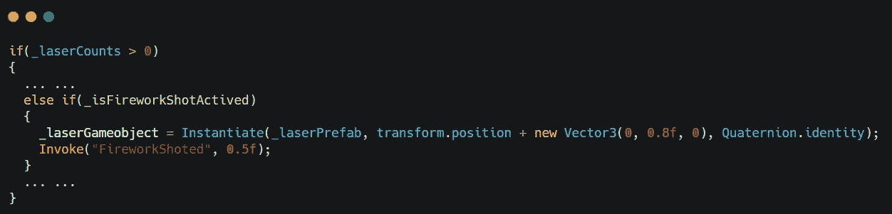

我们创建了一个激光游戏对象来存储我们拍摄的激光预置。这将是烟火产生的位置。同样，我们使用**调用**在激光持续 0.5 秒后发射烟花。
然后创建 **FireworkShoted()** 方法。

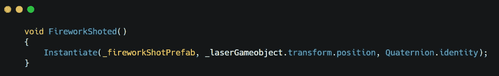

使用这个方法来发射烟火激光，我们需要创建另一个公共方法来激活 bool。

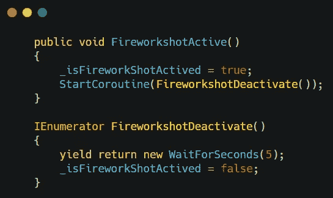

这个带有协程的方法就是我们在通电时要调用的。

**玩家**的脚本现在应该完成了。下一部分是**通电**。

## 通电脚本

启动设置很简单，只需调用我们刚刚用新的启动 ID 创建的方法。

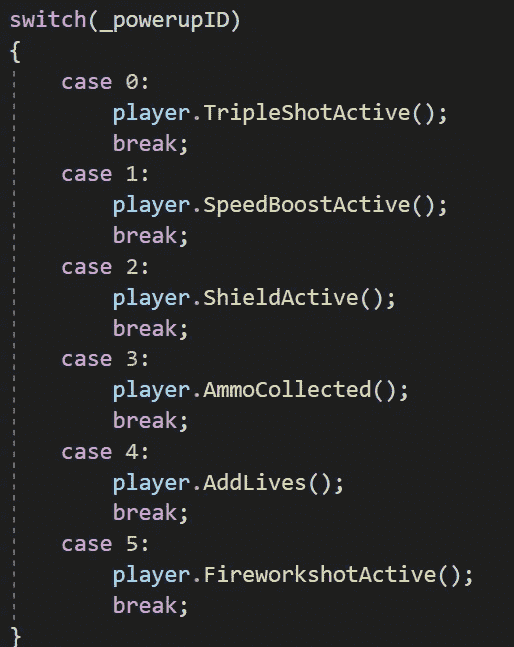

现在我们可以设置“罕见通电”代码。

## SpawnManager 脚本

在 spawn powerup 例程中，我们将创建一个整数变量来计算三重射击产生了多少次。当三重射击产生 3 次时，它将产生一个烟花激光能量。

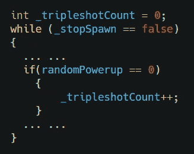

我们还需要改变随机调用的方法。

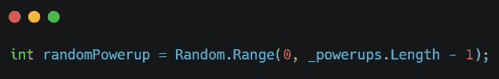

应该是-1，烟花激光那个。

然后我们可以创建一个新的 if 语句来替换原来的派生方法。

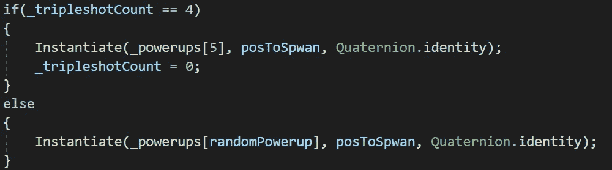

当三枪打到第三次时，第四次就是烟火激光。

当次数达到 3 时，它将产生烟火激光，并将计数清零。

应该就这些了。回到编辑器，拖动所有需要的预设。是时候试玩了。

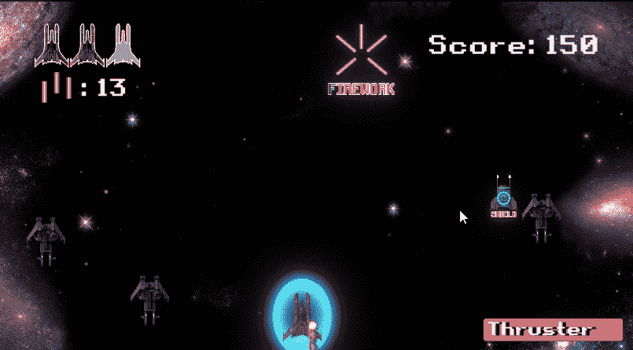

接下来:[最大弹药量限制](https://sj-jason-liu.medium.com/the-maximum-ammo-amount-limit-game-dev-series-41-e7b806ee21c)