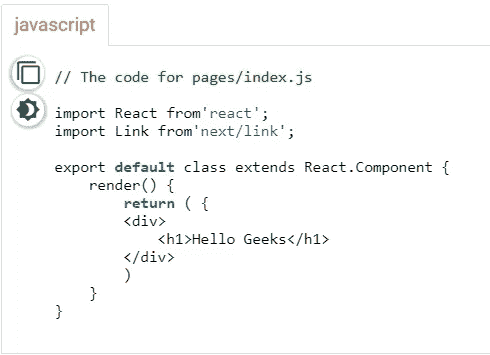
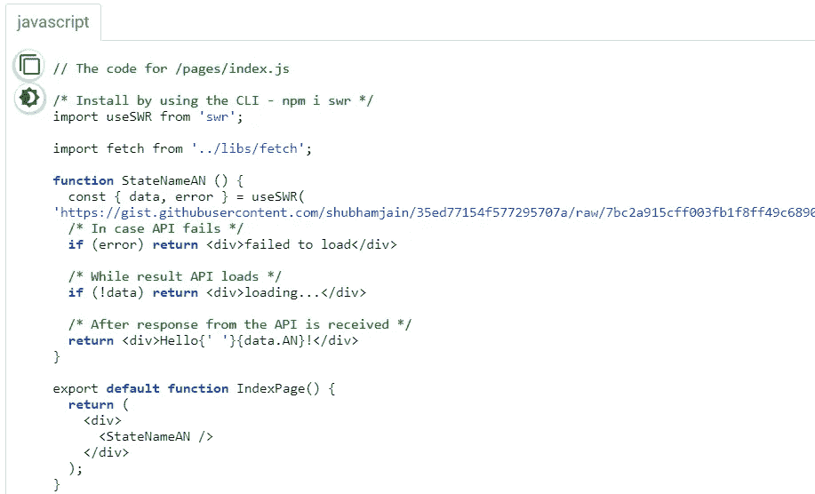
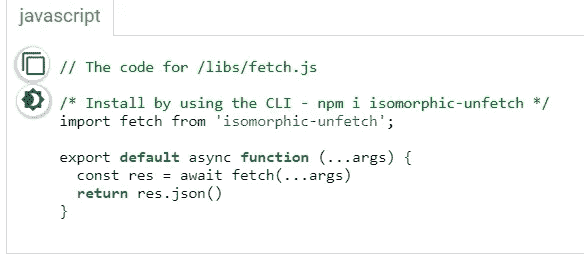

# Next.js | SWR(重新验证时失效)-简介

> 原文：<https://medium.com/nerd-for-tech/next-js-swr-stale-while-revalidate-introduction-de73d243f5b1?source=collection_archive---------0----------------------->


黑暗标志由[https://vercel.com/design/nextjs](https://vercel.com/design/nextjs)

**State While 重新验证**是 React Hooks 库，用于远程数据获取，由 Zeit 创建。它用于:

*   从缓存中返回数据(陈旧)
*   发送获取请求(重新验证)，然后
*   又有了最新的数据。

**谷歌谈论 SWR 的概念:**

> *“它帮助开发人员在即时性(立即加载缓存内容)和新鲜性(确保缓存内容的更新在未来使用)之间取得平衡。如果您维护一个定期更新的第三方 web 服务或库，或者您的第一方资产往往具有较短的生命周期，那么 stale-while-revalidate 可能是对现有缓存策略的一个有用的补充。”*

包含 stale-while-revalidate 的缓存控制响应头也应该包含 max-age，并且通过 max-age 指定的秒数是确定陈旧性的因素。任何比 max-age 新的缓存响应都被认为是新的，而旧的缓存响应是陈旧的。简而言之，只要从缓存中呈现数据，SWR 就会自动从原点重新验证数据，这将使页面呈现速度更快，并且在呈现页面后，数据会更新为最新数据。

**SWR 的优势:**除了自定义 API 调用&Zeit 的 SWR 自带的 REST API 集成如下所述。

*   **焦点重新验证:**当您重新聚焦一个页面或在浏览器中的选项卡之间切换时，SWR 会自动重新验证数据。
*   **快速导航**:一旦缓存中的数据被渲染，SWR 会自动从原点重新验证数据。
*   **间隔**重取:SWR 将为您提供自动提取数据的选项，其中预取将仅发生在与屏幕上的挂钩相关联的组件上。
*   **局部突变**:将变化应用于局部数据，即总是更新到最新数据。
*   **依赖获取** : SWR 允许你获取依赖于其他数据的数据。它确保了最大可能的并行性(避免瀑布)，以及在下一次数据提取需要动态数据时的串行提取。
*   可扩展的 : SWR 的可扩展性非常好，因为它只需要很少的努力就可以编写应用程序，自动并最终汇聚到最新的远程数据。

**SWR 的缺点:**

*   使用 SWR 的一个主要缺点是，它可能会导致用户查看陈旧的数据，这可能是因为缺少 API 的正确实现、更新显示信息时的错误以及其他许多原因造成的。
*   除了创造糟糕的用户体验，这也可能是一个公司遭受挫折的唯一原因！想象一下，一家在金融领域声誉卓著的公司，他们能让用户查看陈旧的数据吗？？不，这就是为什么需要准确实现和使用 SWR 的原因。

**next . js 简介:**

Next.js 是一个基于 react 的框架。这是基于 react，W**ebpack**通天塔。它以自动代码分割、热代码重载(即一旦保存了更改就重载)&而闻名，最重要的是服务器端渲染。这将该框架置于 React 文档中推荐的工具链之上。

假设一个人的设备上安装了 node & npm，我们已经采取了步骤来设置您的 **next.js** 项目。

**步骤 1:** 通过运行以下命令检查节点& npm 版本

*   $node -v && npm -v

**步骤 2:** 创建一个目录，并在终端中到达目标目录后执行

*   $ npm 安装—保存下一个反应反应对象

**第三步:**在 pages 文件夹的 **index.js** 中创建一个文件(基本上是 pages/index.js)，添加下面的代码，运行 npm start 来看看它的作用！



**使用 Next.js 和 SWR 获取 API:**

我们将使用强大的 **Next.js** 、需要安装的两个依赖项(代码中给出的命令)使用 SWR &同构取消提取来执行数据提取。



**输出:**

```
Hello Andaman and Nicobar Islands!
```

不断获取越来越多的信息！这就是我现在所拥有的。希望这有所帮助！