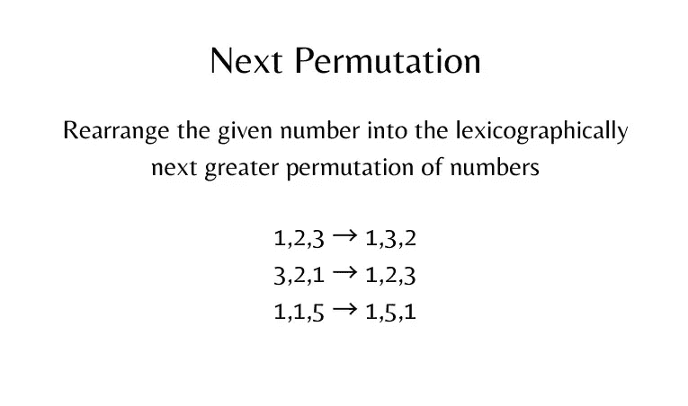

# 下一个排列

> 原文：<https://medium.com/nerd-for-tech/next-permutation-7e7276cca95?source=collection_archive---------1----------------------->

**(LeetCode : Medium)**



实现 **next permutation** ，将数字重新排列成按字典顺序排列的下一个更大的数字。

如果这样的安排是不可能的，它必须重新安排它作为最低可能的顺序(即，按升序排序)。

替换必须是 [**到位**](http://en.wikipedia.org/wiki/In-place_algorithm) 并且只使用常量额外内存。

**例 1:**

```
**Input:** nums = [1,2,3]
**Output:** [1,3,2]
```

**例 2:**

```
**Input:** nums = [3,2,1]
**Output:** [1,2,3]
```

**例 3:**

```
**Input:** nums = [1,1,5]
**Output:** [1,5,1]
```

**例 4:**

```
**Input:** nums = [1]
**Output:** [1]
```

**约束:**

*   `1 <= nums.length <= 100`
*   `0 <= nums[i] <= 100`

```
**class Solution {
public:
    void nextPermutation(vector<int>& nums) {
        int n = nums.size(), k, l;
        for(k = n-2 ; k>=0 ; k--){
            if(nums[k]<nums[k+1]){
                break;
            }
        }
        if(k<0){
            reverse(nums.begin(), nums.end());
        }else{
            for(l = n-1 ; l>k ; l--){
                if(nums[l] > nums[k]){
                    break;
                }
            }
            swap(nums[k], nums[l]);
            reverse(nums.begin()+k+1, nums.end());
        }
    }
};**To get the intution behind the logic let us first dry run a input and see how it works :nums = [1,2,3]
n = 3 ,  k = 1
nums[1] = 2 and nums[2] = 3 , 2 < 3
so now it exits k = 1 and 1 > 0 
l = 2 
nums[1] = 2 and nums[2] = 3
so nums[l] < nums[k] 
so swap them , nums = [1,3,2]
Now reverse(nums.begin()+1+1,nums.end())
nums = [1,3,2] which is the required answer. 
```

这个逻辑背后的基本原理如下。我在 leetcode 上找到了这个，它给出了一个清晰准确的解释。我在此附上更多的资源，以便你更好地理解和清楚。

1.  [https://leet code . com/problems/next-permutation/discuse/1448059/C % 2B % 2B-或-有解释的解决方案-或-对初学者来说很容易](https://leetcode.com/problems/next-permutation/discuss/1448059/C%2B%2B-or-Solution-with-explanation-or-Easy-for-beginners)
2.  [https://leetcode.com/problems/next-permutation/](https://leetcode.com/problems/next-permutation/)
3.  [https://www.youtube.com/watch?v=LuLCLgMElus&list = plguwdvibif 0 RPG 3 ictpu 74 ywbq 1 cabk 2&index = 11](https://www.youtube.com/watch?v=LuLCLgMElus&list=PLgUwDviBIf0rPG3Ictpu74YWBQ1CaBkm2&index=11)
4.  [https://docs . Google . com/document/d/1 sm 92 efk 8 odl 8 nyvw 8 nhpnbgexts 9 w-1 gmteyfeurlwq/edit](https://docs.google.com/document/d/1SM92efk8oDl8nyVw8NHPnbGexTS9W-1gmTEYfEurLWQ/edit)

直到那时，继续编码&继续学习！敬请关注更多内容💻🙌

既然你喜欢看我的博客，为什么不请我喝杯咖啡，支持我的工作呢！！[https://www.buymeacoffee.com/sukanyabharati](https://www.buymeacoffee.com/sukanyabharati)☕