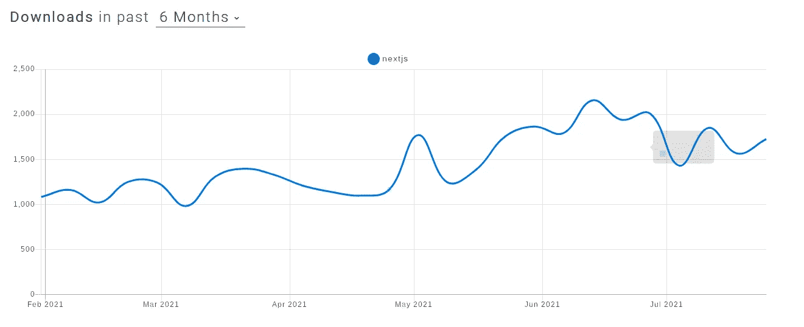

# Next.js:为什么要用？[2023 年更新]

> 原文：<https://medium.com/nerd-for-tech/nextjs-why-use-it-56946b6fc225?source=collection_archive---------19----------------------->

如果你工作、学习，或者对前端的世界感到好奇；在过去的几个月里，你一定听说了很多关于 **Next.js** 的事情。我猜你在想，这只是另一个*炒作*？这项技术会在一个月后消亡吗？你可能还不知道为什么有人在用。

在这篇文章中，我将在接下来的 **中介绍使用 [**的优点。js** 在开发你的项目中，以及它如何超越 React。](https://nextjs.org/)**

# 社区利益

分析 [npm trends](https://www.npmtrends.com/) 的下载图，我们可以看到在过去的 6 个月里，有大量的人对 NextJS 感兴趣。

NPM-趋势

这种日益增长的兴趣不是没有意义的；它的出现是因为 NextJS 提供了关于整个 **JavaScript** 生态系统的解决方案，主要是通过原生解决 **ReactJS** 的一些已知问题。

# 反应页面加载时间

关于**客户端**架构或直译客户端，一旦我们加载内容，我们必须等待包含所有 JavaScript 或**捆绑包**的包，因为已知要加载，然后才能确定在页面上显示什么。这使得充电时间更长，最终成为使用旧移动设备和弱连接的人的一个问题。

另一个问题是搜索引擎(SEO)，它仍然很难索引客户端 JavaScript 应用程序，因为实际内容嵌入在生成的**包**中的某个地方。还有，**搜索引擎**准备获取 HTML 在许多情况下，内容甚至不存在，因为它只是在调用后端后才呈现，所以在这种情况下，您的 SEO 是不存在的。

而 [NextJS](https://github.com/vercel/next.js) 是如何处理这些点的呢？

# 服务器端渲染— SSR

当人们意识到在客户端放置过多的 JavaScript 代码是一个问题时，他们想到了在服务器端呈现代码的替代方法。于是 **NextJS** 来了 **about，**一个在 ReactJS 之上创建的框架，使用服务器端渲染**，**俗称 SSR。

访问网站时，SSR 的工作方式如下:我们向服务器发送一个访问网站主页的请求，然后服务器向一个 **rest API 发送一个请求，例如**、*abc.com*请求这个初始页面。一旦接收到数据，服务器**呈现一个包含内容的 HTML 页面**并发送给客户端，从而在页面上显示内容；如果此人进入另一条路线，例如*abc.com/blog,*，流程保持不变。

使用 **SSR** 概念，我们可以用 React 继续开发它。访问我们网站的人会得到一个简单的 HTML 文档，这极大地提高了性能。

不仅如此，NextJS 还有其他优点！

# 静态生成—静态站点生成— SSG

NextJS 还使创建静态网站成为可能，静态网站是那些与用户没有太多交互的网站，在界面上很少或没有变化，例如，将在广播中播放一周的产品销售页面。

因此，在这种情况下，我们将拥有所有静态内容和一个用于从对产品感兴趣的人那里收集数据的表单；这种形式确实需要互动。为此，在[next js 文档](https://nextjs.org/docs/basic-features/pages)中，指出了该函数的用法。`getStaticProps`。

除了 SSR 和 SSG 选项，NextJS 的另一个优势是易于配置。

# NextJS 给我提供了什么配置？

默认情况下，NextJS 自带优化设置， **Vercel 的人**一直在更新这些设置，以改善开发体验。

例如，NextJS 支持所有现成的现代浏览器和 IE11。它支持**代码分割**，在处理路由时，它将所有 JavaScript 文件组合在一个包中，我们只是加载该页面上使用的 JavaScript。

它已经带有应用程序的**热重新加载**，只更新已经改变的文件，而不会丢失应用程序的状态。当谈到 ReactJS 应用程序时，在某些情况下，我们可能需要退出 create react 应用程序，以便在应用程序中没有未使用的依赖项，并进行一些优化。

`create-next-app`用于创建 NextJS 应用程序，是对`cra`的优化替代，因为它已经为我们抽象了所有这部分，我们不需要担心 babel、webpack 和其他需要在 ReactJS 中优化应用程序的设置。

除了这些配置优势，NextJS 在开发体验方面还有几个优势。

# 动态导入

假设你有一个博客，里面有几篇文章。当一个人进来阅读时，他们需要访问路径，我们希望尽快显示该路径的内容，所以您选择 SSG。`[site.com/novidades/next](http://site.com/novidades/next)`

但是有可能你不想一次创建所有的静态页面，因为那会花费太长的时间，或者你不想要一个永远完全静态的页面；这就是动态导入的强大之处。

NextJS 将获取特定的 URL，并将其保存为静态页面，每当有人访问该路径时，它将静态地提供服务，同时，它将动态地接受新的路径。此外，如果有任何变化，我们可以用 revalidate 参数在后台指定静态页面每 X 秒更新一次！

# 图像优化

优化图像并生成不同大小的图像，以获得不同尺寸的高质量图像而不失真，这是所有前端工作人员已经经历过或将经历的工作。但是 NextJS 没有让我们失望，它提供了一个图像组件:

这将连接到 vercel 的图像优化器，为我们做这整个工作。

# JS 中的 CSS

NextJS 非常关注开发者的体验，所以在风格方面，它支持 CSS、Saas 和 JS 库中一些最著名的 CSS，如 [Tailwind CSS](https://github.com/vercel/next.js/tree/canary/examples/with-tailwindcss) 和 Styled Components。

选择哪一个最适合您的项目取决于您。

# 韦尔塞尔生态系统

公司 [**Vercel**](https://vercel.com/new) 负责 NextJS，除了框架之外，它还构建了一个完整的生态系统，因此构建和部署项目的**过程很简单。通过集成 vercel，您可以获得一些功能，比如我们制作的每个部署分支的预览链接。**

# 国际化

默认情况下，NextJS 提供了对应用程序国际化的支持，在这种情况下，您可以使用根据用户导航的路线以不同语言显示内容的策略。

[在下一篇文档](https://nextjs.org/docs/advanced-features/i18n-routing)中，我们有一个使用上述配置的例子。