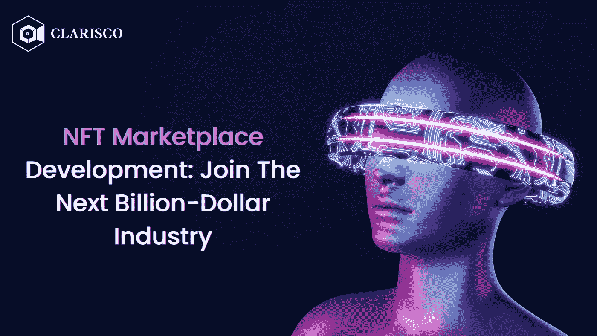

# NFT 市场发展:加入下一个十亿美元产业

> 原文：<https://medium.com/nerd-for-tech/nft-marketplace-development-join-the-next-billion-dollar-industry-655d74c96329?source=collection_archive---------5----------------------->

NFT 市场发展:加入下一个十亿美元产业

NFT 收藏品和 NFT 硬币的价值在过去六个月里直线下降，促使许多 NFT 买家放弃市场。然而，NFT 市场的收入创下历史新高。根据 CryptoPresales.com 发布的数据，预计到 2022 年底，NFT 市场的收入将达到 25 亿美元，同比大幅增长 60%。通过在隐秘的熊市中幸存下来，NFT 市场证明了自己是可靠的投资。

许多领先的公司甚至已经开始将资金投入到 NFT 市场发展中。

几周前，社交媒体巨头 Twitter 宣布，它已经与四家领先的 NFT 市场合作，允许其用户通过 tweets 直接购买、出售和展示他们的 NFT。said 的主要目标是在扩展和改善用户的 Twitter 体验的同时，增强用户的能力。此外，这将有助于开发创新和时尚的系列，同时也促进了 NFT 的销售。有了世界一流的公司和专家，人们可以相信非技术产业将会继续存在！

**NFTs:数字世界的革命**

不可替代的代币(NFT)已经迅速发展成为关于资产的最广泛的讨论或博客之一。它们是数字资产，可以包括各种物品，如游戏中的物品和卡片、音频、电影和艺术品，并且它们是不可替代的，这意味着它们不能兑换成等值的另一种货币，如加密货币和法定货币。NFTs 使持有者能够证明对数字文件或资产的保管，这些文件或资产以后可以出售。收藏家、交易商和银行家都希望利用这些 NFT 来分散投资，他们都在网上这样做。他们甚至通过与 **NFT 市场开发公司**合作，推出了自己的 NFT 市场。

非金融交易彻底改变了全球金融和投资的形象，许多人认为它们也为未来金融设定了标准。他们已经改变了大公司和企业与他们的顾客和客户打交道的方式，引入了新产品、新项目以及与他们交流和互动的方式。就像加密货币的出现有很多热情和一些模糊性一样，非金融交易的兴起让国际金融机构和市场措手不及，这可能表明人们有意从传统金融模式转向数字领域。

**NFT 市场——通向数字世界的大门**

尽管自加密市场崩溃以来，投资者对 NFTs 的信任一直在减少，但 Statista 的研究发现，在 NFT 市场交易的个人数量正在增加。2020 年，NFT 市场约有 67 万用户。自那以来，他们的数量增长了 65 倍，在 2022 年达到 4420 万。这证明了企业和企业家相信 NFTs 的潜力，并准备投资于 **NFT 市场发展**！NFT 市场旨在成为个人买卖不可替代代币(NFT)的媒介。

个人也可以把他们的 NFT 拍卖或投标，在某些情况下，用户可以通过市场制造 NFT。通俗地说，如果是数字资产而不是消费品，NFT 市场就相当于亚马逊。NFT 市场中最常见的一种是通用的、面向艺术的平台；但是，针对特定资产类别的较小的、独特的 NFT 市场也存在。这将包括体育市场、音乐市场和许多其他利基市场，这些市场宣传自己不仅是交换数字商品的网站，也是加入志同道合的个人社区的网站！

**NFT 市场是如何运作的？**

在从客户端深入研究 NFT 市场如何运作之前，理解它是如何构建的是至关重要的。所有 NFT 市场的工作流程通常都是一样的。用户必须首先注册 NFT 市场平台，并安装一个数字钱包，以存储非功能性交易。希望展示自己作品的用户可以上传物品来列出他们的资产。用户还可以设置费用，并选择他们希望收到的支付令牌(如果平台允许的话)。

NFT 必须随后可以在市场上购买。用户可以在拍卖中出价和以固定价格购买之间进行选择。当用户出售任何东西时，都会在他们的钱包中生成一个交易，触发一个私人交易智能合约。这个合同被每一个管理、监督和允许买卖双方交易的 NFT 市场所使用。这些智能合同确保任何特定 NFT 的所有者在宇宙中是唯一的。

**推出你自己的 NFT 市场——创造巨额收入的秘密**

因为不可替代的代币行业充满了充满希望的机会，**开发一个 NFT 市场**是一个快速致富的想法。已经有很多 NFT 市场，因此这个领域可能会相当有竞争力。然而，有了合格的人才，你可以创建一个独一无二的、低成本的 NFT 平台，并在瞬间吸引新的消费者！但是现在的问题是 NFT 市场的所有者是如何赚到这么多钱的。让我们更深入地了解一下。NFT 行业可能相当新，但毫无疑问，它正在处理巨额现金。根据最近的一份报告，NFT 市场比纽约证券交易所和纳斯达克等传统知名证券交易所赚得更多。

问题是，NFT 市场的所有者如何在这个过程中赚钱？与普通市场类似，NFT 市场通过收取交易费来创收。当你考虑交易的数量时，你会立即意识到 NFT 市场是多么有利可图。除了交易费，NFT 市场还有许多其他的赚钱方式。NFT 市场上的上市费、铸造费、招标费、私人销售和联盟计划让他们可以毫不费力地创造收入。**启动您的 NFT 市场**，立即享受源源不断的优惠！

**你如何发展 NFT 市场？**

您知道您可以在短短几周内创建并部署自己的 NFT 市场吗？是的，你没看错。 [**白标 NFT 市场开发**](https://www.clarisco.com/white-label-nft-marketplace-development) 和 **NFT 市场克隆脚本**是现成的解决方案，可以快速调整和启动(最快 48 小时)。白标 NFT 市场解决方案是知名 NFT 市场的预制版本，如 Rarible 和 OpenSea，由一家公司构建，由另一家公司以该公司的独特品牌进行营销。NFT 市场克隆脚本是著名的 NFT 市场的现成复制品，可以根据客户的独特要求进行修改，并在短短 48 小时内推出！

**要点:NFT 市场是这个数字世界的下一个大事件！**

根据最近的 Statista 调查，NFT 市场在 2020 年创造了约 1600 万美元的收入。这一数额在一年内增长了 15000%，2021 年达到 15.7 亿美元。虽然 2022 年增长放缓，但收入同比增长 60%，达到 25.2 亿美元。这些数字表明，NFT 市场将是下一个重要市场。谁不想投资自己的未来呢？作为买家，你需要做的就是找到一家值得信赖的 [**NFT 市场开发公司**](https://www.clarisco.com/nft-marketplace-development) ，它提供无错误、功能齐全的白标解决方案和克隆脚本。

如果你幸运的话，这些公司甚至可能准备从零开始开发 NFT 市场。在签署任何协议之前，确保你和 T4 NFT 市场发展公司彻底讨论了你的需求。当你有一个之前已经尝试过的、基于成功平台的现成解决方案时，你就不必担心平台最终在市场上的成功。在这种情况下，成功是必然的！