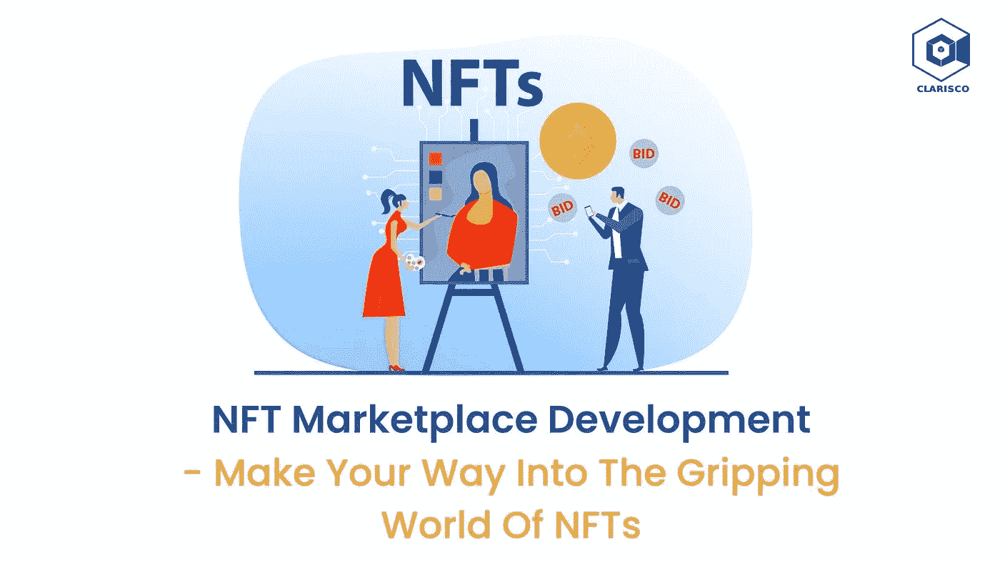

# NFT 市场发展——走进扣人心弦的 NFTs 世界

> 原文：<https://medium.com/nerd-for-tech/nft-marketplace-development-make-your-way-into-the-gripping-world-of-nfts-b399affd0612?source=collection_archive---------7----------------------->

NFT 市场发展——走进扣人心弦的 NFTs 世界

尽管 NFT 从 2014 年就已经存在，但直到 2021 年底才开始流行。像肖恩·蒙德兹和阿姆这样的名人开始融入 NFT 热，这样他们就可以用一种全新的方式与他们的粉丝互动。但是，这种想成为 NFT 世界一部分的执念背后的原因是什么呢？嗯，这很简单。NFT 是独一无二的，人们希望拥有原创物品。NFT 越来越受欢迎，因为人们认为它们比它们所代表的数字事物更有价值。这反过来又引起了多米诺骨牌效应，鼓励企业投资 NFT 市场发展。

尽管最近几个月有些不稳定，行业专家报告说 NFT 的采用率仍然令人鼓舞。这表明该行业仍有发展空间，并且有新的投资机会，NFT 市场就是其中之一。有如此多的低成本选择来建设和**推出 NFT 市场**，甚至企业家和组织都在蜂拥而入。NFTs 为接触新受众提供了一种独特且具有成本效益的方法，当与正确的平台相结合时，它们可以成为营销和品牌识别的巨大工具。

# **NFT 市场——你通往 NFT 世界的门票**

NFT 市场使数字收藏家能够购买、销售和生产自己的代币来代表独特的有形和无形物品。这些市场对于 NFTs 就像亚马逊和易贝对于大宗商品一样。NFT 市场让公司和创作者都能开发出新的工作货币化方法。例如，一个艺术家可能出售他们作品的 NFT，而一个音乐家可能出售他们歌曲的 NFT。这将使他们能够以不同于以往的方式将他们的材料货币化。随着领先的组织与 NFT 市场发展公司合作推出他们自己的 NFT 平台，不用说，NFT 市场是这个时代皇冠上的明珠！

# **NFT 市场有多大？**

不可替代代币(NFT)市场预计在 2020 年价值 2.32 亿美元。然后在 2021 年估值 220 亿美元，涨幅显著。这种上升趋势可能会继续，因为它在收藏品交易中的吸引力越来越大，以及分散融资(DeFi)的相关性越来越大。根据 Technavio 最新的行业分析，全球不可替代令牌(NFT)市场预计将在 2021 年至 2026 年间增长 1，472.4 亿美元。在预测期内，APAC 将占市场增长的 43%。就不可替代代币而言，新加坡、中国和菲律宾是 APAC 最重要的市场(NFT)。

根据咨询公司和全球研究公司 VMR(验证市场研究)的一份报告，预计到 2030 年，NFT 工业的几乎全部价值将攀升至 2310 亿美元。包括音乐、电影和体育在内的众多部门和各行各业的非功能性传播是需求的主要驱动力。有了这些令人难以置信的统计数据，有一件事是清楚的。非功能性交易会一直存在，NFT 市场也是如此。那么，你还在等什么？是时候与一家 **NFT 市场开发公司**合作了，今天就启动你自己的 NFT 市场吧！

# **NFT 市场是如何运作的？**

在投资**开发 NFT 市场**之前，了解他们如何从客户端工作是至关重要的。典型的工作流程通常在所有 NFT 市场平台上都是相同的。为了存储 NFTs，用户首先必须在 NFT 市场平台上注册，并安装一个加密钱包。如果平台允许，用户可以通过上传物品并指定他们希望收到的支付令牌以及费用来列出他们的资产。一旦这些商品开始销售，其他用户就可以在市场上浏览和购买它们。

用户可以选择在拍卖中出价或以固定价格购买。当用户出售任何东西时，都会生成一个交易，触发一个私人交易智能合约。这个合同被每一个管理、监督和允许买卖双方交易的 NFT 市场所使用。这些智能合同保证任何特定 NFT 的所有者在整个宇宙中是唯一的。很有趣，对吧？但你有没有想过这些 NFT 市场是如何产生收入的？让我们来看看。

# **建立一个你可以从中获利的 NFT 市场**

越来越受欢迎的非功能性交易产生了对定制 NFT 市场的需求。许多企业和初创公司正在逐步使用特定于企业的 NFT 市场。一个功能丰富的 NFT 市场个性化的需求将确保稳定的资金来源。但是，NFT 市场发展从哪里开始呢？建立 NFT 市场有三种基本方法。其中包括:

1.  从零开始创建 NFT 市场
2.  利用 NFT 市场的克隆脚本
3.  使用白标 NFT 市场解决方案

如果你选择方案 1，即自下而上建立一个 NFT 市场，请记住，这个过程不仅耗时，还需要大量的资源，包括时间和金钱。你还需要一家声誉良好的 **NFT 市场开发公司**的帮助，以保证 NFT 平台没有错误，并为全球成功做好准备。

如果你想马上创建一个 NFT 市场，选项 2 和 3 是很好的选择。这是因为这两种选择都要求最少的工作，并允许您在几天内建立您的 NFT 市场。一个 [**白色标签的 NFT 市场**](https://www.clarisco.com/white-label-nft-marketplace-development) 是一个预先构建的、经过仔细测试的解决方案，可以作为你自己的产品提供，而一个 **NFT 市场的克隆脚本**是一个预先制作的、随时可以推出的 NFT 知名市场的克隆，例如 Rarible，它已经在全球证明了自己。这两种选择都允许您根据自己独特的业务需求定制预构建的解决方案。无论你选择哪种方法，与一家顶级的 NFT 市场开发公司合作是至关重要的。

# **利用 NFT 市场赚钱**

NFT 市场以多种方式创收，这取决于市场及其独特的创收战略。这里有一些 NFT 市场最典型的赚钱方法。

**1。交易费用**

每个 NFT 市场平台都通过交易费赚钱，其中大多数是通过向买家收取总交易额的一定比例——通常在 2%到 5%之间——来实现的。例如，在线市场 OpenSea 向购买者收取整个交易价值的 2.5%作为交易费。

**2。版税收入**

许多市场，如 Nifty Gateway，通过版税创收。当二级客户出售他们的 NFT 时，原创艺术家从销售中获利，市场也从中获利。这种转售模式使得艺术家们能够从他们的作品中获利，即使这些作品已经被出售过一次。

**3。上市费用**

艺术家除了交易之外还应该支付汽油费，才能在任何给定的 NFT 市场上列出 NFT。这就是市场的所有者从创造者那里获益的方式。大多数 NFT 平台要求从他们的市场中列出、铸造或删除一个 NFT 需要付费。区块链交易的需求和时机影响着天然气费用。

# **收尾思路**

随着 NFTs 市场每天都在增长，并在收入方面打破新纪录，毫无疑问，NFT 市场将被证明是一个令人难以置信的有利可图的努力——只要你有可靠的 [**NFT 市场发展公司**](https://www.clarisco.com/nft-marketplace-development) 提供的所有必要支持，就能让它起步。如果你对创建自己的 NFT 市场感兴趣，现在正是时候。那么，你准备好投入未来了吗？