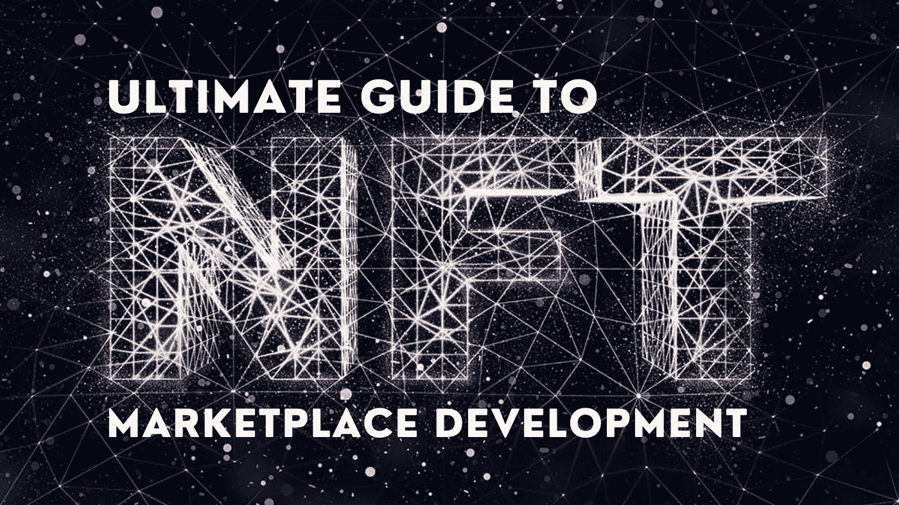

# NFT 市场发展——终极指南

> 原文：<https://medium.com/nerd-for-tech/nft-marketplace-development-the-ultimate-guide-9cb9256a998c?source=collection_archive---------5----------------------->

NFT 市场是作曲家和音乐家等艺术家的绝佳平台。不可替代的代币在艺术和游戏中的重要性不容忽视。随着增强现实或虚拟现实的集成，许多服务现在都是可能的。这鼓励了创新技术解决方案的产生。

**NFT 市场**提供了展示个人知识分子和创意收藏品的独特机会，并展示这些物品以促进数字资产的有效处理。

这篇文章将提供非常规的信息，你需要开始一个 NFT 平台。

无论您是该领域的新手，还是打算使用 NFT 平台销售/购买资产，或者作为一种商业工具，我们都有详细的指南。

## **什么是 NFT？**

NFT 代表**不可替代的标志**。不可替换的令牌是通过其原始识别码和元数据而彼此不同的数字资产。这是不可能的交易或交换一个等价的单位。NFT 可以是照片、曲目、视频、应用程序以及游戏和其他艺术作品。

## **NFT 特有的属性**

每个令牌都是独一无二的数字资产。它有许多特点。

这些是 NFT 代币的具体属性

*   **不可分割**。不可能把这些代币分成小面额的。
*   **真实性**。每个不可替换的令牌都是唯一的，并且属于某个人。很容易验证。
*   **非互操作性。**NFT 永远不会彼此相等。因此，很难将它们与 BTC 或 ETH 等流行的加密货币进行兑换。
*   **可交易性**。NFT 代币可以在许多加密货币交易所交易。可能性几乎是无限的。
*   **与多个生态系统的相互作用。**通过使用几个标准(ERC 1155 和 721)，有可能生成可用作数字收藏品的不可替换的代币。
*   **流动性**。非功能性交易可以不间断地进行。因此，它们的流动性很高。这些代币可能会引起广大客户的兴趣。
*   **可编程性**。不可替代物是复杂的机械，需要锻造、加工或生成。在这个领域有许多变化和可能性。这个利基市场非常适合创意。
*   **稀缺**。在一个程序启动后，有可能强制执行某些不能通过编程改变的特性。

每个不可替换的令牌都是包含一组唯一元数据的原始数字资产。很多收藏者可以通过将商品令牌化的方式加入电商。NFT 市场可以作为普通商店或拍卖平台。

取一些样品以便更好地了解。以下是一些最著名的 NFT 例子:

*   原始数字作品
*   数字收藏品
*   游戏中的物品
*   领域
*   音乐曲目
*   录像
*   NFT 艺术 app
*   散文/创造性写作
*   独一无二的鞋子
*   模式
*   门票/优惠券

这些是不可替换令牌的优秀例子。你可以搜索商品或代币，如果你有这些。现在让我们引导您了解 NFT 市场的发展。

## **NFT 热门市场的一般信息**

一些 NFT 市场允许你避免铸造费。其他人接受特定的加密货币，并在不同的区块链上运行。每一个都有它的优点和缺点。NFT 市场平台主要有两种类型:通用的、不可替代的代币网站，以及利基 P2P 市场。

2021 年，将会有许多 NFT 市场。这些都是收藏家完成收藏的绝佳机会。

下面提到的平台可以作为那些想要创建 NFT 市场的人的范例。

*   OpenSea
*   稀有的
*   超级罕见

**OpenSea**

它是世界上最大的 NFT 市场。您可以找到各种不可替代的代币，包括交易卡、艺术品、体育代币等等。有许多罕见的和原始的资产可用，从分散到 ENS。领导人正在交易纸牌游戏和收藏品。有 700 多个项目。这个 NFT 密码市场提供分散土地和密码猫。

在铸造工具的帮助下，创造个人物品是可能的。用户可以免费完成。如果你正在为一个应用程序做智能合约，或者收集来自区块链的原创物品，加入 OpenSea 的机会很大。

**稀有**

Rarible 是 NFT 领先的市场。整个社区都拥有这个市场。为有创造力的人交换不可替代的代币就像 ABC 一样简单。Rarible 向顾客和畅销商品提供额外补贴。积极的参与者会因为他们的努力而获得奖励——RARI 美元，一种当地货币。它允许快速的 NFT 交易。这个 NFT 艺术平台允许有创造力的人分享曲目和领域，以及图像、卡片和元数据。这些系列令人惊叹！。

**超级稀有**

SuperRare 是另一个可以用来建立 NFT 市场的例子。这是数字加密艺术的最新创新。SuperRare 不对公众开放。只有拥有杰出艺术作品的公认艺术家才被允许出版和出售他们的作品。可能很难通过验证和注册程序。要参与交流，你将需要以太坊。

## **不可替代代币市场的特征**

这种类型的平台可以基于多个概念，从游戏行业到数字资产到收藏品。NFT 开发者可以无限制地使用代币。吸引商业领袖的非功能性交易的主要特征是:

*   统一令牌
*   唯一令牌
*   所有权更强大
*   透明度
*   和睦相处

如果你增加可信赖性、易转让性和不可分割性，你会找到足够的理由参与 NFT 市场的发展。

## **让我们探索区块链 NFT 市场是如何运作的！！。**

NFT 基于一个交易协议，也被称为**智能契约**。让我们仔细看看这个术语。

智能合同是自动执行的合同，它用代码规定了卖方和客户之间的协议。数据存在于一个分散的网络中。

智能合约是 NFTs 的基础。每份合同都有独特的原始信息嵌入到代码中。这确保了安全性和不变性。这些合同可以与区块链理工大学一起使用，以实现其全部潜力。

例如:客户汇款购买他们想要的产品。卖方必须授予这一权利。只有各方都满足了预先设定的条件，合同才会签订。

## **NFT 市场工作流程**

1.  用户在 NFT 平台上注册账户
2.  需要设置加密钱包
3.  用户上传数字物品来展示他们的作品
4.  物品已上市出售。用户可以在拍卖中出价或设定固定价格。
5.  项目通过审核
6.  当新的 NFT 被批准后，潜在的买家会在销售清单上看到它们
7.  代币所有者开始接受出价
8.  拍卖结束时，卖家会收到最高出价的通知
9.  NFT 平台监管数字资产和资金的转移

## **NFT 市场帮助你成功的必备功能**

*   钱包
*   投标选项
*   令牌列表
*   定额制度
*   视觉上吸引人的店面
*   高级令牌搜索

我们可以看到数字世界正在迅速转变，我们可以预测许多变化。这些变化永远不会消失。这些 NFT 市场将会蓬勃发展。这项工作可能包括各种收藏品、不同形式的艺术、创意资源和许多其他增加数字作品价值的东西。

## **如果你最终建立了一个 NFT 市场，你会花多少钱**

如果你想创建一个复杂的 NFT 市场平台，你需要在这上面花更多的钱。

决定开发成本的另一个因素是，您计划为项目的功能添加多少特性？你希望它有复杂的导航和界面吗？开发一个 NFT 市场的成本与其复杂程度成正比。

您需要在以下方面花费时间和金钱:

*   UX/用户界面开发
*   安全性
*   用户配置文件
*   主页
*   产品页面
*   评级页面
*   通知
*   密码集成
*   买方/卖方小组
*   管理面板

## NFT 市场效率和美好未来的最好证明

我们将证明 NFT 市场开发是一项可行的业务。其市值大幅增长。

这是一个赚钱的好方法。另一个成功的不可替代令牌的例子是杰克·多西的第一条推特。他以大约 300 万美元的价格卖掉了它。

NBA 顶级投篮交易卡系统(TCS)最有价值和最昂贵的例子，今天价值更高。

莱昂国王是另一个很好的例子。这些人能以 200 万的价格卖出他们的唱片。

CryptoPunk 今天也以 154 万美元的价格售出。

这些统计数字证明 [**NFT 市场发展**](https://www.clarisco.com/nft-marketplace-development) 是个好主意。随着该行业的快速发展，更多的知名品牌正在加入这一趋势。

## **最后的想法**

创建一个 NFT 市场是一项艰巨的任务，但它将是非常值得的。你可以按照本文提供的步骤，毫不费力地吸引你的潜在交易者，发展一个有利可图和充满活力的 NFT 市场。