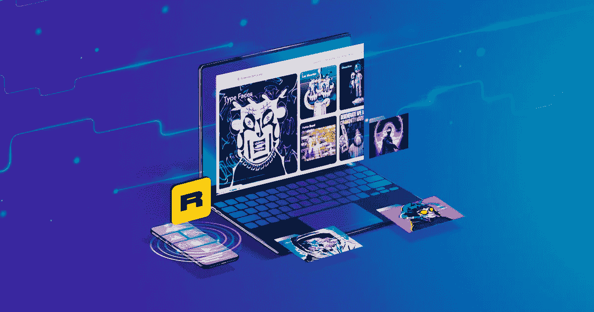

# 像 Rarible 这样的 NFT 市场今天开始营业

> 原文：<https://medium.com/nerd-for-tech/nft-marketplace-like-rarible-to-start-business-today-764ee116de8e?source=collection_archive---------4----------------------->

创业包括理解和解决许多法律、财务、营销等方面的问题。然而，创业热潮从未因这些原因而消退。即使在全球疫情期间，它也达到了历史最高水平。

在过去的两三年里，有许多成功的故事。谈到最近的过去，没有什么比不可替代的代币更有潜力了。NFT 的初创企业已经有了惊人的成功故事，比如 OpenSea、Rarible 和许多其他公司。

这篇文章围绕着像 Rarible 这样的 NFT 市场，以及它如何给企业家带来商机。

# 【Rarible 怎么了？

Rarible 是一个以太坊建造的 NFT 市场，促进分类代币交易。虽然它的竞争对手 OpenSea 可能会主导整个 NFT 的销售，但 Rarible 采取了一种独特的方法，使用其本土令牌———$ RARI。该平台用它的令牌索引治理特性，让所有者与它的成功有利害关系。

*   **拓展多链融合**

除了是以太坊本地人，Rarible 还想扩展它的区块链兼容性。Rarible 在去年 11 月/12 月推出了对 Flow 和 Tezos 网络的支持。

NFT 市场 Rarible 最近宣布了对多边形生成的 NFT 的多链支持。除了 Polygon 之外，Ethereum、Tezos 和 Flow 是其他稀有支持的网络。

*   **推出“多钱包”功能**

Rarible 最近还推出了一个多钱包功能，让用户在不同的区块链连接 20 个不同的钱包。当在 Rarible 上购买和销售 NFT 时，在各种支持的生态系统中拥有不同钱包的用户将不必频繁地登录和退出。

# Rarible 的商业模式是双赢的！！

双赢的局面是指每一方都受益的时刻。同样，Rarible 的商业模式对企业家和客户都有利。当你追求像 NFT 市场发展这样的稀有事物时，你就会知道我在说什么了！

*   **社区优先模式**

随着市场大战的激烈进行，像 OpenSea 这样的平台因做出集中判断而受到指责，像 Rarible 这样的社区优先平台提供了一个诱人的替代方案。

尽管 Rarible 有在未来完全去中心化的雄心，但 RARI 治理令牌仍然没有约束力，核心团队保留所有决策的最终权力。与此同时，各种各样的系统已经到位，以平衡权力和奖励用户。

*   **记号组学模型**

Rarible 的代币供应有限，这是大多数 NFT 项目的情况。由于其分散的性质，记号组学采取灵活的路线。与所有 NFT 市场一样，该平台的核心用例是不可替代代币的转移和收集。另一方面，Rarible 协议寻求扩展到该领域的所有类型的 NFT 应用程序，并在 Flow 和 Tezos 区块链之间建立了一座桥梁，以实现更多的互操作性。

# 如何建立你的稀有市场？

Rarible clone 开源预建解决方案，让创业者踏上创业之旅。该过程是多重的，包括以下步骤:

**#1 开发智能合同**

智能合约用于在 NFT 市场上列出和交易商品。因为 NFT 市场是分散的，所以智能合约被创建来执行交易而不需要人工干预。

**#2 选择存储系统**

IPFS[星际文件系统]是一个可信的存储系统，用于收集自动版本和备份的文件，数据库提供了方便的信息访问和检索。

**#3 决定 NFT 销售类型**

下一步是选择你的 [NFT 市场如 Rarible](https://bit.ly/3vtOu6d) 将如何销售其招募的 NFT。出售 NFT 有两种主要方式:一种是采用固定价格，另一种是进行基于出价的拍卖过程。

**#4 显影**

进入实际开发阶段，你将与一家开发公司合作来构建你的平台。关注市场的用户界面(UI ),以简化客户的 NFT 购物体验。

**#5 测试**

测试 marketplace 以确保它正常工作，不崩溃或包含缺陷是至关重要的。如果你对测试结果满意，是时候推出你的 NFT 市场了。

# **底线**

Rarible 是一个独特的交易平台，通过 RARI 令牌托管和奖励其社区。不管你是否希望开发一个本地令牌，你都需要雇佣一个技术合作伙伴。

有无数的服务提供商提供类似 Rarible 的平台开发，而不是一两家。在做最后决定之前，要小心谨慎，做好自己的研究。