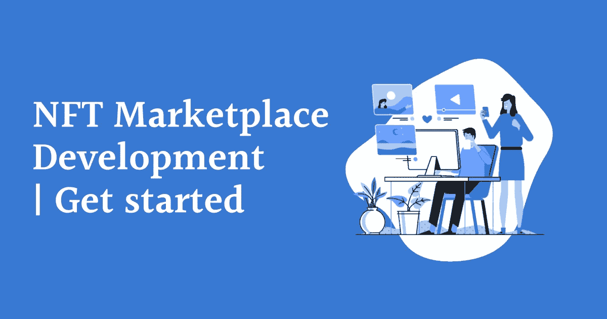

# 白色标签 NFT 市场开发|开始

> 原文：<https://medium.com/nerd-for-tech/nft-marketplace-platform-development-get-started-7f736b56320d?source=collection_archive---------12----------------------->

难怪 NFT 统治着加密领域。像 Opensea、Rarible、Magic Eden、Nifty Gateway、Rarible、比特币基地·NFT、币安·NFT 和 SuperRare NFT 这样受欢迎的 NFT 市场平台正在建立 NFT 趋势。无论是商业模式还是多种创收渠道。有许多因素促使许多加密初创公司和企业家开始他们自己的 NFT 市场平台。是的，如今许多初创公司、公司甚至个体创业者都愿意开发 NFT 市场平台，以利用当前的 NFT 炒作。

## 那么，推出 NFT 市场平台的所有方法是什么？

如果你是一个精通技术的人，你可以从头开始平台开发。但是从零开始开发 NFT 市场平台需要一个经验丰富的区块链开发人员和测试人员团队。开发周期最快需要 6-8 个月。从头开始开发 NFT 市场平台时，也有可能会丢失一些突出的功能和安全标准。测试开发的平台需要各种实时参数，您可能需要考虑市场预期。您需要确保平台能够应对当前的市场趋势。听起来令人生畏，不是吗？

好吧，这里有一个简单的和替代的方法来开发你的 NFT 市场平台，既省事又划算。

在软件开发领域，某些公司和服务提供商仅提供加密平台开发服务，如加密货币交易开发、NFT 市场平台开发和加密支付网关开发。您可以寻求这样的 NFT 市场开发服务提供商，以一种轻松的方式开发您的 NFT 市场平台。你可能会问，所有的额外津贴是什么？

## **选择 NFT 市场开发服务提供商的商业利益:**

**TLDR:** 加密相关软件开发公司专门开发和部署加密货币交换平台、NFTmarketplace 平台、加密货币支付网关，甚至众筹平台。他们可以为您提供端到端的开发支持。在这里，我列出了选择 NFT 市场开发服务提供商来启动您的 NFT 市场平台的一些突出的好处。

I)即时开发和部署
ii)端到端定制支持
iii)能够实施复杂的业务需求
iv)经济高效
v)实施同类最佳功能
vi)为您提供高端安全选项
vii)令人兴奋/时尚的功能集成

## **在开始开发 NFT 市场之前需要查找的功能**

虽然你的 NFT 市场业务有很大的空间以专业的方式获得成功，但你需要确保你的 NFT 市场平台必须具备一些突出的特征。以下是一些精选的功能，将帮助您的 NFT 市场平台应对当前的市场趋势。

*   电子商务店面
*   智能过滤器选项
*   高级搜索选项
*   NFT 上市
*   购买/出价选项
*   钱包整合
*   支付网关集成

将这些功能应用到你的 NFT 市场将会帮助你获得活跃的 NFT 用户。嗯，更多的用户意味着增加你收入的可能性很高。

# **NFT 市场平台开发入门:**

如前所述，选择 NFT 市场开发服务提供商是开发您的 NFT 市场平台的最佳方式。无论是成本、平台质量、实现的功能、集成的安全选项还是部署后支持，专业的 NFT 市场开发服务提供商都可以帮助您轻松地进行端到端的 NFT 市场开发。但问题是，市场上充斥着许多没有经验的服务提供商。在其中选一个会耽误你。我根据各种标准进行了研究，发现 Coinsqueens 是市场上最好的 NFT 市场开发服务提供商之一。

他们有一个由区块链专家组成的专家团队来分析您独特的业务需求，并提出最佳解决方案。他们由经验丰富的 NFT 市场开发人员和品味高雅的设计师支持。您可以完全依赖他们的 NFT 市场开发服务。立即开始您的 [**NFT 市场平台开发**](https://coinsqueens.com/nft-marketplace-development?utm_source=NFTmrktdlpblog&utm_medium=marthamedium&utm_campaign=kartz) ！