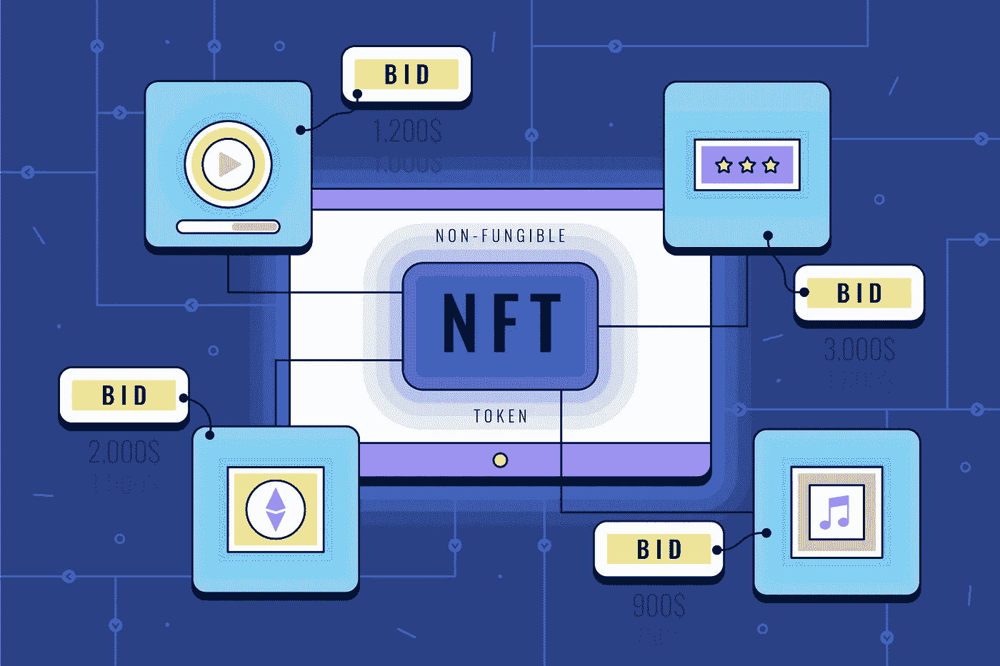

# NFT 网站开发——以下是如何开发和推出 NFT 网站

> 原文：<https://medium.com/nerd-for-tech/nft-website-development-heres-how-to-develop-launch-an-nft-website-fa28ecaab0d1?source=collection_archive---------3----------------------->

在区块链空间中，不可替换的代币已经获得了极大的流行，并在最近得到了更广泛人群的关注。是的，它在 2021 年成为一个流行词，这种狂热甚至会持续到 2022 年。相当可观的是，NFTs 的交易量以十亿计。

你听说过 OpenSea 吗？这是一个交易数字资产和收藏品的平台，也是交易量最大的 NFT 市场。例如，这明显表明不可替代交易平台的用户数量很高。因此， [**NFT 市场发展平台**](https://www.inoru.com/nft-marketplace-development) 将为创业者带来良好的发展机遇。

这个信息丰富的博客将引导你了解 *NFT 网站开发*，带你步入 NFT 空间。穿过去！

## **什么是 NFT，哪些可能是 NFT？**

NFT 是数字资产不可替代令牌的首字母缩写。但是，它存储在区块链上。这些不可替代的代币是彼此可区分的，确保没有其他 NFT 是相似的，即使就稀有程度而言也是如此。下面列出了它的特征。

*   每一个 NFT 都有独特的数据和相同的
*   NFT 的所有权将保存在区块链上，一个数字账本
*   作为单一资产买卖，不可分割，确保不可分割
*   稀缺和独特的 NFT 将吸引发烧友的注意力
*   用户或买家可以密切关注交易和转移
*   权力下放是一个额外的优势

最重要的是，从字面上说，任何东西都可以转化为非功能性食物。是的，毫无疑问，NFT 可以由几乎任何以数字方式存储并且足够独特的东西创建。下面列出了不同类型的 NFT。

*   艺术
*   音乐
*   运动
*   比赛
*   房地产等。

## **NFT 网站或市场——简单介绍其工作流程**

NFT 网站是一个利用区块链技术搭建的交易平台。最常见的是，以太坊是创建 NFT 交易平台的首选区块链网络。常见的以太坊标准协议是 ERC-721 和 ERC-1155。其他重要的区块链网络有币安、多边形、波尔卡多特等。现在让我们看看 NFT 网站是如何运作的。

*   在初始阶段，用户必须向市场注册，因为他们必须提交必要的信息以确保他们的身份。完成初始设置过程后，他们可以使用登录凭据注册。
*   之后，他们必须设置钱包。它是交易前存储数字资产的媒介。
*   用户(即销售者)可以在平台上创建并列出他们的 NFT。这样做时，他们必须通过提供描述和价格来指定有关数字资产的详细信息。
*   另一方面，买家可以选择他们想要的。参与拍卖时，卖方提出拍卖，否则他们可以直接购买。在拍卖的情况下，拍卖结束时出价最高的人将拥有数字资产。
*   购买后，数字资产将从卖家的钱包转移到买家的钱包。

## **NFT 网站开发过程中要执行的步骤**

当你有一个想法推出你的 NFT 交易平台，一些重要的步骤必须考虑在内。查看以下步骤，都是在 [**NFT 网站开发**](https://www.inoru.com/nft-marketplace-development) 的时候进行的。

*   **找到自己的定位**

NFT 市场发展的领域是如此广阔。有这么多的利基要考虑。这包括 NFT 音乐、艺术等市场。根据谁是你的目标受众，选择利基，并继续做同样的基础工作。

*   **选择合适的区块链网络**

下一个需要重点考虑的事情是选择区块链网络公司来开发 NFT 网站。是的，选择完全取决于你。

*   **上诉 UI/UX**

最重要的是，平台的用户界面/UX 应该有吸引力。这是为了确保无缝交易体验。

*   **设计&开发**

现在，是时候设计 NFT 市场开发平台了。它还涉及智能合同的创建，智能合同负责管理数据和数字资产。

*   **测试&发射**

在开发阶段完成后，必须测试平台是否有故障或任何技术问题。在发现任何问题的情况下，这些问题必须立即解决。确保启动无 bug 的 NFT 网站。

## **终审判决**

在这篇博客中，我们几乎涵盖了 [**NFT 网站开发**](https://www.inoru.com/nft-marketplace-development) 的各个角落。您确定要推出 NFT 交易平台吗？你所要做的就是与 NFT 网站开发公司建立联系。