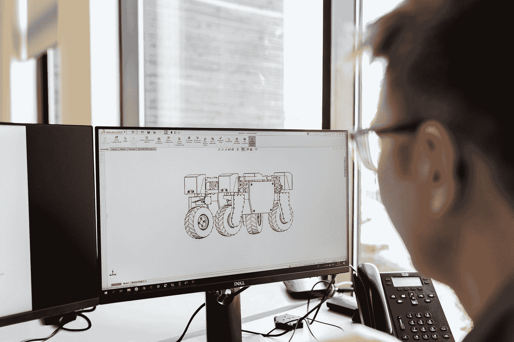

# NFT-每周文摘|第 03 周

> 原文：<https://medium.com/nerd-for-tech/nft-weekly-digest-week-03-a4863130169c?source=collection_archive---------27----------------------->

# 计算机工程

加入 [**领英**](https://www.linkedin.com/showcase/72435604/admin/) 和 [**Instagram**](https://www.instagram.com/nft_computer_engineering/) 社区

1.  [**向自己介绍微服务的世界**](/nerd-for-tech/introduce-yourself-to-the-world-of-microservices-7b917251a763)

照片由[本工程图](https://unsplash.com/@thisisengineering?utm_source=medium&utm_medium=referral)在 [Unsplash](https://unsplash.com?utm_source=medium&utm_medium=referral) 上拍摄

2. [**我们的量子未来有多安全？**](/nerd-for-tech/how-safe-is-our-quantum-future-bc96526ae24b)

照片由[本工程 RAEng](https://unsplash.com/@thisisengineering?utm_source=medium&utm_medium=referral) 在 [Unsplash](https://unsplash.com?utm_source=medium&utm_medium=referral) 上拍摄

3.[**云计算和所有基础知识**](/nerd-for-tech/cloud-computing-and-all-the-basics-8248b623b4c7)

照片由[西格蒙德](https://unsplash.com/@sigmund?utm_source=medium&utm_medium=referral)在 [Unsplash](https://unsplash.com?utm_source=medium&utm_medium=referral) 上拍摄

4. [**安卓按钮变形动画**](/nerd-for-tech/android-button-morphing-animation-4c1b102eec8d)

照片由[本工程图](https://unsplash.com/@thisisengineering?utm_source=medium&utm_medium=referral)在 [Unsplash](https://unsplash.com?utm_source=medium&utm_medium=referral) 上绘制

# 人工智能和数据科学

加入 [**LinkedIn**](https://www.linkedin.com/showcase/72432816/admin/) 和 [**Instagram**](https://www.instagram.com/nft_ai_data_science/) 社区

1.  [**收集了 10 本免费的“施普林格”书籍，主题涉及人工智能、伦理、机器学习、机器人、网络安全、哲学、科学&创新**](/nerd-for-tech/a-great-collection-of-10-free-springer-books-on-the-topics-of-ai-ethics-machine-learning-ce500bf304da)

由[在](https://unsplash.com/@hiteshchoudhary?utm_source=medium&utm_medium=referral) [Unsplash](https://unsplash.com?utm_source=medium&utm_medium=referral) 上拍摄的照片

2. [**数据可视化**](/nerd-for-tech/data-visualization-debc39f1da54)

照片由[普里西拉·杜·普里兹](https://unsplash.com/@priscilladupreez?utm_source=medium&utm_medium=referral)在 [Unsplash](https://unsplash.com?utm_source=medium&utm_medium=referral) 上拍摄

3. [**微调 BERT 进行语义句对分类**](/nerd-for-tech/fine-tuning-bert-for-semantic-sentence-pairs-classification-bd4561af5249)

[附身摄影](https://unsplash.com/@possessedphotography?utm_source=medium&utm_medium=referral)在 [Unsplash](https://unsplash.com?utm_source=medium&utm_medium=referral) 上的照片

4. [**交叉验证**](/nerd-for-tech/cross-validation-6270341658ae)

照片由[摄影师](https://unsplash.com/@ffstop?utm_source=medium&utm_medium=referral)在 [Unsplash](https://unsplash.com?utm_source=medium&utm_medium=referral) 上拍摄

5. [**统计类别:稀缺概念**](/nerd-for-tech/statistical-categories-scarcity-level-scarcity-impact-88ced85a3222)

由[克里斯托弗·高尔](https://unsplash.com/@cgower?utm_source=medium&utm_medium=referral)在 [Unsplash](https://unsplash.com?utm_source=medium&utm_medium=referral) 上拍摄的照片