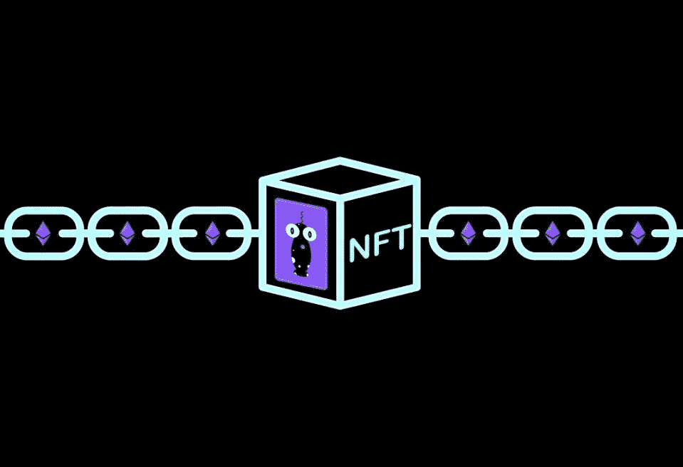
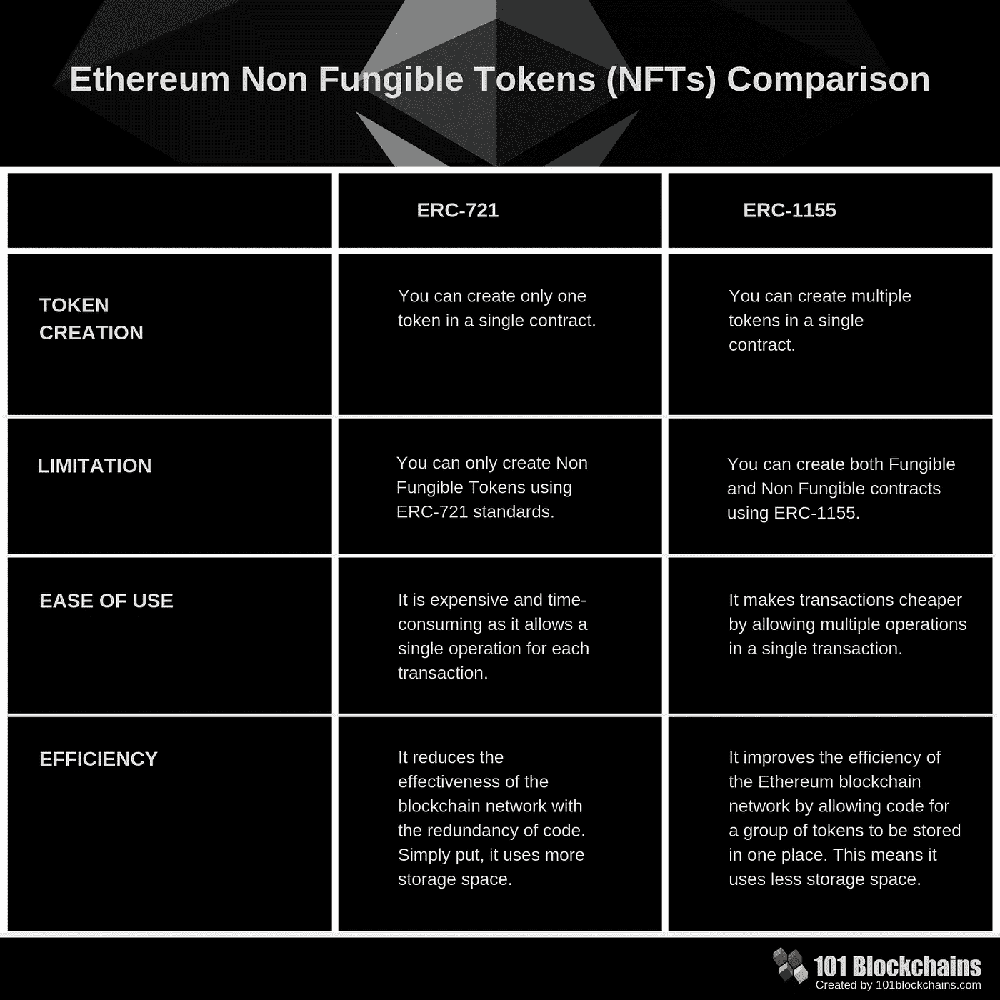
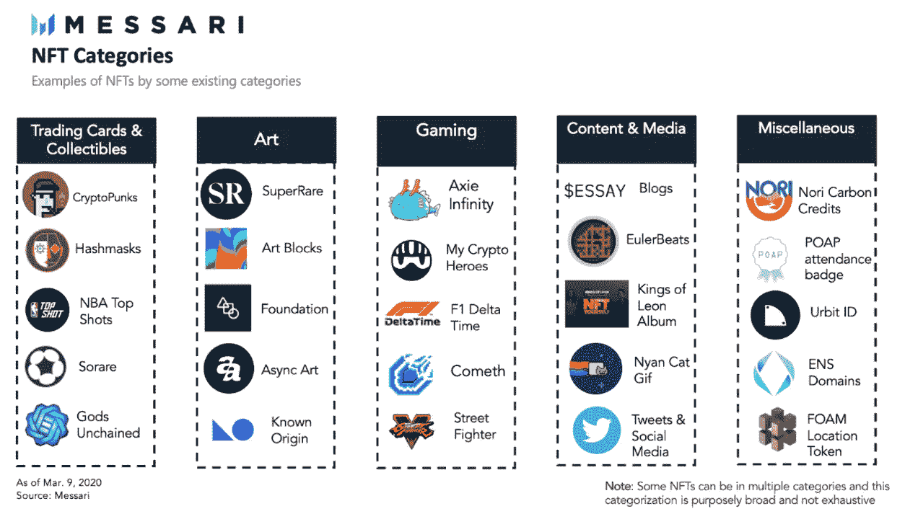

# NFT 及其在密码艺术之外的用途

> 原文：<https://medium.com/nerd-for-tech/nfts-and-their-use-beyond-crypto-art-ae2a4931e5a3?source=collection_archive---------4----------------------->

> 在过去的几周里，你可能已经想到了数字图像价格如此之高的原因。不可替换令牌(NFT)是唯一的实体，不能用其他东西替换。这些令牌是区块链上的一个数据单位，其中每个 NFT 代表一个独特的数字项目。它已经在艺术家、游戏开发者和其他处理作者作品的专业人士中获得了空间。这个概念对其他几个问题也是有用的。我们向您展示了这项技术的一些可能性，以及如何实现您自己的 NFT。



单个 NFT 不可替代令牌示例—从[雅虎](https://br.financas.yahoo.com/noticias/entenda-o-que-e-nft-termo-que-disparou-em-pesquisas-no-google-125010516.html)检索

# 刺激物

在阅读了关于[格莱姆斯获得数百万美元](https://www.theverge.com/2021/3/1/22308075/grimes-nft-6-million-sales-nifty-gateway-warnymph)或者[年夜饭被卖掉](https://www.theverge.com/2021/2/18/22287956/nyan-cat-crypto-art-foundation-nft-sale-chris-torres)的报道后，你可能已经想象出了数字图像背后的价值。我们已经看到了几则解释什么是不可替代令牌(NFT)的新闻。很少有人讨论的是，这项技术已经超越了以高价出售数字图像的范畴。

NFT 可以表示数字文件，如艺术、音频、视频、视频游戏中的项目以及其他形式的创造性工作。它们是[区块链](https://en.wikipedia.org/wiki/Blockchain)上的一个数据单位，其中每个 NFT 代表一个独特的数字项目。这个概念可以用于几个实际问题。

该技术的主要优势是保证真实性，而这并不意味着额外的成本或需要监管机构。NFTs 对于解决现有的知识产权问题非常有用。更重要的是，他们可以为那些如今难以控制所有权的细分市场带来收入。在本文中，我们将向您展示这项技术的可能性以及如何实现您自己的 NFT。

# NFTs

2020 年 9 月，艺术家马特·凯恩以 100422 美元的价格卖出了一件艺术品。这算不上什么新闻，但是[天时地利&地利](https://async.art/art/master/0x6c424c25e9f1fff9642cb5b7750b0db7312c29ad-245)吸引了人们的注意，因为它是第一个跨越 10 万美元大关的秘密艺术创作。每一个 NFT 都是区块链上唯一的令牌。大多数 NFT 都是[以太坊](https://ethereum.org/en/)区块链的一部分，但这不是必须的。

以太坊是一个去中心化的平台，能够执行[智能合约](https://ethereum.org/en/developers/docs/smart-contracts/)和使用区块链技术的去中心化应用。它们是完全按照程序运行的应用程序，没有任何审查、欺诈或第三方干涉的可能性，因为合同是不可变的。

通常，这些 ntf 使用相同的令牌结构。 [ERC-721 标准](https://github.com/ethereum/EIPs/blob/master/EIPS/eip-721.md)是根据智能合约标准为以太网创建的一种令牌。这种模式旨在创建可互换的令牌，但具有独一无二且不可牺牲的特性。

不可替换的令牌是唯一的实体，不能用其他东西替换。例如，独一无二的交易卡是不可替代的。如果你把它换成另一张卡，你会得到完全不同的东西。NFT 可以是任何数字化的东西，但目前的许多兴奋是围绕着使用技术来销售数字艺术。



NFTs 比较

# **密码艺术**

Crypto art 是用来对区块链上出售的所有艺术品进行分类的术语。NFT 在艺术界引起了轰动。一位名为[beepple](https://www.surfacemag.com/articles/beeple-crypto-artwork/)的艺术家最近以 660 万美元的价格卖出了一张 NFT，而在体育界， [NBA 授权的数字集锦卷轴已经产生了 2 . 3 亿美元的总销售额。](https://ca.nba.com/news/what-is-nba-top-shot-explaining-the-blockchain-nba-highlight-collectables/18nram5ye1ub01hres3lkk3xvd)

您可以任意多次拷贝数字文件，包括 NFT 附带的插图。但是 NFT 的设计是为了给你一些不可复制的东西:作品的所有权。重要的是，艺术家仍然可以保留版权和复制权，就像实物艺术品一样。从实物艺术收藏的角度来说。任何人都可以买到莫奈的版画。但只有一个人能拥有原件。除了合同中定义的内容之外，当然，您还可以享受将您的加密资产组合中的工作展示给任何人的乐趣。就好像你口袋里有一个美术馆。这对收藏家来说很有价值。

对于数字艺术家来说，使用区块链的吸引力在于所有权的简单性。加密艺术并不比发布在互联网上的任何其他东西更安全。人们可以很容易地录制视频或截图，并自豪地在他们的桌面上展示复制品。但对于 NFT，所有者购买一个经过验证的令牌，提供艺术品是他们的数字证据。有点像艺术家的签名。这个想法是提供一些自然赋予物理艺术的真实性的表象。

# 在艺术世界之外

任何 NFT 都只是一件数码纪念品，不多也不少。在这种情况下，NFT 是一个粘在贵重物品平台上的数字纪念品。它可以像任何其他投机资产一样运作，你购买它，并希望它的价值有一天会上升，这样你就可以出售它来获利。从技术上讲，任何数码产品都可以作为 NFT 出售。国际 DJ deadmau 已经卖出了数字动画贴纸。已经有一些将 NFT 连接到现实世界对象的尝试，通常作为一种验证方法。耐克申请了一项专利，该专利使用 NFT 系统来验证运动鞋的真实性，耐克称之为 CryptoKicks。

NFT 最有趣的一个方面是如何在游戏中使用它们。已经有一些游戏允许你把 NFT 作为物品。一家公司甚至将虚拟地块作为 NFT 出售。玩家可能会有机会购买一把独特的游戏内枪支或头盔或其他类似 NFT 的东西，这将是大多数人都会喜欢的一种灵活性。

另一个趋于流行的用途是在音乐行业。莱昂国王[发布了一张新专辑，其中包括 NFT 版本](https://www.rollingstone.com/pro/news/kings-of-leon-when-you-see-yourself-album-nft-crypto-1135192/)，具有某些独家优势，如现场演出的特权位置、特殊专辑和差异化艺术。代币将出售两周，然后成为收藏品，可以由其所有者进行交易。任何人都可以听到乐队的热门歌曲，但只有买家会拥有原始文件。



NFT 类别

# 自己做

现在，我们向您介绍一种使用标准 ERC-721 创建 NFT 的解决方案。为此，我们需要在 [Solidity](https://www.google.com/url?sa=t&rct=j&q=&esrc=s&source=web&cd=&cad=rja&uact=8&ved=2ahUKEwiY4aDWkODsAhVBIbkGHSPHAikQFjAAegQIARAC&url=https%3A%2F%2Fsolidity.readthedocs.io%2F&usg=AOvVaw2v8oU3MMOq4ZFNgz1P_ZiU) 中编写代码。这是一种用于编写智能合约的面向对象编程语言。它用于在各种区块链平台上实现智能合约，最著名的是以太坊。我们用这个令牌模式创建了一个包含接口的文件。这是我们令牌的接口。可替换令牌的主要区别在于每个令牌都有一个唯一的 ID。

```
pragma solidity ^0.4.18;contract NFT { event Transfer(address indexed _from, address indexed _to, uint256 _tokenId); function balanceOf(address _owner) public view returns (uint256 _balance); function ownerOf(uint256 _tokenId) public view returns (address _owner); function transfer(address _to, uint256 _tokenId) public;
}
```

在下一个文件中，我们将创建产品所有权结构。修饰符用于改变函数的行为。这个契约声明了 ***onlyOwnerOf*** 修饰符，该修饰符检查与契约交互的帐户是否是特定产品的所有者。如果不满足条件，所需函数将引发异常。

```
pragma solidity ^0.4.18;contract ProductFactory { event NewProduct(uint productId, string name); **struct** Product {
      string name;
    } **Product[]** public products;

    mapping (uint => address) public productToOwner;
    mapping (address => uint) ownerProductCount;

    **modifier** onlyOwnerOf(uint _productId) {
      **require**(msg.sender == productToOwner[_productId]);
      _;
    }

    function createProduct(string _name) public {
      uint id = products.push(Product(_name)) — 1;
      productToOwner[id] = msg.sender;
      ownerProductCount[msg.sender]++;
      emit NewProduct(id, _name);
    }
}
```

NFT 接口具有必须通过我们的令牌实现的方法和事件， ***ProductFactory*** 具有负责创建新产品的数据结构和函数，***product ownership***契约实现了 NFT 接口的方法。

```
pragma solidity ^0.4.19;import "./NFT.sol";
import "./ProductFactory.sol";contract ProductOwnership is ProductFactory, NFT {
    function balanceOf(address _owner) public view returns (uint256 _balance) {
        return ownerProductCount[_owner];
    }

    function ownerOf(uint256 _tokenId) public view returns (address _owner) {
        return productToOwner[_tokenId];
    }

    function _transfer(address _from, address _to, uint256 _tokenId) private {
        ownerProductCount[_to] = ownerProductCount[_to] + 1;
        ownerProductCount[msg.sender] = ownerProductCount[msg.sender] - 1;
        productToOwner[_tokenId] = _to;
        emit Transfer(_from, _to, _tokenId);
    }

    function transfer(address _to, uint256 _tokenId) public onlyOwnerOf(_tokenId) {
        _transfer(msg.sender, _to, _tokenId);
    }
}
```

有关完整的实施和更多其他智能合同，请访问以下 [GitHub 资源库](https://github.com/matheusroleal/solidity-cookbook)。

# 结论

不可替代的代币是一种席卷硅谷精英的狂热。它最大的区别是能够成为独一无二的实体，不能被其他东西取代。这些可以用来表示数字文件，如艺术，音频，视频，视频游戏中的项目，以及其他形式的创造性工作。使用 ERC-721 标准，我们提出了一个实现来创建您自己的 NFT。现在你只需要想象新的使用可能性。