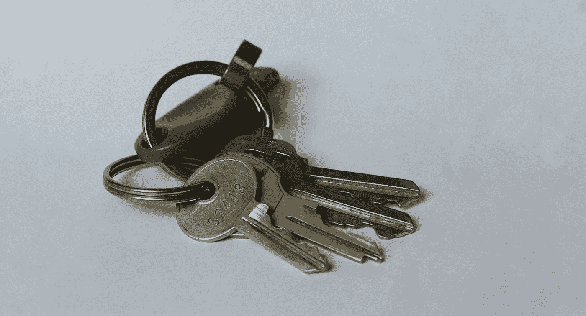
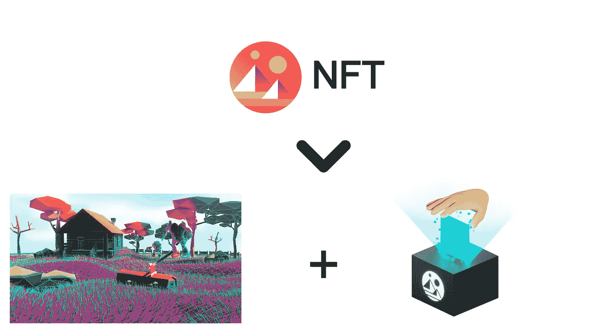
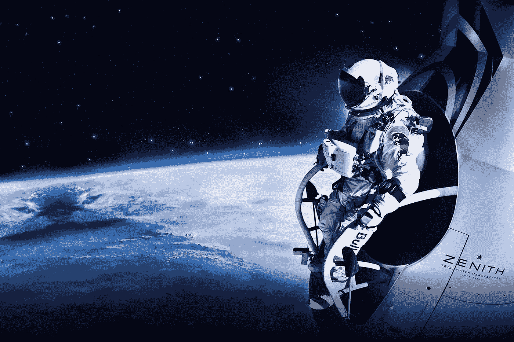
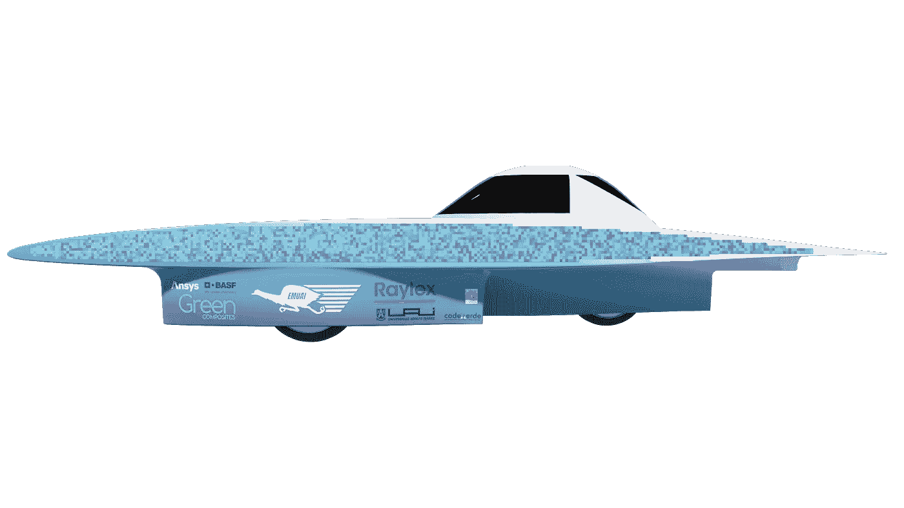
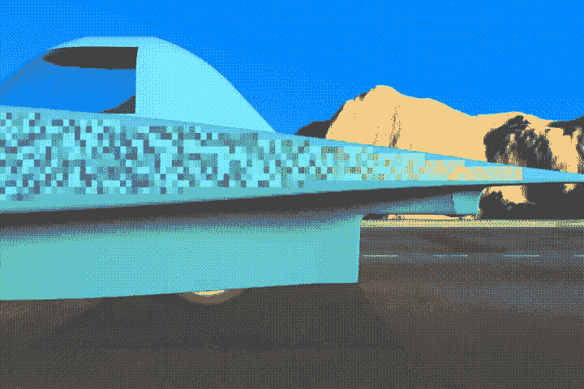

# NFT 不仅代表数字，也代表物理属性。这是怎么做的。

> 原文：<https://medium.com/nerd-for-tech/nfts-represent-not-only-digital-but-physical-property-heres-how-it-s-done-15e1c2b013cd?source=collection_archive---------6----------------------->

读完这篇文章后，你会明白 NFTs 不仅可以代表数字所有权，还可以代表物理对象的所有权，以及如何以一种有用的方式应用它。但是在我们开始之前，我们首先需要了解它们是如何拥有代表任何事物的能力的，所以让我们快速地讨论一下。

不可替换的令牌是有用的，因为它们有一个公开认可的所有者，并且这种所有权可以转移。由于这是在区块链的智能合约上运行的，它们与加密货币具有相同的去中心化、安全和无许可属性。

除此之外，NFT 的创作者通常会赋予所有者一些属性，比如对数字资产的权利，比如图片、视频剪辑、歌曲等。授予权利的范围将由发放 NFT 的个人或机构设定。

例如，在分散土地上拥有一片土地 NFT，你就有权在那片数字土地上进行建设，也有权在分散土地的 DAO 上拥有一定数量的投票权。如果没有分散的元宇宙，NFT 就不值钱了。

现在，如果 NFT 发行者承认 NFT 的所有权是一项资产的权利，那么为什么要止步于数字资产呢？许多人说 NFTs 将是数字所有权的未来，但他们没有说的是，它是所有所有权的未来。

# NFT 的物理表示

让我们来回忆一下红牛平流层项目:该项目通过将一名跳伞运动员送上平流层并打破音障，打破了三项世界纪录。它的成本超过了[3000 万美元](https://www.theaustralian.com.au/news/world/felix-baumgartners-plunge-from-stratosphere-breaks-broadcast-records/news-story/204e359cb84e66cc215b9fce5b28f074)，并将作为最成功的数字营销活动之一被人们铭记，在社交渠道上产生了 [61，634，000](https://socialsupermanager.com/2020/01/14/the-most-successful-digital-marketing-campaign-of-all-times/) 个可信印象。

2012 年红牛平流层飞行任务

现在想象一下，如果我们让人们在胶囊、套装和头盔上印上他们想要的图像，而不是红牛的标志，故事会发生怎样的变化。想象一下，这是一个 NFT 收藏，由某个组织发起，以资助完成这项任务所需的 3000 万美元。你可以购买一小块的权利，放上你的狗、猫、创业标志或任何你内心渴望的图像，它将被全世界数千万或数亿人看到。有一天，你可以向你的孙辈展示，你是如何成为历史的一部分的。

我认为这是未来此类活动的资金来源，至少是部分资金来源，这也是 EMUAI 太阳能团队在 [myemus.info](https://www.myemus.info/) 所做的事情，为他们的下一辆太阳能电动赛车提供资金，在世界各地参加最受欢迎的太阳能赛车比赛:澳大利亚普利司通世界太阳能挑战赛。

EMUAI 下一代太阳能电动赛车

这款下一代汽车旨在利用现有技术尽可能提高效率，制造成本约为 20 万美元。鉴于疫情，该团队一直在努力为项目筹集资金，我们必须在筹资方法上有所创新。

太阳能汽车的表面将被覆盖在 1,5 x 1,5 厘米的网格图像中，这些图像由各自的 NFT 的所有者选择。许多可以合并在一起，如果它的个体大小对某人来说太小的话。

我们制作了一个虚拟的表示，它将根据车主上传的内容进行更新，在每场比赛之前，图像将被更新到实体汽车上。

这就是 NFT 的物理表现。在这种情况下，它代表了 EMUAI 的太阳能汽车表面和虚拟汽车的所有权。

如果你对这个新概念感兴趣，请加入我们的旅程(我们在 [Discord](https://discord.gg/swvsaG8H9V) 和 [Twitter](https://twitter.com/emuai_SolarTeam) )！