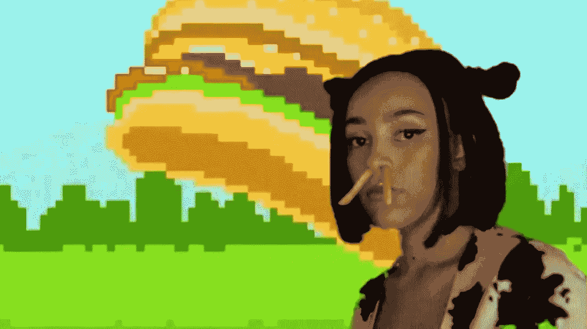
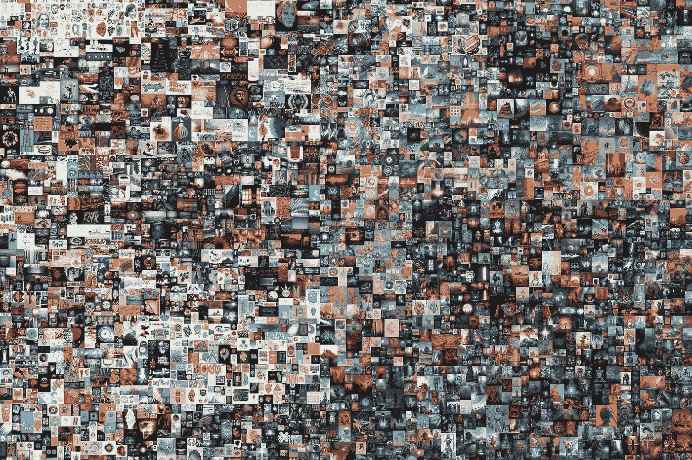
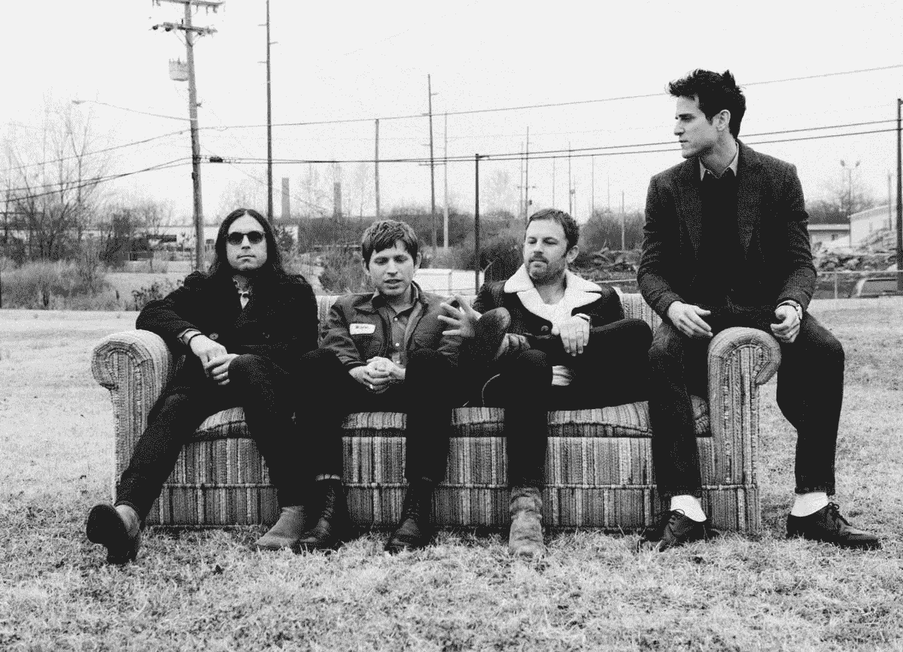
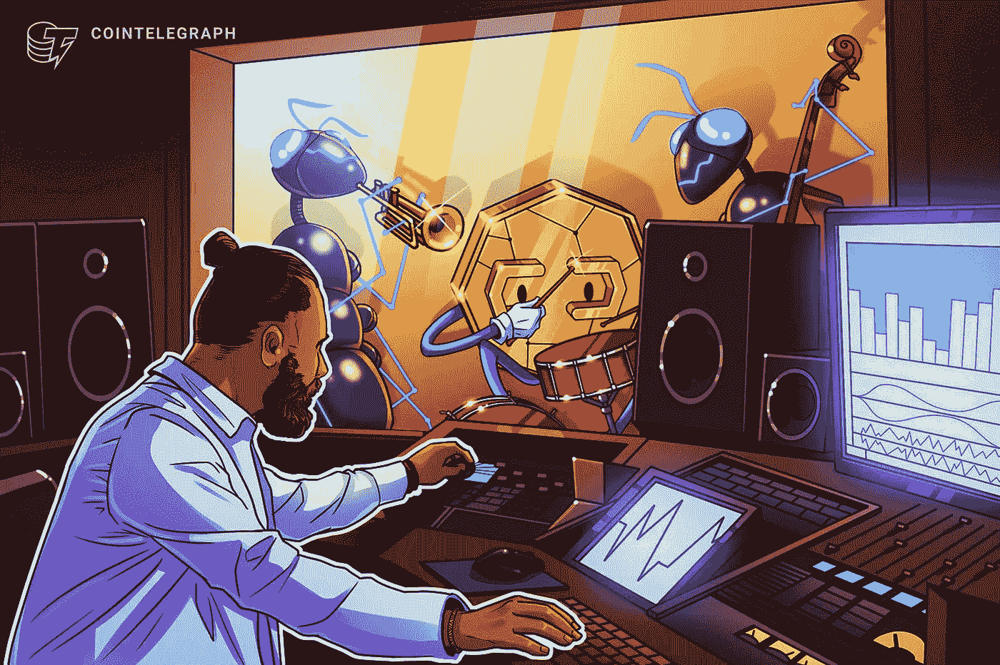

# NFT——什么是炒作，什么是真实的？

> 原文：<https://medium.com/nerd-for-tech/nfts-what-s-hype-what-s-real-bdc618ce245e?source=collection_archive---------21----------------------->

# 流行歌星 Doja Cat 宣布，她将推出自己的 NFT 市场，名为“Juicy Drops ”,这是又一位艺术家对加密技术的信仰飞跃

我们写了一份关于音乐及其背后的商业和技术的每日时事通讯。如果您想直接在您的收件箱中获得它， [*现在就订阅吧！*](https://incentify.substack.com)

大家好，

今天， **Amala Ratna Zandile Dlamini** ，又名 Amala Ratna Zandile Dlamini，又名 Amala Ratna Zandile dla mini，又名 Amala Ratna Zandile dla mini，又名 Amala Ratna Zandile dla mini，又名 Amala Ratna Zandile dla mini，又名 Amala Ratna，又名 Amala Ratna Zandile dla mini，又名 Amala Ratna，又名 Amala Ratna Zandile dla mini，又名 Amala，又名 Amala，又名 Amala，又名 Amala，又名 Amala，又名 Amala，又名 Amala，又名 Amala，又名 Amala，又名 Amala，又名 Amala，又名 Amala，又名 Amala，又名 ama

除非你一直生活在岩石下，否则你至少会听说过 NFT，这是加密领域的最新流行词，事实上它的采用在过去几周已经达到了顶峰。

对于外行人来说，NFT 或**不可替代代币**是一种加密货币**代表任何现实世界(离线或数字)资产的所有权**。与传统货币甚至数字货币不同，这些代币是不可替代的，这意味着没有一个 NFT 是相同的。

与**美元甚至比特币不同，比特币是可互换的**，这意味着每单位美元或比特币代表**相同的价值，可以与同一货币的其他单位自由互换**。

但是令牌的“不可替代性”是如何实现的呢？NFT 的所有权被记录在**公共区块链**上，该公共被**验证并加盖时间戳**以供任何人查看，并且不能被编辑或篡改。

因此，立刻，**只有一个人可以使用 NFT 来声明特定资产的所有权**。与比特币和其他加密货币不同，**这种资产本身并不稀缺**，这意味着任何人都可以简单地复制被转换成 NFT 的数字艺术品、歌曲或任何其他资产。**就像我下载的下面这张图片一样，他的 NFT 在一场拍卖会上卖了 6900 万美元**。

这就像蒙娜丽莎的经典例子。任何人都可以仿造这幅画并声称它是真迹，但是因为众所周知蒙娜丽莎的真迹藏在巴黎**卢浮宫博物馆**，所以不可能有任何其他的画可以声称是真迹。

对于《蒙娜丽莎》这样的名画来说，这很容易，因为**的历史和声望与它联系在一起**，然而，对于基于互联网的数字资产来说**几乎是不可能的**，在互联网上，几乎没有任何人能够证明某件特定的数字艺术品或歌曲或任何其他互联网原生资产的所有权。

NFT 在这方面发挥了作用，他们通过区块链上的公众共识强制执行，特定资产的所有权在某个时间只属于一个人或一个钱包地址。使特定资产的所有权可编程很容易，这意味着音乐家可以确保无论何时转售他们的 NFT，他们都可以从中赚取特定比例的版税。

但是为什么艺术家和音乐家在这里跳上这列火车？史蒂夫·青木、莱昂国王，甚至米克·贾格尔和大卫·格鲁都见过他们的 NFT 在公开拍卖中以数百万美元的价格被买走。

虽然大部分都是为了慈善，但诚实的事实是 NFT 的很有趣。艺术家和音乐家是地球上最有创造力的人之一，引领潮流是他们与粉丝联系的另一种娱乐方式。

这是否意味着 NFT 综合症只是一种时尚？不完全是。

当涉及到核实资产所有权时，它们解决了一个真正的问题，这在以前被认为是集中的权力机构。现在，任何人都很容易以一种不可信和分散的方式来标记和验证他们资产的所有权，并将记录存储在区块链上。

那么，最终会不会所有的艺术家都开始以 NFT 的名义发行他们的歌曲，并赚取数百万美元呢？

**极不可能**。这其中最大的矛盾是艺术家或音乐家希望他们的作品被尽可能多的人看到或消费。另一方面，NFT 通过确保作品的稀缺性来获取价值。

作为一名艺术家，**如果他们开始创作 NFT 的作品，能够消费他们的内容的人就只有这么多了**，即便如此，只有真正受欢迎的人，比如史蒂夫·青木或米克·贾格尔，才能从中赚钱。

对于一个崭露头角的独立音乐人来说，他们刚刚起步，最好的选择不太可能是以 NFT 的方式发布他们的作品，并限制他们作品的有机范围。

那么，由于音乐流媒体行业的复杂结构，区块链如何解决艺术家无法获得公平的收入份额的问题？(在我们早先的新闻简报 [**这里**](https://incentify.substack.com/p/streaming-wars?r=kkvhe&utm_campaign=post&utm_medium=web&utm_source=copy) 中了解更多)。

将艺人收入符号化并建立在区块链上，将直接消除唱片公司和发行商的中间商。这就像一个粉丝购买他们最喜欢的艺术家的股票一样简单，就像购买任何公司的股票，并参与艺术家未来的收入潜力。

鉴于音乐行业的现状，这听起来可能有些牵强，但加密和区块链开辟了以不可信的方式使**资产和金钱可编程的可能性**，这在以前是不可能的。

Incentify 正在努力解决这个问题，所以请继续查看这个空间，了解这方面的更新。

在此之前，享受我们的内容，并随时取得联系，如果你想以任何方式参与这个项目！

祝你们愉快，我们明天再谈。

*如果你喜欢这篇来自* [Incentify](https://incentify.substack.com) *的时事通讯，为什么不订阅呢？让我们建立一个社区:)*

页（page 的缩写）现在就在 [**Twitter**](https://twitter.com/clubincentify) 上关注我们吧！

*原载于*[*https://incentify.substack.com*](https://incentify.substack.com/p/nfts-whats-hype-whats-real)*。*