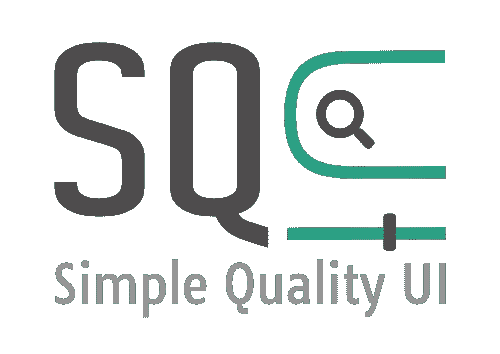

# ng-sq-ui 教程:表单组件模块

> 原文：<https://medium.com/nerd-for-tech/ng-sq-ui-tour-the-form-components-module-c000c66336c7?source=collection_archive---------18----------------------->



大家好，欢迎来到“ng-sq-ui 之旅”系列的另一个版本！这次我们将仔细看看[**FormElementsModule**](https://www.npmjs.com/package/@sq-ui/ng-sq-ui)。如果您喜欢我们的工作，请随意[给我们留下一颗星](https://github.com/SQ-UI/ng-sq-ui)。你的支持是非常 appreciated❤️的

# 概观

**FormElementsModule** 公开了一组常用的表单组件**。它们被设计成与 r[eactive](https://angular.io/guide/reactive-forms)和 t [emplate-driven](https://angular.io/guide/forms) 方法一起工作。表单组件不需要预定义的主题，作为作者，您可以完全控制样式。这个模块最近引入的一个特性(从版本 1.3.1 开始)是支持定制模板。**

# 装置

**FormElementsModule** 目前只作为主要 ng-sq-ui npm 包的一部分出现:

```
npm i @sq-ui/ng-sq-ui
```

# 综合

安装完`@sq-ui/ng-sq-ui`包后，您需要将它导入到您要使用表单控件的模块中，以及 Angular 的 FormsModule 或 ReactiveFormsModule(取决于您想使用的方法):

## 包括内置主题(可选)

如果您想使用默认主题，您需要将它与一些@fortawesome/fontawesome-free 图标样式表一起包含在您的构建中:

1.  包含 **angular.json:** 中的样式表

```
"styles": [
  "./node_modules/@sq-ui/ng-sq-ui/sq-ui-theme.scss",
  "./node_modules/@fortawesome/fontawesome-free/css/fontawesome.min.css",
  "./node_modules/@fortawesome/fontawesome-free/css/solid.min.css",
  "./node_modules/@fortawesome/fontawesome-free/css/regular.min.css",
"src/styles.css"
]
```

2.或者将它们导入到您的 **styles.scss / styles.css** 中:

```
@import '~@fortawesome/fontawesome-free/css/fontawesome.min.css';
@import '~@fortawesome/fontawesome-free/css/solid.min.css';
@import '~@fortawesome/fontawesome-free/css/regular.min.css';
@import '~@sq-ui/ng-sq-ui/sq-ui-theme.scss';
```

## 应用内置主题(可选)

要使用默认主题，只需将`sq`类添加到父元素中:

```
<body class="sq">
  <div class="row">
    <sq-input ...></sq-input>
  </div>
</body>
```

# **FormElementsModule:用途**

所有表单控件都扩展了基本的 **InputCoreComponent** 类，因此有几个公共输入:

[](https://github.com/SQ-UI/ng-sq-ui/blob/master/projects/ng-sq-common/src/lib/entities/input-core-component.ts) [## SQ-UI/ng-sq-ui

### 灵活且易于定制的 UI 套件，适用于 11+ - SQ-UI/ng-sq-ui

github.com](https://github.com/SQ-UI/ng-sq-ui/blob/master/projects/ng-sq-common/src/lib/entities/input-core-component.ts) 

*   `@Input()`名称:`string` -控件的名称。如果没有提供，将使用以下模式生成一个通用名称:`'sq-form-control' + new Date().getTime().toString()`。
*   `@Input()` controlId: `string` -控件的 Id(对应 HTML 中的 **id** 属性)。如果没有提供，将使用以下模式生成一个通用名称:`'sq-form-control' + new Date().getTime().toString()`。
*   `@Input()` controlLabel: `string` -控件的标签(对应 HTML **<标签>** 元素)。默认为空字符串。
*   `@Input()` controlPlaceholder: `string` -控件的占位符(对应 HTML **占位符**元素属性)。默认为空字符串。
*   `@Input()`必需:`boolean` -当使用模板驱动的方法时，这个属性决定了输入是否是必需的。默认为 false。
*   `@Input()`模式:`any` -当使用模板驱动的方法时，该属性确定验证控制值所依据的模式。默认为空字符串。
*   `@Input()`禁用:`boolean` -启用/禁用组件。

## 平方输入

该组件表示本机 HTML `input`元素上的一个瘦包装器。它不提供模板输出，可以作为常规输入。

sq-输入示例:反应式方法

sq 输入示例:模板驱动的方法

## sq-下拉列表

该控件表示一个可配置的下拉菜单，作为本机<select>元素的替代。它期望通过选项输入传递可用选项；它们每个都应该实现 LabelValuePair 接口。</select>

sq-下拉菜单:反应式方法

dropdown 组件公开了一个名为 **onSelectItem** 的输出，它在每次选项更改时被触发。

sq-dropdown:模板驱动方法

sq-dropdown 组件允许用户配置以下模板:

*   下拉列表中的选项
*   选定的选项
*   控件最右侧显示的人字形

sq-下拉列表示例:自定义模板

## 前方 sq 型

UI-kit 附带了一个用于交互式搜索的常用控件 typeahead。默认情况下，它只允许一个选择，但可以很容易地更改为使用多个选择，如下所示:

sq-typeahead 示例:反应式方法

当用户输入一些东西时， **onUserInputEnd** 发射器被触发，延时 500 毫秒。这可以使用**延迟**组件输入进行配置——它接受一个以毫秒为单位表示去抖时间的数字。 **onUserInputEnd** 输出发出用户输入的字符串。

该组件期望通过 **searchResults** 输入来填充其下拉选项。默认情况下，它假设结果集合中的项目实现了 **LabelValuePair** 接口，并通过向用户显示分配给每个集合项目的**标签**属性的内容来显示可能的选择。如果结果集合对象具有不同的格式，可以通过 **displayProp** 输入将控件配置为使用特定属性作为选项下拉列表的标签(如上例所示)。在这两种情况下，存储在 form control/ngModel 变量中的选定项作为 **LabelValuePair** 项出现。或者，如果搜索结果以字符串数组的形式出现，则不应给 **displayProp** 输入赋予任何值 typeahead 会自动将结果字符串作为标签和下拉选项的值进行分配。

sq-typeahead 示例:模板驱动的方法

可以使用模板定制 typeahead，类似于 **sq-dropdown** 。该组件允许为下拉选项(通过 **sq-typeahead-option** 指令)和选定选项(标有**sq-type ahead-selected-option**指令)定制模板:

sq-typeahead 示例:自定义模板

## sq-标签-输入

标签输入组件收集用户在字符串数组中输入的所有值。用来表示字符串结尾的分隔符是空格键:

sq-tags-输入示例:反应式方法

像 **ng-sq-ui** 中的任何其他控件一样， **sq-tags-input** 可以与模板驱动的表单方法一起使用:

sq-tags-输入示例:模板驱动的方法

该控件还支持自定义模板——输入的值可以通过 **sq-tag** 指令进行样式化:

sq-tags-输入示例:自定义模板

## sq-文本区域

**sq-textearea** 控件是本机< textarea >的替代。这种对传统元素的采用扩展到容纳用户输入的值:

sq-textarea 示例:反应式方法

与前面介绍的控件类似， **sq-textarea** 也可以用于模板表单:

sq-textarea 示例:模板驱动的方法

## 方形按钮

该控件可用作原生

方形按钮示例

## sq-复选框

**sq-checkbox** 是一个可样式化的控件，可以用来代替原生的<输入 type="checkbox" >元素。它覆盖了本机复选框，因此保留了控件的可访问性:

sq-复选框示例:反应式方法

它也可以用于模板表单:

sq-checkbox 示例:模板驱动

可以使用 **sq-checkbox-label** 指令定制控件的模板:

## sq-单选按钮

一个可以替代元素的样式。与 **sq-checkbox** 类似，该控件也是其本机对应物的包装器:

sq-单选按钮示例:反应式方法

上面的例子也说明了 **sq-form-group** 元素的使用。它替代了<字段集>元素。从这个意义上说，它提供了相关表单控件的视觉分离，它唯一可用的输入是 **groupLabel** —它的值用作分组控件的标签。请注意， **sq-radiobutton** 控件可以在没有 **sq-form-group 的情况下使用。**

sq-radiobutton 示例:模板驱动方法

**sq-radio-label** 指令允许为控件定义自定义模板:

sq-radiobutton 示例:自定义模板

# 包扎

这就结束了 **FormElementsModule** 之旅。请随意使用本文中的 StackBlitz 示例，并尝试使用这些组件。如果你需要快速复习一下这个库的公共 API，你可以随时查看我们的文档。

# 我们小组正在寻找赏金猎人！

我们想奖励那些努力帮助开发这个项目的人进一步开发令牌！根据您的贡献，您可以获得多达 5 个开发令牌的奖励，包括发布功能请求、完成功能或修复 bug。一定要看看我们的[奖励计划 T & C](https://sq-ui.github.io/ng-sq-ui/#/bounty-program) 。

# 最后但同样重要的是…

非常感谢所有支持我们回购计划的人。如果你有迫切的问题或者只是想给我们写信，请随时加入我们的[休闲频道](https://join.slack.com/t/sq-ui-kit/shared_invite/zt-6sfsgfgm-NVIG8lgR~205VjxsuSG8Gg)！