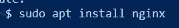
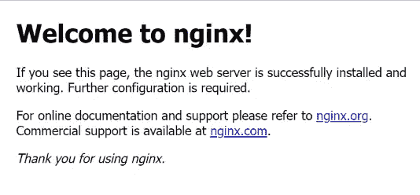

# LTS Ubuntu 18.04 上 NGINX Web 服务器的创建和访问

> 原文：<https://medium.com/nerd-for-tech/nginx-web-server-creation-and-access-on-ubuntu-18-04-lts-d9a421032c95?source=collection_archive---------1----------------------->

Pixabay 提供

尽管有各种各样的 web 服务器和平台可用，NGINX 和 Ubuntu 的组合是开源的，无处不在，而且非常强大。本演练旨在提供测试基本 web 服务器功能所需的最低要求。在我们开始之前，让我们先来看一下每一个的简短描述。

由 Ubuntu 提供

据 Tech Target 报道，“Ubuntu(发音为 oo-BOON-too)是一个开源的基于 Debian 的 Linux 发行版。由 Canonical Ltd .赞助的 Ubuntu 被认为是初学者的好发行版。该操作系统主要是为个人电脑设计的，但也可以用于服务器。“ubuntu”一词来自非洲祖鲁语，翻译过来就是“对他人的仁慈”"

Nginx 提供

nginx.org 说，“Nginx [engine x]是一个 HTTP 和反向代理服务器、邮件代理服务器和通用 TCP/UDP 代理服务器，最初由伊戈尔·塞索耶夫编写。很长一段时间以来，它一直在包括 Yandex、Mail 在内的许多负载较重的俄罗斯网站上运行。如、VK 和漫步者。根据 Netcraft 的数据，nginx 在 2022 年 11 月服务或代理了 21.21%最繁忙的站点。以下是一些成功案例:Dropbox、Wordpress.com 网飞、FastMail.FM。”

## 先决条件:

*   能够通过终端启动命令，并使用安全 shell (SSH)建立连接，命令格式为:SSH 用户名@主机 ip 地址
*   获得“sudo”级权限
*   这个项目使用了一个安装了 Ubuntu 18.04 LTS 的云服务器

# 在服务器上设置防火墙规则

登录服务器后的第一件事就是建立防火墙规则。有必要在简单防火墙(UFW)上允许某些连接协议/端口。我们必须使用`sudo`命令来提升我们的特权。

这允许端口 22/SSH，所以我们不会失去我们的连接，不得不拆除和启动一个新的服务器。(听起来像是发生在我身上的事吗？！)

接下来，我们将允许 HTTP 端口 80 和 HTTPS 端口 443，它们分别是超文本传输协议和安全超文本传输协议。

然后，我们将验证我们是否确实添加了这些规则:

现在，启用防火墙。

在这个命令之后，它将冒着断开连接的风险提示我们进行批准。选择是。

在此步骤之后，检查防火墙的状态。

它应该显示允许的流量列表。

# 更新服务器上的所有包

我们的下一步是确保服务器拥有所有更新的软件包，以便在维护、稳定性和安全性方面提供最好的未来保障。将使用`apt update`命令。请等到此过程完全完成，并且出现可用的命令提示符后再继续。

# 安装 NGINX web 服务器

在第 3 步中，我们将执行`apt install nginx`命令。这可能需要更多的时间，但请允许它在继续之前完成。

当我们还在这一步时，我们将通过使用`systemctl status nginx`命令来验证 NGINX 服务正在运行。

# 使用服务器的公共 IP 地址来验证通过互联网对网页的访问

在最后一步中，我们将找到服务器的公共 IP 地址。我们将打开一个我们选择的浏览器，并以格式`http://*server_IP_Address_here*`输入。输入这些信息后，下面的图像将是成功的确认。

恭喜你！你现在在 Ubuntu 18.04 LTS 版上有了一个新的正常运行的 NGINX 网络服务器。