# NgRx —本地组件存储

> 原文：<https://medium.com/nerd-for-tech/ngrx-local-component-store-a8635649e0c5?source=collection_archive---------0----------------------->

## 将全局应用程序存储用作本地组件存储

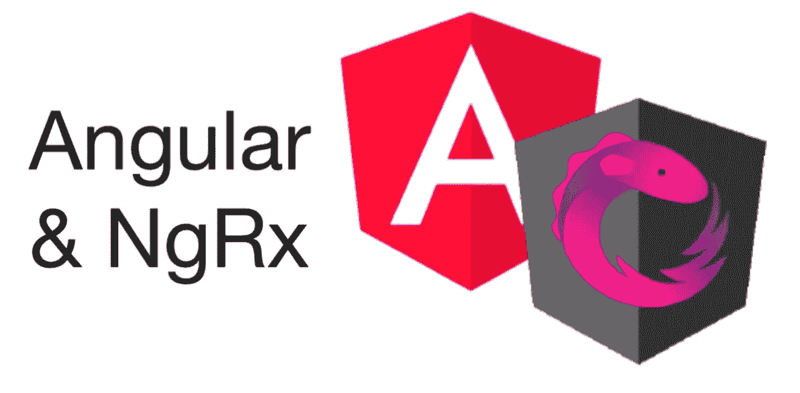

我将尝试*解释如何使用 ngrx 全局存储作为本地组件存储。*我们将尝试寻找一些问题的答案，例如什么是本地商店，我们面临哪些问题，以及如何解决这些问题。*除了几篇文章或 stackoverflow 答案之外，这个主题要找到任何来源、文章或解决方案几乎是很麻烦的。*此外，如果你没有理解 ngrx 和 angular 概念，那么理解这些答案或文章是不可能的。本文的目的是创建一个简单的解决方案和资源。我们开始吧。

事实上，我们已经宣布了一个名为 [@ngrx/component-store](https://ngrx.io/guide/component-store) 的解决方案，专注于 2020 年 8 月 10 日由 Firebase 控制台团队成员 Kevin Elko 和 [Alex Okrushko](https://twitter.com/AlexOkrushko) 开发的 ngrx 第 10 版。这个想法的创造者是 Kevin，Alex 是将它集成到 ngrx 中的人。我可以告诉你确切的解决方案是使用这个模块，但是出于某些原因，你可能仍然希望使用全局存储作为本地存储。所以我们将重点讨论如何通过 [@ngrx/store](https://ngrx.io/guide/store) ，而不是这个模块。

## 有什么问题？

首先，我经常说一个问题，一个问题，一个问题。这个问题到底是什么？我们需要通过代码示例来定义这个问题。少说多做。

让我们制作一个简单的示例，创建一个名为 PersonList 的组件，并将其设计为 angular 模块。它保存了一个人员列表，可以添加或删除一个新的人。在根上提供这个模块，并考虑能够在许多页面上多次使用它。此外，该组件将使用 ngrx 全局存储。我将分享我们在 stackblitz 上创建的示例，供那些想尝试现场演示的人使用。

当运行我们的示例并添加两个人时，状态如下所示。

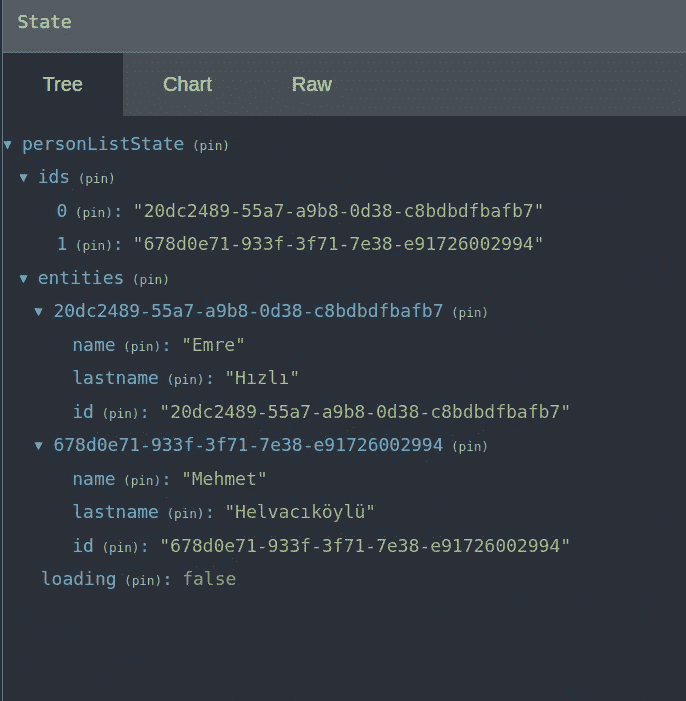

这是 stackblitz 上的一个活生生的例子。

文件夹结构:

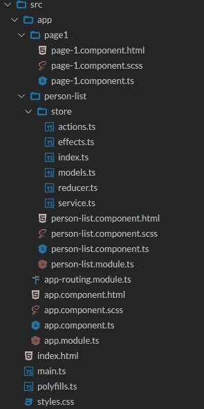

这个例子如我们预期的那样工作。对于添加一个新的人，我们调度 addPerson 动作。之后我们通过 ngrx 效果调用服务保存数据。然后副作用 addPersonSuccess 正在运行，我们从浏览器得到一个“保存成功”的提示。Reducer 为我们更新了状态。我们在选择器的帮助下异步读取数据，并在屏幕上呈现，并使用相同的方法删除一个人。现在，我们将更改代码以重现问题，并看看出现了什么样的问题。我们要一起一步一步考虑出路。

## 麻烦 1

假设我们可以在多个页面中多次使用 PersonList 组件，并希望每次使用时它都是一个空的组件状态。如果我们刷新第 1 页(F5 ),则组件为空，这里没有问题。现在我们创建一个新页面(第 2 页),并同样使用我们的组件。之后，在第 1 页添加一个新人，然后转到第 2 页。

如果你照我说的去做，你会在第 2 页和第 1 页的列表中看到你在第 1 页上保存的人，同样在所有的页面上。这是有原因的，即使组件在它们使用的状态下是可重用的。现在让我们来处理这个问题。当转到第 2 页时，状态应该是干净的。我们可以使用 ngOnDestroy 钩子来解决这个问题。

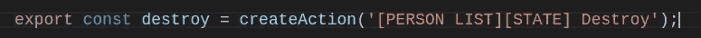

摧毁行动

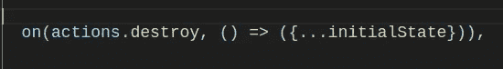

破坏减速器

部件损坏

作为解决方案，我们采用了你们大多数人想到的第一种方法。我们创建了一个销毁操作，并在每次组件被销毁时调度这个操作。在 reducer 代码中，我们再次将状态设置回初始状态。总之，我们使我们的状态(联合的)随时可以重用。这就是我们如何解决将全球商店用作本地商店时遇到的第一个麻烦。

## 麻烦 2

现在让我们把事情变得复杂一点，在同一个页面上使用 PersonList 组件两次，并向我们的第二个问题问好。

正如您所看到的，无论我们使用两个组件中的哪一个来添加人员，我们都会看到我们在两个组件中添加的人员。我们需要使用全局存储为每个组件创建一个本地存储。让我们试试想到的第一个解决方案。

首先，我们应该通过在动作元数据上使用一个标识符属性来分离动作。由于有了这个标识符，我们就可以区分到达缩减器的动作应该为哪个组件运行。

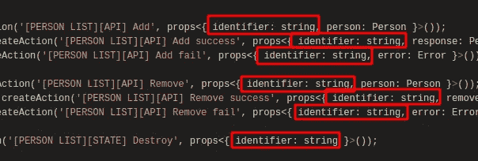

创建一个容器状态，将所有 PersonListState 保存到 reducer 中。每个组件状态都将作为片段站在这个容器下。

创建一个名为 stateSlice 的辅助函数，通过这个函数我们可以从状态中得到我们想要的切片。这样，我们将隔离每个组件状态，但我们的缩减器代码将变得难看。我们稍后会更正减速器代码。

作为一个例子，我把 addPerson 和 removePerson 动作的唯一最终版本。如果你想详细研究它，你可以查看 stackblitz 上的实时演示。

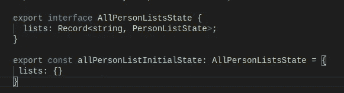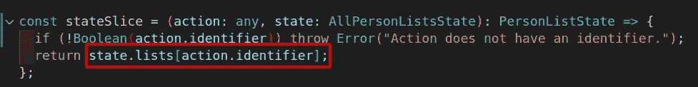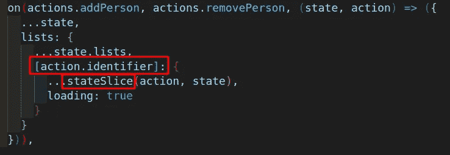

此外，向我们的选择器添加一个标识符，以从存储中获取正确的数据，但是我们失去了可读性和可维护性，就像在 reducer 中一样。您可以尝试不同的方法来提高可读性并降低维护成本。也许 sliceState 函数可以是泛型之类的。但这不是我们的重点。让我们继续…

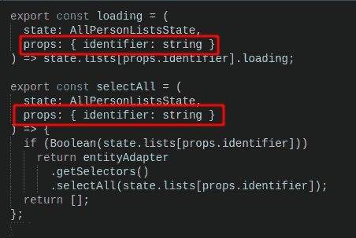

为 PersonList 组件创建一个 id 输入，并将这个 id 传递给操作和选择器。

> 如果你想了解更多关于参数化选择器的信息，你可以搜索 ngrx 参数化选择器’。

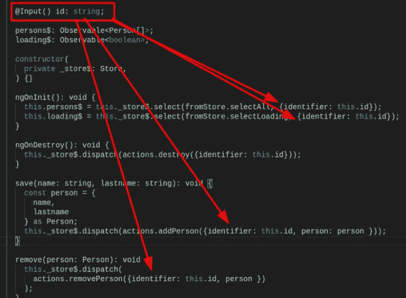

将此标识符传递给触发器动作的映射效果。举个例子，我把 addPerson 效应。我把所有的特效都更新成这样。

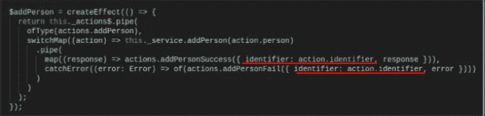

为页面上的组件设置 id。

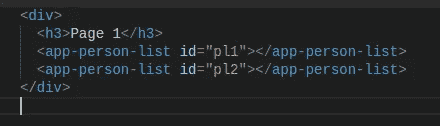

最后，当组件准备好创建动作时初始化状态，并在所有事情之前在组件的 ngOnInit 钩子中分派它，这对于避免选择器抛出错误很重要。

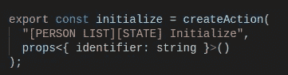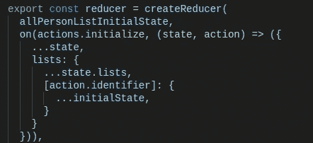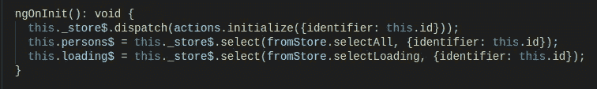

Ta-da…结果看起来像我们想要的:)我们完成了使用全局存储作为特定于组件的本地存储。

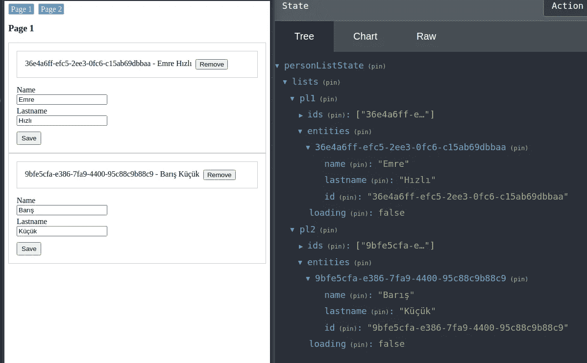

即使您尝试转到第 2 页，也可以看到状态已被销毁操作删除。下面附上 stackblitz 现场演示。我建议你仔细检查一下，以便更好地理解它。

如果你认为我们处理好了一切，那你就错了。接下来我们有更复杂的麻烦。我想向您展示我们使用最后一个现场演示的下一个问题。你可以像我一样试试。我尝试添加一个新的人，然后不等待结果就快速进入第 2 页。

如你所知，当一个人成功保存它时，我们会从浏览器得到一个成功提示。即使组件状态被破坏，也会显示此警报。这种行为意味着即使状态被破坏，效果也不会取消订阅。因此，我们知道订阅在应用程序的整个生命周期中不会被破坏。对我们来说有一个非常严重的问题。我们不能确定我们的州真的干净。因此，我们必须为每种效果定义具体的组件。那么我们如何做到这一点呢？我们总是在每篇 ngrx 文章或例子中看到相同的方法，效果类被导入到一个特性或根的模块级。这意味着当模块加载一次(懒惰或急切)时，我们订阅效果，这些订阅直到应用程序生命结束时才被销毁。我们必须阻止这种行为。为此，ngrx 给了我们两个非常有用的接口。

*   OnRunEffects
*   OnIdentifyEffects

## OnRunEffects

这个接口给出了一个名为 ngrxOnRunEffects 的方法来实现它。因此，它返回一个可观察到的解析效果源，我们可以使用它通过管道进行拦截。

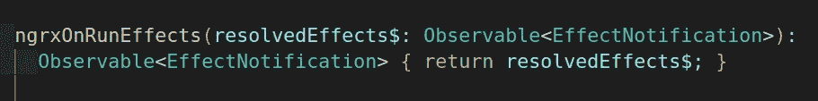

您应该还记得，我们在每次销毁组件时都会调度销毁操作。此时，这个销毁操作将有助于完成我们的订阅。让我们现在就开始将这个接口添加到我们的效果类中。

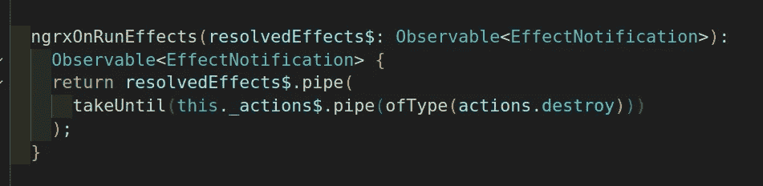

我们使用 rxjs takeUntil 操作符来完成我们的效果订阅，所以我们可以确保所有的效果都将工作，直到销毁操作被分派，但是之后所有的效果都将被完成。您可以使用下面的现场演示来验证这一点。

如果您在转到第 2 页时再次尝试上一个示例，您将不会看到保存成功提示。因为我们的解析效果是在组件被破坏时完成的。但是这里有麻烦了。如果你再次回到第一页，试图创建一个新人，你会发现你的效果不再起作用了。我以前说过什么；

> 我们总是在每篇 ngrx 文章或例子中看到相同的方法，效果类被导入到功能或根的模块级。这意味着当模块加载一次(懒惰或急切)时，我们订阅效果，这种订阅直到应用程序生命结束时才被销毁。

因为我们的介入，特效完成了。我们不能再次加载这些效果，因为模块已经加载过一次，没有办法做到这一点。(也许可以，但那不是我们的话题。)因此，我们需要订阅组件初始化时的效果，而不是已经加载的模块。此时，ngrx 给了我们一个名为 EffectSources 的服务。让我们继续使用这个。

我们正在删除从 PersonListModule 导入的 EffectModule。

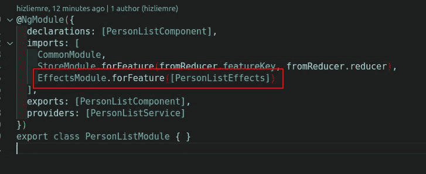

然后将 EffectSources 服务注入到我们的 PersonListComponent 中，从 PersonListEffect 类中获取一个实例，并通过 addEffects 方法将其添加到源代码中。因此 PersonListEffect 类不应该再被注入。随着这种方法的完成，所有效果*都被销毁，并在组件初始化后再次被订阅。*

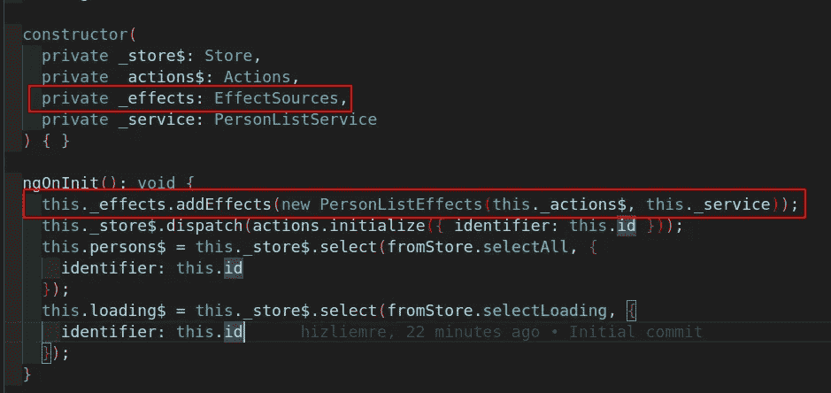

即使问题看起来几乎解决了，我们仍然有麻烦。PersonListComponent 在第 1 页初始化了两次，你可以在 redux dev tools 中看到类似的内容。

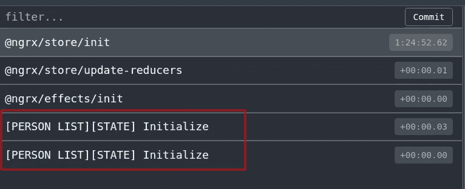

你可以问一些问题，比如我们是否使用 addEffects 将两个不同的资源添加到 EffectSource 两次，或者这是否会导致每个效果运行两次。Ngrx 在后面处理。即使你多次注册同一个效果类别，它也只注册一次。所以在这个阶段对我们来说没有问题，但是我们可以为每个组件注册不同的效果实例。此时，OnIdentifyEffects 接口开始发挥作用。

## OnIdentifyEffects

这个接口给我们设置效果的标识符。很好用。我们可以只返回一个字符串标识符。

我们已经在 PersonListComponent 上有了一个 id。我们可以将这个 id 用于此目的，这里没有障碍。让我们将这个 id 传递给 PersonListEffect 类构造函数，并在方法中返回它。

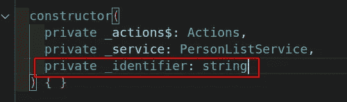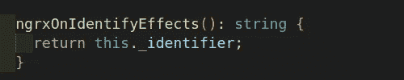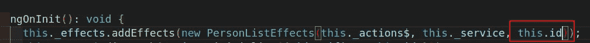

现在，我们需要过滤通过这个标识符发出的效果。为此，我们可以创建一个简单的名为 localOfType 的自定义 rxjs 操作符，然后用它代替 OfType。

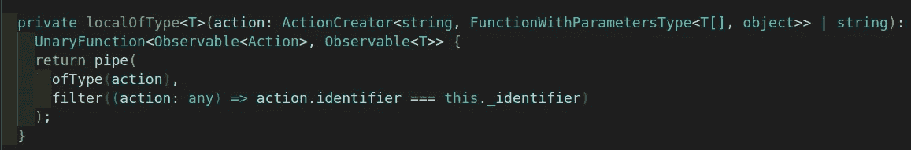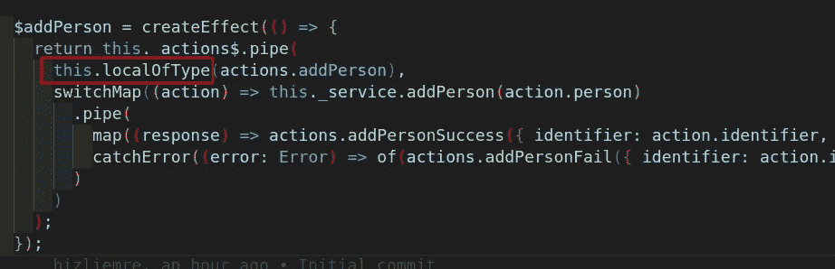

## 减速器管理器

正如您所记得的，我们创建了一个容器存储来保存状态切片。这意味着需要更多的编码工作量时间。

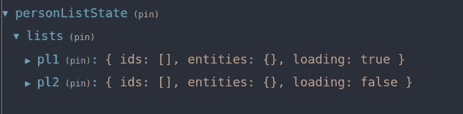

首先，我们要删除从 PersonListModule 导入的 StoreModule，以解决这个问题。

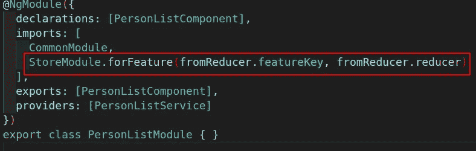

我们需要重写 reducer 代码。从现在起，功能密钥不能是静态的。根据每个组件的标识符，它必须是特殊的。我们创建一个简单的助手方法并导出它，而不是导出特性键。

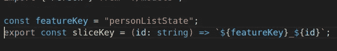

之后，我们更简单地重写缩减器。

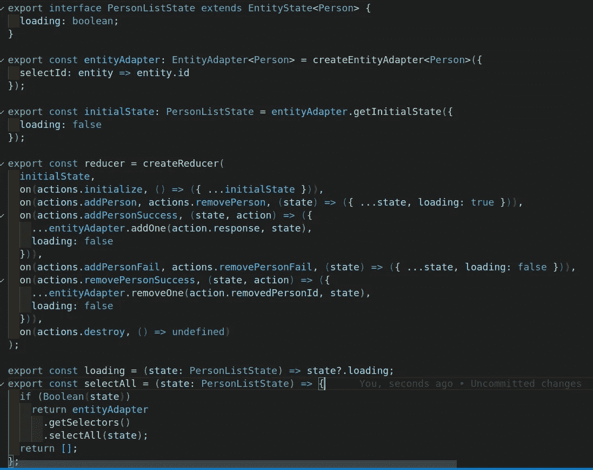

我们创建了一个助手方法来根据标识符过滤动作。

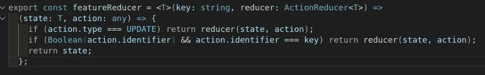

我们也应该对选择器做同样的事情。

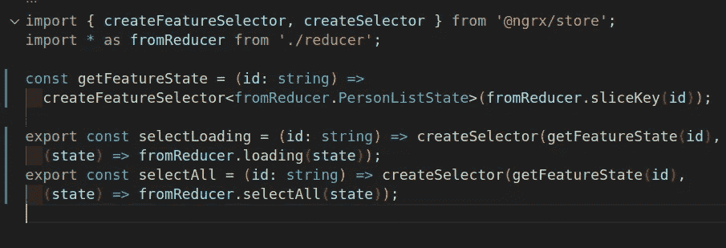

最后，我们应该通过 ReducerManager 服务添加 reducers。

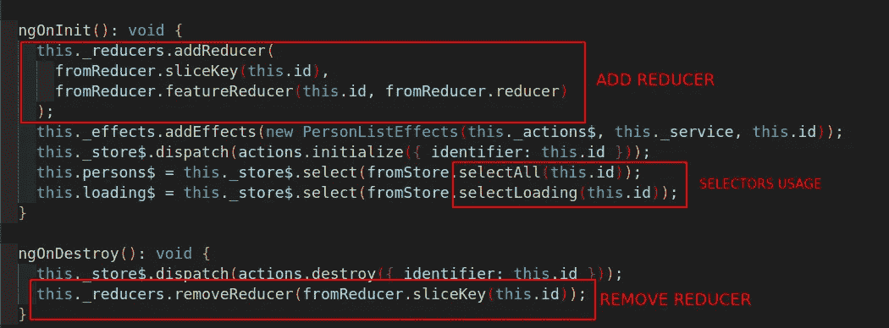

# 结论

我们学习了如何使用全局存储作为本地组件存储，但是我建议使用 ngrx 组件存储。

快乐编码…
不要害羞问我任何问题。[info@emrehizli.com](http://info@emrehizli.com)