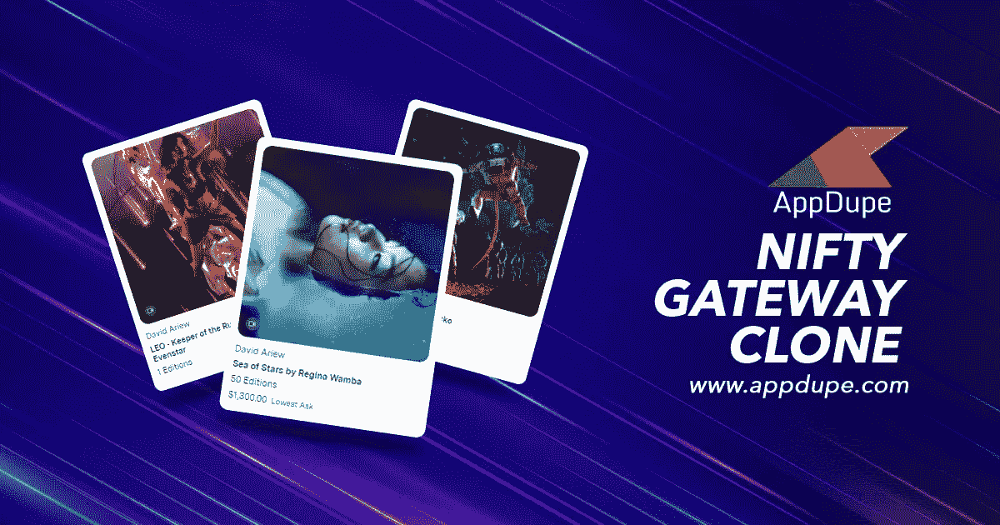
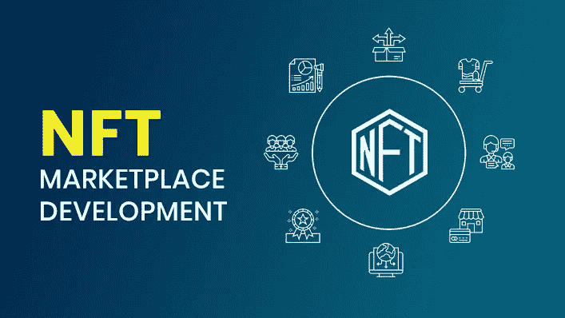

# Nifty Gateway Clone-为 NFT 市场开发定制的解决方案

> 原文：<https://medium.com/nerd-for-tech/nifty-gateway-clone-a-custom-made-solution-for-nft-marketplace-development-f980f86967a3?source=collection_archive---------9----------------------->

随着去年销售额接近 250 亿美元，NFT 今天获得了最多的关注。2021 年标志着 NFT 热的开始，收藏家和创造者现在对不可替代的代币同样兴奋。企业家发现对 NFT 市场的需求与日俱增。使用 [Nifty Gateway clone](https://www.appdupe.com/nifty-gateway-clone) 进行 NFT 市场开发是开发过程中一个负担得起且简单的解决方案。

作为一名企业家，你的目标是通过 NFTs 进入区块链的世界吗？通过为创意艺术家和内容创作者开发专属的 NFT 市场来支持他们。这里有一个为好奇的企业家策划的博客，让他们开始了解 NFTs 和市场发展的基础知识。

图片提供: [AppDupe](https://www.appdupe.com/) (区块链和 NFT 发展公司)

**NFT 市场发展的需要**

你知道，NFT 或不可替代的令牌通过内置的区块链网络为资产提供专属所有权。反过来，它使得资产在不执行一组代码的情况下是不可破解和不可更改的。这组代码仅在满足特定条件时执行。这一功能为独立艺术家、设计师、摄影师、音乐家和其他数字内容创作者提供了一个机会，要求对其作品拥有不可修改的所有权，并通过出售这些作品来赚钱。

由于 NFT 正在侵入从艺术到体育的每一个可能的行业，一个针对每一个流派的专用市场正在慢慢出现。虽然有像 OpenSea、Solsea 和其他 NFT 市场，这些天人们寻找一个专门的市场。如今，各品牌都推出了自己的市场，以方便买家。

对制造 NFT 兴趣的增加以及用户群的增长，已经产生了对具有以下特征的尖端市场的需求:

*   高交易速度
*   低交易成本
*   低铸造成本
*   简单的用户界面
*   担保交易
*   鲁棒搜索过滤器
*   有计划的分类等等

既然你已经理解了 NFT 市场的必要性，那么你需要做些什么来启动它呢？联系开发者之前必须知道的基础知识有哪些？这是为你策划的一步一步的指南。

**迈向发展的第一步**

没有完美的计划，迈出第一步总是充满挑战。当企业家打算在没有战略的情况下启动 NFT 市场发展时，他们确实会遇到困难。浏览以下要点，检查你是否有这些问题的答案。一旦你这样做了，开发过程就像在公园散步一样简单。

谁会是你的市场的用户？NFT 无处不在。一些需求最大的非功能性食物包括

*   艺术
*   照片
*   时装设计
*   体系结构
*   体育可交易
*   音乐
*   活动门票
*   游戏收藏品和更多

哪个区块链网络适合你的项目？有许多区块链在有效地管理着 NFT 市场。研究发现，现在大约 95%的非功能性翻译在以太坊区块链。还有其他区块链，如 BSC、Polygon、Solana 等，正在积极成为它的竞争对手。

W 你们 NFT 市场的工作流程是怎样的？用户可以通过兑换他们的法定货币直接购买 NFT 吗？

你们提供什么样的支付方式，他们如何存储他们的非功能性支付？您计划开发一个本地钱包还是将集成现有的 web 3.0 钱包？做你的研究并得到答案。

你提供给用户的功能是什么？用户界面和功能必须使市场中的整个购买和销售过程顺畅无阻。当人们发现使用你的市场很容易时，它会在短时间内吸引更多的用户。

还有更多的问题要添加到这个列表中，但上述问题是标准问题，将有助于为您的 NFT 市场创建一个基本的轮廓。

**Nifty 网关克隆的基本功能**

NFT 市场的基本功能是买卖。Nifty Gateway 是一个致力于艺术家的前沿 NFT 市场平台。它是向收藏家拍卖独特和稀有的绘画或艺术的平台。这个平台已经卖出了世界上最贵的 NFT 之一。如果你在关注 NFT 世界，你肯定知道 Nifty Gateway 已经卖完了《每日一餐:前 5000 天》。

构成皮普尔出售的拼贴画的其中一幅图像的细节图

***购买*-**NFT 的收藏者应该能够通过简单的支付流程和安全检查来购买 NFTs。

***出售*-**NFT 在平台上出售之前，必须经过认证并检查其合法性。

***拍卖* -** 最近 NFT 市场上有两种拍卖。英国和荷兰拍卖。在英国拍卖法中，最低出价金额是固定的，出价最高的人将赢得拍卖。

**用 Nifty Gateway 克隆的开发过程**

在区块链开发一个平台似乎是一个漫长而富有挑战性的过程。您可能想知道什么是漂亮的网关克隆？它将如何帮助你实现你梦想中的 NFT 市场？

Nifty Gateway Clone 是一个白标脚本，它预先开发并测试了所有可以在主流 NFT 市场上运行的基本功能。它包括后端开发、数据库构建、前端开发、工作流、安全特性等。

你有没有一个创新的特点加入到剧本中？或者有升级现有功能的想法？这是简单的，它可以根据您的要求在任何时间定制。

而从零开始构建一个平台需要数月时间和大量资源。白标克隆有助于在几周内推出您的平台。这使得整个开发和测试过程变得简单，使其成为推出您的 NFT 市场平台的一个负担得起的快速解决方案。AppDupe 就是这样一家[白标克隆软件](https://www.appdupe.com/nifty-gateway-clone)开发公司。

**外卖**

你一定有一些见解，这将有助于你在 NFT 市场的发展。为您漂亮的网关克隆选择合适的开发人员是最重要的一步。检查开发人员在区块链领域的经验，他们以前的项目，以及他们的表现。在把你的项目委托给他们之前，试着和他们进行一次私人谈话。NFT 市场发展是现在正在出现的新趋势，赶快行动吧。