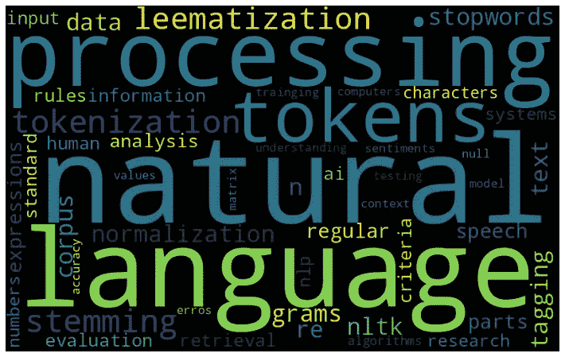
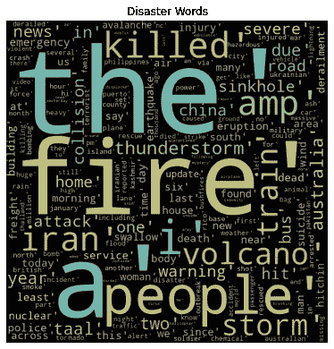
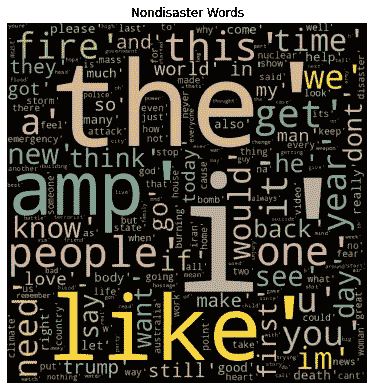
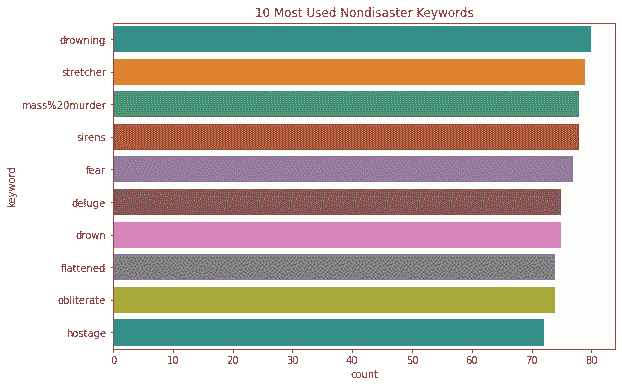

# 自然语言处理:灾难文本分类

> 原文：<https://medium.com/nerd-for-tech/nlp-disaster-text-classification-df6664a92faf?source=collection_archive---------2----------------------->

> 人工智能是我们人类正在努力的最深刻的事情之一。它比火或电更深刻。”—桑德尔·皮帅

> ***简介:***

人工智能的子分支很少。自然语言处理是人工智能的一个分支。自然语言处理关注的是让计算机能够像人类一样理解文本和音频。NLP 帮助机器分解和解释人类所说的语言。在本文中，我解释了一个与 NLP 相关的问题陈述，陈述了“使用 NLP 对 Tweets 进行分类”。对于这个问题陈述，我使用了 Kaggle 上的数据集:“灾难推特”。你可以在这里查看数据集[。](https://www.kaggle.com/datasets/vstepanenko/disaster-tweets)

让我们先了解一下数据集。因此，该数据集共有 5 个属性:

1.id:用户的 ID

2.关键词:提供了来自 tweet 的一些关键词。

3.位置:用户的位置

4.文字:推文

5.目标:是否与灾难相关

> *本文分为 4 个主要部分:*

1.数据提取

2.数据清理

3.数据可视化

4.数据建模

5.结论

> ***1。数据提取***

首先导出所有需要的库，如 pandas、NumPy、sci-kit learn、matplotlib 等。然后使用 panda 命令导出 CSV 文件。

df = pd.read_csv('../input/disaster-tweets/tweets . CSV’)

> ***2。数据清理***

然后，浏览数据集、检查是否存在空值、删除不必要的属性、检查统计信息、数据类型以及进行必要的更改都属于数据清理。下面是一些代码:

#检查信息、数据类型

df.info()

RangeIndex: 11370 个条目，0 到 11369

数据列(共 5 列):

#列非空计数数据类型

— — — — — — — — — — — — — — -

*0 id 11370 非空 int64*

*1 关键字 11370 非空对象*

*2 位置 7952 非空物体*

*3 正文 11370 非空对象*

*4 目标 11370 非空 int64*

*dtypes: int64(2)，object(3* )

#检查空值(如果有)

df.isnull()。总和()

*id 0*

*关键字 0*

*位置 3418*

*正文 0*

*目标 0*

*dtype: int64*

然后作为文本列包含文本，在那里添加一些网址，表情符号，额外的字符。所以，清理这些数据非常关键。为此，在 NLP 中，我们使用 nltk 库，在那里我们可以删除多余的字符，停用词。下面是相同的代码:

从停用字词导入获取停用字词

从 nltk.corpus 导入停用词

stop _ words = list(get _ stop _ words(' en '))

nltk _ words = list(stop words . words('英语'))

停止 _ 单词.扩展(nltk _ 单词)

words =[w for w in df . text if not w in stop _ words]

df['单词'] =单词

tag_map = defaultdict(lambda : wn。名词)

tag_map['j'] = wn。形容词

tag_map['v'] = wn。动词

tag_map['v'] = wn。副词

stop_words = set(stopwords.words("英语"))

打印(停止字)

*输出:{ "没"、'不是'、'自己'、'谁'、'应该'、'这些'、'不是'、'有'、'过'、'什么'、'将'、'所有'、'本身'、'可能'、'出'、'间'、'进'、'下'、'我的'、'不是'、'因为'、'他们'、'还没'、' s '、'不是'、'还没'、'我'、'自己'、'自己'、'不'、'自己'、'不'、'一样'、'如何'、'我们'、'最'、'那些'、'是' ' his '，' could '，' hasn '，' y '，' further '，' not '，' d '，' should '，' on '，' was '，' off '，' here '，' are '，' in '，' under '，' self '，' through '，' so '，' hast '，' she's '，' above '，' you'll '，' her '，' then '，' he '，' not '，' being '，' very '，' wer '，' won '，' won '，' our '，' yours '，' yours '，' yours '，' yours '， 直到'，'每个'，'和'，'我'，'但是'，'不'，'她自己'，'再一次'，'她的'，'这样'，'他们'，'很少'，'为'，'其他'，'不应该'，'赢了'，'你'，'与'，'当' }*

## ***1。停用词:***

停用词是英语中常用的词。首先使用库，我们将它们存储在一个列表中，并使用一个循环，我们检查这样的单词是否出现在我们的数据中，我们简单地删除它们以使我们的项目更容易。

## 2.符号化:

记号化意味着简单地将段落、句子等形式的文本分割成一些称为记号的小单元。

## 3.词干化和词汇化:

词干化通过删除前缀将文本中的实际单词缩减为词干。词汇化将单词从文本转换成它们有意义的基本形式。这些是在自然语言处理中用来识别单词意思的方法。

对于索引，枚举中的条目(df['words']):

new_words = []

word _ lemstized = WordNetLemmatizer()

对于 word，在 pos_tag(entry)中标记:

如果单词不在 stopwords.words('english ')和 word.isalpha()中:

word _ stemmed = word _ lemstized . lemma tize(word，tag_map[tag[0]])

new_words.append(词干)

df.loc[index，' words_final'] = str(new_words)

最后，从数据帧中删除不必要的列，我们就完成了数据清理部分。

df_final = df.drop(['text '，' location '，' words']，axis=1)

df1 = df _ final[df _ final[' target ']= = 1]

df0 = df _ final[df _ final[' target ']= = 0]

> ***3。数据可视化:***

然后为了使它更吸引人和更容易理解，我使用了单词云；它们在两个不同的单词云中表示灾难单词和非灾难单词。这是单词 cloud 的代码。

将 matplotlib.pyplot 作为 plt 导入

从 wordcloud 导入 WordCloud，停用字词

comment_words = ' '

#遍历 csv 文件

对于 df1.words_final 中的 val:

#将每个值转换为字符串

val = str(val)

#分割价值

tokens = val.split()

#将每个标记转换成小写

对于范围内的 I(len(token)):

令牌[i] =令牌[i]。下部()

comment_words += " "。join(token)+" "

wordcloud = WordCloud(宽度= 800，高度= 800，

background_color = '黑色'，

min_font_size = 10

colormap='Set2 '，collocations=False)。生成(comment_words)

#绘制单词云图像

plt.figure(figsize = (5，5)，facecolor = None)

plt.imshow(wordcloud)

plt.axis(“关”)

plt.tight_layout(pad = 0)

plt.title(“灾难词汇”)

plt.show()

然后我打印了十个最常用的灾难和非灾难词汇。

print(df1.keyword.nunique())

plt.figure(figsize = (9，6))

sns.countplot(y= df1.keyword，order = df1.keyword.value_counts()。iloc[:10]。索引)

PLT . title(“10 个最常用的灾难关键词”)

plt.show()

> ***4。数据建模:***

最后，我试着预测并将文本分为灾难和非灾难推文。为此，我使用了逻辑回归算法。它是用于分类的最大似然算法之一。要了解更多信息，请参考本文:[点击这里](https://www.analyticsvidhya.com/blog/2020/10/introduction-to-logistic-regression-the-most-common-classification-algorithm/)

Train_X，Test_X，Train_Y，Test _ Y = model _ selection . Train _ Test _ split(df _ final[' words _ final ']，df_final['target']，test_size = 0.3)

encoder = LabelEncoder()

Train _ Y = encoder . fit _ transform(Train _ Y)

Test_Y = encoder.fit_transform(测试 _Y)

Tfidf _ vect =矢量器(max_features = 5000)

tfi df _ vect . fit(df _ final[' words _ final '])

Train _ X _ tfi df = tfi df _ vect . transform(Train _ X)

Test _ X _ tfi df = tfi df _ vect . transform(Test _ X)

log reg = LogisticRegression(solver = ' liblinear ')

logreg.fit(Train_X_Tfidf，Train_Y)

预测= logreg.predict(Test_X_Tfidf)

预言

*输出:数组([0，1，0，…，0，0，0])*

为了决定我们使用的模型是否预测了所需的产量，我们必须检查模型的准确性。所以，是时候检验这个算法的工作精度了。

print("Accuracy:"，accuracy_score(预测，测试 _Y))

*精度:0.86103781882146*

这就是我们如何使用 NLP 和 ML 算法对文本进行分类和预测。

> ***5。结论:***

1.数据集非常适合对推文进行分类，尽管执行数据清理以获得特定数据至关重要。

2.模型的精度为 **0.86。**

3.逻辑回归分类器可以很好地对推文进行分类。

> **链接:**

1. [Kaggle 数据集](https://www.kaggle.com/datasets/vstepanenko/disaster-tweets?rvi=1)

2. [Kaggle 笔记本](https://www.kaggle.com/code/arya24/nlp-disaster)

3. [GitHub 库](https://github.com/aryatalathi/NLP-Disaster)

~*ARYA·塔拉西*