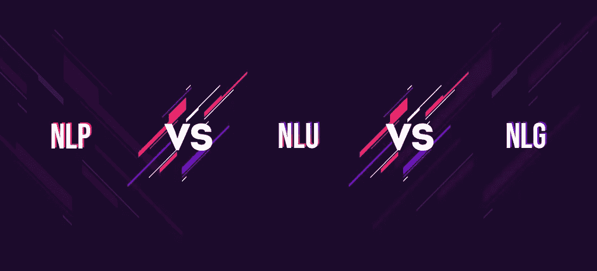
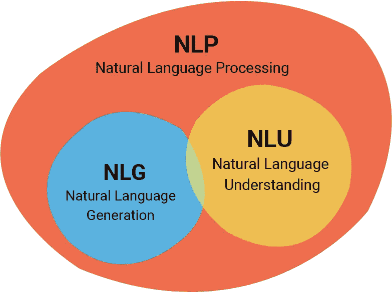
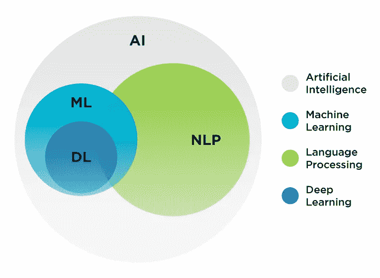
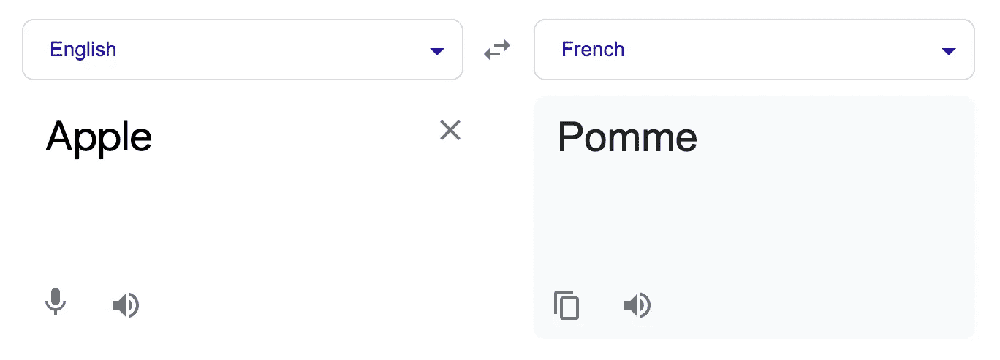
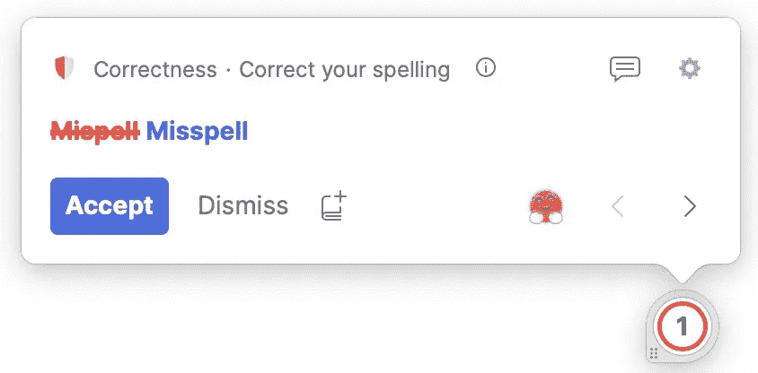
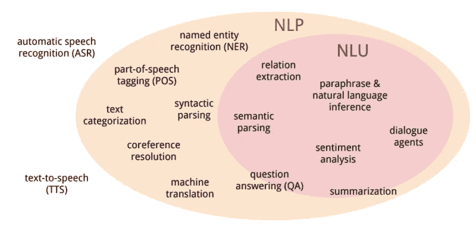
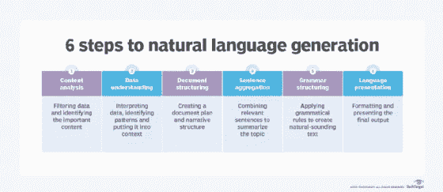

# NLP，NLU 和 NLG

> 原文：<https://medium.com/nerd-for-tech/nlp-nlu-and-nlg-7aa3d8d64e2f?source=collection_archive---------1----------------------->

我的文章中使用的图片是各自组织的财产，仅用于参考、说明和教育目的。【图片来源:谷歌(除了部分图片，在图片下方特别提到了其来源)】

图片来源:GeeksforGeeks

我们已经理解了什么是自然语言处理，(NLP)是对的？但是我们还不太了解什么是自然语言理解(NLU)，什么是自然语言生成(NLG)。让我们理解这两者，以及本文中的 NLP。

本文将分为三个部分

*   **NLP**
*   **NLU**
*   **NLG**

# 自然语言处理

自然语言处理(NLP)指的是计算机科学的一个分支，更具体地说，是人工智能(AI)的一个分支，它涉及到让计算机能够像人类一样理解文本和口语。

计算机程序可以理解人类的口语和书面语，这就是所谓的自然语言。

它是机器用来理解、分析、操作和解释人类语言的技术。

它有助于完成任务，比如—

*   翻译
*   自动总结
*   语音识别

等等。

## NLP 的优势

*   NLP 帮助用户提出任何主题的问题，并在几秒钟内获得直接响应。
*   NLP 提供问题的准确答案意味着它不提供不必要和不想要的信息(填充词)
*   NLP 帮助计算机用人类的语言与人类交流。
*   这是非常省时的。
*   大多数公司使用 NLP 来提高文档处理的效率、文档的准确性以及从大型数据库中识别信息。

## 自然语言处理的缺点

*   NLP 可能不会显示上下文，这使得它很难理解。
*   NLP 是不可预测的。
*   NLP 的功能是有限的，因此 NLP 只是为一个特定的任务而构建的。

## 自然语言处理的子集

NLP 有两个子集—

*   自然语言理解(NLU)
*   自然语言生成(NLG)

## 自然语言处理的应用

在现实生活中，我们有几种使用自然语言处理的方法。让我们来看看其中的一些。

**问答(虚拟助手):**

*   用自然语言，即我们理解的语言，自动回答我们人类提出的问题。

**垃圾邮件检测**

*   垃圾邮件检测用于检测不需要的电子邮件，有时是垃圾邮件或促销邮件，并将其从主收件箱中过滤出来。它们被过滤并被发送到另一个地方，称为垃圾邮件文件夹。
*   NLP 有时可能会将重要的电子邮件分类为垃圾邮件/促销邮件，因为它不是一个完美的模型，这意味着它无法将每一封垃圾邮件分类为垃圾邮件，并将每一封重要的电子邮件分类为重要邮件。

**情感分析**

*   它用于应用程序和社交媒体，如 Twitter、Instagram、脸书等，以分析发送者的态度、行为和情绪状态。
*   这个应用程序是通过 NLP(自然语言处理)和统计学的结合来实现的，通过给文本赋值(正面、负面或自然)，并识别上下文的情绪(高兴、悲伤、愤怒等)。)
*   这样，模型将知道哪些推文可能是仇恨言论等。

**语言翻译**

NLP 还可以将语音或文本从一种自然语言翻译成另一种自然语言，就像这里所做的那样，从英语翻译成法语。

NLP 将苹果翻译成法语

**拼写纠错**

每当您在键入时拼错某个单词，您会得到红色/蓝色下划线的原因是因为 NLP 已经识别出您可能拼错了某个单词，并建议用一个替换单词来代替它，通常是正确拼写的单词。

语法上**s NLP**在工作，试图用正确的单词替换我拼错的单词。****

****以及更多的用例，但这就是我们今天要讲的，因为我不想文章太长:)****

## ****自然语言处理中的歧义****

****NLP 很棒，但有时也有一定比例的不确定性。****

****看看这些例子。****

*   ****约翰正在寻找一个匹配的对象。****

****在这种情况下，这意味着约翰正在寻找结婚，还是意味着约翰正在寻找某个地方发生的板球比赛？****

****这是一个词汇歧义的例子*—**一个单词中的句子存在两种或两种以上可能的含义时所产生的混淆。*******

*   *******詹姆斯去了凯特。她说“我饿了”*******

*******这种情况下，谁饿了？詹姆斯还是凯特。想想吧。*******

*******这是一个指称歧义的例子*——****当你用代词指代某事时存在的混淆。************

*   **********我看到我爸爸拿着一副望远镜。**********

**********现在，在这种情况下，这句话的意思是我借助一副望远镜看到了我的爸爸，还是我看到了我的爸爸，而他正在使用一副望远镜？**********

**********这是 ***句法歧义*** *—* 的一个例子，在句子内出现两个或两个以上可能的意思时存在的混淆。**********

********现在，让我们继续到 NLU。********

# ********自然语言理解(NLU)********

*   ********自然语言理解(NLU)是自然语言处理(NLP)的一个子集，涉及到将人类语言转换成机器可读的格式。********
*   ********在 NLU 和 ML 的帮助下，计算机可以在几秒钟内自动分析数据，在分析客户反馈时为企业节省了无数的时间和资源。********
*   ********NLU 专注于机器理解自然人类语言的能力。NLU 指的是如何重新安排非结构化数据，以便机器可以“理解”，解释和分析它。********

********在计算机能够将非结构化文本处理成机器可读格式之前，首先机器需要理解人类语言的细节和独特性。(俚语、上下文、讽刺等)********

********Gartner 将 NLU 定义为“它是计算机对人类语言(如英语、西班牙语、日语)的结构和意义的理解，允许用户使用自然句子与计算机进行交互”——Gartner********

********换句话说，NLU 是一个使用计算机软件来解释文本和任何类型的非结构化数据的人工智能。NLU 可以消化文本，将其翻译成计算机语言，并以人类可以理解的语言输出。********

********NLU 的主要目标是制造机器:********

*   ********解读自然语言********
*   ********衍生意义********
*   ********识别上下文********
*   ********获得洞察力********

*********** *以上 4 点来源:BMC 博客************

****************

********来源:斯坦福大学********

# ********为什么 NLU 现在很重要？********

*********(来源:AIMultiple)*********

*   **********NLU 可以用作支持非结构化文本分析的工具。人们表达自己的方式多种多样，有时因人而异。**********
*   ********尤其是个人助理要想成功，很重要的一点就是对用户的正确理解。NLU 将语言的复杂结构转换成机器可读的结构。********
*   ********这使得文本分析成为可能，也使得机器能够响应人类的查询。********
*   ********需要分析的非结构化文本的数量正在增加。计算机可以以一致和无偏见的方式对 24/7 进行基于语言的分析。********
*   ********考虑到每天产生的原始数据量，NLU 和 NLP 对于有效分析这些数据至关重要。一个开发良好的基于 NLU 的应用程序可以读取、监听和分析这些数据。********

# ********NLU 领先的组织********

*********(来源:AIMultiple)*********

********正如在许多新兴领域一样，科技巨头在 NLU 也占据了重要地位。一些创业公司和开源 API 也是生态系统的一部分。********

## ********微软********

*   ********知识探索服务********
*   ********语言理解智能服务(LUIS)********
*   ********Azure 翻译器 API********

## ********谷歌********

*   ********对话流********
*   ********翻译 API********
*   ********云自然语言 API********

## ********国际商用机器公司********

*   ********沃森对话服务********
*   ********沃森音调分析仪********

## ********亚马孙********

*   ********包含********
*   ********法律********

# ********开源替代方案有:********

*   ********脸书的智慧********
*   ********拉萨·NLU********
*   ********模糊的********
*   ********PyNLPl********
*   ********斯坦福·科伦普********

# ********自然语言生成(NLG)********

*********(来源:营销 AI 研究院)*********

********自然语言生成(NLG)是使用人工智能将数据转换为自然语言的过程。********

********NLG 软件通过使用由 ML 和深度学习支持的人工智能模型来实现这一点，将数字转化为人类可以理解的自然语言文本或语音。********

********聊天机器人、语音助手、AI 博客写手(仅举几例)都使用自然语言生成。NLG 系统可以根据预设的模板将数字转化为叙述。他们可以预测接下来需要生成哪些单词(比如，在你正在积极输入的电子邮件中)。或者，最复杂的系统可以形成完整的摘要、文章或回复。********

## ********自然语言生成的应用(NLG)********

*********(来源:营销 AI 研究院)*********

********以下是 NLG 最常见的一些应用********

*   **********自动回答网站问题的聊天机器人**。********
*   **********像 Alexa 或 Siri 这样响应命令的语音助手**。********
*   ********将一种语言翻译成另一种语言的机器翻译工具。********
*   **********对话式人工智能助手**使用先进的 NLG 和 NLU 进行双向对话。********
*   **********分析平台**可以使用 NLG，用通俗易懂的语言解释来自数据的见解。********
*   ********用于内容创作的人工智能博客作者可以使用语言模型自动编写任何内容，从一个句子到整篇文章。********
*   **********情感分析平台**利用 NLU 来了解哪种语言能引起顾客的共鸣，然后利用 NLG 来创造他们可能会做出回应的信息。********
*   **********人工智能转录工具**使用语音识别来理解音频，然后通过 NLG 将其转化为文本。********
*   **********叙事** **生成工具**使用结构化数据(通常以电子表格的形式)自动生成文本叙事。********

## ********NLG 是如何工作的？********

*********(来源:TechTarget)*********

****************

********NLG 是一个多阶段的过程，每一步都进一步完善用于以自然语言制作内容的数据。NLG 的六个阶段如下:********

*   **********内容分析。**对数据进行过滤，以确定流程结束时产生的内容应包含哪些内容。这个阶段包括识别源文档中的主要主题以及它们之间的关系。********
*   **********数据理解。数据被解释，模式被识别，并被放到上下文中。这个阶段经常使用机器学习。**********
*   **********文档结构化。根据要解释的数据类型，创建记录计划并选择叙述结构。**********
*   **********句子聚合。**相关句子或句子的组成部分以准确概括主题的方式组合在一起。********
*   **********语法结构。**应用语法规则生成听起来自然的文本。这个程序推断出这个句子的句法结构。然后，它使用这些信息以语法正确的方式重写句子。********
*   **********语言表述。**根据用户或程序员选择的模板或格式生成最终输出。********

## ********如何使用 NLG？********

*********(来源:TechTarget)*********

********自然语言生成正以多种方式被使用。许多用途中的一些包括如下:********

*   ********生成聊天机器人和语音助手的响应，如谷歌的 Alexa 和苹果的 Siri********
*   ********将财务报告和其他类型的业务数据转换为员工和客户易于理解的内容；********
*   ********自动化潜在客户培育电子邮件、消息和聊天回复；********
*   ********对客户电子邮件和信息的个性化回复；********
*   ********生成和个性化客户服务代表使用的脚本；********
*   ********汇总和总结新闻报道；********
*   ********报告物联网设备的状态；和********
*   ********为电子商务网页和客户信息创建产品描述。********

********看看这段讨论聊天机器人是什么以及如何使用它们的 YouTube 视频。********

********来源:YouTube********

# ********进一步研究爱好者的重定向********

********[自然语言生成—维基百科](https://en.wikipedia.org/wiki/Natural_language_generation)********

********[自然语言生成(NLG):它是什么&它是如何工作的(aimultiple.com)](https://research.aimultiple.com/nlg/)********

********[自然语言生成快速指南(NLG) (phrazor.ai)](https://phrazor.ai/blog/what-is-natural-language-generation-nlg)********

********在我们结束这篇文章之前，如果你读过我的前一篇文章，你可能会记得我已经给出了 5 个问题，这些问题的答案将在这篇文章的最后，所以在这里！请首先自己尝试，然后检查这些:)********

## ********Q1。NLU 和 NLP 的区别。********

********你会在这篇文章中得到答案:)********

## ********Q2。组织如何从使用对话式人工智能中受益？********

*   ********准确(性)********
*   ********效率********
*   ********非接触式客户服务********
*   ********追加销售机会********
*   ********更好的客户体验********
*   ********降低运营成本********

********有关上述各点的进一步详细说明，请参见本文中的[。](https://grubbrr.com/why-conversational-ai-is-superior-to-voice-response/)********

## ********Q3。如果客户给出的输入是语音，那么用什么来分析数据？********

********自动语音识别(ASR) *(参考我以前的文章)*********

## ********Q4。对话管理阶段我们做什么？********

********在这个阶段，自然语言生成(NLG)作为自然语言处理的一个组成部分，形成了一个适当的反应。*(参考我之前的文章)*********

## ********Q5。对话式 AI 面临的最大挑战之一是什么？********

********不断变化的交流方式********

********安全性和隐私********

********发现和采用********

*********(参考我之前的文章)*********

**********附:这篇文章没有问题了:)**********

********感谢阅读，快乐学习！********