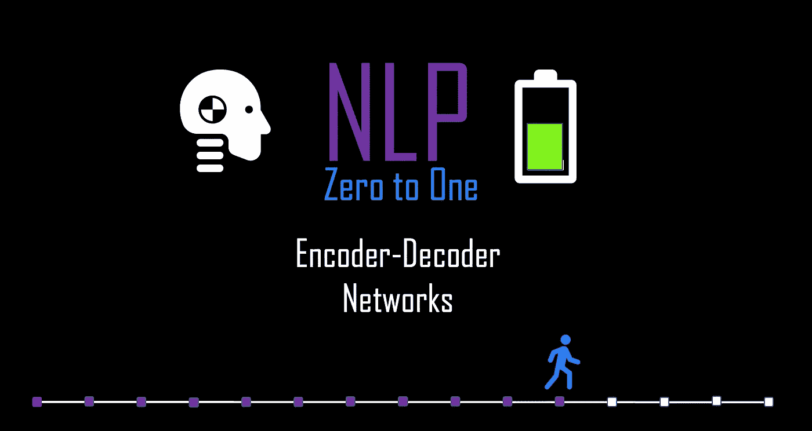
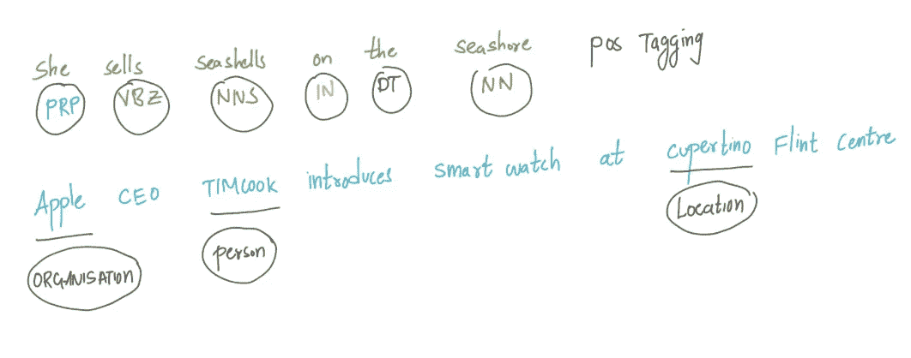
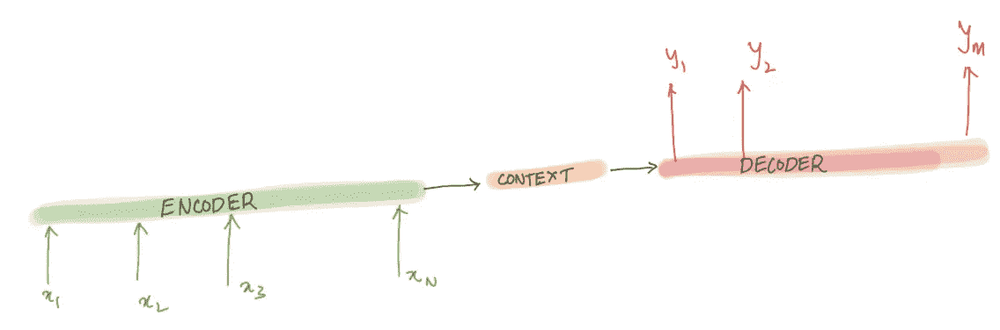
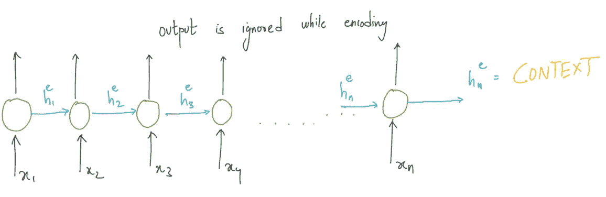
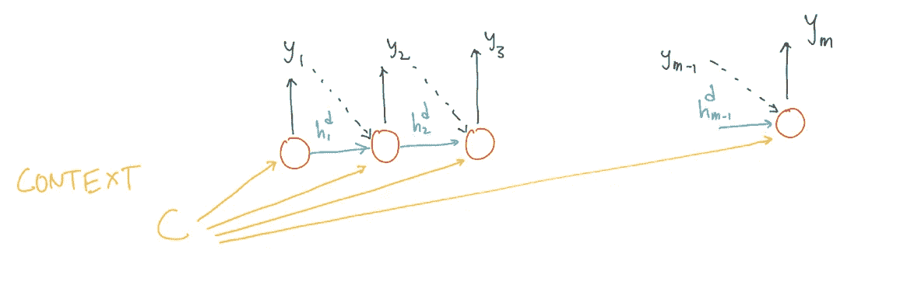
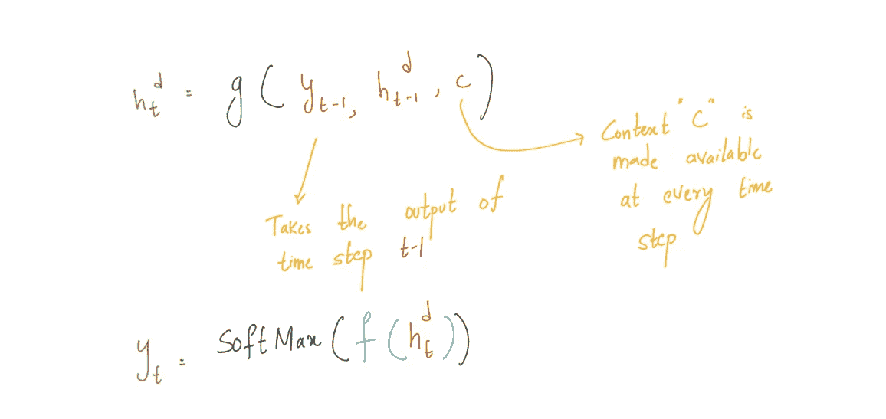
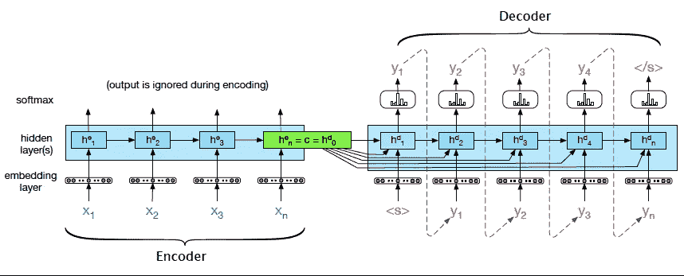

# NLP 理论和代码:编码器-解码器模型(第 11/30 部分)

> 原文：<https://medium.com/nerd-for-tech/nlp-theory-and-code-encoder-decoder-models-part-11-30-e686bcb61dc7?source=collection_archive---------7----------------------->

## 序列到序列网络，上下文表示

由作者生成

# 介绍..

在像机器翻译这样的任务中，我们必须从输入单词序列映射到输出单词序列。读者必须注意，这与“序列标记”不同，在“序列标记”中，任务是将序列中的每个单词映射到预定义的类别，如词性或命名实体任务。

作者生成

在上面的两个例子中，模型的任务是将序列中的每个单词映射到标签/类别。

谷歌翻译

但是在机器翻译这样的任务中:输入序列的长度不一定是输出序列的长度。正如您在 google 翻译示例中看到的，输入长度是“5”，输出长度是“4”。由于我们将一个输入序列映射到一个输出序列，因此序列模型被命名为**。**不仅输入和输出序列的长度不同，而且单词的顺序也不同。这在 NLP 中是非常复杂的任务，并且编码器-解码器网络在处理这种复杂的序列到序列映射任务方面非常成功。

编码器-解码器网络可以解决的一个更重要的任务是文本摘要，其中我们将长文本映射到短摘要/摘要。在这篇博客中，我们将试图理解编码器-解码器网络的架构及其工作原理。

# 编码器-解码器网络..

这个网络已经被应用到非常广泛的应用中，包括机器翻译、文本摘要、问答和对话。让我们试着理解编码器-解码器网络的基本思想。编码器获取输入序列并创建其上下文表示(也称为上下文),解码器将该上下文表示作为输入并生成输出序列。

由作者生成的编码器-解码器核心思想的图示

# RNN 的编码器和解码器…

RNN 的所有变体都可以用作编码器和解码器。在 RNN 的中，我们有隐藏状态的概念“ **ht** ”，这可以被看作是在序列链中直到时间步“**t”**它已经看到的单词/记号的总结。

## 编码器:

编码器接收输入序列并生成一个上下文，该上下文是解码器输入的本质。

使用 RNN 作为编码器，由作者生成

编码器的全部目的是为输入序列生成上下文表示/上下文。使用 RNN 作为编码器，RNN 序列链的最终隐藏状态可以用作上下文的代理。这是构成编码器-解码器模型基础的最关键的概念。我们将使用下标 e 和 d 来表示编码器和解码器的隐藏状态。忽略编码器的输出，因为目标是为解码器生成最终的隐藏状态或上下文。

## 解码器:

解码器将上下文作为输入，并生成一系列输出。当我们使用 RNN 作为解码器时，上下文是 RNN 编码器的最终隐藏状态。

第一解码器 RNN 单元将“上下文”作为其先前的隐藏状态。然后，解码器生成输出，直到生成序列结束标记。

RNN 解码器中的每个单元自动回归地接受输入，即解码器使用它自己在时间 t 的估计输出作为下一个时间步长 xt+1 的输入。如果上下文仅对第一解码器 RNN 单元可用，则一个重要的缺点是，随着越来越多的输出序列产生，上下文变弱。为了克服这个缺点，可以在每个解码 RNN 时间步骤中使用“上下文”。与香草 RNN 略有不同。让我们来看看更新后的解码器 RNN 方程。

RNN 解码器的更新方程式，由作者生成

# 训练编码器-解码器模型..

完整的编码器和解码器网络

训练数据由多组输入句子和它们各自的输出序列组成。我们在解码器中使用交叉熵损失。编码器-解码器架构是端到端训练的，就像 RNN 语言模型一样。计算损失，然后使用梯度下降优化反向传播以更新权重。通过平均每个目标词的交叉熵损失来计算总损失。

# 注意..

语言类型学:这是一个与机器翻译相关的概念。这些语言在许多方面都不同。对这些系统性差异和跨语言相似性的研究被称为语言类型学。

**词汇空缺:**这是一个与机器翻译相关的概念。在一种给定的语言中，可能没有一个词或短语可以表达另一种语言中一个词的确切含义。

由作者生成

上一篇: [**NLP 零比一:双向 LSTM 部分(10/30)**](https://kowshikchilamkurthy.medium.com/nlp-zero-to-one-bi-directional-lstm-part-10-30-cab0eab65533?source=your_stories_page-------------------------------------)
下一篇: [**NLP 零比一:注意机制(12/30)**](https://kowshikchilamkurthy.medium.com/nlp-zero-to-one-attention-mechanism-part-12-30-c5c36670c81f?source=your_stories_page-------------------------------------)