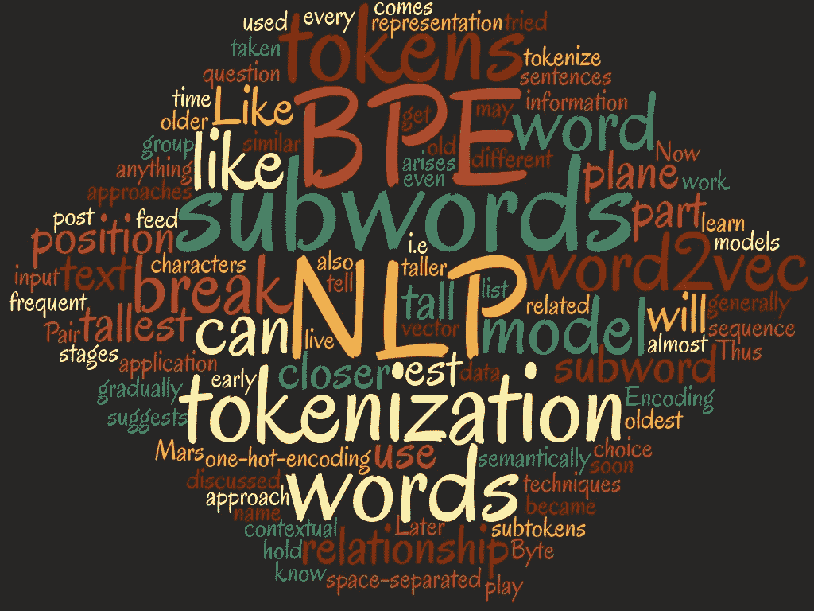
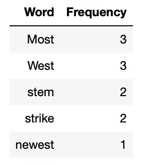
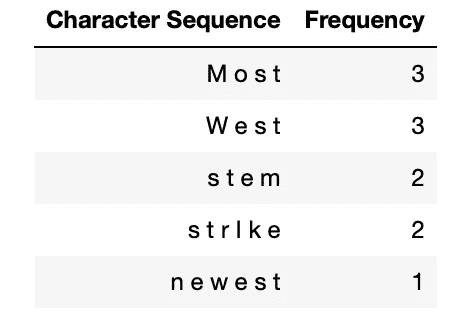
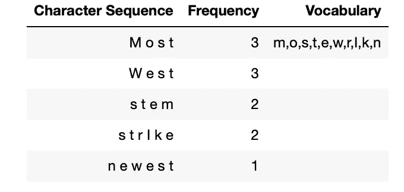
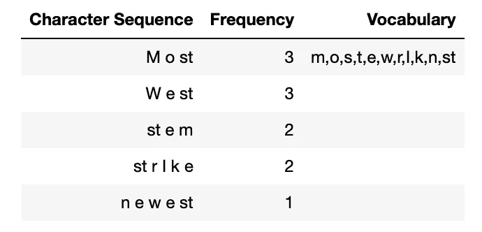
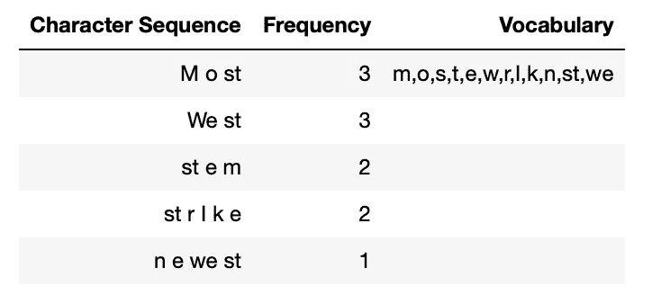
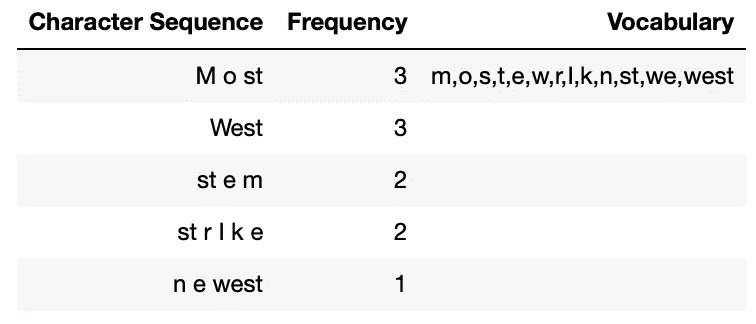
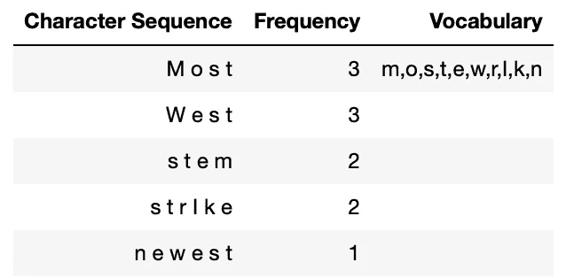

# NLP 标记化

> 原文：<https://medium.com/nerd-for-tech/nlp-tokenization-2fdec7536d17?source=collection_archive---------0----------------------->

语言是在世界任何角落相互交流的方式。当你从零开始时，很难理解这种语言。要学习任何一种语言，我们都必须学习许多层次和语法。

同样的方法，让机器理解语言，我们需要打破这个词，让机器理解它，并学习这个词背后的概念和语法。自然语言处理中的输入只是显而易见的文本，对机器学习文本背后的上下文所做的预处理是多余的。

这里列出了一些预处理步骤:

1)标记化
2)停用词去除
3)词干化和词条化
4)词性标注
5)单词嵌入

然而，还有其他步骤，如降低文本，清洁文本等。根据应用预处理步骤的变化。让我们开始深入了解 [Python 实现](http://Tokenisation Python Implementation.ipynb)的一些步骤。

# 什么是标记化

标记化是将文本分解成句子的单词的过程。这些标记帮助机器学习文本的上下文。这有助于解释文本背后的含义。因此，标记化是处理文本的首要过程。一旦在语料库上执行了标记化，所得到的标记可以用于准备词汇，该词汇可以用于训练模型的进一步步骤。

比如给机器的文字是“城市在河岸上”。这个句子首先被转换为标记词" the "、" city "、" is "、" on "、" The "、" river "、" bank "。

有多种方法和库可以将文本转换成标记。

# 1)单词(空白)标记化

这是最简单的标记化技术，它基于空白或某些分隔符来分割语料库。这种方法最快，但也有一些缺点。

OOV(不在词汇表中)是单词标记器的主要问题。当看不见的单词出现在测试中时，这个方法就失败了。但是，此问题可以通过将所有 OOV 单词替换为 UNK 令牌来解决，该单词的全部信息将丢失。另一个问题是，它需要在大型语料库上进行训练，以处理词汇表中的所有单词。

# 2)字符标记化

顾名思义，字符记号化在字符级拆分单词。通过这种方式，我们可以克服单词记号赋予者所面临的问题。我们可以像处理文集里的人物一样处理 OOV。它也限制了词汇的大小，例如，它只能处理 26 个字母中的单词和特殊字符。

然而，在处理 OOV 问题时，句子的长度迅速增加。语料库中的每个字符都被处理为一个标记，因此很难理解单词和句子之间的关系。

# 3)子词标记化

子词标记化在自然语言处理的 SOTA 模型中广泛应用，如伯特模型和 GPT 模型。这是非常有效的处理 OOV 话。

正如我们在单词标记器中看到的，当我们有一个 OOV 单词时，它被标记为 UNK 单词。为了处理所有 OOV 单词，我们必须在词汇表中添加太多的单词，这会导致内存和性能问题。

比如我们有一个词汇，里面有单词**【阅读，the，I，小说，科技，享受，to】**。现在，我们将使用这个列表来准备令牌。我们有一段文字**【“我以前看小说”】**，首先我们会用空格将单词拆分。所以代币是 **[“我”、“享受”、“要”、“读”、“小说”]** 。现在，我们的词汇列表中没有“享受”这个词，所以它将被替换为“UNK”，我们最终的令牌将是 **[“我”、“UNK”、“to”、“read”、“小说”]** 。

为了处理这类问题，subword tokenizer 很有帮助。在子单词标记化中，我们将单词分成子单词，因此单词“享受”将变成 **[“享受”、“编辑”]** ，它将被添加到词汇表中。于是词汇就变成了**【阅读，the，I，小说，科技，享受，to，ed】**。

现在，让我们拿同一个句子来说，因为我们在词汇表中没有单词“享受”,我们将分成子单词。然后，我们将检查词汇中出现的单词“enjoy”和“ed”。所以最后的令牌会是这样的**【“我”、“享受”、“编#”、“要”、“读”、“小说”】**。这表明##ed 是一个子词，前面是另一个词。

所以，到目前为止，我们已经处理了 OOV，但为什么我们只在子字中划分“享受”。我们如何决定把哪个单词分开？这就是我们使用几个子词算法来创建词汇的地方。下面我们来了解一下广泛用于标记化的 3 种算法。

**1)字节对编码**
**2)字节级字节对编码**
**3)词块**
**4)单字**
**5)句子块**

# 字节对编码

为了理解 BPE，让我们举一个例子。我们有一个数据集，并从该数据集中提取单词，我们得出以下计数。

现在我们将把单词拆分成字符。

现在，我们将采用 13 的词汇量，这意味着我们将从字符序列中创建 13 个标记。首先，我们将从字符序列中提取所有的记号。

正如我们所看到的，词汇表只有 10 个，所以我们仍然可以继续在列表中添加令牌。为了向词汇表中添加新的标记，首先，我们识别最频繁出现的符号对。然后我们合并最频繁符号对并将其添加到词汇表中。我们反复重复这个步骤，直到达到词汇量。这个我们来详细了解一下。通过查看上表，我们可以看到最常见的符号对是出现 5 次的**【ST】**。所以我们可以在词汇表中添加**【ST】**。

我们仍然可以在词汇表中添加更多的 2 个标记。为此，我们将重复上述步骤，并在列表中添加**“我们”**。所以更新后的词汇表会是这样的。

接下来，我们可以看到**“we”和“ST”**标记被频繁使用了两次，因此我们可以在词汇表中添加**“west”**。

最后，我们的词汇表长度是 13，所以我们可以停止重复这个过程。所以我们的词汇表将是**【m，o，s，t，e，w，r，I，k，n，st，we，west】**

所以到目前为止，为了创建词汇表，我们遵循了以下步骤。

1-从给定的数据集中提取单词及其计数。
2 —定义词汇量。
3 —将单词拆分成一个字符序列。
4 —将我们字符序列中的所有独特字符添加到词汇表中。
5 —选择并合并出现频率高的符号对。
6 —重复步骤 5，直到达到词汇量。

最后，创建词汇。现在，我们将了解如何使用这个词汇表来生成令牌。假设我们的输入文本由单词**“East”**组成。现在。我们将检查这个单词是否在词汇表中。由于这个词不在词汇表中，我们将把这个词分成子词，成为 **["Ea "，" st"]** 。由于“st”出现在词汇表中，我们将在子词中进一步拆分单词。于是，我们就想出了下面的令牌**【e】【a】【ST】**。因为“a”不在我们的词汇表中，并且不可能进一步拆分，所以最终的令牌列表将是这样的。

**【e】，< UNK >，【ST】**

因为我们已经取得了非常小的语料库，这就是为什么我们得到了< UNK >令牌。当我们处理庞大的语料库时，我们的词汇表将包含所有的字符。

# 字节级字节对编码

字节级字节对编码的工作方式类似于 BPE，但是它不使用字符级序列，而是使用字节级序列。假设我们的测试是 **West** ，那么序列如下。

**人物:——W e s t**

字节级字节对编码在字节级转换上述序列，因此字节级序列将是

**字节级:- 57 65 73 74**

每个 Unicode 字符都被转换成一个字节。所以，我们把输入的字转换成一个字节序列。当我们处理字节级时，这种编码在处理复杂的 OOV 时很有用。当我们处理多种语言时，字节级 BPE 更有效。

# 文字片

文字作品几乎和 BPE 一样。不同之处在于，我们合并符号对，直到达到词汇大小，但在 Wordpiece 中，我们不基于频率合并符号对。我们根据可能性合并它。因此，合并是基于在给定数据集上训练的语言模型的高可能性来完成的。让我们以 BPE 为例。

现在，我们将根据可能性合并“st ”,可能性是用 p(st)/p(s)* p(t)计算的。

如果可能性很高，我们将合并这些符号，并将它们添加到词汇表中。在工件标记化过程中，我们遵循以下步骤。与 BPE 的区别在于第 5-6 点。

1-从给定的数据集中提取单词及其计数。
2 —定义词汇量。
3 —将单词拆分成一个字符序列。
4 —将我们字符序列中的所有独特字符添加到词汇表中。
5 —在给定数据集上建立语言模型。
6-选择并合并具有在训练集上训练的语言模型的最大可能性的符号对。
7 —重复步骤 6，直到达到词汇量。

处理完所有这些步骤后，它将像 BPE 一样工作，我们可以使用它进行令牌化。

# Unigram

Unigram 的工作方式与 BPE 和 WordPiece 不同，它用大量的符号初始化它的基本词汇，并逐步削减符号以降低词汇量。最终词汇表将对应于所有预先标记的单词或最常见的子串。Unigram 与 SentencePiece 连用。Unigram 从不删除基本字符，因此任何单词都可以被标记化。

现在，让我们看看 unigram 是如何工作的。例如，我们有一个包含单词的语料库

**[("jug "，10)、(" bug "，5)、(" fun "，12)、(" run "，4)、(" huge "，5)]** 对于这个语料库我们会取所有严格的子串来准备基础词汇。所以基础词汇会这样。

**["j "，" u "，" g "，" ju "，" ug "，" b "，" bu "，" f "，" n "，" fu "，" un "，" r "，" ru "，" e "，" hug "，" ge "，" uge]]**

现在，我们将计算词汇表中所有子词的频率。

**[("j "，10) ("u "，36) ("g "，20) ("ju "，10) ("ug "，20) ("b "，5) ("bu "，5) ("f "，12) ("n "，16) ("fu "，12) ("un "，16) ("r "，4) ("ru "，4) ("e "，5) ("hu "，5)("拥抱"，5) ("ge "，5) ("uge "，5))]**

因此，所有频率的总和将是 190，子词“uge”的概率将是 5/190。

现在，为了标记给定的单词，我们将计算单词的每个可能组合的概率。例如，为了计算单词“fun”的概率，我们将计算每个可能的组合。

P(["f "，" u "，" n "])= P(" f ")×P(" u ")×P(" n ")=(12/190)*(36/190)*(16/190)= 0.001007727

然而，标记["fu "，" n"]的概率将是(12/190)* (16/190) = 0.00531856 标记["f "，" un"]的概率将是(12/190)* (16/190) = 0.00531856

由于我们的语料库非常小，这种问题会发生，如果语料库很大，我们将对所有组合有不同的概率。因此，在这种情况下,“fun”将被标记为[“f”、“un”]或[“fu”、“n”]，这取决于首先遇到的是哪种分段。

现在，我们将训练模型来决定要删除哪个令牌。为此，每个单词及其各自分数的标记化为:

**"jug": ["ju "，g"](分值 0.005540166)
"bug": ["bu "，" g"](分值 0.002770083)
"fun": ["fu "，" n"](分值 0.00531856)
"run": ["ru "，" n"](分值 0.001772853)
"huge": ["拥抱"，" e"](分**

所以损失是

**10*(-LOG(0.005540166))+5*(-LOG(0.002770083))+12*(-LOG(0.00531856))+4*(-LOG(0.001772853))+5 *(LOG(0.000692521))= 89.44592463**

现在，我们将计算移除令牌如何影响损耗。例如，如果我们删除“ju”令牌，损失将是这样的

**10*(-LOG(0.001049716))+5*(-LOG(0.002770083))+12*(-LOG(0.00531856))+4*(-LOG(0.001772853))+5 *(LOG(0.000692521))= 96.67043563**

这意味着损失增加。因此，我们需要从列表中删除另一个令牌。这个过程。迭代地找到最终的令牌列表。

# 句子片断

到目前为止，所有的分词器都假设单词之间用空格隔开。但是，在许多语言中，标记没有用空格分隔，例如中文、日语和泰语。所以我们可以使用语言特定的预标记器。然后，我们将使用 BPE、单词块或单词作为标记器来创建词汇集。在句子块标记器中，例如单词“New York”将被标记为“_”，而解码时“_”将被替换为空格。

这些标记化方法的 Python 实现可以在这里找到[。](http://Tokenisation Python Implementation.ipynb)

# 参考资料:

1.  [https://huggingface.co/course/chapter6/7?fw=pt](https://huggingface.co/course/chapter6/7?fw=pt)