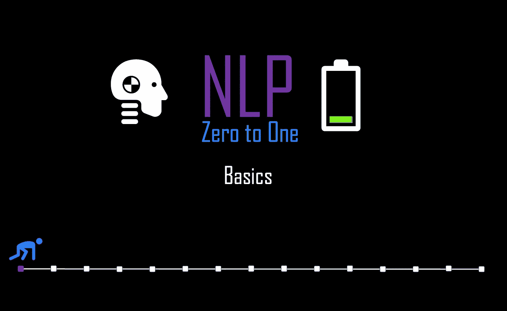
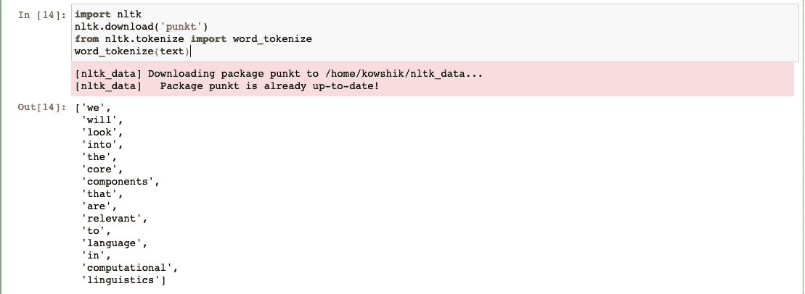
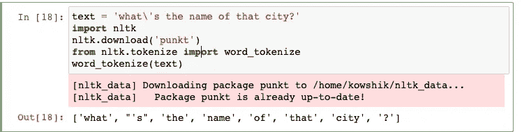
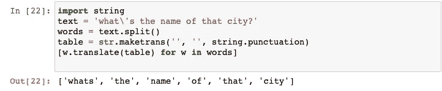
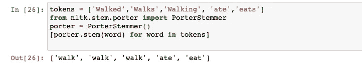
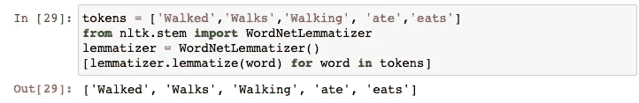
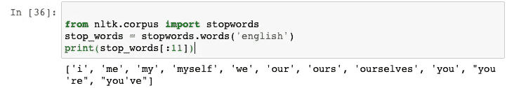

# NLP 零到一:基础(第 1/30 部分)

> 原文：<https://medium.com/nerd-for-tech/nlp-zero-to-one-basics-part-1-30-35c3f6bc7097?source=collection_archive---------8----------------------->

## 自然语言和计算语言学。



由作者生成

# 介绍..

*自然语言处理* (NLP)是计算方法的应用，不仅从文本中提取信息，还在此基础上模拟不同的应用。所有基于语言的文本都有系统的结构或规则，这通常被称为形态学，例如“jump”的过去式总是“jumped”。对人类来说，这种形态学上的理解是显而易见的。

在这篇介绍性的 NLP 博客中，我们将看到不同的方法来确定语言的形态结构和规则。

# 标记化

将文本分割成相关单词的任务称为标记化。

在最简单的形式中，可以通过使用空白分割文本来实现标记化。NLTK 提供了一个名为 *word_tokenize()* 的函数，用于将字符串拆分成令牌。

```
text = 'we will look into the core components that are relevant to language in computational linguistics'
```



但是简单的符号化并不是一直都有效。在单词之间包含标点符号的复杂单词的情况下(例如:what's)



如果我们想保留带标点符号的单词，简单的方法是我们可以用空格把文本分成单词，不用任何标点符号。



# 词干和引理满足

将每个单词还原到其词根的任务。例如，“Walk”是单词“Walks”、“Walking”、“Walked”的词根。通常词根可能比时态本身包含更多的意义。所以在 NLP 任务中，提取文本中单词的词根是非常重要的。

词干有助于减少文档中的词汇，从而节省大量计算。同样，在分类这样的任务中，一旦使用词干，单词的时态就变得无关紧要了。

最流行的方法是*波特词干算法*。它是一种后缀剥离算法，不依赖于由词形变化和词根关系组成的查找表。为提取词根建立了一些简单的规则。



词干匹配与词干匹配非常相似，因为它删除了词尾变化和后缀来将单词转换成它们的词根。意义和上下文可能在词干分析中丢失，词条满足保留了上下文。



## 其他重要..

**规范化大小写:**将所有单词转换成一个大小写是很常见的。
**停用词:**停用词是在对文本数据进行提取/建模的过程中不起作用的那些词，因为它们是最常见的词，例如:“ *the* ”、“ *a* ”、“ *is* ”。



# 注意

**数据清洗:**在对文本数据应用复杂的计算方法之前，我们需要理解和清洗数据。这些技术帮助我们用先进的 DNN 和自然语言处理技术为文本建模做好准备。

接下来: [NLP 理论和代码:稀疏文档表示(第 2/40 部分)](https://kowshikchilamkurthy.medium.com/nlp-theory-and-code-sparse-document-representations-part-2-20-bdbd89c567a)


由作者生成

**下一个**:

[**NLP 零对一:稀疏文档表示(第 2/30 部分)**](https://kowshikchilamkurthy.medium.com/nlp-zero-to-one-sparse-document-representations-part-2-30-d7ce30b96d63?source=your_stories_page-------------------------------------)